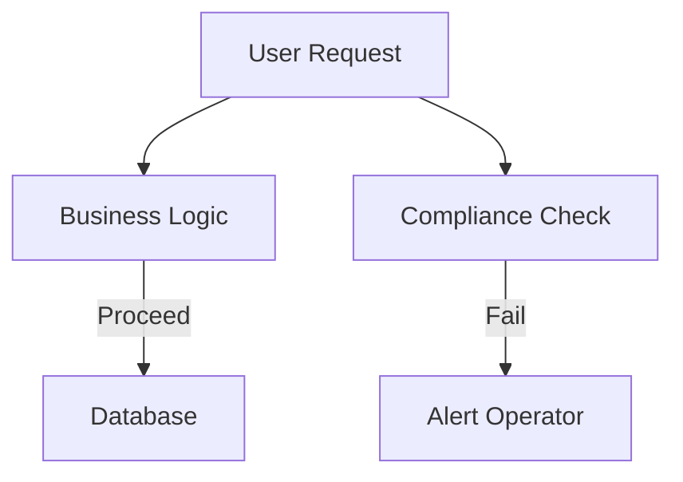

# **Debugging Compliance Integration: A Troubleshooting Guide**
*For Senior Backend Engineers*

Compliance Integration ensures that systems adhere to regulatory, industry-specific, or internal policies (e.g., GDPR, HIPAA, SOX, PCI DSS). Misconfigurations, miscommunications between compliance modules, and misalignments with business logic can lead to failures in audits, penalties, or operational breakdowns.

This guide focuses on **practical debugging** for common compliance-related issues, with a backend engineering perspective.

---

## **1. Symptom Checklist**
Before diving into fixes, compile a list of observed symptoms. Use this checklist to systematically identify root causes:

| **Symptom Category**          | **Possible Indicators**                                                                 |
|--------------------------------|----------------------------------------------------------------------------------------|
| **Audit Failures**             | - Audit logs flagging compliance violations.                                           |
|                                | - SOX controls failing during testing.                                                 |
|                                | - Regulatory bodies rejecting submissions.                                             |
| **Data Integrity Issues**      | - Unexpected data alterations (e.g., deleted records still appear in logs).           |
|                                | - Unexpected access to sensitive fields (e.g., PII in audit trails).                 |
| **Performance Degradation**   | - Slow compliance checks during high-traffic periods.                                  |
|                                | - Database locks on compliance-related tables.                                          |
| **API & Integration Failures**| - External compliance APIs returning errors.                                           |
|                                | - Failed webhook deliveries (e.g., GDPR data deletion requests).                        |
| **Configuration Drift**       | - Changes in business logic breaking compliance logic.                                |
|                                | - Hardcoded compliance rules instead of dynamic policy files.                           |
| **Logging & Monitoring Issues**| - Missing or corrupted compliance event logs.                                           |
|                                | - Alerts ignoring compliance-related exceptions.                                        |

---
## **2. Common Issues & Fixes**

### **Issue 1: Audit Logs Are Incomplete or Corrupt**
**Symptoms:**
- Missing entries in compliance logs.
- Logs show `NULL` or invalid timestamps.

**Root Causes:**
- Database table truncations.
- Insufficient log rotation policies.
- Missing middleware to capture audit events.

**Fixes:**

#### **Option A: Restore Logs from Backups**
If logs were accidentally deleted:
```sql
-- SQL Example: Restore deleted audit logs from a backup table
INSERT INTO audit_logs (event_id, timestamp, entity_id, action)
SELECT *, NOW() AS timestamp FROM backup_audit_logs;
```

#### **Option B: Implement Real-Time Logging Middleware**
Add a compliance wrapper around business logic:
```javascript
// Node.js Example: Middleware to log all CRUD operations
app.use((req, res, next) => {
  const start = Date.now();
  const logEntry = { path: req.path, method: req.method };

  // Log on completion
  res.on('finish', () => {
    logEntry.duration = Date.now() - start;
    db.auditLogs.create(logEntry).catch(console.error);
  });
  next();
});
```

#### **Option C: Validate Log Integrity with Checksums**
```python
# Python Example: Generate a checksum of logs for verification
import hashlib

def generate_log_checksum(logs):
    checksum = hashlib.sha256()
    for log in logs:
        checksum.update(str(log).encode())
    return checksum.hexdigest()
```

---

### **Issue 2: Compliance Checks Are Overridden in Production**
**Symptoms:**
- Business logic bypasses compliance rules.
- Hardcoded `skipValidation: true` flags in deployment.

**Root Causes:**
- Feature flags overriding compliance layers.
- Inadequate code reviews for compliance-sensitive paths.

**Fixes:**

#### **Option A: Enforce Immutable Compliance Rules**
Use a **policy-as-code** framework like OpenPolicyAgent (OPA):
```yaml
# Example OPA Policy (rego)
package main

default allow = false

allow {
    input.action != "delete"
    input.entity.type == "PII"
}
```

#### **Option B: Automated Compliance Scanning**
Integrate tools like **Checkov** or **Trivy** in CI/CD:
```bash
# Example: Run Checkov in GitHub Actions
- name: Scan for compliance violations
  run: checkov -d ./src --quiet
```

#### **Option C: Separate Compliance from Business Logic**


---

### **Issue 3: Failed Compliance API Calls**
**Symptoms:**
- External compliance APIs (e.g., GDPR notification services) return `5xx` errors.
- Timeouts during high-volume compliance tasks.

**Root Causes:**
- Unreliable external dependencies.
- No retries/fallback mechanisms.
- Rate limits exceeded.

**Fixes:**

#### **Option A: Implement Retry Logic with Exponential Backoff**
```javascript
// Node.js Example: Retry API calls with backoff
async function callComplianceAPI(url, retries = 3) {
  try {
    const res = await fetch(url);
    if (!res.ok) throw new Error("API failed");
    return res.json();
  } catch (err) {
    if (retries > 0) {
      await new Promise(resolve => setTimeout(resolve, 1000 * Math.pow(2, 3 - retries)));
      return callComplianceAPI(url, retries - 1);
    }
    throw err;
  }
}
```

#### **Option B: Use a Circuit Breaker Pattern**
Leverage **Pagy** or **Hystrix** for resilience:
```python
# Python Example: Circuit breaker with Pagy
from pagy.backends import DjangoBackend

circuit = CircuitBreaker(fail_max=3, reset_timeout=60)

@circuit
def notify_gdpr_authority(data):
    try:
        api_response = compliance_api.post("/notify", json=data)
        return api_response.status_code == 200
    except Exception:
        return False
```

#### **Option C: Queue Non-Critical Compliance Tasks**
Use a message queue (e.g., RabbitMQ) for async processing:
```python
# Python Example: Publish compliance task to a queue
import pika

connection = pika.BlockingConnection(pika.ConnectionParameters('localhost'))
channel = connection.channel()
channel.queue_declare(queue='compliance_tasks')
channel.basic_publish(exchange='', routing_key='compliance_tasks', body=task_data)
```

---

### **Issue 4: Data Retention Violations**
**Symptoms:**
- Data being retained beyond regulatory limits.
- Missing automated cleanup jobs.

**Root Causes:**
- Manual cleanup processes.
- Lack of scheduling for compliance purges.

**Fixes:**

#### **Option A: Schedule Automated Purge Jobs**
```sql
-- SQL Example: Automated purge with a cron job
-- Run weekly to delete records older than 7 years
CREATE OR REPLACE PROCEDURE purge_old_data()
AS $$
BEGIN
    DELETE FROM sensitive_data WHERE created_at < NOW() - INTERVAL '7 years';
END;
$$ LANGUAGE plpgsql;
```

#### **Option B: Enforce Retention Policies at DB Level**
```sql
-- PostgreSQL Example: Time-based partition cleanup
ALTER TABLE transactions SET (autovacuum_enabled = off);
-- Then create a maintenance script to drop old partitions
```

#### **Option C: Log Retention Violations**
```python
# Python Example: Track compliance violations
from datetime import datetime, timedelta

def check_retention_policies():
    cutoff = datetime.now() - timedelta(days=365 * 7)
    at_risk = db.query("SELECT * FROM logs WHERE last_access < %s", (cutoff,))
    if at_risk:
        send_alert("Potential retention violation detected!")
```

---

## **3. Debugging Tools & Techniques**

| **Tool**               | **Use Case**                                                                 |
|------------------------|------------------------------------------------------------------------------|
| **OpenPolicyAgent (OPA)** | Enforce dynamic policies (e.g., IAM checks).                                |
| **Checkov / Trivy**     | Scan infrastructure/config for compliance violations.                       |
| **Prometheus + Alertmanager** | Monitor compliance metrics (e.g., audit log latency).                  |
| **AWS Config / Azure Policy** | Track cloud compliance state.                                            |
| **Postgresql Logical Decoding** | Capture DB changes in real-time for auditing.                              |
| **ELK Stack (Elasticsearch, Logstash, Kibana)** | Centralize and analyze compliance logs.                                   |
| **Chaos Engineering Tools (Gremlin)** | Test resilience of compliance systems under failure.                       |

**Debugging Technique: The 5 Whys**
When a compliance failure occurs:
1. **Why did the system fail?**
   - "Audit logs were missing."
2. **Why were logs missing?**
   - "The database partition was deleted."
3. **Why was that partition deleted?**
   - "A misconfigured cron job ran."
4. **Why was the cron job misconfigured?**
   - "No one reviewed the new retention policy."
5. **Why wasn’t the policy reviewed?**
   - "Lack of documentation on compliance requirements."

**Action:** Document the 5 Whys and update runbooks.

---

## **4. Prevention Strategies**

### **A. Design-Time Compliance**
- **Policy as Code:** Store compliance rules in Git (e.g., Terraform modules for cloud policies).
- **Dependency Risk Assessment:** Use tools like **OWASP Dependency-Check** to scan libraries for vulnerabilities.
- **Compliance Testing in CI/CD:** Fail builds if compliance checks fail.

### **B. Runtime Compliance**
- **Real-Time Monitoring:** Use **Prometheus** to track compliance metrics (e.g., "audit log latency").
- **Automated Remediation:** Use **Kubernetes Operators** to auto-patch misconfigurations.
- **Immutable Infrastructure:** Avoid manual changes to compliance-critical systems.

### **C. Documentation & Governance**
- **Runbooks for Compliance Failures:** Document step-by-step recovery (e.g., "How to restore audit logs").
- **Regular Audits:** Schedule quarterly reviews of compliance integrations.
- **Compliance Ownership:** Assign a **Compliance Engineer** to track regulatory changes.

### **D. Testing Strategies**
- **Chaos Engineering:** Simulate compliance failures (e.g., kill the audit service).
- **Regulatory Playbooks:** Test GDPR, HIPAA, etc., in staging before production.

---
## **Final Checklist Before Production**
| **Task**                          | **Status** |
|------------------------------------|------------|
| Compliance policies documented in code | [ ]        |
| Audit logs enabled and tested      | [ ]        |
| External API retries configured    | [ ]        |
| Retention policies enforced        | [ ]        |
| CI/CD includes compliance checks   | [ ]        |
| Runbook for compliance failures    | [ ]        |

---
This guide ensures **quick resolution** of compliance issues while preventing recurrence. Adjust based on your specific regulatory framework (e.g., GDPR vs. SOX).