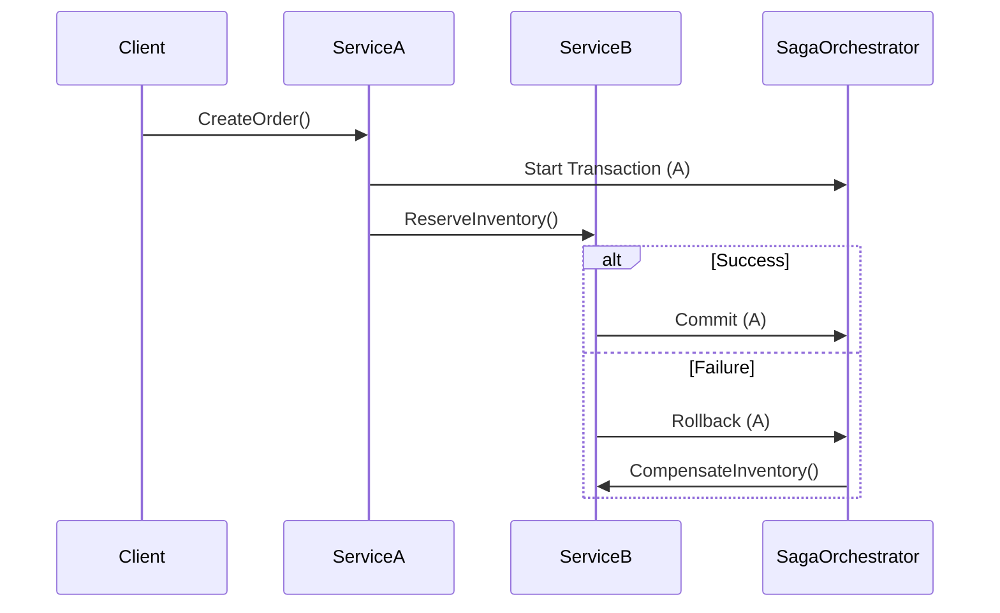

# **Debugging Consistency Issues: A Troubleshooting Guide**

Consistency in distributed systems—whether involving databases, microservices, caches, or event-driven architectures—is fundamental to reliability. When inconsistencies arise, they often manifest as race conditions, stale data, failed transactions, or duplicate operations. This guide provides a structured approach to diagnosing and resolving consistency-related issues efficiently.

---

## **1. Symptom Checklist**
Before diving into debugging, confirm whether the issue is indeed a consistency problem. Common symptoms include:

| **Symptom**                          | **Likely Cause**                          | **Affected Components**                     |
|---------------------------------------|-------------------------------------------|---------------------------------------------|
| **Partial updates**                  | Uncommitted transactions, retry logic failures | Databases, APIs, Microservices              |
| **Duplicate operations**             | Idempotency violations, event reprocessing | Event queues, Batch jobs, CRUD operations   |
| **Inconsistent reads/writes**        | Dirty reads, lack of isolation            | Databases (especially NoSQL, weak ACID)      |
| **Timeouts or stalled transactions** | Deadlocks, long-running locks             | Distributed transactions (Saga, 2PC)        |
| **Missing or outdated data**         | Cache invalidation failures               | CDNs, Redis, Memcached                      |
| **Race conditions in APIs**           | Unsafe concurrent access to shared state  | REST/gRPC APIs, Webhooks                    |
| **Failed rollbacks or compensations**| Saga pattern misconfiguration              | Event-driven workflows                      |

**Quick Checks:**
✅ Is the issue reproducible under load?
✅ Does it happen intermittently or consistently?
✅ Are multiple services or systems involved?
✅ Is there a pattern (e.g., always after a restart, during peak traffic)?

---

## **2. Common Issues and Fixes**

### **Issue 1: Missing or Duplicate Events (Event Sourcing, Kafka, etc.)**
**Symptoms:**
- A user payment is processed twice.
- Database state doesn’t match event logs.
- Event stream gaps detected in tools like Kafka Lag Exporter.

**Root Causes:**
- **Producer retries without idempotency** (e.g., duplicate `OrderCreated` events).
- **Consumer lag** (events processed too slowly, leading to duplicates).
- **Schema evolution mismatches** (new consumers fail to parse old events).

**Fixes:**
#### **A. Enforce Idempotency in Consumers**
```java
// Example: Kafka consumer with idempotent processing
public void processEvent(OrderEvent event) {
    String eventKey = event.getOrderId(); // Use a globally unique key
    if (!seenEvents.contains(eventKey)) {
        applyEvent(event); // Business logic
        seenEvents.add(eventKey); // Track processed events
    }
}
```
- **Database-backed deduplication** (for high availability):
  ```sql
  INSERT INTO processed_events (event_id, order_id)
  VALUES ('event_123', 'order_456')
  ON CONFLICT (order_id) DO NOTHING;
  ```

#### **B. Configure Kafka for Exactly-Once Semantics**
```bash
# Producer config (enable idempotence)
bootstrap.servers=kafka:9092
enable.idempotence=true
max.in.flight.requests.per.connection=5

# Consumer config (ensure committed offsets)
enable.auto.commit=false
isolation.level=read_committed
```
- **Use transactional writes** in Kafka:
  ```java
  producer.initTransactions();
  producer.beginTransaction();
  producer.send(record1).get();
  producer.send(record2).get();
  producer.commitTransaction();
  ```

#### **C. Check for Consumer Lag**
```bash
# Kafka Consumer Lag Tool
kubectl exec -it kafka-consumer-pod -- bash -c "kafka-consumer-groups.sh --bootstrap-server kafka:9092 --group my-group --describe"
```
- **Scale consumers** if lag is high.
- **Optimize processing logic** (reduce downtime per event).

---

### **Issue 2: Database Inconsistencies (Distributed Transactions)**
**Symptoms:**
- A payment is debited but the inventory isn’t updated.
- ACID violations in PostgreSQL/MySQL (dirty reads, phantom reads).

**Root Causes:**
- **Distributed transaction (Saga) misconfiguration** (e.g., no compensation logic).
- **Improper isolation levels** (e.g., `READ COMMITTED` allowing dirty reads).
- **Missing locks** (e.g., optimistic locking bypassed).

**Fixes:**
#### **A. Implement Saga Pattern Correctly**


**Compensation Handler Example (Java):**
```java
public class OrderSaga {
    public void compensateInventory(String orderId, String productId, int quantity) {
        // Revert inventory changes
        inventoryService.releaseInventory(orderId, productId, quantity);
    }
}
```

#### **B. Use Database Locks or Optimistic Concurrency**
```sql
-- Pessimistic lock (PostgreSQL)
BEGIN;
SELECT * FROM orders WHERE id = 123 FOR UPDATE; -- Locks the row
-- Business logic
COMMIT;

-- Optimistic lock (check version)
UPDATE accounts SET balance = balance - 100 WHERE id = 1 AND version = 3;
```

#### **C. Audit Transactions**
```sql
-- Log all transactions for debugging
INSERT INTO transaction_log (order_id, action, status)
VALUES ('order_123', 'debit', 'FAILED') ON CONFLICT DO NOTHING;
```

---

### **Issue 3: Cache Staleness (Redis, Memcached)**
**Symptoms:**
- Users see outdated inventory counts.
- API responses are inconsistent with the database.

**Root Causes:**
- **Cache invalidation not triggered** after DB updates.
- **Long cache TTL** (e.g., 24 hours for frequently changing data).
- **No cache-aside pattern** (write-through missing).

**Fixes:**
#### **A. Implement Cache-Aside with Proper Invalidation**
```python
# Flask example with Redis cache
@app.route('/product/<int:product_id>')
def get_product(product_id):
    cache_key = f"product:{product_id}"
    product = redis.get(cache_key)
    if not product:
        product = db.query_product(product_id)
        redis.setex(cache_key, 600, product)  # 10-minute TTL
    return product

# After DB update, invalidate cache
def update_product(product_id, new_price):
    db.update_product(product_id, new_price)
    redis.delete(f"product:{product_id}")  # Invalidate
```

#### **B. Use Pub/Sub for Real-Time Invalidation**
```bash
# Redis Pub/Sub workflow
EVAL "return redis.call('publish', 'product:updated', ARGV[1])" 1 "product:123"
SUBSCRIBE product:updated
```
- **Listener invalidates cache:**
  ```python
  pubsub = redis.pubsub()
  pubsub.subscribe("product:updated")
  for message in pubsub.listen():
      if message["type"] == "message":
          redis.delete(message["data"].decode())
  ```

#### **C. Monitor Cache Hit/Miss Ratios**
```bash
# Redis CLI command
INFO stats | grep keyspace_hits
INFO stats | grep keyspace_misses
```
- **Low hits?** → Increase TTL or reduce cache granularity.
- **High misses?** → Optimize cache key design.

---

### **Issue 4: Race Conditions in APIs (REST/gRPC)**
**Symptoms:**
- Two users claim the same coupon simultaneously.
- Concurrent requests modify shared state unpredictably.

**Root Causes:**
- **No transactional guarantees** in API calls.
- **Race on shared resources** (e.g., shared counter).

**Fixes:**
#### **A. Use Distributed Locks (Redis, ZooKeeper)**
```java
// Example: Redis-lock for coupon redemption
String lockKey = "coupon:123:redemption";
try (RedisLock lock = new RedisLock("lock", redisClient)) {
    if (!lock.tryLock()) {
        throw new CouponAlreadyClaimedException();
    }
    // Critical section (e.g., deduct stock, issue reward)
} catch (Exception e) {
    log.error("Failed to acquire lock", e);
    throw new ServiceException("Retry later");
}
```

#### **B. Atomic Operations in Databases**
```sql
-- SQL: Deduct stock atomically
UPDATE products p
SET stock = stock - 1
WHERE id = 123 AND stock > 0
RETURNING stock;
```

#### **C. Idempotent API Design**
```http
POST /api/orders HTTP/1.1
Idempotency-Key: order_123

# Server checks header before processing
if (order_exists(order_123)) {
    return 200 Already Processed
}
process_order(request_body);
```

---

## **3. Debugging Tools and Techniques**

| **Tool/Technique**               | **Use Case**                                  | **Example Command/Setup**                          |
|-----------------------------------|-----------------------------------------------|----------------------------------------------------|
| **Kafka Consumer Lag Monitor**    | Detect event processing delays                | `kafka-consumer-groups --describe --bootstrap-server kafka:9092` |
| **Distributed Tracing (Jaeger)** | Trace Saga workflows                          | `curl http://jaeger:16686/search?service=order-service` |
| **Database Replication Lag**      | Check for stale reads                        | `SHOW SLAVE STATUS` (MySQL)                       |
| **Cache Hit/Miss Analytics**      | Identify cache inefficiencies                | Redis `INFO stats`                                |
| **Lock Contention Debugging**     | Find deadlocks in Redis/ZooKeeper             | `redis-cli monitor`                               |
| **Chaos Engineering (Gremlin)**   | Test system resilience                       | `kill 50% of DB connections`                      |
| **Git Blame for Configuration**   | Trace config changes causing inconsistencies | `git blame config.yaml`                           |

**Advanced Techniques:**
- **Log Correlation IDs** across services:
  ```bash
  # Add to all logs
  logger.info("Processing order", correlationId = "order_123")
  ```
- **Use SQL `EXPLAIN ANALYZE`** to debug slow queries:
  ```sql
  EXPLAIN ANALYZE SELECT * FROM orders WHERE status = 'pending';
  ```
- **Capture Replay with Redpanda** (Kafka alternative for debugging):
  ```bash
  redpanda replay --from-end --topic orders --output /tmp/debug-events
  ```

---

## **4. Prevention Strategies**

### **A. Design for Consistency**
1. **Adopt the right consistency model per data type:**
   - **Strong consistency:** Use 2PC (rare) or Saga (common for microservices).
   - **Eventual consistency:** Use CRDTs or operational transforms (OT) for collaborative apps.
2. **Enforce idempotency by default** in all APIs and event handlers.
3. **Design for failure:**
   - Retry policies with exponential backoff.
   - Circuit breakers (Hystrix, Resilience4j).

### **B. Monitoring and Alerts**
- **Kafka:** Monitor consumer lag and broker health.
  ```yaml
  # Prometheus alert for lag
  - alert: HighConsumerLag
    expr: kafka_consumer_lag{topic="orders"} > 1000
    for: 5m
  ```
- **Database:** Alert on replication lag or high lock wait times.
  ```sql
  -- MySQL slow query log
  SET GLOBAL slow_query_log = 'ON';
  ```
- **Cache:** Monitor TTL effectiveness and cache hit ratios.

### **C. Testing Strategies**
1. **Chaos Testing:**
   - Kill random pods in Kubernetes to test resilience.
   - Use [Chaos Mesh](https://chaos-mesh.org/).
2. **Property-Based Testing (Hypothesis, QuickCheck):**
   ```python
   # Example: Test idempotent API
   @given(order_id=st.text(), attempts=st.integers(1, 5))
   def test_idempotent_api(order_id, attempts):
       for _ in range(attempts):
           response = requests.post(f"/api/orders?idempotency_key={order_id}")
           assert response.status_code == 200
   ```
3. **End-to-End Consistency Tests:**
   - Replay event streams to verify state.
   - Use [Kafka Streams](https://docs.confluent.io/platform/current/streams/) for testing.

### **D. Documentation and Runbooks**
- **Document consistency guarantees per service:**
  ```markdown
  # Service: Payment Service
  Consistency Model: Strong (2PC for debits/credits)
  ```
- **Create runbooks for common failure modes:**
  - **"How to recover from Kafka consumer crash"**
  - **"Steps to fix database replication lag"**

---

## **5. Step-by-Step Debugging Workflow**
When faced with a consistency issue, follow this structured approach:

1. **Reproduce the Issue**
   - Isolate the scenario (e.g., API call, event replay).
   - Check if it’s intermittent or consistent.

2. **Gather Logs and Metrics**
   - Correlate logs with correlation IDs.
   - Check for errors in `stderr`, Kafka consumer lag, or DB slow logs.

3. **Inspect the Critical Path**
   - Draw a sequence diagram of the workflow.
   - Example:
     ```
     Client → API Gateway → ServiceA → Kafka → ServiceB → DB
     ```

4. **Check for Race Conditions**
   - Use thread dumps (Java) or `strace` (Linux) to find locks.
   - Example:
     ```bash
     strace -p <pid>  # Trace system calls for locks
     ```

5. **Test Fixes Incrementally**
   - Apply the smallest possible change (e.g., add a retry).
   - Validate with a single test case.

6. **Monitor the Fix**
   - Set up alerts for similar issues.
   - Roll back if metrics worsen.

---

## **6. Key Takeaways**
| **Problem Area**          | **Quick Fix**                          | **Long-Term Solution**                     |
|---------------------------|----------------------------------------|--------------------------------------------|
| Duplicate events          | Add idempotency keys                    | Use Kafka transactions                     |
| Database inconsistencies  | Implement Saga pattern                 | Audit transactions with `transaction_log` |
| Cache staleness           | Invalidate cache on DB writes          | Use Pub/Sub for real-time invalidation     |
| Race conditions           | Distributed locks (Redis)              | Atomic DB operations                       |
| Slow debugging            | Distributed tracing (Jaeger)           | Chaos testing workflow                     |

---
**Final Tip:** Consistency debugging is often about **eliminating the impossible** (e.g., "Is it the database? The cache? The API?"). Start with the most likely culprit (e.g., Kafka lag for events, cache TTL for stale reads) and work inward. Use tools to **correlate logs across services**—this is where most inconsistencies are revealed.

For further reading:
- [CAP Theorem](https://www.infoq.com/articles/cap-twelve-years-later-how-the-rules-have-changed/)
- [Saga Pattern (Martin Fowler)](https://martinfowler.com/articles/patterns-of-distributed-system-error-handling.html#Saga)
- [Kafka Idempotence Guide](https://kafka.apache.org/documentation/#intro_idempotence)