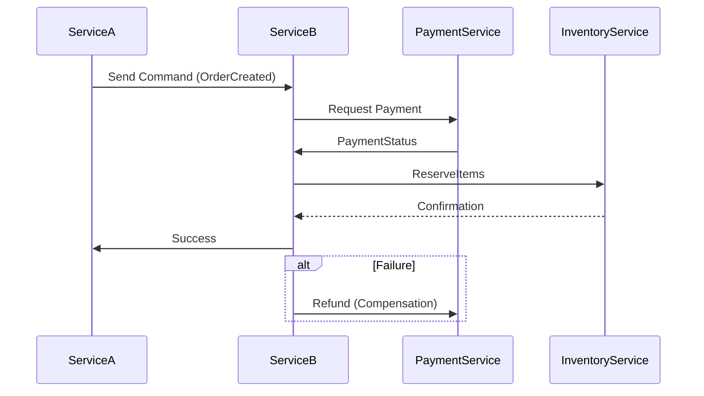

# **Debugging Consistency Integration: A Troubleshooting Guide**

## **Introduction**
The **Consistency Integration** pattern ensures that distributed systems maintain data consistency across multiple services or databases, often using techniques like **event sourcing, sagas, compensating transactions, or eventual consistency mechanisms**. When implemented incorrectly, it can lead to **inconsistent state, lost transactions, or cascading failures**.

This guide provides a structured approach to diagnosing and resolving common consistency-related issues in distributed systems.

---

## **1. Symptom Checklist**
Before diving into debugging, verify these symptoms to confirm if consistency issues are the root cause:

| **Symptom**                          | **Description**                                                                 | **How to Check**                                                                 |
|--------------------------------------|---------------------------------------------------------------------------------|---------------------------------------------------------------------------------|
| **Data Inconsistency**               | Different services report conflicting data (e.g., DB vs. cache mismatch).      | Query both systems and compare results.                                         |
| **Transaction Failures**             | Transactions succeed in one service but fail in another.                       | Check transaction logs (e.g., DB rollbacks, saga state).                         |
| **Missing Events**                   | Events (e.g., Kafka, RabbitMQ) are not processed or lost.                     | Verify message brokers (`lag`, `offsets`, `consumer groups`).                    |
| **Partial Updates**                  | Some records are updated while others remain stale.                           | Compare timestamps (`createdAt`, `lastModified`).                               |
| **Duplicate Operations**             | The same operation is applied multiple times (e.g., double-charge in payments).| Check saga compensations or idempotency keys.                                    |
| **Long-Lived Transactions**          | Transactions hang due to coordination delays (e.g., 2PC timeout).              | Monitor distributed locks (`ZooKeeper`, `Redis`).                               |
| **Race Conditions**                  | Concurrent operations lead to conflicting writes.                              | Review service logs for overlapping transactions.                               |
| **Eventual Consistency Stuck**       | System never converges to a consistent state (e.g., stale reads).               | Check retries, backoff policies, and propagation delays.                          |

---

## **2. Common Issues & Fixes**

### **Issue 1: Event Loss in Message Brokers**
**Symptoms:**
- Events are missing from downstream consumers.
- Transactions appear incomplete.

**Root Cause:**
- Consumer not catching up (`lag` too high).
- Broker partition rebalancing.
- Message TTL expired.

**Fixes:**

#### **Check Consumer Lag**
```bash
# For Kafka (using kafka-consumer-groups)
kafka-consumer-groups --bootstrap-server <broker> --group <group> --describe
```
- If `LAG > 0`, either:
  - **Increase consumer scalability** (add more workers).
  - **Slow down producers** (reduce throughput).
  - **Restart consumers** (if stuck due to crashes).

#### **Verify Broker Configs**
```properties
# Increase message retention (in broker config)
message.max.bytes=104857600  # 100MB
log.retention.ms=604800000   # 7 days
```

#### **Enable Idempotent Consumers**
```java
// Example: Idempotent event processing (Kafka)
Map<String, Boolean> processedEvents = new HashMap<>();
public void handleEvent(String eventId, Event event) {
    if (!processedEvents.containsKey(eventId)) {
        processedEvents.put(eventId, true);
        // Process logic
    }
}
```

---

### **Issue 2: Saga Timeouts & Partial Rollbacks**
**Symptoms:**
- Some steps succeed, others fail without full compensation.
- Database remains in an inconsistent state.

**Root Cause:**
- **Orchestrator crash** before completing the saga.
- **Compensating transaction fails** silently.
- **Timeout too short** for external APIs.

**Fixes:**

#### **Implement Retry with Exponential Backoff**
```python
# Example: Saga retry logic (Python)
from tenacity import retry, stop_after_attempt, wait_exponential

@retry(stop=stop_after_attempt(3), wait=wait_exponential(multiplier=1, min=4, max=10))
def execute_compensation():
    response = compensator.execute()
    if response.success:
        return True
    raise Exception("Compensation failed")
```

#### **Use Distributed Locks for Safety**
```java
// Example: Redis lock for saga coordination
public boolean acquireLock(String sagaId) {
    String lockKey = "saga:" + sagaId;
    return redisson.tryLock(lockKey, 10, TimeUnit.MINUTES); // 10 min timeout
}
```

#### **Monitor Saga Status**
```sql
-- Example: Track saga progress in DB
CREATE TABLE sagas (
    saga_id VARCHAR(64) PRIMARY KEY,
    current_step VARCHAR(50),
    status VARCHAR(20), -- "RUNNING", "COMPLETED", "FAILED"
    last_updated TIMESTAMP
);
```

---

### **Issue 3: Database Inconsistency (Event Sourcing)**
**Symptoms:**
- Aggregates are deserialized incorrectly.
- Event replay leads to duplicated state.

**Root Cause:**
- **Event ordering violated** (out-of-order replay).
- **Corrupted events** (serialization/deserialization issues).
- **Missing event confirmation** (publisher didn’t receive ACK).

**Fixes:**

#### **Validate Event Order**
```java
// Example: Check event sequence number
public boolean isValidEvent(Event event) {
    long expectedSeq = eventStore.getLastSequence();
    return event.getSequence() == expectedSeq + 1;
}
```

#### **Use Checksums for Event Integrity**
```python
# Example: Verify event hash before replay
import hashlib
def verify_event(event):
    event_sha = hashlib.sha256(event.serialize().encode()).hexdigest()
    return event_sha == event.checksum
```

#### **Implement Idempotent Reads**
```java
// Example: Read model with snapshot
public Money getAccountBalance(String accountId) {
    Money snapshot = readModel.getSnapshot(accountId);
    if (snapshot != null) {
        return snapshot;
    }
    // Replay events if no snapshot
    return eventStore.query(accountId).aggregate();
}
```

---

### **Issue 4: Two-Phase Commit (2PC) Failures**
**Symptoms:**
- One DB commits, another rolls back.
- Transaction hangs indefinitely.

**Root Cause:**
- **Coordinator crash** before vote phase.
- **Participant unavailable** during prepare phase.
- **Network partition** between nodes.

**Fixes:**

#### **Switch to Saga Pattern**


#### **Use Asynchronous Confirmation**
```java
// Example: Async confirmatory 2PC alternative
public void processOrder(Order order) {
    try {
        paymentService.charge(order.getAmount());
        inventoryService.reserve(order.getItems());
        // Publish success event
        eventPublisher.emit(new OrderConfirmed(order.getId()));
    } catch (Exception e) {
        // Publish failure event
        eventPublisher.emit(new OrderFailed(order.getId(), e.getMessage()));
    }
}
```

---

## **3. Debugging Tools & Techniques**

| **Tool/Technique**               | **Use Case**                                                                 | **Example Command/Setup**                                  |
|-----------------------------------|-----------------------------------------------------------------------------|-----------------------------------------------------------|
| **Kafka Consumer Groups**         | Check message lag, offset tracking.                                          | `kafka-consumer-groups --bootstrap-server <broker>`       |
| **Redis Insight**                 | Monitor locks, pub/sub, and Redis keys.                                      | `redis-cli --scan --pattern "*saga*"`                    |
| **Distributed Tracing (Jaeger)**  | Track saga flows across services.                                            | `curl "http://localhost:16686/search?service=saga"`       |
| **Database Auditing**             | Log all schema changes.                                                      | `CREATE TRIGGER audit_changes ...`                        |
| **Load Testing (Locust)**         | Simulate high throughput for consistency bottlenecks.                      | `locust -f locustfile.py --host http://api.example.com`  |
| **Postmortem Analysis**           | Review failed transactions in a structured way.                             | Slack/Discord postmortem template.                         |
| **Chaos Engineering (Gremlin)**   | Test system resilience under failure.                                       | `kill -9 <pod>` (or use Gremlin for controlled failures). |

---

## **4. Prevention Strategies**

### **Design Time**
✅ **Choose the Right Pattern**
- Use **sagas** for long-running workflows.
- Use **event sourcing** only if strict auditability is needed.
- Avoid **2PC** unless absolutely necessary.

✅ **Idempotency Guarantees**
- Every command should be **repeatable without side effects**.
- Example: Use `UUID` or `transaction_id` in requests.

✅ **Compact Event Logs**
- Store events in **immutable storage** (e.g., Kafka, S3).
- Avoid **storing raw payloads**—use **compacted events**.

### **Runtime**
✅ **Monitor Consistency Breaches**
- Set up **alerts for lag** (e.g., Kafka lag >1000).
- **Anomaly detection** for sudden spikes in compensations.

✅ **Implement Health Checks**
```python
# Example: Saga health check
@app.route("/health")
def health():
    if not kafka_consumer.connected():
        return {"status": "degraded"}, 503
    return {"status": "healthy"}
```

✅ **Graceful Degradation**
- If a service fails, **fall back to a known-good state** (e.g., cache stale data).
- Example:
  ```java
  public Money getBalance(String accountId) {
      try {
          return database.getBalance(accountId);
      } catch (Exception e) {
          return cache.getFallbackBalance(accountId); // Stale but safe
      }
  }
  ```

### **Observability**
✅ **Structured Logging**
```json
{
  "timestamp": "2024-05-20T12:00:00Z",
  "level": "ERROR",
  "saga_id": "saga-123",
  "step": "payment_confirmation",
  "error": "Timeout",
  "metadata": {
    "attempts": 3,
    "retries_left": 1
  }
}
```

✅ **Distributed Tracing**
- Tag all requests with `trace_id` and `span_id`.
- Example (OpenTelemetry):
  ```java
  Tracer tracer = GlobalTracer.get();
  try (Span span = tracer.startSpan("order_processing")) {
      // Business logic
  }
  ```

✅ **Automated Rollback Testing**
- Use **GitHub Actions** to simulate failures:
  ```yaml
  # .github/workflows/rollback-test.yml
  name: Rollback Test
  on: [push]
  jobs:
    test-rollback:
      runs-on: ubuntu-latest
      steps:
        - name: Fail intentionally
          run: |
            curl -X POST http://localhost:3000/api/orders/123/rollback
  ```

---

## **5. Postmortem Template for Consistency Issues**
When a consistency bug occurs, follow this structure for root cause analysis:

| **Field**          | **Details**                                                                 |
|--------------------|-----------------------------------------------------------------------------|
| **Time Detected**  | `2024-05-20 14:30 UTC`                                                     |
| **Impact**         | `5% of orders failed to process; $X in losses`                             |
| **Root Cause**     | `Saga compensator failed due to Redis timeout`                              |
| **Immediate Fix**  | `Increased Redis timeout to 15 mins`                                       |
| **Long-Term Fix**  | `Migrated to async compensations with dead-letter queue`                   |
| **Mitigation**     | `Added circuit breaker for payment service`                                |
| **Action Items**   |                                                                             |
| 1. | Update saga retry logic with jitter.                                       |
| 2. | Monitor Redis lock contention.                                             |
| 3. | Document compensator failure cases in runbook.                             |

---

## **Final Checklist Before Going Live**
✅ **Test Saga Compensations** (Kill the orchestrator mid-execution).
✅ **Chaos Test Event Loss** (Kill Kafka brokers to verify recovery).
✅ **Measure End-to-End Latency** (Ensure no step adds >500ms).
✅ **Simulate Network Partitions** (Use `netem` or `chaos mesh`).
✅ **Audit Database Snapshots** (Ensure no data corruption).

---
**By following this guide, you should be able to:**
✔ Diagnose consistency issues quickly.
✔ Apply fixes without cascading failures.
✔ Prevent future incidents with observability and testing.

Would you like a deeper dive into any specific section (e.g., **chaos testing for sagas**)?