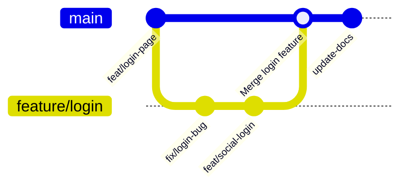

# **Debugging Continuous Delivery Practices: A Troubleshooting Guide**
*"Always Ready to Deploy"*

This guide provides a structured approach to diagnosing, resolving, and preventing issues related to **Continuous Delivery (CD) practices**. Poor CD implementation leads to deployment delays, technical debt, scalability bottlenecks, and integration failures. This guide focuses on **quick resolution** with actionable steps.

---

## **1. Symptom Checklist**
Before diving into fixes, verify if your system exhibits these symptoms:

| **Symptom**                          | **Description**                                                                 | **Red Flag?** |
|--------------------------------------|---------------------------------------------------------------------------------|---------------|
| Deployment takes >30+ minutes        | Manual or slow CI/CD pipelines cause delays.                                  | ✅ Yes         |
| Frequent rollback requests           | New deployments often require immediate rollback due to bugs or failures.      | ✅ Yes         |
| High failure rates in staging/prod  | Tests pass in dev but fail in higher environments (staging/production).         | ✅ Yes         |
| No automated rollback capability     | Manual intervention required for failed deployments.                          | ✅ Yes         |
| Long-lived feature branches          | Branches merge after weeks/months, causing merge conflicts and testing burdens. | ✅ Yes         |
| Deployments trigger downtime         | Deployment disrupts services instead of being seamless.                         | ✅ Yes         |
| Lack of automated testing coverage   | No or insufficient unit, integration, or smoke tests.                          | ✅ Yes         |
| Slow feedback loop                   | Developers wait hours/days for feedback on changes.                            | ✅ Yes         |
| Inconsistent environments             | Dev ≠ Staging ≠ Prod (e.g., mismatched configs, dependencies).                  | ✅ Yes         |
| No blue-green or canary deployments  | All traffic shifts abruptly, risking outages.                                  | ⚠️ (Risky)    |
| High maintenance debt                | Old code is hard to modify due to tight coupling or lack of modularity.          | ⚠️ (Critical) |

---
**If you checked ≥3 red flags, your CD process needs immediate attention.**

---

## **2. Common Issues & Fixes**

### **Issue 1: Slow Deployment Pipelines (Time-Consuming CI/CD)**
**Root Cause:**
- Inefficient scripts, missing parallelization, or overly complex builds.
- Missing incremental builds (rebuilding everything on every commit).
- Heavy dependency management (e.g., Docker builds taking too long).

**Quick Fixes:**
#### **Optimize Build Scripts (Example: Gradle/Kotlin DSL)**
```kotlin
// Before: Sequential tasks
tasks.withType<JavaCompile>().configureEach {
    dependsOn("clean") // Forces full rebuild
}

// After: Parallel tasks + incremental builds
tasks.withType<JavaCompile>().configureEach {
    dependsOn("clean", "compileTestJava") // Parallel execution
    isIncremental = true // Only recompiles changed files
}
```

#### **Use Caching in CI (GitHub Actions Example)**
```yaml
# .github/workflows/deploy.yml
jobs:
  build:
    runs-on: ubuntu-latest
    steps:
      - uses: actions/checkout@v4
      - uses: actions/cache@v3
        with:
          path: |
            ~/.gradle/caches
            ~/.gradle/wrapper
          key: ${{ runner.os }}-gradle-${{ hashFiles('**/*.gradle*', '**/gradle-wrapper.properties') }}
          restore-keys: |
            ${{ runner.os }}-gradle-
```

**Preventive Action:**
- **Benchmark builds** and identify bottlenecks (e.g., `mvn package` vs. `npm install`).
- **Use Docker layers** to cache dependencies.
- **Implement parallel job execution** (e.g., GitHub Actions `jobs.matrix`).

---

### **Issue 2: Inconsistent Environments (Dev ≠ Staging ≠ Prod)**
**Root Cause:**
- Hardcoded configs, missing infrastructure-as-code (IaC), or manual setup.
- Lack of environment parity (e.g., staging uses old DB schemas).

**Quick Fixes:**
#### **Use Infrastructure as Code (Terraform Example)**
```hcl
# variables.tf
variable "env" {
  type = string
  default = "dev" # Can be overridden per deployment
}

# main.tf
resource "aws_rds_cluster" "db" {
  engine        = "aurora-postgresql"
  database_name = "app_${var.env}"
  # ... other configs
}
```
**Deploy with environment variables:**
```bash
# Deploy to staging
export ENV=staging
terraform apply -target=aws_rds_cluster.db
```

#### **Secrets & Configs via Secrets Manager (AWS Example)**
```yaml
# GitHub Actions
- name: Deploy with secrets
  run: |
    echo "DB_HOST=${{ secrets.DB_HOST_STAGING }}" >> .env
    ./deploy.sh
```

**Preventive Action:**
- **Enforce IaC for all environments** (Terraform, CloudFormation, Pulumi).
- **Use feature flags** (e.g., LaunchDarkly, Unleash) to toggle configs without redeploying.
- **Automate environment provisioning** (e.g., `terraform apply --auto-approve`).

---

### **Issue 3: Failed Deployments → No Automated Rollback**
**Root Cause:**
- No health checks post-deployment.
- Manual intervention required to revert changes.

**Quick Fixes:**
#### **Automated Rollback with Health Checks (Kubernetes Example)**
```yaml
# deployment.yaml
containers:
- name: my-app
  readinessProbe:
    httpGet:
      path: /health
      port: 8080
    initialDelaySeconds: 5
    periodSeconds: 10
  livenessProbe:
    httpGet:
      path: /health
      port: 8080
    initialDelaySeconds: 15
    failureThreshold: 3
```

**Add rollback logic (Python Flask Example):**
```python
@app.route('/health')
def health_check():
    if not check_dependencies():  # Custom health check
        return {"status": "critical"}, 500
    return {"status": "healthy"}, 200

# Post-deploy script
if not health_check():
    rollback_latest_deployment()
```

**Preventive Action:**
- **Implement canary deployments** (gradual traffic shift).
- **Use blue-green deployments** (full switch only after validation).
- **Log rollback triggers** (e.g., Prometheus alerts + Slack notifications).

---

### **Issue 4: Testing Gaps (Tests Pass in Dev, Fail in Prod)**
**Root Cause:**
- Lack of integration/end-to-end (E2E) tests.
- Mocks/stubs don’t match real dependencies.

**Quick Fixes:**
#### **Add Integration Tests (JUnit + TestContainers)**
```java
@Test
public void testDatabaseIntegration() {
    try (DynamicContainer postgres = new GenericContainer("postgres")
        .withExposedPorts(5432)) {

        // Start Dockerized DB
        postgres.start();

        // Test against real DB
        JdbcTemplate jdbc = new JdbcTemplate(new DataSourceBuilder()
            .url("jdbc:postgresql://" + postgres.getHost() + ":" + postgres.getMappedPort(5432))
            .build());
        jdbc.queryForObject("SELECT 1", Integer.class);
    }
}
```

#### **Mock External Services (Postman + WireMock)**
```java
// Mock API response in tests
WireMock.stubFor(
    get(urlEqualTo("/api/data"))
        .willReturn(
            aResponse()
                .withStatus(200)
                .withBody("{\"status\":\"ok\"}")
        )
);
```

**Preventive Action:**
- **Shift tests left**: Add E2E tests in CI (e.g., Cypress, Selenium).
- **Use chaos engineering** (e.g., Gremlin) to test failure scenarios.
- **Run tests in staging-like environments** before prod.

---

### **Issue 5: Long-Lived Feature Branches**
**Root Cause:**
- Developers avoid merging due to fear of breaking changes.
- No trunk-based development workflow.

**Quick Fixes:**
#### **Enforce Trunk-Based Development (Git Flow Alternative)**


**Preventive Action:**
- **Use feature flags** to hide unfinished features.
- **Enforce branch policies** (e.g., "No branches >1 week old").
- **Automate PR reviews** (e.g., Slack notifications for stale PRs).

---

## **3. Debugging Tools & Techniques**

| **Tool/Technique**               | **Use Case**                                                                 | **Example Command/Setup**                          |
|-----------------------------------|-----------------------------------------------------------------------------|----------------------------------------------------|
| **CI/CD Dashboards**              | Track deployment frequency, failure rates.                                  | GitHub Actions API, JFrog Xray                      |
| **APM Tools (New Relic, Datadog)** | Monitor app performance post-deployment.                                   | `datadog-agent install`                            |
| **Log Aggregation (ELK, Loki)**   | Debug failed deployments via logs.                                           | `kubectl logs -f <pod>`                            |
| **Feature Flags (LaunchDarkly)**  | Roll back features without redeploying.                                     | `curl -X POST "https://app.launchdarkly.com/api/v2/flags/..."` |
| **Chaos Engineering (Gremlin)**   | Test resilience of deployments.                                             | `gremlin run kill-pod -n my-namespace`             |
| **Infrastructure Drift Detection**| Compare IaC state vs. actual cloud state.                                   | `terraform plan -out=tfplan && terraform show -json tfplan` |
| **Canary Analysis Tools**         | Gradually roll out traffic to detect issues.                                | Istio + Kiali, Flagger                          |
| **Database Migration Tools**      | Safely update DB schemas.                                                   | Flyway, Liquibase                                  |

**Debugging Workflow:**
1. **Reproduce**: Deploy in staging with the same config as prod.
2. **Isolate**: Check logs (`journalctl`, `kubectl logs`).
3. **Compare**: Run `diff` on configs, Dockerfiles, or DB schemas.
4. **Rollback**: Use feature flags or blue-green deployments.
5. **Analyze**: Add metrics (e.g., Prometheus) to track failures.

---

## **4. Prevention Strategies**

### **A. Culture & Processes**
✅ **Shift Left**: Move testing/validation earlier in the pipeline.
✅ **Automate Everything**: From code reviews to deployments.
✅ **Blame-Free Postmortems**: Analyze failures objectively.
✅ **Metrics-Driven Deployments**: Track DORA metrics (Deployment Frequency, Lead Time, etc.).
✅ **On-Call Rotation**: Ensures quick response to production issues.

### **B. Tooling & Architecture**
🔧 **Use GitOps (ArgoCD, Flux)**: Sync Kubernetes manifests via Git.
🔧 **Immutable Infrastructure**: Replace servers instead of patching them.
🔧 **Containerization (Docker/K8s)**: Ensures consistency across environments.
🔧 **Feature Flags**: Separate deployment from release.
🔧 **Chaos Engineering**: Proactively test failure scenarios.

### **C. Checklist for Healthy CD**
| **Practice**               | **Implementation**                          |
|----------------------------|---------------------------------------------|
| **Automated Testing**      | 100% unit + integration + E2E coverage.      |
| **Environment Parity**     | IaC for all environments.                    |
| **Rollback Strategy**      | Blue-green or canary + health checks.       |
| **Security Scanning**      | SAST/DAST in CI (e.g., SonarQube, Trivy).    |
| **Monitoring**             | APM + logs + metrics (Prometheus + Grafana).|
| **Documentation**          | Runbooks for rollbacks, deployment guides.   |

---

## **5. Final Checklist for Quick Fixes**
| **Action**                          | **Time to Complete** |
|-------------------------------------|----------------------|
| Optimize build scripts (parallelize). | 1-2 hours            |
| Add caching in CI.                  | 30 mins              |
| Implement IaC for environments.     | 1-2 days             |
| Add health checks + rollback logic. | 2-4 hours            |
| Run integration tests in staging.   | 1 day                |
| Enforce trunk-based workflow.       | 1 week               |
| Set up monitoring (Prometheus).     | 1 day                |

---
### **Next Steps**
1. **Start small**: Fix the most critical symptom first (e.g., slow deployments).
2. **Measure outcomes**: Track DORA metrics before/after changes.
3. **Automate everything**: Reduce manual intervention in deployments.
4. **Iterate**: CD is a journey, not a destination.

**Example Roadmap:**
- **Week 1**: Optimize builds + add caching.
- **Week 2**: Implement IaC for staging.
- **Week 3**: Add canary deployments.
- **Week 4**: Chaos testing.

---
**By following this guide, you’ll reduce deployment risks, improve reliability, and achieve "always ready to deploy" status.** 🚀