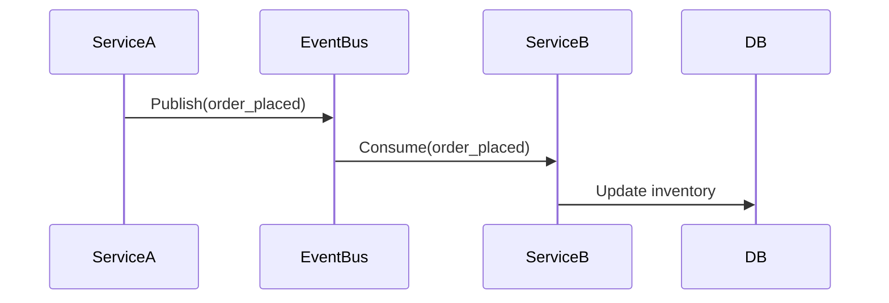

# **Debugging Distributed Systems Best Practices: A Troubleshooting Guide**
*Efficiently diagnose and resolve issues in scalable, distributed architectures*

---

## **1. Introduction**
Distributed systems are built to scale horizontally, improve fault tolerance, and enhance performance. However, their complexity introduces unique debugging challenges, such as **network latency, consistency issues, load imbalance, and service dependencies**. This guide provides a structured approach to identifying and resolving common distributed system problems.

---

## **2. Symptom Checklist**
Before diving into fixes, verify if your issue aligns with these **distributed-specific symptoms**:

| **Symptom** | **Description** | **Likely Cause** |
|-------------|----------------|------------------|
| **Latency Spikes** | Slow response times (e.g., >1s), inconsistent delays | Network congestion, DB bottlenecks, cold starts |
| **Partial Failures** | Some services work, others fail intermittently | Race conditions, eventual consistency, retries |
| **Inconsistent Data** | Different replicas show divergent states | Eventual consistency, message loss, duplicate processing |
| **Resource Starvation** | High CPU/memory usage in one pod/instance | Misconfigured autoscaling, noisy neighbors |
| **Timeouts & Retries** | HTTP 5xx errors, exponential backoff retries | Circuit breakers, improper retry logic |
| **Deprecated APIs** | Services refuse requests due to version mismatch | API versioning drift |
| **Dependency Failures** | Service A crashes because Service B is down | Poor circuit breaker thresholds |
| **Log Corruption** | Missing or corrupted logs in distributed traces | Log aggregation failures |

**Next Step:** If multiple symptoms match, prioritize based on **impact vs. occurrence rate**.

---

## **3. Common Issues and Fixes**
### **A. Network Latency & Timeouts**
**Issue:** Slow inter-service communication (e.g., `Service A → Service B` takes 3s instead of 100ms).

**Root Causes:**
- **Network partitions** (DNS misconfigurations, VPC peering issues).
- **Unoptimized service calls** (synchronous blocking calls).
- **Thundering herd problem** (too many retries causing cascading failures).

**Fixes:**

#### **1. Optimize Network Calls**
Replace blocking HTTP requests with **asynchronous messaging (Kafka, RabbitMQ)**.
```java
// Bad: Synchronous call (blocks until response)
Response response = restTemplate.getForObject(url, Response.class);

// Good: Fire-and-forget with async message queue
producer.send(Message("processRequest", request));
```

#### **2. Implement Circuit Breakers**
Use **Resilience4j** or **Hystrix** to limit retries and fail fast.
```java
// Spring Cloud Circuit Breaker (Resilience4j)
@CircuitBreaker(name = "inventoryService", fallbackMethod = "fallbackGetStock")
public Inventory getStock(String productId) { ... }
```

#### **3. Enable Connection Pooling**
Use **Apache HttpClient** or **gRPC** with connection pooling.
```java
// gRPC (connection reuse)
Channel channel = ManagedChannelBuilder
    .forTarget("service-b:50051")
    .usePlaintext()
    .maxInboundMessageSize(1048576) // 1MB
    .build();
```

---

### **B. Data Inconsistency (Eventual Consistency Issues)**
**Issue:** Two services report different states for the same entity (e.g., `User A` has `balance=100` in DB1 but `balance=95` in DB2).

**Root Causes:**
- **Eventual consistency** (e.g., CQRS, eventual sync).
- **Lost writes** (e.g., Kafka topic partitions not acknowledged).
- **Duplicate processing** (idempotency not enforced).

**Fixes:**

#### **1. Enforce Idempotency**
Use **idempotency keys** to prevent duplicate processing.
```python
# Example: SQL-based idempotency check
if not db.execute("SELECT * FROM processed_transfers WHERE id = ?", [tx_id]):
    process_transaction(tx_id)
```

#### **2. Compensating Transactions**
For **saga patterns**, implement rollback logic.
```java
// Saga example: Order -> Payment -> Shipping
if (paymentService.charge(orderId).failed()) {
    inventoryService.returnStock(orderId);
    throw new PaymentFailedException();
}
```

#### **3. Stronger Consistency with 2PC (Two-Phase Commit)**
Use **JTA (Java Transaction API)** for distributed transactions (last resort).
```java
@Transactional
public void transferFunds(Account from, Account to, BigDecimal amount) {
    from.withdraw(amount);
    to.deposit(amount);
}
```
⚠️ **Warning:** 2PC degrades performance; prefer **sagas** for most cases.

---

### **C. Load Imbalance & Resource Exhaustion**
**Issue:** One service node handles 90% of traffic while others are idle.

**Root Causes:**
- **Misconfigured load balancers** (round-robin vs. least connections).
- **Cold starts** (e.g., serverless functions).
- **Uneven data distribution** (sharding issues).

**Fixes:**

#### **1. Use Consistent Hashing**
Distribute requests evenly across shards.
```java
// Java example: ConsistentHashing
ConsistentHash<ServiceNode> hashRing = new ConsistentHash<>(100, (key) -> {
    return MurmurHash.hash(key);
});
String node = hashRing.get(key);
```

#### **2. Auto-Scaling Monitoring**
Set up **Prometheus + Alertmanager** to detect CPU/Memory spikes.
```yaml
# Prometheus alert rule
- alert: HighCPUUsage
  expr: 100 - (avg by(instance) (rate(node_cpu_seconds_total{mode="idle"}[5m])) * 100) > 80
  for: 5m
  labels:
    severity: critical
```

#### **3. Pre-Warm Services**
For serverless (e.g., AWS Lambda), use **scheduled keep-alive requests**.
```bash
# Example: Keep Lambda warm
curl -X POST https://your-api-gateway/health
```

---

### **D. Dependency Failures (Cascading Failures)**
**Issue:** Service A crashes because Service B is down, causing a domino effect.

**Root Causes:**
- **No circuit breakers** (retry loops exhausting resources).
- **No retry backoff** (exponential delays recommended).
- **Tight coupling** (monolithic dependencies).

**Fixes:**

#### **1. Implement Retry with Jitter**
Use **Resilience4j Retry** with exponential backoff.
```java
RetryConfig retryConfig = RetryConfig.custom()
    .maxAttempts(3)
    .waitDuration(Duration.ofMillis(100))
    .retryExceptions(TimeoutException.class)
    .failAfterMaxAttemps(true)
    .build();
Retry retry = Retry.of("retryConfig", retryConfig);
```

#### **2. Decouple with Event-Driven Architecture**
Replace direct calls with **event sourcing**.


#### **3. Bulkhead Pattern (Resource Isolation)**
Limit concurrent calls to a dependent service.
```java
// Resilience4j Bulkhead
@Bulkhead(name = "paymentService", type = BulkheadType.SEMAPHORE, maxConcurrentCalls = 10)
public Payment processPayment(PaymentRequest request) { ... }
```

---

## **4. Debugging Tools & Techniques**
### **A. Distributed Tracing**
- **Tools:** Jaeger, Zipkin, OpenTelemetry
- **How to Use:**
  ```bash
  # Enable OpenTelemetry in Java
  public static void main(String[] args) {
      OpenTelemetrySdk openTelemetry = OpenTelemetrySdk.builder()
          .setServiceName("service-a")
          .build();
      openTelemetry.getTracer("tracer").spanBuilder("processOrder")
          .startSpan()
          .end();
  }
  ```
- **Fix Timeouts:** Check if spans show **long RPC durations** (e.g., DB queries).

### **B. Log Aggregation & Correlation IDs**
- **Tools:** ELK Stack, Loki, Datadog
- **Example Correlation ID Tracking:**
  ```java
  // Set correlation ID in request/response headers
  RequestContext.put("correlationId", UUID.randomUUID().toString());
  ```

### **C. Chaos Engineering**
- **Tools:** Gremlin, Chaos Mesh
- **Example: Kill a Pod to Test Resilience**
  ```bash
  kubectl delete pod service-b-pod-1 --grace-period=0 --force
  ```
- **Observations:**
  - Does the circuit breaker trip?
  - Are fallback responses served?

### **D. Performance Profiling**
- **Tools:** JFR (Java Flight Recorder), Flame Graphs
- **Example: CPU Bottleneck Analysis**
  ```bash
  # Generate Java Flight Record
  jcmd <PID> JFR.start duration=60s filename=profile.jfr
  ```

---

## **5. Prevention Strategies**
### **A. Design for Failure**
- **Assume services will fail** (stateless services where possible).
- **Use retries with backoff** (never infinite loops).
- **Implement health checks** (`/actuator/health` in Spring Boot).

### **B. Monitoring & Alerting**
- **Key Metrics:**
  - `latency_percentile` (p99)
  - `error_rate` (per service)
  - `dependency_success_rate`
- **Tools:**
  - **Prometheus + Grafana** (metrics)
  - **Sentry** (error tracking)
  - **Datadog** (APM)

### **C. CI/CD Best Practices**
- **Canary Deployments** (gradual rollout).
- **Automated Rollback** (if health checks fail).
- **Chaos Testing in CI** (e.g., kill a pod before production).

### **D. Documentation & Runbooks**
- **Document:**
  - Service dependencies (arch diagrams).
  - Failure modes (e.g., "If DB is down, fall back to cache").
- **Runbooks:**
  - Step-by-step fixes for common failures (e.g., "Timeouts in Service B").

---

## **6. Quick Reference Table**
| **Issue**               | **Quick Fix**                          | **Long-Term Solution**               |
|-------------------------|----------------------------------------|---------------------------------------|
| High Latency            | Enable caching (Redis)                 | Optimize DB queries, use async       |
| Data Inconsistency      | Implement idempotency keys              | Adopt saga pattern                   |
| Cascading Failures      | Add circuit breakers                     | Decouple services with events         |
| Load Imbalance          | Use consistent hashing                 | Auto-scale based on CPU/memory       |
| Missing Logs            | Check log aggregation (ELK)            | Centralized logging (Fluentd)         |

---

## **7. Final Checklist Before Production**
✅ **All dependencies have circuit breakers.**
✅ **Services are idempotent.**
✅ **Logging includes correlation IDs.**
✅ **Monitoring covers latency, errors, and dependencies.**
✅ **Chaos tests pass (e.g., pod kills).**
✅ **Rollback procedure is documented.**

---
**Next Steps:**
1. **Reproduce the issue** in a staging environment.
2. **Apply fixes** incrementally (start with circuit breakers).
3. **Verify** with distributed tracing.
4. **Monitor** post-deployment.

By following this guide, you’ll **minimize downtime** and **improve resilience** in distributed systems. 🚀