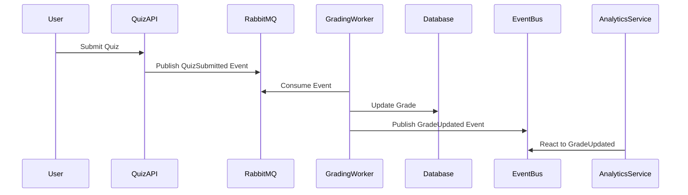

# **Debugging Education Domain Patterns: A Troubleshooting Guide**

## **Introduction**
The **Education Domain Patterns** refer to best practices for designing and implementing systems that support learning management, student engagement, course management, and academic analytics. Common challenges include **performance bottlenecks** (due to complex student data queries), **reliability issues** (from inconsistent grading pipelines), and **scalability problems** (due to high concurrent user activity during exams).

This guide provides a **practical, structured approach** to diagnosing and resolving issues in education domain applications.

---

## **1. Symptom Checklist**
Before diving into fixes, systematically check for these symptoms:

| **Category**          | **Symptoms**                                                                 |
|-----------------------|-----------------------------------------------------------------------------|
| **Performance**       | Slow course content loading, delayed quiz submissions, analytics report lag  |
| **Reliability**       | Failed grading pipelines, inconsistent quiz scores, database corruption    |
| **Scalability**       | High CPU/memory usage during peak hours, timeouts in enrollment APIs       |
| **User Experience**   | Login delays, API rate limits, course enrollment failures                  |
| **Data Integrity**    | Duplicate student records, missing attendance logs, incorrect grade updates |

**Action:** Isolate the symptom (e.g., "Analytics reports take 30+ minutes to generate").

---

## **2. Common Issues and Fixes**

---

### **Issue 1: Slow Query Performance (Course Content & Analytics)**
**Symptoms:**
- Joining `Students`, `Courses`, and `Grades` tables takes **10+ seconds**.
- Aggregating student performance reports is slow.

**Root Cause:**
- Lack of **proper indexing** on frequently queried fields (`student_id`, `course_id`, `date`).
- **Unoptimized aggregation** (e.g., `GROUP BY` on large datasets).
- **N+1 query problem** (e.g., fetching a course, then loading all enrolled students in a loop).

**Fixes:**

#### **A. Optimize Database Queries**
**Before (Slow Query):**
```sql
SELECT s.student_name, c.course_name, g.grade
FROM Students s
JOIN Courses c ON s.course_id = c.id
JOIN Grades g ON s.student_id = g.student_id
WHERE g.assignment_id = 123;
```
**After (Optimized with Indexes & Joins):**
```sql
-- Ensure these indexes exist
CREATE INDEX idx_students_course_id ON Students(course_id);
CREATE INDEX idx_grades_assignment_id ON Grades(assignment_id);

-- Use JOINs efficiently
SELECT s.student_name, c.course_name, g.grade
FROM Students s
INNER JOIN Courses c ON s.course_id = c.id
INNER JOIN Grades g ON s.student_id = g.student_id
WHERE g.assignment_id = 123
ORDER BY s.student_name;
```
**Key Fixes:**
✅ **Add composite indexes** for frequently joined columns.
✅ **Use `EXPLAIN`** to analyze query execution.

---

#### **B. Avoid N+1 Queries (Lazy Loading)**
**Problem:**
```python
# Python (Flask/FastAPI) Example - Slow due to N+1 queries
courses = db.session.query(Course).all()
for course in courses:
    students = db.session.query(Student).filter_by(course_id=course.id).all()  # N+1
```
**Solution (Eager Loading with `joinedload`):**
```python
from sqlalchemy.orm import joinedload

courses = db.session.query(Course).options(joinedload(Course.students)).all()
```
**Alternative (Batch Fetching):**
```python
# Use SQLAlchemy's `batch_size` parameter
students = db.session.query(Student).filter_by(course_id=course.id).options(
    lazyload_only([Student.grades])
).all()
```

---

### **Issue 2: Failed Grading Pipeline (Reliability)**
**Symptoms:**
- Quiz submissions are **not processed** in real-time.
- Grades are **inconsistent** across students.
- **Deadlocks** in concurrent grading updates.

**Root Cause:**
- **No retries** for failed grading jobs.
- **Lock contention** when multiple users submit at once.
- **Eventual consistency** issues in distributed systems.

**Fixes:**

#### **A. Implement Retry Logic (Celery/RabbitMQ)**
```python
# Python (Celery Task with Retry)
from celery import shared_task
from celery.exceptions import Retry

@shared_task(max_retries=3, default_retry_delay=60)
def process_quiz_submission(student_id, quiz_id):
    try:
        result = db.session.query(QuizResult).filter_by(student_id=student_id, quiz_id=quiz_id).first()
        if not result:
            raise ValueError("Quiz result not found")
        # Update grades atomically
        db.session.execute(
            "UPDATE Grades SET score = :score WHERE student_id = :student_id AND assignment_id = :quiz_id",
            {"score": result.score, "student_id": student_id, "quiz_id": quiz_id}
        )
        db.session.commit()
    except Exception as e:
        raise Retry(exc=e)
```

#### **B. Use Optimistic Locking (Prevent Deadlocks)**
```python
# SQLAlchemy Optimistic Locking
from sqlalchemy.ext.declarative import declared_attr
from sqlalchemy import Column, Integer

class Grade(Base):
    __tablename__ = 'grades'
    id = Column(Integer, primary_key=True)
    student_id = Column(Integer)
    score = Column(Integer)
    version = Column(Integer, default=1)  # For optimistic locking

    @declared_attr
    def __table_args__(cls):
        return {
            'extend_existing': True,
            'version_id_col': 'version',
            'version_id_generator': Sequence('grade_version_seq', start=1)
        }
```
**Update with Locking:**
```python
grade = db.session.query(Grade).filter_by(student_id=student_id).with_for_update().first()
if grade.version == expected_version:
    grade.score = new_score
    grade.version += 1
    db.session.commit()
else:
    db.session.rollback()
    raise StaleDataError("Grade was modified by another user")
```

---

### **Issue 3: Scalability Under Load (Peak Hours)**
**Symptoms:**
- **API timeouts** during simultaneous exam submissions.
- **Database connection pool exhausted**.
- **High latency** in real-time analytics dashboards.

**Root Cause:**
- **No caching** for frequently accessed data (e.g., course syllabi).
- **Stateless API design fails** under load.
- **No rate limiting** on enrollment endpoints.

**Fixes:**

#### **A. Implement Caching (Redis)**
```python
# FastAPI + Redis Cache Example
from fastapi import FastAPI
import redis

app = FastAPI()
cache = redis.Redis(host="redis-host", port=6379, db=0)

@app.get("/course/{course_id}")
async def get_course(course_id: int):
    cache_key = f"course:{course_id}"
    cached_course = cache.get(cache_key)
    if cached_course:
        return json.loads(cached_course)

    course = db.session.query(Course).filter_by(id=course_id).first()
    cache.setex(cache_key, 3600, json.dumps(course.__dict__))  # Cache for 1 hour
    return course
```

#### **B. Use Async Database Queries (SQLAlchemy + Asyncio)**
```python
# Async SQLAlchemy Example
from sqlalchemy.ext.asyncio import create_async_engine, AsyncSession
from sqlalchemy.orm import sessionmaker

engine = create_async_engine("postgresql+asyncpg://user:pass@db:5432/db")
AsyncSessionLocal = sessionmaker(engine, class_=AsyncSession, expire_on_commit=False)

@app.get("/students/")
async def get_students():
    async with AsyncSessionLocal() as session:
        async with session.begin():
            students = await session.execute(
                select(Student)
            )
            return [student for student in students.scalars()]
```

#### **C. Rate Limiting (FastAPI + `slowapi`)**
```python
# FastAPI Rate Limiter
from slowapi import Limiter
from slowapi.util import get_remote_address

limiter = Limiter(key_func=get_remote_address)
app = FastAPI(limiter=limiter)

@app.post("/enroll")
@limiter.limit("5/minute")
async def enroll_student(student_id: int):
    # Enrollment logic
    return {"status": "success"}
```

---

## **3. Debugging Tools & Techniques**

| **Tool**               | **Purpose**                                                                 | **Example Command/Usage**                          |
|------------------------|----------------------------------------------------------------------------|----------------------------------------------------|
| **Database Profiling** | Identify slow queries.                                                      | `EXPLAIN ANALYZE SELECT * FROM Students;`          |
| **APM (New Relic/Datadog)** | Monitor API latency, database bottlenecks.                                 | Check `/api/latency` in APM dashboard.            |
| **Redis Inspector**    | Debug cache hits/misses.                                                    | `redis-cli --bigkeys`                             |
| **Celery Beat Logs**   | Check if scheduled tasks (grading) are running.                           | `celery -A tasks beat --loglevel=info`             |
| **Postman/K6**        | Simulate load under peak hours.                                             | Run `k6 run load_test.js --vus 100`               |
| **SQLAlchemy Debug**   | Log slow queries in Flask/FastAPI.                                          | `app.config['SQLALCHEMY_ECHO'] = True`            |
| **Prometheus/Grafana** | Monitor CPU, memory, and request rates.                                     | `prometheus scrape_config.yaml`                    |

**Pro Tip:**
- **Use `tracemalloc` in Python** to track memory leaks in long-running processes.
  ```python
  import tracemalloc
  tracemalloc.start()
  snapshot = tracemalloc.take_snapshot()
  top_stats = snapshot.statistics('lineno')
  for stat in top_stats[:10]:
      print(stat)
  ```

---

## **4. Prevention Strategies**

### **A. Architectural Best Practices**
✅ **Microservices for Scalability**
- Split `CourseService`, `GradingService`, and `AnalyticsService` into separate containers.
- Use **Kubernetes HPA** to auto-scale grading pods during exam peaks.

✅ **Event-Driven Grading Pipeline**


✅ **Database Sharding**
- Shard `Students` table by **cohort** (e.g., `students_2024`, `students_2025`).
- Use **connection pooling** (e.g., PgBouncer for PostgreSQL).

### **B. Code-Level Optimizations**
✅ **Batch Inserts for Bulk Operations**
```python
# Instead of multiple INSERTs:
for student in new_students:
    db.session.add(student)

# Use bulk insert:
db.session.execute(
    "INSERT INTO Students (name, email) VALUES (:name, :email)",
    [{"name": s.name, "email": s.email} for s in new_students]
)
db.session.commit()
```

✅ **Async Task Queues**
- Use **Celery + Redis** for non-critical tasks (e.g., generating certificates).
- Set **TTL on cache keys** to avoid stale data:
  ```python
  cache.setex(f"course:{course_id}:syllabus", 86400, syllabus_content)  # 1 day TTL
  ```

### **C. Monitoring & Alerts**
✅ **Set Up Alerts for:**
- **Database query duration > 500ms**
- **Grading pipeline failure rate > 1%**
- **Cache miss ratio > 30%**

**Example (Prometheus + Alertmanager):**
```yaml
# alert.rules.yml
groups:
- name: education_alerts
  rules:
  - alert: SlowCourseQuery
    expr: rate(db_query_duration_seconds_bucket{job="course_api"}[5m]) > 0.5
    for: 5m
    labels:
      severity: warning
    annotations:
      summary: "Slow course query detected ({{ $value }}s)"
```

---

## **5. Final Checklist for Quick Resolution**
| **Step** | **Action** |
|----------|------------|
| 1 | **Reproduce the issue** (Is it consistent or intermittent?) |
| 2 | **Check logs** (`/var/log/nginx`, `celery.log`, database logs) |
| 3 | **Profile slow queries** (`EXPLAIN`, APM) |
| 4 | **Optimize indexes** (Add missing ones) |
| 5 | **Enable caching** (Redis) for read-heavy operations |
| 6 | **Review deadlocks** (Use `pg_locks` in PostgreSQL) |
| 7 | **Test scaling** (Load test with K6) |
| 8 | **Set up monitoring** (Prometheus + Grafana) |

---

## **Conclusion**
Education domain systems **require fine-tuned performance, reliability, and scalability** due to high user activity and data sensitivity. By following this guide:
- **Fix performance** with indexing, caching, and async queries.
- **Ensure reliability** with retries, optimistic locking, and event sourcing.
- **Scale efficiently** with microservices, rate limiting, and sharding.

**Next Steps:**
- **Automate deployments** (use GitHub Actions + Terraform for DB scaling).
- **Run monthly load tests** before exam seasons.
- **Document failover procedures** for database backups.

Troubleshooting education systems is **part art, part science**—leverage logs, APM, and proactive monitoring to stay ahead of issues. 🚀