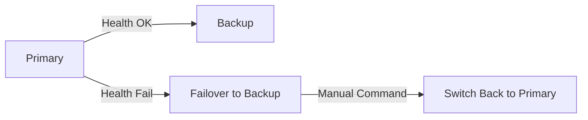

# **Debugging Failover Integration: A Troubleshooting Guide**
*For Backend Engineers*

---

## **Introduction**
Failover Integration ensures high availability by seamlessly switching to a backup service when the primary fails. Commonly used with databases (e.g., PostgreSQL, MongoDB), microservices, or cloud services (AWS RDS, GCP Cloud SQL), misconfigurations or runtime failures can disrupt this critical pattern.

This guide covers **symptoms, root causes, fixes, debugging tools, and prevention** for Failover Integration failures.

---

## **1. Symptom Checklist**
✅ **Primary Service Unavailable**
   - API calls to the primary service return `Service Unavailable (503)` or `Timeout` errors.
   - Database queries fail with `Connection Refused` or `No route to host`.

✅ **Slow Failover Response**
   - Failover triggers but takes **>30 seconds** to activate.
   - Clients see degraded performance before switching.

✅ **Inconsistent Failover States**
   - Some clients use the backup, while others still try the primary.
   - Partial writes occur on both primary and backup (data inconsistency).

✅ **Backup Service Overloaded**
   - After failover, the backup service becomes unresponsive.
   - High CPU/memory usage detected on the backup node.

✅ **Health Checks Fail**
   - `health_check()` endpoints return `false` for both primary and backup.
   - Ping tests (`curl -v http://backup-service:8080/health`) timeout.

✅ **Session/Connection Issues**
   - Active database transactions are dropped during failover.
   - Application sessions (Redis/JWT) become inconsistent.

---

## **2. Common Issues & Fixes**
### **2-1. Primary Service Down, Failover Not Triggered**
**Symptom:**
The primary service crashes (e.g., `Node.js` app OOM-killed or `PostgreSQL` crashes), but failover does **not** activate.

**Root Cause:**
- **Health check threshold misconfigured** (e.g., `max_failures=3` with 1-second interval → too strict).
- **Failover script stuck** (e.g., stuck in `while` loop waiting for primary).
- **Network partition** (DNS/load balancer still pointing to dead primary).

**Fixes:**
#### **Fix 1: Adjust Health Check Intervals**
```javascript
// Example: Health check in Node.js (Express)
const healthCheckInterval = 5000; // 5 seconds (default: 10s)
let failureCount = 0;

app.get('/health', (req, res) => {
  if (failureCount >= 3) {
    res.status(503).send('Primary down, switching to backup.');
    triggerFailover(); // Call your failover logic
  } else {
    res.status(200).send('OK');
  }
});
```
**Best Practice:**
- **Primary:** `health_check_interval=3s`, `max_failures=5`.
- **Backup:** `health_check_interval=5s`, `max_failures=3` (less strict).

#### **Fix 2: Force Failover on Critical Failures**
```bash
# Kubernetes Liveness Probe Example (YAML)
livenessProbe:
  httpGet:
    path: /health
    port: 8080
  initialDelaySeconds: 5
  failureThreshold: 3
  periodSeconds: 2
```
**Action:**
- If `failureThreshold` is too high, reduce it.
- Add **manual failover** via CLI:
  ```bash
  # AWS RDS Failover
  aws rds promote-read-replica --db-instance-identifier primary-db
  ```

---

### **2-2. Slow Failover Response**
**Symptom:**
Failover detected but takes **>20s** to switch.

**Root Cause:**
- **DNS propagation delay** (if using Cloudflare/Route53).
- **Load balancer stuck** (sticky sessions not released).
- **Backup service overloaded** (CPU/memory constrained).

**Fixes:**
#### **Fix 1: Use Round-Robin DNS + Fast TTL**
```bash
# Example: AWS Route53 Failover Setup
nslookup myapp.example.com
```
**Solution:**
- Set **TTL=30s** (not 1h) to propagate changes quickly.
- Use **weighted records** for gradual failover:
  ```
  PRIMARY: Weight=100 (until down)
  BACKUP: Weight=0 → 100 (on failover)
  ```

#### **Fix 2: Disable Sticky Sessions in Load Balancer**
```yaml
# Nginx Configuration (Remove `proxy_next_upstream`)
server {
  listen 80;
  server_name primary.myapp.com;

  location / {
    proxy_pass http://primary-service:8080;
    proxy_next_upstream error timeout invalid_header; # Remove sticky tracking
  }
}
```

#### **Fix 3: Pre-warm Backup Service**
```bash
# Kubernetes Horizontal Pod Autoscaler (HPA)
apiVersion: autoscaling/v2
kind: HorizontalPodAutoscaler
metadata:
  name: backup-service-hpa
spec:
  scaleTargetRef:
    apiVersion: apps/v1
    kind: Deployment
    name: backup-service
  minReplicas: 2  # Always keep 2 running
  maxReplicas: 5
  metrics:
  - type: Resource
    resource:
      name: cpu
      target:
        type: Utilization
        averageUtilization: 70
```

---

### **2-3. Data Inconsistency After Failover**
**Symptom:**
Some writes succeed on primary, others on backup → **split-brain risk**.

**Root Cause:**
- **No write-ahead logging (WAL) replication** (e.g., PostgreSQL async replication).
- **Application layer doesn’t enforce failover consistency**.

**Fixes:**
#### **Fix 1: Use Synchronous Replication (PostgreSQL)**
```sql
-- Configure in postgresql.conf
synchronous_commit = on
synchronous_standby_names = '*'
```
**Explanation:**
- `synchronous_commit=on` ensures writes are acknowledged only after backup confirms.
- **Cost:** Slightly slower writes (~10-20% overhead).

#### **Fix 2: Application-Level Failover Semaphore**
```javascript
// Node.js Example: Lock-based Failover
const redis = require('redis');
const client = redis.createClient();

async function writeToDatabase(data) {
  const lockKey = 'failover_lock';
  const lock = await client.set(lockKey, 'locked', 'EX', 5, 'NX'); // 5s lease

  try {
    await db.connectToPrimary(); // Try primary first
    await db.save(data);
  } catch (err) {
    await db.connectToBackup();
    await db.save(data); // Retry on backup
  }
}
```

---

### **2-4. Backup Service Overloaded Post-Failover**
**Symptom:**
Failover triggers, but backup crashes under load.

**Root Cause:**
- **Backup DB not sized for full traffic** (e.g., 10x read queries).
- **No auto-scaling** on cloud services.

**Fixes:**
#### **Fix 1: Right-Size Backup Database**
```sql
-- PostgreSQL: Check replication lag
SELECT pg_stat_replication;
```
**Solution:**
- If `lag > 1s`, **increase standby replicas** or **upgrade backup DB tier**.
- **AWS RDS Example:**
  ```bash
  aws rds modify-db-instance --db-instance-identifier backup-db --db-instance-class db.r5.2xlarge
  ```

#### **Fix 2: Implement Read Replicas for Backup**
```yaml
# Kubernetes StatefulSet for Read Replicas
apiVersion: apps/v1
kind: StatefulSet
metadata:
  name: db-replicas
spec:
  replicas: 3
  serviceName: db
  selector:
    matchLabels:
      app: db
  template:
    spec:
      containers:
      - name: postgres
        image: postgres:14
        ports:
        - containerPort: 5432
        env:
        - name: POSTGRES_PASSWORD
          value: "password"
        # Replication config
        command: ["postgres", "-c", "wal_level=replica", "-c", "max_wal_senders=10"]
```

---

## **3. Debugging Tools & Techniques**
### **3-1. Health Check Monitoring**
- **Prometheus + Grafana:**
  ```yaml
  # Example Prometheus Alert (Failover Triggered)
  - alert: PrimaryServiceDown
    expr: up{service="primary"} == 0
    for: 5s
    labels:
      severity: critical
    annotations:
      summary: "Primary service failed ({{ $labels.instance }})"
  ```
- **AWS CloudWatch Metrics:**
  - Monitor `DatabaseConnections` and `CPUUtilization`.

### **3-2. Failover Log Analysis**
- **Database Logs (PostgreSQL):**
  ```bash
  tail -f /var/log/postgresql/postgresql-{date}-primary.log
  ```
  - Look for `replication lag` or `connection drops`.

- **Application Logs (Node.js):**
  ```bash
  journalctl -u myapp --no-pager -n 50
  ```
  - Filter for `failover_triggered` or `health_check_timeout`.

### **3-3. Network Diagnostics**
- **Traceroute to Primary/Backup:**
  ```bash
  traceroute primary-db.example.com
  traceroute backup-db.example.com
  ```
  - Check for **latency spikes** or **ICMP blocks**.

- **DNS Propagation Test:**
  ```bash
  dig myapp.example.com +trace
  ```

### **3-4. Failover Simulation (Chaos Engineering)**
- **Use `chaos-mesh` (Kubernetes):**
  ```yaml
  apiVersion: chaos-mesh.org/v1alpha1
  kind: PodChaos
  metadata:
    name: kill-primary-pod
  spec:
    action: pod-kill
    mode: one
    selector:
      namespaces:
        - default
      labelSelectors:
        app: primary-service
  ```
- **Postman Collection for Failover Testing:**
  ```json
  {
    "name": "Failover Test",
    "request": [
      {
        "url": {"raw": "http://primary-service/health"},
        "method": "GET",
        "assertion": ["statusCode==503"]
      }
    ]
  }
  ```

---

## **4. Prevention Strategies**
### **4-1. Configure Proper Failover Thresholds**
| Component       | Recommended Setting          |
|-----------------|-----------------------------|
| Health Check    | `interval=3s`, `failures=3` |
| DNS TTL         | `30s` (not 1h)              |
| DB Replication  | `synchronous_commit=on`     |

### **4-2. Automate Failback (Not Just Failover)**
```bash
# AWS CloudWatch Event Rule for Auto-Failback
{
  "source": ["aws.ec2"],
  "detail-type": ["EC2 Instance State-change Notification"],
  "detail": {
    "state": ["running"]
  }
}
```
**Action:**
- Trigger failback if primary recovers within **5 minutes**.

### **4-3. Blue-Green Deployment for Services**

**Tools:**
- **AWS CodeDeploy** (for zero-downtime deployments).
- **Istio Traffic Shifting** (for gradual rollouts).

### **4-4. Regular Failover Drills**
- **Monthly Test:**
  ```bash
  # Simulate Primary Crash
  pkill -f "node primary-service.js"
  ```
- **Chaos Monkey Integration:**
  - **Netflix’s Chaos Monkey** (randomly kills primary pods).

### **4-5. Monitoring & Alerts**
- **Key Metrics to Monitor:**
  | Metric                     | Threshold       | Action                          |
  |----------------------------|-----------------|---------------------------------|
  | `PrimaryHealthCheckFail`   | >3 failures    | Trigger failover                |
  | `BackupDBLag`              | >5s             | Scale backup replicas           |
  | `FailoverDuration`         | >20s            | Investigate DNS/load balancer   |

---

## **5. Summary Checklist for Quick Resolution**
| Issue                     | Immediate Fix                          | Long-Term Fix                  |
|---------------------------|----------------------------------------|--------------------------------|
| Primary down, no failover | Check health check thresholds          | Reduce `failureThreshold`      |
| Slow failover             | Use Round-Robin DNS (TTL=30s)          | Disable sticky sessions        |
| Data inconsistency        | Use synchronous DB replication         | Implement application locks    |
| Backup overload           | Scale backup DB (e.g., `db.r5.2xlarge`) | Add read replicas              |
| Failover logs missing     | Enable `auditlog` in PostgreSQL        | Centralize logs (ELK Stack)    |

---
**Final Note:**
Failover is **not a silver bullet**—test it **before** production. Use **chaos engineering** to catch edge cases early.

**Need more help?** Check:
- [PostgreSQL Replication Docs](https://www.postgresql.org/docs/current/wal-shipping.html)
- [AWS RDS Failover Guide](https://docs.aws.amazon.com/AmazonRDS/latest/UserGuide/USER_PG_Failover.html)