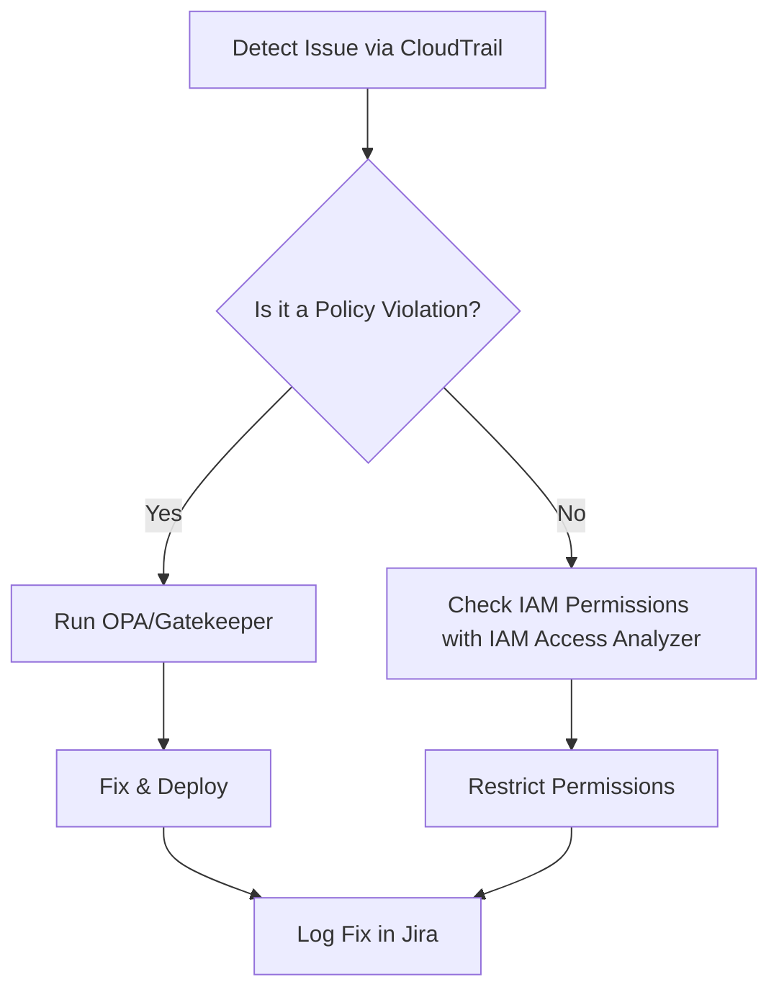

# **Debugging *Governance Best Practices* Pattern: A Troubleshooting Guide**
*By Senior Backend Engineer*

This guide provides a structured approach to diagnosing, resolving, and preventing issues related to **Governance Best Practices** in microservices, cloud-native architectures, and distributed systems. Governance Best Practices ensure consistency, compliance, and maintainability across environments—from IaC (Infrastructure as Code) to policy enforcement and operational workflows.

---

## **1. Symptom Checklist**
Common symptoms indicate misconfigurations, policy violations, or operational drift in governance. Check for:

### **A. Infrastructure & Deployment Issues**
- **[ ]** Unauthorized access to resources (e.g., IAM roles, secrets, or storage).
- **[ ]]** Failed deployments due to policy violations (e.g., resource quotas, tagging requirements).
- **[ ]** Manual deviations from IaC templates (e.g., hardcoded values in Terraform/CloudFormation).
- **[ ]]** Unintended resource scaling (e.g., missing autoscaling policies).
- **[ ]]** Compliance violations in logs (e.g., weak encryption, non-compliant network security groups).

### **B. Policy & Enforcement Failures**
- **[ ]]** Alerts or denials from policy-as-code tools (e.g., Open Policy Agent, Kyverno).
- **[ ]]** Audit logs showing repeated policy violations (e.g., missing backup policies).
- **[ ]]** Workloads running without proper labeling (e.g., Kubernetes namespaces, AWS tags).
- **[ ]]** Secrets exposed in version control (e.g., GitHub, Bitbucket).
- **[ ]]** Lack of change tracking (e.g., no approval gates for deployments).

### **C. Operational & Observability Problems**
- **[ ]]** Missing governance dashboards (e.g., AWS Control Tower, GitHub Enterprise Admin).
- **[ ]]** No centralized logging for governance events (e.g., failed access requests).
- **[ ]]** Overprivileged accounts (e.g., root access, long-lived credentials).
- **[ ]]** Slow incident response due to unclear ownership (e.g., "who owns this resource?").
- **[ ]]** No automated remediation for governance-related failures.

---
---

## **2. Common Issues & Fixes**

### **2.1 Issue: Unauthorized Access to Cloud Resources**
**Symptom:**
- Unusual API calls in AWS CloudTrail, GCP Audit Logs, or Azure Activity Logs.
- Sudden spikes in resource usage from unknown accounts.

**Root Cause:**
- Over-permissive IAM policies (e.g., `*` permissions).
- Shared secrets or default credentials in code repositories.

**Fix:**
#### **A. Restrict IAM Roles & Policies**
Remove broad permissions and use **principle of least privilege (PoLP)**.
**Example (AWS IAM Policy):**
```json
{
  "Version": "2012-10-17",
  "Statement": [
    {
      "Effect": "Allow",
      "Action": [
        "s3:GetObject",
        "s3:ListBucket"
      ],
      "Resource": [
        "arn:aws:s3:::my-bucket/*",
        "arn:aws:s3:::my-bucket"
      ]
    }
  ]
}
```
**Tool:** Use **AWS IAM Access Analyzer** or **Permit.io** to detect risky permissions.

#### **B. Rotate & Secure Secrets**
- **Never commit secrets** to version control.
- Use **HashiCorp Vault** or **AWS Secrets Manager** with short-lived credentials.
- Example (Kubernetes Secrets rotation):
  ```dockerfile
  # Use envsubst to inject secrets from Vault
  envsubst < config.template.yml > config.yml
  ```

---

### **2.2 Issue: Policy Violations Blocking Deployments**
**Symptom:**
- CI/CD pipelines failing due to missing tags, non-compliant images, or unapproved changes.

**Root Cause:**
- Missing **policy-as-code** enforcement (e.g., OPA/Gatekeeper, Kyverno).
- Manual overrides in IaC configurations.

**Fix:**
#### **A. Enforce Policy-as-Code**
**Example (Kyverno ClusterPolicy for Required Labels):**
```yaml
apiVersion: kyverno.io/v1
kind: ClusterPolicy
metadata:
  name: require-team-label
spec:
  validationFailureAction: enforce
  rules:
  - name: check-team-label
    match:
      resources:
        kinds:
        - Pod
    validate:
      message: "Pod must have 'team: <team-name>' label"
      pattern:
        metadata:
          labels:
            team: "*"
```
**Tool:** Scan IaC with **Checkov** or **Tfsec** before deployment.

#### **B. Automate Compliant Deployments**
- Use **GitHub Actions/Kubernetes Admission Webhooks** to block non-compliant changes.
- Example GitHub Action for IaC validation:
  ```yaml
  - name: Validate Terraform
    run: terraform init && terraform validate
  ```

---

### **2.3 Issue: Lack of Resource Tagging & Ownership**
**Symptom:**
- AWS/GCP resources without cost-center or environment tags.
- No way to track who owns a misconfigured resource.

**Root Cause:**
- Missing **tagging policies** in cloud provider console.
- No enforcement in IaC templates.

**Fix:**
#### **A. Enforce Tagging in IaC**
**Example (AWS CloudFormation):**
```yaml
Resources:
  MyEC2Instance:
    Type: AWS::EC2::Instance
    Properties:
      Tags:
        - Key: Environment
          Value: Production
        - Key: CostCenter
          Value: "12345"
```
**Tool:** Use **AWS Config** to detect and remediate missing tags.

#### **B. Automate Ownership Tracking**
- Use **Kubernetes Ownership Annotations** or **AWS Resource Groups**.
- Example (K8s Owner Reference):
  ```yaml
  spec:
    ownerReferences:
    - apiVersion: apps/v1
      kind: Deployment
      name: my-app
      uid: "123e4567..."
  ```

---

### **2.4 Issue: Manual Deviations from IaC**
**Symptom:**
- "Drift" detected in AWS/GCP (resources not matching Terraform state).

**Root Cause:**
- Operators modifying resources manually (e.g., via AWS Console).
- Missing **infrastructure-as-code (IaC) locks**.

**Fix:**
#### **A. Enforce IaC Compliance**
- Use **AWS Control Tower** or **GCP Organization Policies** to block manual changes.
- Example (GCP Organization Policy):
  ```json
  {
    "constraint": "constraints/compute.disableDeletion",
    "inherent": false,
    "enforcement": {
      "denyWithoutOverride": true
    }
  }
  ```
- **Tool:** **Crossplane** for policy-enforced Kubernetes resources.

#### **B. Automate Reconciliation**
- Use **Terraform Cloud** or **Pulumi** to auto-apply missing changes.
- Example (Terraform Cloud Sentinel Policy):
  ```hcl
  rule "no-manual-ec2" {
    condition = hasvar("tags.NoManual") && !var.tags.NoManual
    message = "EC2 instances cannot be created manually."
  }
  ```

---
---

## **3. Debugging Tools & Techniques**

| **Issue Area**          | **Tool**                          | **Debugging Technique**                                                                 |
|-------------------------|-----------------------------------|----------------------------------------------------------------------------------------|
| **IAM/Permissions**     | AWS IAM Access Analyzer           | Compare current policies with least-privilege templates.                               |
| **Policy Enforcement**  | Open Policy Agent (OPA), Kyverno  | Run `opa eval` on policy rules or use Kyverno’s CLI (`kyverno validate`).               |
| **Infrastructure Drift**| Terraform (`terraform plan`), AWS Config | Compare `terraform state list` with live cloud resources.                              |
| **Secrets Leaks**       | GitHub Secret Scanning, Trivy     | Run `trivy image` to scan container images for embedded secrets.                         |
| **Audit Logging**       | AWS CloudTrail, Datadog           | Filter logs for `Error` or `Deny` actions using `aws cloudtrail lookup-events`.         |
| **Kubernetes Governance**| KubeBencher, Falco               | Use Falco to detect policy violations in real-time (`falco rules list`).                 |
| **Cost & Tagging**      | AWS Cost Explorer, GCP Billing    | Query `aws billing get-cost-and-usage` for untagged resources.                          |

**Pro Tip:**
- **Automate debugging** with **Terraform Cloud Sentinel** or **Kyverno’s CLI**.
- Use **structured logging** (JSON) in governance tools for easier parsing:
  ```json
  {
    "event": "policy_violation",
    "resource": "arn:aws:s3:::my-bucket",
    "reason": "Missing encryption policy"
  }
  ```

---

## **4. Prevention Strategies**

### **4.1 Governance-Ready Architecture**
- **Enforce IaC from Day 1**: Use Terraform/CloudFormation for **all** resources.
- **Immutable Infrastructure**: Treat deployments as immutable (no manual edits).
- **Policy Gates in CI/CD**: Block deployments if policies fail (e.g., **ArgoCD Policy**).

### **4.2 Automation & Observability**
- **Automated Remediation**: Use **AWS Config Rules** or **Kyverno** to auto-fix violations.
- **Centralized Logging**: Aggregate governance events in **ELK Stack** or **Datadog**.
- **Real-Time Alerts**: Set up **SNS topics** for policy violations.

### **4.3 Training & Culture**
- **Run Governance Drills**: Simulate policy violations and response times.
- **Document Ownership**: Use **AWS Resource Groups** or **K8s Ownership Annotations**.
- **Zero Trust Principles**: Assume breach; enforce least privilege everywhere.

### **4.4 Tooling Stack Recommendations**
| **Category**            | **Recommended Tools**                                                                 |
|-------------------------|---------------------------------------------------------------------------------------|
| **IaC Enforcement**     | Terraform Cloud, Pulumi, Crossplane                                               |
| **Policy-as-Code**      | Open Policy Agent (OPA), Kyverno, AWS IAM Policy Simulator                           |
| **Secrets Management**  | HashiCorp Vault, AWS Secrets Manager, Azure Key Vault                                |
| **Audit & Compliance**  | AWS Config, GCP Audit Logs, Datadog Governance                                         |
| **Cost Tracking**       | AWS Cost Explorer, GCP Billing Reports, Kubecost                                       |

---
## **5. Final Checklist for Governance Health**
Before calling it "fixed," verify:
✅ **All resources are IaC-managed** (no manual changes).
✅ **IAM roles follow least privilege** (test with `aws iam simulate-principal-policy`).
✅ **Policy-as-code blocks violations** (test with `opa eval` or Kyverno).
✅ **Secrets are rotated and encrypted** (scan with `trivy`).
✅ **Ownership is traceable** (tags, Kubernetes owners).
✅ **Alerts exist for governance events** (SNS, Datadog).

---
## **Next Steps**
1. **For Immediate Issues**: Use the tools above to detect and fix drift.
2. **For Long-Term Stability**: Implement automated governance checks in CI/CD.
3. **For Compliance**: Run a **governance audit** using AWS/GCP built-in tools.

**Example Workflow:**


---
By following this guide, you can **systematically debug, fix, and prevent** governance-related issues—reducing operational risk and ensuring compliance.