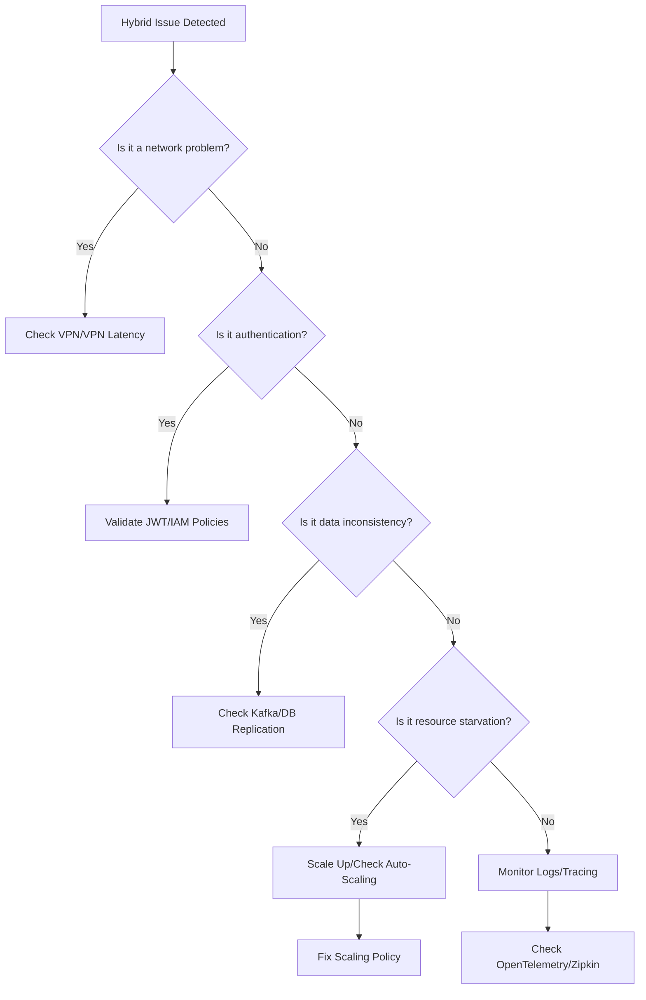

# **Debugging Hybrid Best Practices Pattern: A Troubleshooting Guide**
*(Backend-Focused, Practical, and Action-Oriented)*

---

## **Overview**
The **Hybrid Best Practices** pattern combines cloud-based microservices with on-premises or edge computing resources. This approach balances scalability, security, and low-latency requirements. However, integration challenges, network latency, data consistency, and security risks can arise.

This guide helps diagnose and resolve common issues in hybrid deployments efficiently.

---

## **1. Symptom Checklist**
Before diving into fixes, verify which symptoms match your issue:

| **Symptom Category**       | **Common Indicators**                                                                 |
|----------------------------|--------------------------------------------------------------------------------------|
| **Network Latency**        | Slow API responses, timeouts, or delays in cross-environment calls (cloud ↔ edge).   |
| **Data Inconsistency**     | Duplicate entries, stale data, or failed transactions across cloud/on-prem.         |
| **Authentication Issues**  | Failed JWT/OAuth token validation, IAM policy misconfigurations.                      |
| **Resource Starvation**    | On-prem servers overloaded, cloud auto-scaling stuck, or edge compute throttling.    |
| **Monitoring Alerts**      | High error rates (5xx), circuit breakers tripped, or logging gaps.                 |
| **Security Vulnerabilities** | Unauthorized API access, exposed secrets, or compliance violations.               |
| **Deployment Failures**    | Failed CI/CD pipelines, misaligned configurations between environments.            |

---

## **2. Common Issues & Fixes**

### **A. Network Latency & Cross-Environment Communication**
**Symptom:** API calls between cloud and on-prem/edge take >500ms, with timeouts or `5xx` errors.

#### ** Root Causes & Fixes**
1. **High Latency Between Environments**
   - **Cause:** Direct peering (VPN, MPLS) may be slow due to routing hops or network congestion.
   - **Fix:** Use **AWS Direct Connect**, **Azure ExpressRoute**, or **Google Cloud Interconnect** for private, low-latency connections.
     ```yaml
     # Example: Configuring AWS Direct Connect (Terraform)
     resource "aws_vpn_connection" "hybrid_vpn" {
       vgw_id         = aws_virtual_private_gateway.example.id
       customer_gateway_id = aws_customer_gateway.onprem.id
       type           = "IPsec.1"
       static_routes_only = false
       tunnel_options {
         pre_shared_key = "your-secure-key"
       }
     }
     ```

2. **API Gateway Throttling**
   - **Cause:** Cloud provider rate limits (e.g., AWS API Gateway throttling at 10,000 RPS).
   - **Fix:** Use **request batching** or **AWS WAF + Custom Metrics** to monitor/mitigate.
     ```javascript
     // Node.js: Retry with exponential backoff
     async function callHybridApiWithRetry(url, retries = 3) {
       try {
         return await fetch(url);
       } catch (err) {
         if (retries > 0 && err.status === 429) {
           await new Promise(res => setTimeout(res, 1000 * Math.pow(2, retries)));
           return callHybridApiWithRetry(url, retries - 1);
         }
         throw err;
       }
     }
     ```

3. **DNS Resolution Issues**
   - **Cause:** Internal DNS (e.g., Cloudflare vs. on-prem BIND) fails to resolve hybrid services.
   - **Fix:** Use **hybrid DNS** (e.g., AWS Route 53 Resolver) or **split-horizon DNS**.
     ```bash
     # Test DNS resolution from on-prem to cloud
     nslookup api.example.cloud --server=onprem-dns
     ```

---

### **B. Data Inconsistency (Cloud ↔ On-Prem)**
**Symptom:** Duplicate orders, conflicting state changes, or stale cache between environments.

#### **Root Causes & Fixes**
1. **Eventual Consistency Without Retries**
   - **Cause:** Kafka/RabbitMQ events lost due to network splits.
   - **Fix:** Implement **exactly-once processing** with Kafka’s `transactional_id`.
     ```java
     // Spring Kafka Example (Exactly-Once)
     @Bean
     public NewTopic ordersTopic() {
       return TopicBuilder.name("orders")
           .partition(3)
           .replicas(2)
           .build();
     }
     ```

2. **Database Replication Lag**
   - **Cause:** On-prem PostgreSQL fails to sync with RDS due to network issues.
   - **Fix:** Use **binary replication** with `wal_gender` and monitor with `pg_stat_replication`.
     ```sql
     -- Enable binary replication in PostgreSQL
     ALTER SYSTEM SET wal_level = replica;
     ALTER SYSTEM SET synchronous_commit = off;
     ```

3. **Caching Mismatches**
   - **Cause:** Redis (on-prem) and Elasticache (cloud) serve stale data.
   - **Fix:** Use **Redis Cluster Mode** with cross-region replication.
     ```bash
     # Enable Redis Cluster Replication
     redis-cli --cluster create node1:6379 node2:6379 node3:6379 --cluster-replicas 1
     ```

---

### **C. Authentication & Authorization Failures**
**Symptom:** `403 Forbidden` or `401 Unauthorized` when accessing hybrid APIs.

#### **Root Causes & Fixes**
1. **Token Validation Mismatch**
   - **Cause:** JWT issuer (`iss`) or audience (`aud`) differs between cloud and on-prem.
   - **Fix:** Standardize token claims across environments.
     ```json
     // Cloud + On-Prem JWT Payload (Shared Config)
     {
       "iss": "hybrid-auth.example.com",
       "aud": ["cloud-service", "onprem-gateway"],
       "exp": 1735689600,
       "sub": "user123"
     }
     ```

2. **IAM Policy Conflicts**
   - **Cause:** AWS IAM policies deny cross-account access between cloud and on-prem.
   - **Fix:** Use **AWS Organizations SCPs** or **cross-account roles**.
     ```json
     # AWS IAM Policy for Hybrid Access
     {
       "Version": "2012-10-17",
       "Statement": [
         {
           "Effect": "Allow",
           "Action": ["dynamodb:GetItem"],
           "Resource": "arn:aws:dynamodb:us-east-1:123456789012:table/Orders"
         }
       ]
     }
     ```

---

### **D. Resource Starvation (Edge/On-Prem Overload)**
**Symptom:** On-prem servers hit CPU/memory limits; cloud auto-scaling fails to kick in.

#### **Root Causes & Fixes**
1. **Auto-Scaling Misconfiguration**
   - **Cause:** Cloud provider (AWS/GCP) scales too slowly or based on wrong metrics.
   - **Fix:** Use **custom CloudWatch metrics** + **predictive scaling**.
     ```yaml
     # AWS Auto Scaling Policy (Terraform)
     resource "aws_autoscaling_policy" "scale_on_cpu" {
       name                   = "scale-on-cpu"
       policy_type            = "TargetTrackingScaling"
       adjustment_type        = "ChangeInCapacity"
       cooldown               = 300
       autoscaling_group_name = aws_autoscaling_group.my_app.name

       target_tracking_configuration {
         predefined_metric_specification {
           predefined_metric_type = "ASGAverageCPUUtilization"
         }
         target_value = 70.0
       }
     }
     ```

2. **Edge Compute Throttling**
   - **Cause:** AWS Lambda@Edge or Azure Functions at edge hit throughput limits.
   - **Fix:** Distribute workloads across multiple edge locations.
     ```yaml
     # AWS Lambda@Edge Deployment (CloudFront)
     resources:
       - type: AWS::CloudFront::Function
         properties:
           FunctionCode: {"S3Bucket": "edge-lambda-code", "S3Key": "processor.js"}
           Runtime: nodejs14.x
           AutoPublish: true
     ```

---

### **E. Monitoring & Logging Gaps**
**Symptom:** Missing logs or alerts for hybrid failures.

#### **Root Causes & Fixes**
1. **Distributed Tracing Missing**
   - **Cause:** OpenTelemetry traces split between cloud and on-prem.
   - **Fix:** Use **Zipkin + Prometheus** for end-to-end tracing.
     ```bash
     # Start Zipkin Collector
     docker run -d -p 9411:9411 openzipkin/zipkin
     ```

2. **Centralized Logging Misconfiguration**
   - **Cause:** ELK Stack (or Datadog) misses on-prem logs.
   - **Fix:** Use **Fluent Bit** to forward logs to cloud.
     ```conf
     # Fluent Bit Config (Forward to Datadog)
     [OUTPUT]
         Name          datadog
         Match         *
         ApiKey        YOUR_DATADOG_API_KEY
         AppKey        YOUR_DATADOG_APP_KEY
     ```

---

## **3. Debugging Tools & Techniques**

| **Tool**               | **Purpose**                                                                 | **Example Command/Usage**                          |
|------------------------|----------------------------------------------------------------------------|---------------------------------------------------|
| **Wireshark**          | Capture network traffic between cloud/on-prem (latency, TLS handshakes).   | `wireshark -i eth0 -f "tcp port 443"`              |
| **Terraform Plan**     | Detect config drift in hybrid deployments.                                   | `terraform plan`                                  |
| **AWS/X-Ray**          | Trace API calls across AWS + on-prem (if integrated).                       | `aws xray get-sampling-rules`                     |
| **Prometheus + Grafana** | Monitor cross-environment metrics (latency, error rates).                  | `prometheus scrape_configs`                       |
| **k6**                 | Load test hybrid APIs to identify bottlenecks.                              | `k6 run hybrid-api-test.js`                       |
| **Chaos Mesh**         | Simulate network partitions (e.g., kill pod communication).               | `chaosmesh create networkchaos pod-name --mode`   |

**Pro Tip:**
Use **`kubectl describe`** for Kubernetes clusters to check pod events:
```bash
kubectl describe pod hybrid-service-pod -n hybrid-namespace
```

---

## **4. Prevention Strategies**

### **A. Design-Time Best Practices**
1. **API Contracts & Versioning**
   - Use **OpenAPI/Swagger** to standardize endpoints.
   - Example:
     ```yaml
     # OpenAPI Spec (Shared Between Cloud/On-Prem)
     paths:
       /orders:
         post:
           summary: Create order (hybrid)
           responses:
             201:
               description: Order created
     ```

2. **Idempotency Keys**
   - Prevent duplicate transactions by requiring `idempotency-key` in API calls.
     ```javascript
     // Express.js Middleware
     app.post("/orders", (req, res, next) => {
       const idempotencyKey = req.headers["idempotency-key"];
       if (existingOrder) return res.status(409).send("Duplicate");
       next();
     });
     ```

### **B. Run-Time Safeguards**
1. **Circuit Breakers (Hystrix/Resilience4j)**
   - Fail fast if hybrid calls time out.
     ```java
     // Resilience4j Circuit Breaker
     CircuitBreaker circuitBreaker = CircuitBreaker.ofDefaults("hybrid-service");
     Supplier<String> fallback = () -> "Service unavailable";
     String result = circuitBreaker.executeRunnable(() -> callHybridApi(), fallback);
     ```

2. **Chaos Engineering**
   - Test failure scenarios (e.g., kill VPN link) with **Chaos Mesh**.
     ```yaml
     # Chaos Mesh Network Partition
     apiVersion: chaos-mesh.org/v1alpha1
     kind: NetworkChaos
     metadata:
       name: simulate-latency
     spec:
       action: delay
       mode: one
       selector:
         namespaces:
           - hybrid
       delay:
         latency: "100ms"
     ```

### **C. Observability First**
1. **Centralized Metrics**
   - Use **Prometheus + Grafana Dashboards** for hybrid health.
   - Example alert:
     ```yaml
     # Prometheus Alert (Hybrid Latency Spike)
     alert: HighHybridLatency
     expr: histogram_quantile(0.99, sum(rate(hybrid_api_duration_seconds_bucket[5m])) by (le))
     for: 5m
     labels:
       severity: critical
     annotations:
       summary: "Hybrid API call latency > 1s"
     ```

2. **Log Aggregation**
   - Forward logs to **Loki + Grafana** for hybrid logging.
     ```bash
     # Fluent Bit Config for Loki
     [OUTPUT]
         Name loki
         Match *
         Host loki.example.com
         Label job hybrid_logs
     ```

---

## **5. Step-by-Step Troubleshooting Flowchart**



---

## **6. Final Checklist Before Production**
1. [ ] **Test hybrid API calls** with `curl`/`Postman` from on-prem → cloud and vice versa.
2. [ ] **Validate DNS resolution** (`nslookup`, `dig`) for all hybrid services.
3. [ ] **Run load tests** (`k6`) to simulate peak traffic.
4. [ ] **Enable distributed tracing** (Zipkin) for latency analysis.
5. [ ] **Set up alerts** for hybrid-specific metrics (e.g., `hybrid_api_error_rate`).
6. [ ] **Document hybrid-specific secrets** (e.g., VPN keys) in **Vault**.

---
### **Key Takeaways**
- **Network issues?** → **Direct Connect + Wireshark**.
- **Data inconsistency?** → **Kafka Exactly-Once + DB Replication**.
- **Auth failures?** → **Standardize JWT/IAM**.
- **Resource starvation?** → **Auto-Scaling + Edge Distribution**.
- **Observability gaps?** → **Prometheus + OpenTelemetry**.

Hybrid systems require **proactive monitoring** and **fail-fast design**. Use these tools and techniques to diagnose and resolve issues quickly.