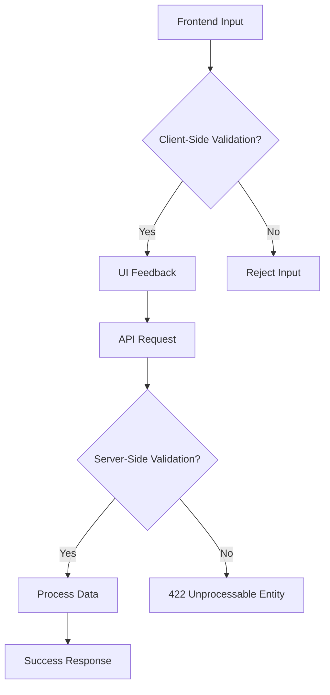

# **Debugging Hybrid Validation: A Troubleshooting Guide**

Hybrid Validation is a pattern where **client-side and server-side validation** work together to ensure data integrity. The goal is to provide a **seamless user experience** while maintaining **security and correctness** on both ends. However, misconfigurations, race conditions, or inconsistent validation logic can lead to failures.

This guide helps you **identify, diagnose, and resolve** common Hybrid Validation issues efficiently.

---

## **1. Symptom Checklist**
Before diving into debugging, check for these symptoms:

| **Symptom** | **Description** | **Likely Cause** |
|-------------|----------------|----------------|
| **Client-side validation passes, but server rejects data** | Frontend allows invalid input, but the API returns errors. | Misaligned validation rules between frontend and backend. |
| **Server-side validation fails intermittently** | Some requests pass, others fail with the same payload. | Race conditions, caching, or inconsistent validation logic. |
| **"422 Unprocessable Entity" or "400 Bad Request" errors** | HTTP errors indicate validation failures, but logs don’t clarify. | Invalid payload structure, missing fields, or strict schema mismatches. |
| **Validation logic differs across environments** (Dev vs. Prod) | Works in staging but fails in production due to environment-specific rules. | Hardcoded validation rules, missing environment variables. |
| **Slow API responses with validation timeouts** | Requests hang or timeout before validation completes. | Heavy validation logic (e.g., regex, complex business rules). |
| **API returns inconsistent responses for identical payloads** | Same input fails sometimes, works others. | Non-deterministic validation (e.g., time-based checks). |
| **Frontend UI shows incorrect validation errors** | Error messages don’t match backend validation. | Misaligned error mapping between frontend and backend. |
| **Validation errors in logs without clear context** | Logs show `ValidationError` but no details on which field failed. | Poor error reporting from validation libraries. |

**Next Steps:**
- If **client-side passes but server fails**, check **API payloads** and **backend validation rules**.
- If **server fails intermittently**, look for **race conditions** or **caching issues**.
- If **errors are inconsistent**, verify **environment differences** (e.g., test vs. prod schemas).

---

## **2. Common Issues & Fixes**

### **2.1 Issue: Client-Side Validation Passes, but Server Rejects Data**
**Cause:** Frontend and backend validation rules are mismatched.
**Example:**
```javascript
// Frontend (React)
const schema = {
  email: {
    required: true,
    pattern: /^[^\s@]+@[^\s@]+\.[^\s@]+$/,
  },
};
```

```python
# Backend (Flask + Marshmallow)
class UserSchema(ma.Schema):
    email = fields.Email(required=True)
    # Marshmallow's Email() is stricter than regex
```

**Fix:**
- **Align schemas** between frontend and backend.
- **Use the same validation library** (e.g., Zod for frontend, Zod for backend).
- **Explicitly document rules** in a shared schema file.

**Solution Code:**
```javascript
// Frontend (Zod)
import { z } from 'zod';

const userSchema = z.object({
  email: z.string().email(), // Zod's email() matches backend
  password: z.string().min(8),
});
```

```python
# Backend (Pydantic)
from pydantic import BaseModel, EmailStr

class UserCreate(BaseModel):
    email: EmailStr
    password: str = Field(min_length=8)
```

---

### **2.2 Issue: Server-Side Validation Fails Intermittently**
**Cause:** Race conditions, caching, or async validation delays.
**Example:**
```python
# Flask with caching enabled
@app.before_request
def validate_user():
    user = cache.get(request.json.get('user_id'))
    if not user:  # Race condition: user could be deleted mid-validation
        abort(404)
```

**Fix:**
- **Disable caching for validation endpoints** or use **short TTLs**.
- **Ensure atomic validation checks** (e.g., lock DB rows during validation).
- **Add retries with exponential backoff** for transient failures.

**Solution Code:**
```python
from flask import abort
from werkzeug.exceptions import BadRequest

@app.route('/validate', methods=['POST'])
def validate():
    data = request.get_json()
    try:
        schema = UserSchema()
        schema.load(data)  # Raises ValidationError if invalid
    except ValidationError as e:
        abort(422, description=e.messages)
    return {"status": "valid"}
```

---

### **2.3 Issue: "422 Unprocessable Entity" Without Clear Error Details**
**Cause:** Backend validation libraries (e.g., Marshmallow, Pydantic) provide vague errors.
**Example:**
```python
# Marshmallow returns a generic dict with no field-level errors
{
  "message": "Validation failed",
  "errors": {}
}
```

**Fix:**
- **Customize error responses** to include field-level details.
- **Map validation errors to API-standard formats** (e.g., JSON Schema errors).

**Solution Code (Flask + Marshmallow):**
```python
def validate_request(schema_class):
    def decorator(f):
        @wraps(f)
        def wrapper(*args, **kwargs):
            data = request.get_json()
            schema = schema_class()
            errors = schema.validate(data)
            if errors:
                return jsonify({
                    "success": False,
                    "errors": errors
                }), 422
            return f(*args, **kwargs)
        return wrapper
    return decorator

class UserSchema(ma.Schema):
    email = fields.Email(required=True)
    password = fields.String(min_length=8)

@app.route('/users', methods=['POST'])
@validate_request(UserSchema)
def create_user():
    return jsonify({"success": True})
```

---

### **2.4 Issue: Environment-Specific Validation Failures (Dev vs. Prod)**
**Cause:** Hardcoded rules or missing environment variables.
**Example:**
```python
# Dev has lenient checks; Prod is strict
if env == "dev":
    schema = UserSchema(min_password_length=6)
else:
    schema = UserSchema(min_password_length=8)
```

**Fix:**
- **Use environment variables** for validation rules.
- **Centralize schema definitions** in a shared config.

**Solution Code:**
```python
import os
from pydantic import BaseModel, Field

class UserSchema(BaseModel):
    username: str
    password: str = Field(min_length=int(os.getenv("MIN_PASSWORD_LENGTH", 8)))
```

---

### **2.5 Issue: Slow API Responses Due to Heavy Validation**
**Cause:** Complex regex, nested validations, or external checks.
**Example:**
```python
# Slow due to complex regex
re = re.compile(r'^((?!.*\.\.\/).*\.|\.)(?:[^\/]*\/)*[^\/]*$')
if not re.match(re, path):
    raise ValidationError("Invalid path")
```

**Fix:**
- **Optimize regex** (use simpler patterns).
- **Batch validate** related fields.
- **Cache frequent checks** (e.g., rate-limiting validation).

**Solution Code:**
```python
# Pre-compile regex for better performance
PATH_REGEX = re.compile(r'^((?!.*\.\.\/).*\.|\.)(?:[^\/]*\/)*[^\/]*$')

def validate_path(path: str):
    if not PATH_REGEX.match(path):
        raise ValueError("Invalid path")
```

---

### **2.6 Issue: Inconsistent API Responses for Identical Payloads**
**Cause:** Non-deterministic validation (e.g., time-based checks).
**Example:**
```python
# Invalid if created after a certain date
if datetime.now() > cutoff_date:
    raise ValidationError("Too late!")
```

**Fix:**
- **Avoid time-based validation** in stateless APIs.
- **Use versioned schemas** to prevent breaking changes.

**Solution Code:**
```python
# Replace with deterministic checks
if not data.get("is_active"):
    raise ValidationError("Account disabled")
```

---

## **3. Debugging Tools & Techniques**

| **Tool/Technique** | **Use Case** | **Example Command/Setup** |
|--------------------|-------------|---------------------------|
| **Postman/Newman** | Test API endpoints with different payloads. | `newman run validation.collection.json -e dev.env.json` |
| **Structured Logging** | Trace validation failures in logs. | `logger.error(f"Validation failed: {errors}")` |
| **API Mocking (Mockoon, WireMock)** | Simulate backend responses for frontend testing. | Mock `422 Unprocessable Entity` responses |
| **Debuggers (pdb, Chrome DevTools)** | Step through validation logic. | `import pdb; pdb.set_trace()` |
| **Error Tracking (Sentry, Datadog)** | Monitor validation failures in production. | `@app.errorhandler(ValidationError)` |
| **Schema Validation Tools (Zod, JSON Schema)** | Compare frontend/backend schemas. | `zod.validate(data, schema)` |
| **Load Testing (k6, Locust)** | Identify slow or flaky validations. | `k6 run validation_test.js` |
| **Database Inspection** | Check for race conditions in DB locks. | `SELECT * FROM users WHERE id = ? FOR UPDATE;` |

**Debugging Workflow:**
1. **Reproduce the issue** with a failing payload.
2. **Compare frontend/backend schemas** using a tool like `zod`.
3. **Check logs** for validation errors (use structured logging).
4. **Test with mocked API responses** to isolate frontend/backend issues.
5. **Profile slow validations** with a load tester (`k6`).

---

## **4. Prevention Strategies**

### **4.1 Design-Time Best Practices**
✅ **Standardize validation libraries** (e.g., Zod for frontend, Pydantic for backend).
✅ **Document schemas in a shared format** (e.g., OpenAPI/Swagger).
✅ **Use versioned schemas** to avoid breaking changes.
✅ **Implement a validation layer** that returns **consistent error formats**.

### **4.2 Runtime Best Practices**
✅ **Cache schema definitions** to avoid recompilation.
✅ **Disable caching for validation endpoints** or use short TTLs.
✅ **Add circuit breakers** for slow validation checks.
✅ **Log validation errors with context** (e.g., payload, user ID).

### **4.3 Testing & Monitoring**
✅ **Unit test validation logic** in isolation.
✅ **Integrate validation tests into CI/CD** (e.g., `pytest` for backend).
✅ **Monitor validation failures** with error tracking (Sentry).
✅ **Run load tests** to catch slow validations early.

### **4.4 Example: Robust Hybrid Validation Pipeline**


**Key Takeaways:**
- **Frontend validates fast** (UX).
- **Backend enforces strict rules** (security).
- **Error responses are consistent** (API contracts).

---

## **5. Final Checklist for Hybrid Validation Debugging**
| **Step** | **Action** | **Tool/Method** |
|----------|-----------|----------------|
| **1. Reproduce** | Find a failing payload. | Postman, API tests |
| **2. Compare Schemas** | Ensure frontend/backend match. | Zod, JSON Schema |
| **3. Check Logs** | Look for validation errors. | Structured logging |
| **4. Test Edge Cases** | Stress-test boundaries. | k6, Locust |
| **5. Align Error Handling** | Standardize error formats. | Custom decorators |
| **6. Optimize Performance** | Profile slow validations. | `timeit`, k6 |
| **7. Monitor in Prod** | Track failures with Sentry. | Error tracking |

---
### **Summary**
Hybrid Validation failures usually stem from **schema mismatches, race conditions, or inconsistent error handling**. By:
✔ **Standardizing validation tools**
✔ **Aligning frontend/backend schemas**
✔ **Monitoring validation failures**
✔ **Optimizing performance**

You can **minimize debugging time** and **prevent production issues**.

**Next Steps:**
- **Audit your current validation pipeline** for mismatches.
- **Implement structured logging** for validation errors.
- **Automate schema validation** in CI/CD.

Would you like a deeper dive into any specific area (e.g., async validation, distributed systems)?