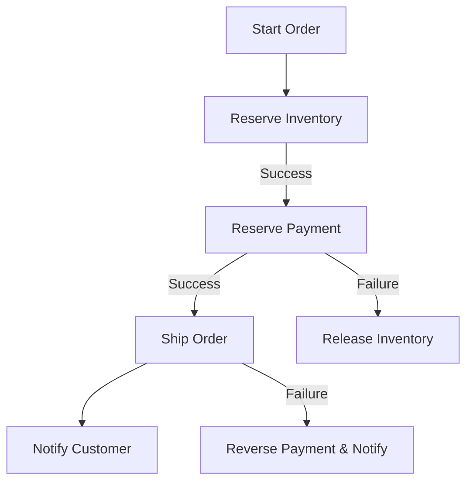

# **Debugging Microservices Validation: A Troubleshooting Guide**

## **Introduction**
Microservices Validation ensures that individual services communicate correctly, adhere to contracts, and maintain system integrity while operating independently. Poor validation can lead to data inconsistencies, failed transactions, or cascading failures. This guide provides a structured approach to diagnosing and resolving common validation-related issues in microservices architectures.

---

## **1. Symptom Checklist**
Before diving into debugging, verify the following symptoms to narrow down the root cause:

| **Symptom**                          | **Possible Causes**                                                                 | **Severity** |
|--------------------------------------|------------------------------------------------------------------------------------|--------------|
| **Service Rejection Without Error**  | Payload validation fails (malformed JSON, missing fields, invalid types)            | High         |
| **Inconsistent Data Across Services**| Eventual consistency delays, duplicate processing, or missing validation           | Medium-High  |
| **5XX Errors in API Gateways/Proxies**| Invalid responses from downstream services due to poor validation                   | High         |
| **Timeouts in Service Communication** | Validation logic is too slow (e.g., complex schema checks)                         | Medium       |
| **Database Schema Mismatches**       | Schema changes not propagated to dependent services                                 | Critical     |
| **Spurious Retries Leading to Duplicates** | Lack of idempotency validation in events                                       | Medium       |
| **Logging Shows Validation Failures** | Schema mismatches, missing required fields, or type mismatches                     | High         |

---

## **2. Common Issues & Fixes**

### **Issue 1: Payload Validation Failures**
**Symptoms:**
- API rejects requests with `400 Bad Request` or `422 Unprocessable Entity`.
- Logs show `ValidationError`, `SchemaMismatch`, or `TypeError`.

**Root Causes:**
- Missing required fields.
- Invalid data types (e.g., sending a string where an integer is expected).
- Schema drift between services (e.g., a new field was added without backward compatibility).

**Fixes:**
#### **A. Strongly-Typed Request/Response Validation**
Use libraries like **JSON Schema** (OpenAPI/Swagger) or runtime validation frameworks (**Zod**, **Pydantic**, **JSR-303**).

**Example (Node.js with Zod):**
```javascript
const { z } = require('zod');

const createOrderSchema = z.object({
  userId: z.string().uuid(),
  items: z.array(z.object({
    productId: z.string().uuid(),
    quantity: z.number().int().positive()
  })),
  total: z.number().positive()
});

app.post('/orders', (req, res) => {
  try {
    const validatedData = createOrderSchema.parse(req.body);
    // Proceed with validated data
  } catch (err) {
    res.status(400).json({ error: "Validation failed", details: err.errors });
  }
});
```

**Example (Python with Pydantic):**
```python
from pydantic import BaseModel, ValidationError, conint

class OrderItem(BaseModel):
    product_id: str
    quantity: conint(gt=0)

class OrderRequest(BaseModel):
    user_id: str
    items: list[OrderItem]
    total: float

@app.post("/orders")
def create_order(request: OrderRequest):
    # Use validated data
```

#### **B. Backward Compatibility Handling**
- Use **optional fields** (e.g., `.optional()` in Zod, `Optional` in Pydantic).
- Add **versioning** to schemas (e.g., `v1`, `v2` endpoints).

**Example (OpenAPI Schema Versioning):**
```yaml
components:
  schemas:
    OrderV1:
      type: object
      required: [userId, items]
      properties:
        userId: { type: string, format: uuid }
        items:
          type: array
          items:
            type: object
            properties:
              productId: { type: string, format: uuid }
              quantity: { type: integer, minimum: 1 }
        total: { type: number }
    OrderV2:
      allOf:
        - $ref: '#/components/schemas/OrderV1'
        - type: object
          properties:
            discountCode: { type: string, nullable: true }
```

---

### **Issue 2: Eventual Consistency Delays**
**Symptoms:**
- Data appears in one service but not another.
- Duplicate events processed due to retries.

**Root Causes:**
- Lack of **eventual consistency guarantees**.
- Missing **idempotency keys** in event processing.
- Database transactions not properly synchronized.

**Fixes:**
#### **A. Implement Idempotency**
Ensure duplicate requests don’t cause side effects.

**Example (Idempotency Key in Event Processing):**
```python
# Using Redis for idempotency tracking
REDIS_CLIENT = redis.Redis()

@app.post("/events")
def process_event(event: EventRequest):
    idempotency_key = event.metadata.idempotency_key
    if REDIS_CLIENT.set(idempotency_key, "processed", ex=3600):  # Expires in 1h
        # Process only if not seen before
        perform_side_effects()
```

#### **B. Use Saga Pattern for Distributed Transactions**
Break long-running transactions into smaller, compensatable steps.

**Example (Saga Workflow):**


**Code Example (Python with Celery):**
```python
from celery import Celery

app = Celery('tasks', broker='redis://localhost:6379/0')

@app.task(bind=True, max_retries=3)
def reserve_inventory(self, order_id, product_id, quantity):
    try:
        # Attempt to reserve inventory
        inventory.decrement(product_id, quantity)
    except:
        self.retry(exc=Exception, countdown=10)

@app.task
def compensate_inventory(order_id, product_id, quantity):
    inventory.increment(product_id, quantity)
```

---

### **Issue 3: Schema Mismatches Between Services**
**Symptoms:**
- `CastError` (e.g., string passed where number is expected).
- `TypeError: missing required field`.

**Root Causes:**
- One service updated its schema without notifying consumers.
- Dynamic typing in ORMs (e.g., SQLAlchemy, Prisma) allowing invalid data.

**Fixes:**
#### **A. Enforce Schema Evolution Control**
- Use **API versioning** (e.g., `/v1/orders`, `/v2/orders`).
- Implement **schema registry** (e.g., **Confluent Schema Registry** for Kafka).

**Example (PostgreSQL with NOT NULL Constraints):**
```sql
ALTER TABLE orders
ADD COLUMN discount_code VARCHAR(50) NULL;

-- Update consumers to handle optional fields
```

#### **B. Runtime Schema Validation (Kafka Example)**
```python
from confluent_kafka.schema_registry import SchemaRegistryClient
from confluent_kafka.schema_registry.avro import AvroSchema

schema_registry_conf = {'url': 'http://schema-registry:8081'}
schema_client = SchemaRegistryClient(schema_registry_conf)

# Fetch the latest schema and validate
schema_id = 123  # Pre-registered schema
schema = schema_client.get_schema(schema_id)
avro_schema = AvroSchema(schema)
```

---

### **Issue 4: Slow Validation Leading to Timeouts**
**Symptoms:**
- Requests hanging at `/validate` or `/parse` stages.
- Logs show long `validate` latency.

**Root Causes:**
- Overly complex JSON schemas.
- Heavy computational checks (e.g., regex, cryptographic validation).

**Fixes:**
#### **A. Optimize Validation**
- **Batch validation** (e.g., validate all `items` in a single pass).
- **Lazy validation** (validate only necessary fields for partial updates).

**Example (Lazy Validation with Pydantic):**
```python
from pydantic import Field

class PartialOrderUpdate(BaseModel):
    user_id: Optional[str] = Field(alias="user_id", default=None)
    items: Optional[List[OrderItem]] = Field(alias="items", default=None)
    # Only validate provided fields
```

#### **B. Use Async Validation**
```javascript
// Fastify + Zod async validation
app.post('/orders', {
    schema: {
        body: createOrderSchema.omit({ total: true }), // Defer total calc
    },
    handler: async (req, reply) => {
        const validated = await createOrderSchema.parseAsync(req.body);
        // Calculate total asynchronously
        validated.total = await calculateTotal(validated.items);
        reply.send(validated);
    }
});
```

---

## **3. Debugging Tools & Techniques**

| **Tool**               | **Purpose**                                                                 | **Example Use Case**                          |
|------------------------|----------------------------------------------------------------------------|-----------------------------------------------|
| **Postman/Newman**     | API contract testing, schema validation checks.                            | Validate OpenAPI specs against real endpoints. |
| **JSON Schema Validator** (Ajv, json-schema-validator) | Runtime schema validation. | Validate incoming requests before processing. |
| **Prometheus + Grafana** | Monitor validation latency and error rates. | Set up alerts for `validation_errors` > 0. |
| **Kafka Schema Registry** | Track schema changes and enforce compatibility. | Detect when a producer starts sending invalid Avro messages. |
| **OpenTelemetry**      | Trace validation failures across microservices. | Correlate `400 Bad Request` errors to downstream issues. |
| **Redis/Database Query Logs** | Debug idempotency and consistency issues. | Check if duplicate events were processed. |

**Debugging Workflow:**
1. **Log Validation Failures** (structured logging with correlation IDs).
2. **Capture Request/Response Payloads** (use tools like **Grafana Tempo**).
3. **Reproduce Locally** with Postman/curl.
4. **Use Health Checks** (e.g., `/actuator/health` in Spring Boot).

**Example Debugging Command:**
```bash
# Capture HTTP payloads with tcpdump
tcpdump -i any -w validation_traffic.pcap 'port 8080 and proto http'

# Analyze with Wireshark for malformed requests
```

---

## **4. Prevention Strategies**

### **A. Contract Testing**
- **Pact.io** or **Contract Testing** to validate service interactions.
- Example (Pact Contract Test in Python):
  ```python
  from pact import ConsumerContractTestRunner

  runner = ConsumerContractTestRunner(
      provider="inventory-service",
      consumer="order-service",
      dir="pacts",
      log_level="DEBUG"
  )
  runner.run()
  ```

### **B. Schema as Code**
- Store schemas in **Git** (e.g., JSON/YAML files).
- Use tools like **Schemathesis** to auto-generate tests from schemas.

### **C. Automated Validation Testing**
- **Unit Tests** for validation logic.
- **Integration Tests** with mocked downstream services.

**Example (Python with pytest):**
```python
import pytest
from fastapi.testclient import TestClient
from main import app

client = TestClient(app)

def test_validation_fails_on_missing_field():
    response = client.post(
        "/orders",
        json={"items": [{"productId": "abc", "quantity": 1}]},  # Missing userId
    )
    assert response.status_code == 400
    assert "userId" in response.json()["detail"]
```

### **D. Monitoring & Alerting**
- **Prometheus Alerts** for validation failures:
  ```yaml
  - alert: HighValidationErrorRate
    expr: rate(http_requests_total{status=~"4.."}[5m]) / rate(http_requests_total[5m]) > 0.05
    for: 1m
    labels:
      severity: warning
    annotations:
      summary: "High validation error rate ({{ $value }}%)"
  ```

---

## **5. Summary Checklist for Microservices Validation**
| **Step**               | **Action**                                                                 |
|------------------------|---------------------------------------------------------------------------|
| **1. Validate Requests** | Use Zod/Pydantic/OpenAPI to enforce schemas at API boundaries.           |
| **2. Handle Schema Drift** | Implement versioning and backward compatibility.                        |
| **3. Ensure Idempotency** | Use keys or sagas to prevent duplicate side effects.                      |
| **4. Optimize Validation** | Avoid slow checks; batch or lazy-validate where possible.               |
| **5. Monitor Failures**   | Log, alert, and trace validation errors.                                |
| **6. Test Contracts**     | Use Pact/Schemathesis to validate service interactions.                  |

---

## **Final Notes**
- **Start small**: Validate at the API layer first, then expand to event processing.
- **Automate**: Integrate validation tests into CI/CD.
- **Document**: Maintain an **API Contract Repository** for all schemas and versions.

By following this guide, you can systematically debug and prevent validation-related issues in microservices, ensuring data integrity and smooth inter-service communication.