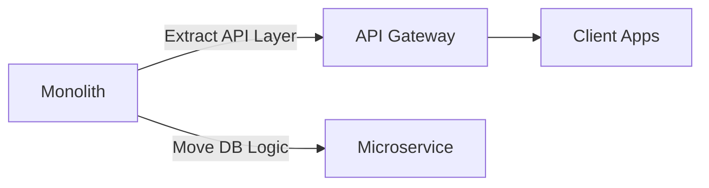

# **Debugging Monolith Gotchas: A Troubleshooting Guide**

Monolithic architectures can become unwieldy as they grow, leading to performance bottlenecks, scalability issues, and debugging nightmares. This guide helps you identify, diagnose, and resolve common problems in monolithic systems efficiently.

---

## **1. Symptom Checklist**
Before diving into fixes, verify if your system exhibits these symptoms:
✅ **Degrading Performance Under Load** – Slow responses, timeouts, or crashes when traffic spikes.
✅ **High Latency in Critical Paths** – Specific APIs or database queries taking far longer than expected.
✅ **Memory Leaks or Bloated Processes** – Rising memory usage over time without obvious leaks.
✅ **Cascading Failures** – One service failure causing downstream system outages.
✅ **Difficult Debugging** – Hard to isolate issues due to tight coupling between components.
✅ **Slow Build/Deployment Times** – Long compilation or test cycles slowing down CI/CD.
✅ **Infrequent Releases** – Fear of breaking changes due to system complexity.

---

## **2. Common Issues and Fixes**

### **2.1 Performance Bottlenecks (Slow Queries, High CPU, Memory Leaks)**
**Symptoms:**
- Response times degrade under load.
- Garbage collection pauses (Java/Python) or memory usage spikes.

**Common Causes & Fixes:**

#### **A. Slow Database Queries**
**Issue:**
A single query ties up the database for too long, causing timeouts.

**Debugging Steps:**
1. **Check Query Profiles**
   Use database tools (`EXPLAIN` in SQL, `EXPLAIN ANALYZE`) to identify slow queries.
   ```sql
   EXPLAIN ANALYZE SELECT * FROM users WHERE status = 'active';
   ```

2. **Optimize Queries**
   - Add proper indexes.
   - Use pagination (`LIMIT`/`OFFSET`) for large datasets.
   - Avoid `SELECT *`; fetch only needed columns.

**Fix Example (ORM Optimization):**
```python
# Bad - Fetches all columns unnecessarily
users = User.query.all()

# Good - Only fetch needed fields
users = User.query.with_entities(User.id, User.name).all()
```

#### **B. Memory Leaks (Unreleased Objects)**
**Issue:**
Memory usage grows indefinitely, leading to OOM crashes.

**Debugging Steps:**
1. **Profile Memory Usage**
   - **Java:** Use Eclipse MAT or VisualVM.
   - **Python:** Use `tracemalloc` or `memory_profiler`.
     ```python
     import tracemalloc
     tracemalloc.start()
     # Run code...
     snapshot = tracemalloc.take_snapshot()
     top_stats = snapshot.statistics('lineno')
     for stat in top_stats[:10]:
         print(stat)
     ```

2. **Common Leaks & Fixes:**
   - **Unclosed Connections:** Use context managers (`with` in Python, `try-with-resources` in Java).
     ```python
     # Bad
     conn = psycopg2.connect("...")

     # Good
     with psycopg2.connect("...") as conn:
         cursor = conn.cursor()
     ```
   - **Caching Issues:** Implement proper cache invalidation (e.g., TTL-based expiry).

---

### **2.2 Cascading Failures (One Service Brings Down the System)**
**Symptoms:**
A single API failure causes the entire monolith to fail.

**Common Causes & Fixes:**

#### **A. Tight Coupling Between Services**
**Issue:**
Component A depends directly on Component B, and a failure in B crashes A.

**Debugging Steps:**
1. **Trace Dependency Flow**
   - Use logging to track function calls between modules.
   - Example (Python logging):
     ```python
     import logging
     logging.basicConfig(level=logging.INFO)
     def fetch_user_data():
         logging.info("Fetching user data from DB...")
         # ... (DB call)
     ```

2. **Fix with Circuit Breakers & Retries**
   Implement retry logic with exponential backoff.
   ```python
   from tenacity import retry, stop_after_attempt, wait_exponential

   @retry(stop=stop_after_attempt(3), wait=wait_exponential(multiplier=1, min=4, max=10))
   def call_external_api():
       response = requests.get("http://api.example.com/data")
       return response.json()
   ```

#### **B. Global State Issues**
**Issue:**
A shared in-memory cache (e.g., `dict`, Redis) causes race conditions.

**Debugging Steps:**
1. **Audit Shared State Access**
   - Log key accesses (`logging.info(f"Cache hit for key {key}")`).
   - Use thread-safe data structures (e.g., `threading.Lock` in Python).

**Fix Example:**
```python
from threading import Lock

cache = {}
cache_lock = Lock()

def get_from_cache(key):
    with cache_lock:
        return cache.get(key)
```

---

### **2.3 Slow Builds & Deployment Delays**
**Symptoms:**
Long wait times for `npm install`, `pip install`, or tests.

**Common Causes & Fixes:**

#### **A. Bloated Dependencies**
**Issue:**
Unnecessary packages slow down builds.

**Fix:**
- Use `yarn.lock`/`requirements.txt` pinning.
- Audit dependencies with:
  ```bash
  yarn outdated
  pip list --outdated
  ```

#### **B. Slow Tests**
**Issue:**
Unit/integration tests take too long.

**Fix:**
- Parallelize tests (PyTest, Jest).
- Cache test fixtures (e.g., Docker containers with `docker-compose`).
- Example (Parallel PyTest):
  ```bash
  pytest -n 4  # Runs 4 processes in parallel
  ```

---

## **3. Debugging Tools & Techniques**

| **Tool/Technique**       | **Purpose**                          | **Example Usage**                          |
|--------------------------|---------------------------------------|--------------------------------------------|
| **APM Tools**            | Track latency & errors in production. | New Relic, Datadog, OpenTelemetry          |
| **Distributed Tracing**  | Trace requests across microservices.   | Jaeger, Zipkin                             |
| **Logging (Structured)** | Centralized logs for debugging.       | ELK Stack (Elasticsearch, Logstash, Kibana)|
| **Memory Profilers**     | Find leaks in heap memory.            | `heapdump` (Java), `tracemalloc` (Python) |
| **Load Testing**         | Simulate traffic to find bottlenecks.| Locust, k6                                 |
| **Debugging Proxies**    | Inspect HTTP traffic.                 | Charles Proxy, Wireshark                  |

**Quick Debugging Workflow:**
1. **Reproduce Issue** → Use load testing or staging env.
2. **Isolate Component** → Check logs, metrics, and traces.
3. **Isolate Code** → Add `print()`/`console.log()` statements.
4. **Fix & Validate** → Test fix in staging before production.

---

## **4. Prevention Strategies**

### **4.1 Gradual Refactoring (Strangler Pattern)**
Instead of rewriting the monolith, incrementally extract components:


**Steps:**
1. **Wrapper Pattern:** Expose a clean API around legacy code.
2. **Feature Toggles:** Gradually shift functionality to new services.
3. **Database Sharding:** Split tables if needed.

### **4.2 Modular Design Best Practices**
- **Separate Concerns:** Split into layers (API, Business Logic, DB).
- **Dependency Injection:** Avoid global state.
  ```python
  # Bad
  db = get_db_connection()

  # Good
  def get_user_repo(db_conn):
      return UserRepository(db_conn)
  ```
- **Interface-Based Design:** Use abstract classes/interfaces for flexibility.

### **4.3 Observability & Alerting**
- **Key Metrics:**
  - Latency percentiles (P99, P95).
  - Error rates (`5xx` responses).
  - Memory/CPU usage trends.
- **Alerting Rules:**
  ```yaml
  # Example Prometheus Alert
  - alert: HighLatency
    expr: rate(http_request_duration_seconds{status=~"2.."}[5m]) > 1
    for: 5m
    labels:
      severity: critical
    annotations:
      summary: "High latency on {{ $labels.route }}"
  ```

### **4.4 CI/CD Best Practices**
- **Incremental Builds:** Cache dependencies (`npm ci`, `pip cache dir`).
- **Canary Deployments:** Roll out changes to a subset of users first.
- **Rollback Strategies:** Automate rollback on failed health checks.

---

## **5. Summary Checklist for Monolith Debugging**
| **Step**               | **Action**                                      |
|------------------------|------------------------------------------------|
| **Identify Symptoms**  | Check logs, metrics, and user reports.          |
| **Isolate Bottlenecks**| Profile queries, memory, and CPU usage.         |
| **Fix Root Cause**     | Optimize code, refactor, or add retries.       |
| **Test Locally**       | Reproduce in staging before production.         |
| **Monitor Post-Fix**   | Set up alerts for regression.                  |
| **Prevent Future Issues** | Gradually refactor, improve observability. |

---

## **Final Notes**
Monoliths are powerful but fragile. The key is:
✔ **Actively profile** under realistic loads.
✔ **Isolate failures** early.
✔ **Refactor incrementally** instead of big-bang rewrites.

By following this guide, you can diagnose and resolve monolith-related issues efficiently while preparing for a smoother transition to microservices if needed. 🚀