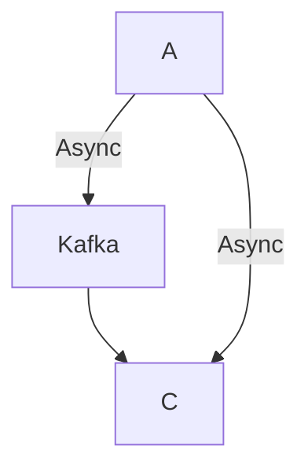

# **Debugging Optimization Bottlenecks: A Troubleshooting Guide**

Optimization debugging is the process of identifying and resolving performance bottlenecks in a system to improve efficiency, reduce latency, and scale effectively. Unlike functional debugging, optimization debugging focuses on **speed, resource usage, and architectural inefficiencies** rather than correctness.

This guide provides a structured approach to diagnosing and fixing common optimization issues in backend systems, including code-level bottlenecks, database inefficiencies, I/O bottlenecks, and poorly scaled architectures.

---

## **1. Symptom Checklist: Signs of Optimization Issues**
Before diving into fixes, confirm whether performance degradation is due to optimization problems. Common symptoms include:

### **Application-Level Symptoms**
- **[ ]** High CPU usage (near 100%) with no obvious spikes in request volume.
- **[ ]** Slow response times (e.g., 500ms → 3s for the same API call).
- **[ ]** Memory leaks (growing `RSS` or `Heap Usage` over time).
- **[ ]** High garbage collection (GC) pauses (>100ms in Java/Kotlin).
- **[ ]** Unnecessarily long-running queries or blocking calls.
- **[ ]** Increased latency when scaling horizontally (e.g., microservices adding slow dependencies).

### **Database-Level Symptoms**
- **[ ]** Slow queries (executing for >500ms, especially in warm-up).
- **[ ]** High read/write latency (e.g., DB response time >50ms).
- **[ ]** Large indexes or unnecessary table scans (`Full Table Scan` in Slow Query Logs).
- **[ ]** Connection pool exhaustion (e.g., `Too many connections` errors).
- **[ ]** Lock contention (long `InnoDB Lock Waits` in MySQL).

### **Infrastructure-Level Symptoms**
- **[ ]** High disk I/O (e.g., `iowait` > 10% in `top`/`htop`).
- **[ ]** Network bottlenecks (high latency between services, saturated network interfaces).
- **[ ]** Unbalanced load (some nodes underutilized while others maxed out).
- **[ ]** Cold starts (slow first request after inactivity, e.g., serverless functions).

### **Observability Symptoms**
- **[ ]** Distributed tracing shows long propagating latencies (e.g., 80% time spent in one service).
- **[ ]** Logs show repeated timeouts or retries (e.g., `504 Gateway Timeout`).
- **[ ]** Metrics indicate inconsistent behavior (e.g., P99 latency spikes).

---
## **2. Common Issues & Fixes (With Code Examples)**
Below are the most frequent optimization bottlenecks and their solutions.

---

### **2.1. CPU-Bound Bottlenecks**
#### **Symptom:**
High CPU usage with no visible load spikes, long-running loops, or inefficient algorithms.

#### **Common Causes & Fixes**
| Issue | Example Code | Fix |
|--------|-------------|------|
| **Inefficient Loops** | ```python
def compute_sum(numbers):
    total = 0
    for i in range(len(numbers)):
        for j in range(len(numbers)):
            total += numbers[i] * numbers[j]  # O(n²) time
    return total
``` | **Use vectorized operations** (NumPy) or **reduce complexity**:
```python
import numpy as np

def compute_sum(numbers):
    arr = np.array(numbers)
    return (arr @ arr)  # O(n) time with broadcasting
``` |
| **Excessive Recursion** | ```java
int fib(int n) {
    if (n <= 1) return n;
    return fib(n-1) + fib(n-2);  // O(2ⁿ) time
}
``` | **Use memoization or iteration**:
```java
int fib(int n, int[] memo) {
    if (memo[n] != -1) return memo[n];
    if (n <= 1) return n;
    memo[n] = fib(n-1, memo) + fib(n-2, memo);
    return memo[n];
}
``` |
| **Blocking I/O in Loops** | ```javascript
const data = [];
for (let i = 0; i < 1000; i++) {
    const result = await fetch(`https://api.example.com/data/${i}`);
    data.push(result);
}  // Blocks on each fetch
``` | **Use parallelism (async/await + Promise.all)**:
```javascript
const urls = Array.from({ length: 1000 }, (_, i) => `https://api.example.com/data/${i}`);
const results = await Promise.all(urls.map(url => fetch(url)));
``` |

**Debugging Tools:**
- **`top`/`htop`** – Check CPU usage per process.
- **`perf` (Linux)** – Profile CPU bottlenecks.
  ```bash
  perf record -g ./your_app
  perf report
  ```
- **JVM Profiler (VisualVM, Async Profiler)** – Identify hot methods.

---

### **2.2. Database Bottlenecks**
#### **Symptom:**
Slow queries, high DB latency, or connection pool exhaustion.

#### **Common Causes & Fixes**
| Issue | Query Example | Fix |
|--------|--------------|------|
| **Full Table Scan** | ```sql
SELECT * FROM users WHERE email = 'test@example.com';  -- No index
``` | **Add an index:**
```sql
CREATE INDEX idx_user_email ON users(email);
``` |
| **N+1 Query Problem** | ```python
# Fetch all users
users = db.query("SELECT * FROM users")
# Then fetch each user's posts -> N+1 queries
for user in users:
    posts = db.query(f"SELECT * FROM posts WHERE user_id = {user.id}")
``` | **Use JOIN or batch fetching**:
```python
# Single query with JOIN
posts = db.query("""
    SELECT p.* FROM users u
    JOIN posts p ON u.id = p.user_id
    WHERE u.id IN ({user_ids})
""")
``` |
| **SELECT * (Overfetching)** | ```sql
SELECT * FROM orders WHERE customer_id = 1;  # Returns 50 columns
``` | **Fetch only needed columns:**
```sql
SELECT order_id, amount, status FROM orders WHERE customer_id = 1;
``` |
| **Lock Contention** | ```sql
-- Long-running transaction
BEGIN;
UPDATE accounts SET balance = balance - 100 WHERE id = 1;
UPDATE accounts SET balance = balance + 100 WHERE id = 2;
COMMIT;  # Holds lock for too long
``` | **Use shorter transactions or optimistic locking**:
```sql
-- Example with row-level locks
BEGIN;
UPDATE accounts SET balance = balance - 100 WHERE id = 1 FOR UPDATE;
UPDATE accounts SET balance = balance + 100 WHERE id = 2;
COMMIT;
``` |

**Debugging Tools:**
- **`EXPLAIN ANALYZE`** – Analyze query execution plans.
  ```sql
  EXPLAIN ANALYZE SELECT * FROM users WHERE email LIKE '%@example.com%';
  ```
- **slow_query_log (MySQL/PostgreSQL)** – Log slow queries.
- **`pg_stat_activity` (PostgreSQL)** – Check running queries.
- **Database Benchmarking** – Use `pgbench` (PostgreSQL) or `sysbench` (MySQL).

---

### **2.3. I/O Bottlenecks**
#### **Symptom:**
High disk I/O (`iowait` > 10%), slow file reads/writes, or network latency.

#### **Common Causes & Fixes**
| Issue | Example Code | Fix |
|--------|-------------|------|
| **Unbuffered File I/O** | ```python
with open("large_file.txt", "r") as f:
    data = f.read()  # Reads entire file into memory
``` | **Use buffered reads or generators**:
```python
def read_large_file(path):
    with open(path, "r") as f:
        for line in f:
            yield line  # Processes line-by-line
``` |
| **Network Latency Between Services** | ```bash
# Slow inter-service calls
time curl http://service-b:8080/data  # Takes 200ms
``` | **Optimize network calls**:
- **Use gRPC instead of REST** (binary protocol, lower overhead).
- **Cache responses** (Redis, CDN).
- **Reduce payload size** (compress JSON).
```go
// Example: gRPC vs REST
// gRPC (faster, binary)
conn, _ := grpc.Dial("service-b:50051", grpc.WithInsecure())
client := proto.NewServiceBClient(conn)
res, _ := client.GetData(ctx, &proto.Request{Id: 123})

// REST (slower, text)
resp, _ := http.Get("http://service-b:8080/data/123")
```

**Debugging Tools:**
- **`iotop` (Linux)** – Monitor disk I/O.
- **`netstat`/`ss`** – Check network connections.
- **`traceroute`/`mtr`** – Find network hops with latency.
- **`ping`/`mtr --report`** – Check inter-service latency.

---

### **2.4. Memory Leaks**
#### **Symptom:**
Increasing memory usage over time (even with no active requests).

#### **Common Causes & Fixes**
| Issue | Example Code | Fix |
|--------|-------------|------|
| **Unclosed Connections** | ```python
def process_data():
    conn = psycopg2.connect("db_uri")
    # Forget to close connection in error case
    try:
        cursor = conn.cursor()
        cursor.execute("SELECT * FROM data")
    except Exception as e:
        print(e)  # Connection leaks!
``` | **Use context managers (`with`)**:
```python
def process_data():
    with psycopg2.connect("db_uri") as conn:
        with conn.cursor() as cursor:
            cursor.execute("SELECT * FROM data")
``` |
| **Caching Without Limits** | ```python
cache = {}  # Unbounded cache
def get_user(user_id):
    if user_id not in cache:
        cache[user_id] = fetch_user_db(user_id)  # Grows indefinitely
    return cache[user_id]
``` | **Implement TTL-based caching**:
```python
import time
from collections import OrderedDict

user_cache = OrderedDict()
CACHE_TTL = 300  # 5 minutes

def get_user(user_id):
    if user_id in user_cache:
        user = user_cache.pop(user_id)
        if time.time() - user["timestamp"] < CACHE_TTL:
            user_cache[user_id] = user
            return user["data"]
    data = fetch_user_db(user_id)
    user_cache[user_id] = {"data": data, "timestamp": time.time()}
    return data
``` |

**Debugging Tools:**
- **Heap Profiler (Java: VisualVM, Go: `pprof`, Python: `tracemalloc`)**
  ```bash
  # Go heap profile
  go tool pprof http://localhost:6060/debug/pprof/heap
  ```
- **Memory Analyzers (Valgrind, `heaptrack` for C/C++)**
- **Monitoring Tools (Prometheus + Grafana for RSS/Heap Usage)**

---

### **2.5. Poor Scaling (Vertical vs. Horizontal)**
#### **Symptom:**
Adding more CPU/memory doesn’t help, or scaling horizontally introduces overhead.

#### **Common Causes & Fixes**
| Issue | Example | Fix |
|--------|---------|------|
| **Tight Coupling Between Services** | ```mermaid
graph TD
    A[Service A] --> B[Service B]
    B --> C[Service C]
    A --> C
```
Service A depends on B and C directly, making scaling hard. | **Introduce a Message Broker (Kafka, RabbitMQ)**:

- **Decouple services** using event-driven architecture.
- **Use circuit breakers (Hystrix, Resilience4j)** to avoid cascading failures. |

**Debugging Tools:**
- **Load Testing (Locust, k6)** – Simulate traffic.
  ```bash
  # Locust example
  locust -f load_test.py --host=http://your-api:8080 --headless -u 1000 -r 100
  ```
- **Distributed Tracing (Jaeger, Zipkin)** – Identify slow service calls.
- **Latency Breakdown (Prometheus + Grafana)** – Split request time by component.

---

## **3. Debugging Tools & Techniques**
| **Tool/Technique** | **Use Case** | **Example Command/Setup** |
|---------------------|-------------|--------------------------|
| **`perf` (Linux)** | CPU profiling | `perf record -g ./your_app; perf report` |
| **`traceroute`/`mtr`** | Network latency | `mtr google.com` |
| **`EXPLAIN ANALYZE`** | Slow SQL | `EXPLAIN ANALYZE SELECT * FROM users WHERE ...` |
| **`pg_stat_statements` (PostgreSQL)** | Query performance | Enable in `postgresql.conf`: `shared_preload_libraries = 'pg_stat_statements'` |
| **Heap Profiler (`pprof`)** | Memory leaks | `go tool pprof http://localhost:6060/debug/pprof/heap` |
| **Distributed Tracing (Jaeger)** | Service latency | `docker run -d -p 16686:16686 jaegertracing/all-in-one` |
| **Load Testing (Locust)** | Scaling limits | `locust -f test.py --headless -u 1000` |
| **APM Tools (New Relic, Datadog)** | Real-time monitoring | Integrate with Prometheus/Grafana |

---

## **4. Prevention Strategies**
Optimization issues are often easier to prevent than to fix. Follow these best practices:

### **4.1. Code-Level Optimizations**
- **Write efficient algorithms** (avoid O(n²) where O(n log n) suffices).
- **Use appropriate data structures** (e.g., `HashMap` for O(1) lookups vs. `ArrayList` for O(n)).
- **Minimize allocations** (reuse objects where possible).
- **Avoid blocking I/O in loops** (use async/await, threads, or event loops).

### **4.2. Database Optimizations**
- **Index wisely** (only on frequently queried columns).
- **Denormalize data** if reads outpace writes.
- **Use connection pooling** (HikariCP for Java, `pgbouncer` for PostgreSQL).
- **Partition large tables** (e.g., `PARTITION BY RANGE` in PostgreSQL).
- **Batch writes/reads** (reduce round trips).

### **4.3. Infrastructure Optimizations**
- **Monitor early** (set up Prometheus + Grafana for metrics).
- **Use auto-scaling** (Kubernetes HPA, AWS Auto Scaling).
- **Optimize storage** (SSD for I/O-bound workloads, cold storage for archives).
- **Reduce network hops** (co-locate services, use service mesh like Istio).

### **4.4. Observability & Alerting**
- **Log structured data** (JSON logs for easier parsing).
- **Set up alerts** (e.g., "CPU > 90% for 5 mins").
- **Use distributed tracing** to track requests across services.
- **Benchmark regularly** (compare P99 latencies over time).

### **4.5. Testing for Performance**
- **Load test early** (even in development).
- **Use synthetic transactions** (simulate real user flows).
- **Test failure modes** (e.g., DB downtime, high latency).

---
## **5. Final Checklist for Optimization Debugging**
Before concluding, verify:
✅ **Is the issue reproducible?** (Can you reproduce it in staging/prod?)
✅ **Is it consistent?** (Does it happen under load or only randomly?)
✅ **Are observability tools in place?** (Metrics, logs, traces?)
✅ **Have you ruled out external factors?** (e.g., CDN issues, third-party APIs)
✅ **Did you test fixes thoroughly?** (Load test post-fix)

---
## **6. When to Ask for Help**
If stuck:
1. **Check existing incident reports** (e.g., GitHub issues, internal docs).
2. **Reproduce in a minimal example** (share code, logs, and metrics).
3. **Ask for help with:**
   - "This query is slow. `EXPLAIN ANALYZE` shows a full table scan. How can I fix it?"
   - "CPU spikes at 99% when processing 10K requests. Where should I look?"
   - "Adding more nodes doesn’t help. Is this a scaling issue or a bottleneck elsewhere?"

---
## **Conclusion**
Optimization debugging requires a structured approach:
1. **Identify symptoms** (CPU, DB, I/O, memory).
2. **Reproduce issues** in a controlled environment.
3. **Use the right tools** (`perf`, `EXPLAIN`, tracing).
4. **Apply fixes** (indexes, caching, async I/O, scaling).
5. **Prevent recurrence** (observability, load testing, code reviews).

By following this guide, you can systematically diagnose and resolve performance bottlenecks, ensuring your system remains fast and scalable at scale.