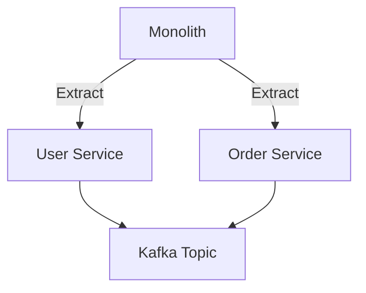

# **Debugging "Technical Debt Practices": A Troubleshooting Guide**

## **Introduction**
Technical debt is the unintended consequence of choosing a quick, inexpensive solution instead of a better approach that would take more time or money. While technically debt, it’s not financial debt—it’s accumulated complexity, inefficiencies, and hidden costs that emerge over time. Unlike financial debt, technical debt can silently degrade system performance, increase maintenance costs, and introduce risks in production.

This guide provides a **practical, actionable approach** to identifying, diagnosing, and mitigating technical debt in software systems. We’ll cover **symptoms, common issues, debugging techniques, and preventive strategies** to ensure sustainable code quality.

---

## **1. Symptom Checklist**
Before diving into fixes, recognize whether your system exhibits signs of technical debt. Below are **key indicators** that suggest debt accumulation:

### **Performance & Scalability Issues**
✅ **Symptoms:**
- Slower than expected application response times (e.g., API calls taking 3x longer than expected).
- System crashes or timeouts under moderate load.
- Workarounds for scaling (e.g., manually tweaking database sharding, adding caching layers).
- High server resource consumption (CPU/memory spikes) without obvious cause.

**Example Debugging Question:**
*"Is our database query optimized? Are we hitting N+1 query problems?"*

### **Increasing Maintenance Costs**
✅ **Symptoms:**
- More time spent fixing bugs than writing new features.
- Frequent "emergency" deployments to fix critical issues.
- Developers avoiding certain parts of the codebase due to complexity.
- Duplicate code that’s hard to update consistently.
- Dependency bloat (e.g., 50+ unused libraries in `node_modules` or `pom.xml`).

**Example Debugging Question:**
*"Why is our monolithic app taking 3x longer to deploy now than it did 6 months ago?"*

### **Flaky or Unreliable Code**
✅ **Symptoms:**
- Tests are flaky or fail intermittently.
- Bugs reappear repeatedly despite fixes.
- Manual QA checks are required before deployments.
- Feature flags or backend hacks are used to work around defects.

**Example Debugging Question:**
*"Why does our test suite fail with ‘ResourceNotFound’ in staging but works in CI?"*

### **Architectural Rigidity**
✅ **Symptoms:**
- Changes require rewriting entire modules.
- Refactoring is risky due to tight coupling.
- New features require hacky workarounds.
- The team avoids major changes ("We’ll fix it later...").

**Example Debugging Question:**
*"Why does adding a new user type require modifying 5 different services?"*

### **Security & Compliance Risks**
✅ **Symptoms:**
- Security vulnerabilities remain unfixed for months.
- Compliance audits fail due to undocumented workarounds.
- Exposed sensitive data in logs or deprecated APIs.
- Security patches are delayed due to integration risks.

**Example Debugging Question:**
*"Why are we still using SHA-1 signatures in 2024?"*

### **Team Morale & Productivity Drops**
✅ **Symptoms:**
- Developers hate working on specific modules.
- Knowledge hoarding (only one person understands a critical part).
- Burnout due to constant context-switching between fixes.

**Example Debugging Question:**
*"Why does our onboarding process take 6 months instead of 2 weeks?"*

---
## **2. Common Issues & Fixes**

### **Issue 1: Poor Code Quality & Readability**
**Symptom:** Code is hard to understand, with excessive comments explaining *what* rather than *why*.

**Root Cause:**
- Lack of coding standards (e.g., inconsistent naming, no type safety).
- Shortcuts taken during rushed development.
- No automated linting or static analysis.

**Fixes:**
```javascript
// ❌ Bad: Magic numbers, no explanations
const MAX_RETRIES = 3;
fetchData().then(data => process(data));

// ✅ Good: Self-documenting, clear intent
const MAX_API_RETRIES = 3; // Prevents redundant requests on transient failures
async function fetchDataWithRetry(url) {
  for (let attempt = 0; attempt < MAX_API_RETRIES; attempt++) {
    try {
      return await fetch(url);
    } catch (error) {
      if (attempt === MAX_API_RETRIES - 1) throw error;
      console.warn(`Retrying... Attempt ${attempt + 1}`);
      await delay(1000);
    }
  }
}
```

**Prevention:**
- Enforce **ESLint** (JavaScript) / **Pylint** (Python) / **Checkstyle** (Java).
- Use **pre-commit hooks** to block bad code.
- Write **unit tests** for critical logic.

---

### **Issue 2: Lack of Automation (Build, Test, Deploy)**
**Symptom:** Manual steps slow down releases, leading to errors.

**Root Cause:**
- No CI/CD pipeline.
- Manual database migrations.
- No automated testing (or tests only run on demand).

**Fixes:**
```yaml
# Example CI pipeline (GitHub Actions)
name: Build & Test
on: [push]
jobs:
  test:
    runs-on: ubuntu-latest
    steps:
      - uses: actions/checkout@v4
      - run: npm install
      - run: npm test  # Runs unit & integration tests
      - run: npm run lint
      - run: npm run build
```

**Prevention:**
- **Automate everything** (build, test, deploy).
- Use **Infrastructure as Code (IaC)** (Terraform, CloudFormation).
- Implement **feature flags** to avoid risky merges.

---

### **Issue 3: Database Schema Drift**
**Symptom:** Application and database schemas are out of sync.

**Root Cause:**
- Manual SQL migrations.
- No version control for DB changes.
- ORM-generated schema changes not tracked.

**Fix:**
- Use **schema migration tools** (Flyway, Liquibase).
- Enforce **immutable database changes** (e.g., Blue-Green deployments).

```sql
-- ❌ Manual migration (risky)
ALTER TABLE users ADD COLUMN last_login TIMESTAMP;

-- ✅ Flyway migration (safe, versioned)
V1__Add_last_login_column.sql
-- Up migration:
ALTER TABLE users ADD COLUMN last_login TIMESTAMP;
-- Down migration (rollback support):
ALTER TABLE users DROP COLUMN last_login;
```

**Prevention:**
- **Version-control DB changes** alongside code.
- **Test migrations in staging** before production.

---

### **Issue 4: Overly Complex Monoliths**
**Symptom:** A single codebase handles too many responsibilities.

**Root Cause:**
- Original design was "good enough."
- Microservices were never properly split.
- Team grew, but no architectural refactoring.

**Fix:**
- **Domain-Driven Design (DDD)** to split by business domains.
- **Strangler Pattern** to incrementally migrate to microservices.



**Prevention:**
- **Modularize early** (use **feature flags** to isolate changes).
- **Decouple services** with APIs (REST/gRPC).

---

### **Issue 5: Unmaintainable Legacy Code**
**Symptom:** No one understands how a module works.

**Root Cause:**
- No documentation.
- Tight coupling with dependencies.
- No test coverage.

**Fix:**
- **Rewrite incrementally** (not all at once).
- **Add tests** to critical paths.

```python
# ❌ Untestable legacy code
class PaymentProcessor:
    def process(self, amount):
        if amount > 1000:
            return self._high_value_processing(amount)
        else:
            return self._standard_processing(amount)

# ✅ Testable with mocks
class PaymentProcessor:
    def process(self, amount):
        if amount > 1000:
            return self._high_value_processing(amount)
        else:
            return self._standard_processing(amount)

# Unit test
def test_high_value_processing(mocker):
    processor = PaymentProcessor()
    mocker.patch.object(processor, '_high_value_processing', return_value="Approved")
    assert processor.process(1500) == "Approved"
```

**Prevention:**
- **Document "why" changes were made** (Git commit messages).
- **Refactor in small batches** (using **Safe Refactoring Patterns**).

---

## **3. Debugging Tools & Techniques**

### **A. Static Analysis & Linting**
- **ESLint** (JavaScript), **Pylint** (Python), **Checkstyle** (Java)
- **SonarQube** (Code quality dashboard)
- **GitHub CodeQL** (Security vulnerabilities)

### **B. Performance Profiling**
- **CPU Profiling:** `perf` (Linux), Xcode Instruments (macOS)
- **Memory Leaks:** `heapdump` (Node.js), Valgrind (C++)
- **Database Bottlenecks:** `pgMustard` (PostgreSQL), `Slow Query Logs`

### **C. Logging & Monitoring**
- **Structured Logging:** `winston` (Node.js), `structlog` (Python)
- **APM Tools:** New Relic, Datadog, OpenTelemetry
- **Error Tracking:** Sentry, Error Tracking

### **D. Test Coverage Analysis**
- **Unit Test Coverage:** `Jest` (JavaScript), `pytest-cov` (Python)
- **Missing Coverage Alerts:** `Codecov`, `Coveralls`

### **E. Dependency Analysis**
- **Outdated Dependencies:** `npm outdated`, `dependency-check` (OWASP)
- **Bloat Detection:** `bundlephobia.com`, `npm ls --depth=0`

### **F. Architectural Visualization**
- **Sequence Diagrams:** `Mermaid.js`, ` draw.io`
- **Dependency Graphs:** `Dependabot`, `npm graph`

---
## **4. Prevention Strategies**
To avoid accumulating technical debt, adopt these **practices**:

### **1. Code Reviews & Guidelines**
- Enforce **checklist-based reviews** (e.g., "Did this add tests?").
- Use **Prettier** for consistent formatting.
- **Ban `// TODO` comments**—either fix or delete them.

### **2. Automated Testing**
| Test Type | Purpose | Example Tools |
|-----------|---------|---------------|
| Unit Tests | Catch logic bugs early | Jest, pytest, JUnit |
| Integration Tests | Verify API/database interactions | Supertest, Postman, Cypress |
| End-to-End Tests | Test real user flows | Selenium, Playwright |
| Load Tests | Ensure scalability | k6, JMeter |

### **3. Infrastructure as Code (IaC)**
- **Example:** Use **Terraform** or **AWS CDK** instead of manual AWS console setups.
- **Benefit:** Reproducible environments, faster deployments.

### **4. Modularity & Decoupling**
- **Principle:** "No single component should do too much."
- **Tools:** Event-driven architecture (Kafka, RabbitMQ), gRPC APIs.

### **5. Continuous Monitoring & Alerting**
- **Key Metrics to Track:**
  - **Error rates** (should be < 1% in production).
  - **Latency percentiles** (e.g., 95th percentile should be < 500ms).
  - **CPU/Memory usage** (alert on spikes).
- **Tools:** Prometheus + Grafana, Datadog, New Relic.

### **6. Scheduled Tech Debt Retreats**
- **Dedicate 10% of dev time** to refactoring.
- **Example Work Items:**
  - Replace `switch-case` with strategy pattern.
  - Replace hardcoded configs with environment variables.
  - Remove dead code.

### **7. Knowledge Sharing**
- **Pair Programming** (Live code reviews).
- **Wiki/Docs** (Confluence, Notion) for critical systems.
- **Post-mortems** (What went wrong? How to prevent it?).

---
## **5. Final Checklist for Technical Debt Reduction**
| Step | Action | Owner | Timeline |
|------|--------|-------|----------|
| 1 | Identify **top 3 debt items** (from symptom checklist) | Tech Lead | 1 Day |
| 2 | Run **static analysis & linting** | Dev Team | 1 Day |
| 3 | **Add missing tests** (focus on high-risk areas) | QA/Dev | 3 Days |
| 4 | **Refactor one module** (small batch) | Pair Programmers | 1 Week |
| 5 | **Automate deployments** (CI/CD) | DevOps | 2 Weeks |
| 6 | **Monitor impact** (error rates, latency) | SRE | Ongoing |
| 7 | **Plan next debt reduction cycle** | Team | Monthly |

---
## **Conclusion**
Technical debt is **not a one-time fix**—it’s an ongoing **sustainability challenge**. The key is:
1. **Detect early** (monitor symptoms).
2. **Fix incrementally** (small, low-risk changes).
3. **Prevent future debt** (automation, reviews, modularity).

By treating technical debt like **financial debt** (pay interest early to avoid compounding), your system will remain **fast, stable, and maintainable** for years.

**Next Steps:**
✅ Audit your codebase for debt hotspots.
✅ Set up **automated checks** (linting, testing).
✅ Schedule a **debts sprint** (1-2 weeks).

Would you like a **customized debt assessment template** for your stack? Let me know which language/framework you’re using! 🚀