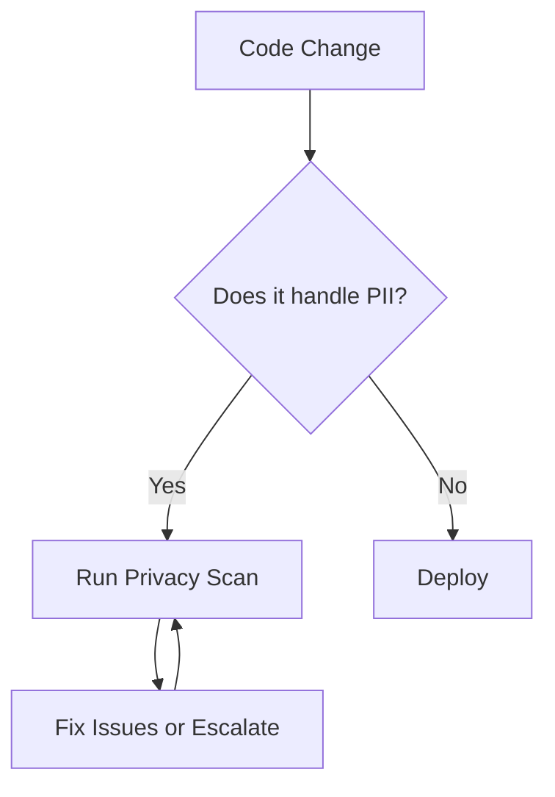

# **Debugging Privacy Best Practices: A Troubleshooting Guide**

## **Introduction**
Privacy Best Practices ensure that user data is handled securely, transparently, and compliantly. Misconfigurations, security gaps, or improper logging can lead to data leaks, compliance violations (e.g., GDPR, CCPA), or system instability. This guide helps identify, diagnose, and resolve common issues in privacy-focused implementations.

---

## **Symptom Checklist**
Before diving into debugging, check if the following symptoms apply:

| **Symptom** | **Description** | **Impact** |
|-------------|----------------|------------|
| **Unauthorized Data Exposure** | User data (PII, PII-like) leaks via logs, APIs, or cache. | Legal/Compliance Risks, Reputation Damage |
| **Non-Compliant Logging** | Sensitive data logged in plaintext or unencrypted. | GDPR/CCPA Violations, Security Breaches |
| **Over-Permissive Access Controls** | Services have unnecessary data access privileges. | Data Leaks, Unauthorized Data Usage |
| **Lack of Data Minimization** | Systems collect more data than necessary. | Storage Bloat, Privacy Violations |
| **Inconsistent Privacy Policies** | API documentation does not reflect actual data handling. | User Confusion, Trust Erosion |
| **Slow Privacy Compliance Checks** | Manual reviews take too long, delaying deployments. | Operational Delays, Increased Risk |
| **Unintended Data Sharing** | Third-party integrations expose more data than intended. | Data Leaks, Non-Compliance |
| **Missing or Incomplete Audit Logs** | No clear trail of who accessed what data. | Harder to Detect Breaches |

If any of these apply, proceed with the troubleshooting steps below.

---

## **Common Issues & Fixes**

### **1. Unauthorized Data Exposure via Logs/APIs**
**Symptom:**
Sensitive data (e.g., tokens, PII) appears in logs, API responses, or cache.

#### **Root Causes:**
- **PII stored in logs** (e.g., `console.log(user.email)`).
- **API responses expose more than necessary** (e.g., returning `password_hash` in error details).
- **Debugging tools (e.g., Postman) cache sensitive data.**

#### **Fixes:**
✅ **Sanitize Logs & API Responses**
```javascript
// Bad: Logging raw data
console.log("User signed in:", user); // May log password/reset tokens

// Good: Log only essential fields
console.log("User signed in:", { id: user.id, email: user.email });

// API Response Sanitization
const safeResponse = {
  user: { id: user.id, name: user.name }, // Exclude sensitive fields
};
```

✅ **Use Structured Logging with Redaction**
```go
// Go (using zap logger)
log.Info("User login",
    zap.String("email", "user@example.com"), // Safe
    zap.Int("user_id", user.ID), // Safe
    zap.String("password_hash", "REDACTED"), // Always redact
)
```

✅ **Enable API Response Masking**
```javascript
// Express.js middleware to sanitize responses
app.use((req, res, next) => {
  const originalSend = res.send;
  res.send = function(body) {
    const sanitized = JSON.parse(JSON.stringify(body));
    delete sanitized.password;
    delete sanitized.token;
    originalSend.call(res, sanitized);
  };
  next();
});
```

---

### **2. Non-Compliant Logging (GDPR/CCPA Violations)**
**Symptom:**
Logs contain unencrypted PII, or retention policies are unclear.

#### **Root Causes:**
- **Plaintext logging** (e.g., `fs.writeFileSync` without encryption).
- **Logs retained beyond legal limits** (e.g., 7 years for GDPR).
- **Third-party log aggregation tools lack encryption.**

#### **Fixes:**
✅ **Encrypt Logs at Rest & in Transit**
```python
# Python (using PyCryptodome)
from Crypto.Cipher import AES
import json

def encrypt_log(log_entry):
    cipher = AES.new("32-byte-key-128-bit-here", AES.MODE_EAX)
    ciphertext, tag = cipher.encrypt_and_digest(json.dumps(log_entry).encode())
    return {
        "ciphertext": ciphertext.hex(),
        "nonce": cipher.nonce.hex(),
        "tag": tag.hex()
    }
```

✅ **Use Log Retention Policies**
```yaml
# ELK Stack Log Retention (GDPR Compliant: 1 year max)
index.lifecycle.phase_headers:
  hot: 'index.lifecycle.hot'
  delete: 'index.lifecycle.delete'
  hot.rollover.threshold: 50gb
  delete.rollover.index: 'index.lifecycle.delete.*'
  delete.rollover.max_age: 1y
```

✅ **Avoid Logging PII in Cloud Services**
- Use **confidential computing** (AWS Secret Manager, Azure Key Vault).
- **Mask sensitive fields** in logs before sending to third-party tools.

---

### **3. Over-Permissive Access Controls**
**Symptom:**
A service can access more data than required (e.g., `admin` role granted to a non-superuser function).

#### **Root Causes:**
- **Default roles have excessive permissions** (e.g., `db:*:*`).
- **No principle of least privilege (PoLP) enforcement.**
- **API keys with full database read/write access.**

#### **Fixes:**
✅ **Implement Least Privilege with IAM**
```bash
# AWS IAM Policy (Restrict API access)
{
  "Version": "2012-10-17",
  "Statement": [
    {
      "Effect": "Allow",
      "Action": [
        "dynamodb:GetItem",
        "dynamodb:Query"
      ],
      "Resource": "arn:aws:dynamodb:us-east-1:123456789012:table/UserData"
    }
  ]
}
```

✅ **Use ABAC (Attribute-Based Access Control) for Fine-Grained Access**
```python
# Example: Only allow admins to access `/admin` endpoints
from functools import wraps

def admin_only(f):
    @wraps(f)
    def decorated(*args, **kwargs):
        if not current_user.has_role("admin"):
            raise PermissionError("Forbidden")
        return f(*args, **kwargs)
    return decorated

@admin_only
def delete_user(user_id):
    # Only admins can delete users
    ...
```

✅ **Rotate & Audit API Keys Regularly**
```bash
# Rotate AWS API keys periodically
aws iam update-access-key --user-name my-service --status Inactive --access-key-id AKIA...
aws iam update-access-key --user-name my-service --status Active --access-key-id AKIA...
```

---

### **4. Lack of Data Minimization**
**Symptom:**
Systems collect unnecessary data (e.g., storing `IP_address` indefinitely).

#### **Root Causes:**
- **Forms request more fields than needed.**
- **Databases store redundant PII.**
- **Analytics tools track excessive user behavior.**

#### **Fixes:**
✅ **Audit Data Collection Points**
```sql
-- Check for unnecessary columns in database
SELECT column_name
FROM information_schema.columns
WHERE table_name = 'users'
AND column_name IN ('ip_address', 'reset_token', 'last_login_at');
```

✅ **Implement Field-Level Encryption for Sensitive Data**
```javascript
// Only store hashed emails in DB
const bcrypt = require('bcrypt');
const encryptedEmail = await bcrypt.hash(user.email, 12);
```

✅ **Use Opt-In Consent for Analytics**
```javascript
// Check if user opted into analytics
if (!user.consented_analytics) {
  analytics.track("page_view", { user_id: user.id }); // Only if allowed
}
```

---

### **5. Inconsistent Privacy Policies**
**Symptom:**
API docs claim data is anonymous, but logs reveal PII.

#### **Root Causes:**
- **Misaligned Swagger/OpenAPI docs.**
- **Backend code contradicts frontend disclaimers.**
- **No automated compliance checks.**

#### **Fixes:**
✅ **Automated Compliance Scanning**
```bash
# Use OWASP ZAP to scan API responses for PII leaks
zap-baseline.py -t http://localhost:3000/api/users
```

✅ **Document Data Handling in API Specs**
```yaml
# Swagger/OpenAPI Compliance Note
x-compliance:
  - GDPR: "User data is encrypted at rest (AES-256)."
  - CCPA: "Users can opt-out via /opt-out endpoint."
```

✅ **Implement a Privacy Review Workflow**


---

## **Debugging Tools & Techniques**

| **Tool** | **Purpose** | **Example Use Case** |
|----------|------------|----------------------|
| **Fiddler / Charles Proxy** | Inspect HTTP traffic for PII leaks. | Check if `password` is sent in plaintext. |
| **ELK Stack (Elasticsearch, Logstash, Kibana)** | Monitor & redact logs in real-time. | Block logs containing `credit_card`. |
| **GDPR Audit Tools (e.g., OneTrust, TrustArc)** | Automated compliance scanning. | Detect unauthorized data transfers. |
| **AWS IAM Access Analyzer** | Detect over-permissive IAM policies. | Find S3 buckets with public access. |
| **Burp Suite** | Test API security for data exposure. | Fuzz endpoints for sensitive data leaks. |
| **Postman / Insomnia** | Check API responses for PII. | Verify `/users/me` doesn’t leak `password_hash`. |
| **Datadog / New Relic** | Monitor data access patterns. | Alert on unusual database query patterns. |

---

## **Prevention Strategies**

### **1. Adopt a Privacy-First Development Culture**
- **Default to "private" settings** (e.g., IAM roles start with least privilege).
- **Conduct privacy impact assessments (PIAs)** before new features.
- **Train teams on GDPR/CCPA basics** (e.g., GDPR’s "right to erasure").

### **2. Automate Privacy Checks**
- **Use linters to block PII in logs:**
  ```bash
  # ESLint rule to prevent logging PII
  "no-console-log": ["error", { allow: ["user_id", "email"] }],
  ```
- **Enforce data retention policies in CI/CD:**
  ```yaml
  # GitHub Actions: Delete logs after 30 days
  - name: Clean up old logs
    run: aws logs filter-log-events --log-group-name /app --end-time $(date -d "30 days ago" +%s000) --delete
  ```

### **3. Regular Compliance Audits**
- **Quarterly reviews of:**
  - Log retention policies.
  - Data access logins.
  - Third-party integrations.
- **Use automated tools like:**
  - **AWS Config** (for compliance tracking).
  - **Google Security Command Center** (for GCP compliance).

### **4. Incident Response Plan for Data Leaks**
- **Step 1:** Contain the leak (e.g., revoke API keys).
- **Step 2:** Notify affected users (GDPR requires **72 hours**).
- **Step 3:** File a breach report (e.g., FCC for US, ICO for UK).
- **Step 4:** Improve logging/monitoring to prevent recurrence.

---

## **Final Checklist for Privacy Debugging**
✅ **Logs:** Are PII fields redacted? Are logs encrypted?
✅ **APIs:** Do responses include sensitive data?
✅ **Access Controls:** Are permissions least-privilege?
✅ **Data Storage:** Is PII minimized & encrypted?
✅ **Compliance:** Are policies documented & automated?
✅ **Incident Response:** Is there a breach playbook?

By following this guide, you can systematically debug privacy issues, ensure compliance, and prevent security breaches.