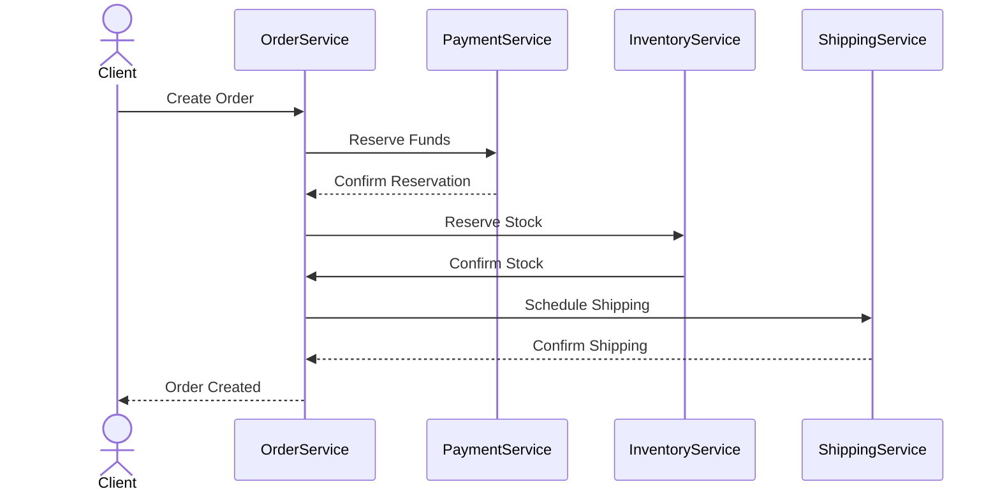

# **Debugging Reliability Conventions: A Troubleshooting Guide**

---

## **Introduction**
Reliability Conventions are design patterns and implementation practices that ensure fault tolerance, graceful degradation, and recovery in distributed systems. These conventions help mitigate issues like timeouts, retries, circuit breakers, and idempotency while maintaining system stability during failures.

This guide will help you diagnose, resolve, and prevent issues related to **Reliability Conventions** in microservices and distributed systems.

---

## **1. Symptom Checklist**
Before diving into debugging, confirm the presence of these symptoms:

| **Symptom**                          | **Description**                                                                 |
|--------------------------------------|---------------------------------------------------------------------------------|
| ❌ **Unrecoverable timeouts**        | Services fail after retries exceed max attempts, causing cascading failures.     |
| ❌ **Duplicate operations**          | An operation (e.g., payment, order) is executed multiple times due to retries. |
| ❌ **Infinite retries**             | Requests hang indefinitely due to misconfigured retry policies.                |
| ❌ **Circuit breaker not tripping** | Service degradation occurs, but the circuit doesn’t open, leading to cascading failures. |
| ❌ **Idempotency violations**       | Repeated requests produce different outcomes (e.g., duplicate database entries). |
| ❌ **Deadlocks in recovery**         | System freezes during recovery attempts due to circular dependencies.           |
| ❌ **Uneven recovery times**        | Some services recover faster than others, causing inconsistencies.               |
| ❌ **Logging lacks retry/fallback details** | Hard to track why a request failed and how it was handled.                     |
| ❌ **Metrics missing reliability indicators** | No visibility into retry rates, failure modes, or circuit breaker states.     |

If you see multiple symptoms, prioritize:
1. **Duplicate operations** (data corruption risk)
2. **Infinite retries** (system starvation)
3. **Circuit breaker misbehavior** (latency spikes)

---

## **2. Common Issues & Fixes**

### **2.1 Issue: Unrecoverable Timeouts (Retries Exhausted)**
**Symptoms:**
- API Gateway logs: `Max retries exceeded`
- Service A fails to call Service B after multiple attempts.

#### **Root Causes:**
✅ **Network latency spikes** (e.g., cloud provider outages)
✅ **Misconfigured retry delays** (too short → hammering; too long → user experience degrades)
✅ **Service B is overloaded** (retries make it worse)
✅ **No circuit breaker** → retries continue indefinitely

#### **Fixes:**
**A. Adjust Retry Policy (Exponential Backoff)**
```java
// Example in Java (Resilience4j)
RetryConfig retryConfig = RetryConfig.custom()
    .maxAttempts(3)
    .waitDuration(Duration.ofMillis(100))
    .multiplier(2) // Exponential backoff
    .retryExceptions(ServiceUnavailableException.class)
    .build();
```

**B. Implement a Circuit Breaker**
```java
// Spring Cloud Circuit Breaker (Resilience4j)
@CircuitBreaker(name = "serviceB", fallbackMethod = "fallback")
public String callServiceB(String input) {
    return remoteServiceB.invoke(input);
}

public String fallback(String input, Exception e) {
    return "Fallback response: Service B unavailable";
}
```

**C. Add Timeout with Fallback**
```python
# Python (FastAPI + CircuitBreaker pattern)
from circuitbreaker import circuit

@circuit(failure_threshold=5, recovery_timeout=60)
async def call_service_b():
    async with aiohttp.ClientSession() as session:
        async with session.get("http://service-b/api", timeout=2) as resp:
            return await resp.text()
```

**D. Use Bulkheads (Thread Pools for Parallel Retries)**
```java
// Resilience4j Bulkhead
BulkheadConfig bulkheadConfig = BulkheadConfig.custom()
    .maxConcurrentCalls(10)
    .maxWaitDuration(Duration.ofMillis(500))
    .build();
```

---

### **2.2 Issue: Duplicate Operations (Non-Idempotency)**
**Symptoms:**
- Database shows duplicate orders/payments.
- User gets billed twice for the same transaction.

#### **Root Causes:**
✅ **No idempotency key** (repeated requests → repeated actions)
✅ **Retry without idempotency check**
✅ **Distributed transactions without compensating actions**

#### **Fixes:**
**A. Use Idempotency Keys**
```java
// Example: Order Service with Idempotency
@PostMapping("/orders")
public ResponseEntity<Order> createOrder(@RequestBody Order order, @RequestHeader("Idempotency-Key") String idempotencyKey) {
    if (orderService.isOrderIdempotent(idempotencyKey)) {
        return ResponseEntity.status(200).body(orderService.findByIdempotencyKey(idempotencyKey));
    }
    Order createdOrder = orderService.createOrder(order);
    orderService.storeIdempotencyKey(idempotencyKey, createdOrder.getId());
    return ResponseEntity.status(201).body(createdOrder);
}
```

**B. Implement Compensating Transactions**
```java
// Example: Payment Service (rollback on failure)
@Transactional
public void processPayment(Order order) {
    paymentGateway.charge(order.getAmount());
    // If payment fails, refund and mark order as failed:
    try {
        paymentGateway.charge(order.getAmount());
    } catch (PaymentFailedException e) {
        paymentGateway.refund(order.getAmount());
        orderRepository.markAsFailed(order.getId());
    }
}
```

**C. Use Saga Pattern for Distributed Idempotency**


---

### **2.3 Issue: Infinite Retries (No Circuit Breaker)**
**Symptoms:**
- Logs show `Retry #1`, `Retry #2`, `Retry #3`, … forever.
- No timeout, no fallback.

#### **Root Causes:**
✅ **Missing circuit breaker**
✅ **Retry policy without max attempts**
✅ **Service dependency not failing fast**

#### **Fixes:**
**A. Add Circuit Breaker with State Monitoring**
```java
// Resilience4j Circuit Breaker with Fallback
CircuitBreakerConfig circuitBreakerConfig = CircuitBreakerConfig.custom()
    .failureRateThreshold(50)
    .waitDurationInOpenState(Duration.ofMillis(1000))
    .slidingWindowSize(10)
    .permittedNumberOfCallsInHalfOpenState(3)
    .recordExceptions(ServiceUnavailableException.class)
    .build();

CircuitBreaker circuitBreaker = CircuitBreaker.of("serviceB", circuitBreakerConfig);
```

**B. Log Circuit Breaker State**
```java
// Enable logging for circuit breaker
logging.level.io.github.resilience4j.circuitbreaker=CIRCUMVENT
```

**C. Use a Fallback Queue (Async Retries)**
```java
// Spring Cloud Task with Retry Queue
@Retryable(maxAttempts = 3, backoff = @Backoff(delay = 1000))
public void retryFailedTask(FailedTask task) {
    if (task.isRetryable()) {
        retryTemplate.execute(context -> {
            // Retry logic
        });
    }
}
```

---

### **2.4 Issue: Deadlocks During Recovery**
**Symptoms:**
- System hangs during `DB rollback`/`service restart`.
- `java.util.concurrent.TimeoutException` in recovery tasks.

#### **Root Causes:**
✅ **Two-phase commit (2PC) without proper isolation**
✅ **Circular dependencies in recovery scripts**
✅ **Long-running transactions blocking others**

#### **Fixes:**
**A. Use Saga Pattern (Decompose Transactions)**
```java
// Saga Example: Payment → Inventory → Shipping
public class PaymentSaga {
    private final PaymentService paymentService;
    private final InventoryService inventoryService;
    private final ShippingService shippingService;

    public void execute(Order order) {
        try {
            paymentService.charge(order);
            inventoryService.reserveStock(order);
            shippingService.schedule(order);
        } catch (Exception e) {
            // Compensating actions
            inventoryService.releaseStock(order);
            shippingService.cancel(order);
            paymentService.refund(order);
        }
    }
}
```

**B. Use Event Sourcing for Recovery**
```java
// Event Sourcing Example
public class OrderService {
    private final EventStore eventStore;

    public void createOrder(Order order) {
        eventStore.append(event -> event.apply(order));
    }

    public void recover() {
        eventStore.playback(events -> events.forEach(this::applyEvent));
    }
}
```

**C. Add Timeout to Recovery Tasks**
```java
// Java CompletableFuture with Timeout
CompletableFuture.supplyAsync(() -> recoverService())
    .orTimeout(10, TimeUnit.SECONDS)
    .exceptionally(e -> {
        log.error("Recovery timed out", e);
        throw new RecoveryFailedException();
    });
```

---

## **3. Debugging Tools & Techniques**

| **Tool/Technique**               | **Use Case**                                                                 | **Example** |
|-----------------------------------|-----------------------------------------------------------------------------|-------------|
| **Distributed Tracing (OpenTelemetry)** | Track requests across services, identify bottlenecks. | Jaeger, Zipkin |
| **Circuit Breaker Metrics**      | Monitor failure rates, retry counts, open/closed states. | Resilience4j Dashboard |
| **Retry Delay Logger**           | Log retry attempts with delays. | `log.debug("Retry #{} after {}ms", attempt, delayMs)` |
| **Idempotency Key Validation**    | Check if duplicate operations exist. | `SELECT * FROM idempotency_keys WHERE key = ?` |
| **Chaos Engineering Tools**       | Simulate failures to test reliability. | Gremlin, Chaos Mesh |
| **Deadlock Detection**           | Find circular dependencies in transactions. | Oracle `v$locked_object`, PostgreSQL `pg_locks` |
| **API Gateway Rate Limiting**    | Prevent retry storms from overwhelming services. | Kong, Envoy |

**Example Debugging Workflow:**
1. **Check logs** for retry attempts (`Retry #1`, `Retry #2`).
2. **Enable tracing** to see where the call gets stuck.
3. **Query metrics** (e.g., Prometheus) for failure rates.
4. **Simulate a retry storm** (Chaos Mesh) to test circuit breaker behavior.
5. **Add logging** for idempotency keys to verify uniqueness.

---

## **4. Prevention Strategies**

### **4.1 Design Time**
✅ **Adopt Resilience Patterns Early**
- Use **Circuit Breaker** (Resilience4j, Hystrix).
- Enforce **Idempotency** via keys or sagas.
- Implement **Bulkheads** to isolate failures.

✅ **Choose the Right Retry Strategy**
| Strategy | When to Use | Example |
|----------|------------|---------|
| **Fixed Backoff** | Simple retries | `retry-after: 1s` |
| **Exponential Backoff** | Network variability | `waitDuration = 100ms * 2^(n-1)` |
| **Jittered Retries** | Avoid thundering herds | `randomDelay(100ms, 500ms)` |

✅ **Design for Failure**
- Assume services will fail → **degrade gracefully**.
- **Isolate dependencies** (e.g., separate DB read/write pools).
- **Use async processing** (Kafka, SQS) for non-critical paths.

### **4.2 Runtime**
✅ **Monitor Reliability Metrics**
| Metric | Tool | Threshold |
|--------|------|-----------|
| **Retry Count** | Prometheus | `>3` → Investigate |
| **Circuit Breaker Open Time** | Resilience4j | `>1min` → Check downstream |
| **Duplicate Operations** | Database Audit Logs | `>0` → Fix idempotency |
| **Latency P99** | Jaeger | `>1s` → Optimize |

✅ **Automated Alerts**
```yaml
# Prometheus Alert Rule (Retry Storm)
- alert: HighRetryCount
  expr: rate(resilience4j_retry_call_attempts_total[1m]) > 10
  for: 5m
  labels:
    severity: warning
  annotations:
    summary: "High retry rate detected (instance {{ $labels.instance }})"
```

✅ **Chaos Testing**
- **Kill random instances** (Gremlin) to test recovery.
- **Simulate network partitions** (Chaos Mesh) to validate circuit breakers.

### **4.3 Post-Mortem**
✅ **Root Cause Analysis (RCA) Template**
| **Step** | **Question** | **Action** |
|----------|-------------|------------|
| 1 | Was it a retry issue? | Check logs, metrics |
| 2 | Did the circuit breaker fail? | Verify `CIRCUIT_OPEN` state |
| 3 | Were idempotency keys missing? | Audit DB for duplicates |
| 4 | Was there a dependency delay? | Trace request path |
| 5 | Did recovery fail? | Review saga/compensating actions |

✅ **Lessons Learned**
- **Document retry policies** (e.g., `maxRetries: 3`, `backoff: exponential`).
- **Add postmortem templates** for reliability incidents.
- **Run reliability drills** quarterly.

---

## **5. Summary Checklist for Quick Fixes**

| **Issue** | **Quick Fix** | **Tool to Verify** |
|-----------|--------------|---------------------|
| **Unrecoverable Timeouts** | Add circuit breaker + exponential backoff | Resilience4j Dashboard |
| **Duplicate Operations** | Implement idempotency keys | Database audit logs |
| **Infinite Retries** | Configure max attempts + timeout | Prometheus Alerts |
| **Circuit Breaker Not Tripping** | Check failure rate threshold | `CIRCUIT_OPEN` logs |
| **Deadlocks in Recovery** | Use saga pattern + timeouts | `pg_locks` (PostgreSQL) |
| **Slow Recovery** | Async processing (Kafka) | Job queue metrics |

---

## **Final Notes**
- **Start small**: Apply reliability patterns to **one critical service** first.
- **Monitor aggressively**: Set up alerts for retry storms and circuit breaker states.
- **Test failures**: Use chaos engineering to validate recovery strategies.
- **Iterate**: Reliability is an ongoing effort—refine based on postmortems.

By following this guide, you can **quickly diagnose** reliability issues and **prevent cascading failures** in distributed systems. 🚀