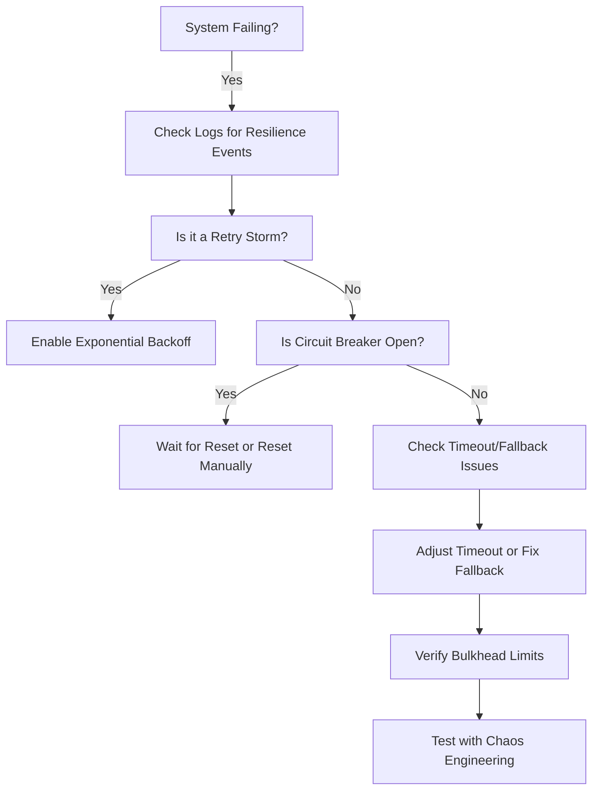

# **Debugging Resilience Strategies: A Troubleshooting Guide**

Resilience Strategies (e.g., Retry, Circuit Breaker, Bulkhead, Fallback, Timeout, Rate Limiting, and Bulkhead) help systems gracefully handle failures, reduce cascading failures, and improve overall reliability. When implemented incorrectly, these patterns can lead to degraded performance, incorrect retries, or even system collapse.

This guide provides a **practical, step-by-step** approach to diagnosing and fixing common issues with Resilience Strategies.

---

## **1. Symptom Checklist**
Before diving into debugging, confirm which resilience-related issues are affecting your system. Check for:

| **Symptom** | **Likely Cause** |
|-------------|------------------|
| ✅ **High latency or timeouts** | Retry loops, missing timeouts, or inefficient fallback mechanisms. |
| ✅ **Uncontrolled retry storms** | Retry policies too aggressive, missing exponential backoff, or improper retry limits. |
| ✅ **Cascading failures** | Missing Circuit Breaker, Bulkhead, or Rate Limiting. |
| ✅ **Incorrect fallback behavior** | Fallback logic returning wrong data or failing silently. |
| ✅ **System overload under load** | Missing Rate Limiting or Bulkhead isolation. |
| ✅ **Deadlocks or hangs** | Infinite retries, missing thread/pool limits, or resource starvation. |
| ✅ **Incorrect error handling** | Resilience strategies not properly propagated through call chains. |
| ✅ **API/Service timeouts** | Missing Timeout configurations or overly aggressive retries. |

If multiple symptoms appear, focus on **Retry + Circuit Breaker + Timeout** first.

---

## **2. Common Issues & Fixes**

### **Issue 1: Uncontrolled Retry Storms (Exponential Backoff Not Working)**
**Symptoms:**
- Rapid, repeated retries without delay.
- System overload when dependent services fail repeatedly.

**Common Causes:**
- Missing exponential backoff.
- Hardcoded retry delays.
- Retry limit too high.

**Fixes:**

#### **Example: Correct Retry with Backoff (Java - Resilience4j)**
```java
RetryConfig retryConfig = RetryConfig.custom()
    .maxAttempts(5)
    .waitDuration(Duration.ofSeconds(1))  // Initial wait
    .enableExponentialBackoff()          // Exponential delay
    .build();

Retry retry = Retry.of("retryConfig", retryConfig);

retry.executeCallable(() -> {
    // Your callable logic with fallback
});
```

#### **Fixes to Apply:**
✔ **Add exponential backoff** (Resilience4j, Retry-After HTTP header).
✔ **Set a reasonable retry limit** (3-5 retries typically suffice).
✔ **Log retry attempts** to detect storms:
```java
logger.debug("Retry attempt {} of {}", attempt, maxAttempts);
```

---

### **Issue 2: Circuit Breaker Not Tripping Properly**
**Symptoms:**
- System keeps failing even after dependent service is down.
- No automatic fallback to cached data.

**Common Causes:**
- Incorrect success/failure thresholds (`failureRateThreshold`).
- Too slow sliding window (causes delayed circuit opening).
- Missing `automaticTransitionFromOpenToHalfOpen` (if needed).

**Fixes:**

#### **Example: Configured Circuit Breaker (Java - Resilience4j)**
```java
CircuitBreakerConfig circuitBreakerConfig = CircuitBreakerConfig.custom()
    .failureRateThreshold(50)  // 50% failures → trip circuit
    .waitDurationInOpenState(Duration.ofSeconds(10))  // 10s before allowing requests
    .permittedNumberOfCallsInHalfOpenState(2)       // Test 2 calls before closing
    .slidingWindowType(SlidingWindowType.COUNT_BASED)
    .slidingWindowSize(2)                           // Track last 2 calls
    .recordExceptions(TimeoutException.class, IOException.class)
    .build();

CircuitBreaker circuitBreaker = CircuitBreaker.of("circuitBreaker", circuitBreakerConfig);
```

#### **Fixes to Apply:**
✔ **Tune `failureRateThreshold`** (start with **50%**).
✔ **Set a short `waitDurationInOpenState`** (but not too short).
✔ **Enable logging to track state transitions**:
```java
circuitBreaker.getMetrics().addCallback(event -> {
    logger.info("CircuitBreaker state: {}", event.getState());
});
```

---

### **Issue 3: Bulkhead Not Isolating Failures**
**Symptoms:**
- Thread pool exhaustion under load.
- All requests blocked even for healthy services.

**Common Causes:**
- Too few threads in the pool.
- No connection pooling (e.g., HTTP clients).
- Missing isolation for different service types.

**Fixes:**

#### **Example: Bulkhead Isolation (Java - Resilience4j)**
```java
BulkheadConfig bulkheadConfig = BulkheadConfig.custom()
    .maxConcurrentCalls(10)  // Limit concurrent calls
    .maxWaitDuration(Duration.ofMillis(100))  // Reject if queue is full
    .build();

Bulkhead bulkhead = Bulkhead.of("bulkheadConfig", bulkheadConfig);

bulkhead.executeRunnable(() -> {
    // Your callable logic
});
```

#### **Fixes to Apply:**
✔ **Set `maxConcurrentCalls` based on service capacity** (e.g., DB connections).
✔ **Use `maxWaitDuration` to prevent queue buildup**.
✔ **Isolate different service types** (e.g., DB vs. External API).

---

### **Issue 4: Fallback Returns Incorrect Data**
**Symptoms:**
- Fallback logic fails silently.
- Fallback returns stale or wrong data.

**Common Causes:**
- Fallback not updated when downstream changes.
- No validation in fallback logic.

**Fixes:**

#### **Example: Safe Fallback with Data Validation (Java)**
```java
Fallback fallback = Fallback.of("fallback", (RetryContext context, Exception ex) -> {
    if (ex instanceof TimeoutException) {
        return cachedData;  // Return stale data on timeout
    } else {
        throw new RuntimeException("Fallback failed", ex);  // Re-throw on unknown errors
    }
});
```

#### **Fixes to Apply:**
✔ **Validate fallback data** before returning.
✔ **Log fallback usage** to detect silent failures:
```java
logger.warn("Fallback triggered for: {}", context.getAttempt());
```

---

### **Issue 5: Timeouts Not Working**
**Symptoms:**
- Requests hang indefinitely.
- No response even after expected timeout.

**Common Causes:**
- Missing timeout configuration.
- Timeout too short for slow but valid responses.

**Fixes:**

#### **Example: Setting Timeout (Java - Resilience4j)**
```java
TimeoutConfig timeoutConfig = TimeoutConfig.custom()
    .timeoutDuration(Duration.ofSeconds(2))  // 2s timeout
    .build();

Timeout timeout = Timeout.of("timeoutConfig", timeoutConfig);

timeout.executeCallable(() -> {
    // Your callable logic
});
```

#### **Fixes to Apply:**
✔ **Start with a conservative timeout** (e.g., **2-5s**).
✔ **Combine with Circuit Breaker** to avoid cascading timeouts.

---

## **3. Debugging Tools & Techniques**

### **Logging & Metrics**
- **Resilience4j Metrics:**
  ```java
  circuitBreaker.getMetrics().addCallback(event -> {
      logger.info("Failures: {}, Successes: {}", event.getFailureCount(), event.getSuccessCount());
  });
  ```
- **Micrometer + Prometheus** for real-time monitoring:
  ```java
  CircuitBreakerMetrics.of(circuitBreaker).bindTo(registry);
  ```

### **Distributed Tracing (Jaeger/Zipkin)**
- Trace resilience strategy calls through your microservices.
- Example:
  ```java
  tracing.trace(span -> {
      span.setTag("resilience.strategy", "retry");
      retry.executeCallable(() -> { ... });
  });
  ```

### **Instrumentation & Probes**
- **Resilience4j Dashboard** (for Resilience4j):
  ```bash
  curl -X POST http://localhost:8081/actuator/resilience4j
  ```
- **OpenTelemetry** for custom resilience metrics.

### **Unit & Integration Testing**
- **Mock Resilience Strategies** (Mockito):
  ```java
  @Mock
  Retry retry;

  @Test
  void testRetryBehavior() {
      when(retry.executeCallable(any())).thenThrow(new RuntimeException("Failed"));
      assertThrows(Exception.class, () -> retry.executeCallable(() -> { ... }));
  }
  ```

---

## **4. Prevention Strategies**

### **Best Practices**
✅ **Default to Fail-Fast** – Avoid silent failures in resilience logic.
✅ **Monitor Resilience Metrics** – Set alerts for high failure rates.
✅ **Test Failure Scenarios** – Chaos engineering for resilience.
✅ **Document Fallback Behavior** – Ensure devs know what happens on failure.
✅ **Use Circuit Breaker for External Calls** – Never expose internal DB calls to external APIs.

### **Configuration Guidelines**
| **Strategy** | **Recommended Setup** |
|-------------|----------------------|
| **Retry** | Max 5 attempts, exponential backoff, log retries. |
| **Circuit Breaker** | 50% failure rate → trip, 10s reset. |
| **Bulkhead** | Limit threads/connections to service capacity. |
| **Timeout** | Start with 2-5s, adjust based on P99 latency. |
| **Rate Limiting** | Apply at API gateway & service level. |

### **Anti-Patterns to Avoid**
❌ **Infinite Retries** – Always set a max retry limit.
❌ **No Exponential Backoff** – Causes retry storms.
❌ **Ignoring Circuit Breaker State** – Always check if circuit is open.
❌ **Overusing Fallbacks** – Fallbacks should degrade gracefully, not hide bugs.

---

## **5. Quick Troubleshooting Flowchart**



---
## **Final Checklist Before Deployment**
✔ Retry configured with exponential backoff.
✔ Circuit Breaker thresholds tuned (50% failure rate).
✔ Bulkhead limits set per service.
✔ Fallback logic validated.
✔ Timeouts set (2-5s default).
✔ Metrics/logging enabled for all resilience strategies.

By following this guide, you can **quickly identify, debug, and fix** common resilience issues without extensive downtime. 🚀