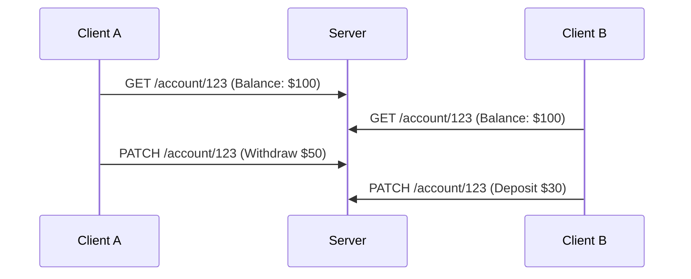

# **Debugging REST Gotchas: A Troubleshooting Guide**
*(For Senior Backend Engineers)*

REST APIs are a core part of modern software architecture, but their simplicity can hide subtle pitfalls. This guide focuses on **common REST anti-patterns ("gotchas")** that lead to subtle bugs, performance issues, and security vulnerabilities. We’ll break this down into **symptoms, root causes, fixes, debugging techniques, and prevention strategies** for quick resolution.

---

## **1. Symptom Checklist: When to Suspect REST Gotchas**
Before diving into fixes, confirm whether your issue aligns with these symptoms:

### **A. Performance & Reliability Issues**
- [ ] API responses are **unexpectedly slow** (e.g., random delays, timeouts).
- [ ] High **latency spikes** without obvious load changes.
- [ ] **Inconsistent responses** (e.g., `200 OK` vs. `500 Internal Server Error` for the same request).
- [ ] **Race conditions** causing data conflicts (e.g., duplicate entries, missing updates).
- [ ] **Resource exhaustion** (e.g., memory leaks, open connections piling up).

### **B. Data Integrity & Consistency Problems**
- [ ] **Idempotency failures** (e.g., `PATCH`/`PUT` not working as expected).
- [ ] **Partial updates** (e.g., `PATCH` leaves fields in an inconsistent state).
- [ ] **Race conditions on writes** (e.g., two clients modifying the same resource simultaneously).
- [ ] **Missing or stale data** (e.g., `GET` returns outdated records).

### **C. Security & Compliance Issues**
- [ ] **Unauthorized access** (e.g., APIs leak sensitive data via `GET`).
- [ ] **CORS misconfigurations** (e.g., frontend blocked by `Access-Control-Allow-Origin`).
- [ ] **CSRF vulnerabilities** (e.g., stateless APIs vulnerable to token hijacking).
- [ ] **Excessive logging** exposing PII (Personally Identifiable Information).

### **D. Behavioral & Standards Violations**
- [ ] **Non-idiomatic HTTP methods** (e.g., using `POST` for updates instead of `PUT`/`PATCH`).
- [ ] **Overuse of `POST` for non-idempotent operations** (violates REST principles).
- [ ] **Incorrect status codes** (e.g., `200` for errors, `404` for invalid inputs).
- [ ] **Missing or malformed headers** (e.g., `Content-Type`, `ETag`, `Last-Modified`).

### **E. Client-Side Issues**
- [ ] **Clients making incorrect assumptions** (e.g., assuming `GET` is safe for writes).
- [ ] **No proper error handling** (e.g., silent failures on `4xx/5xx`).
- [ ] **Missing retry logic** for idempotent operations.

---
## **2. Common REST Gotchas & Fixes (With Code Examples)**

### **Problem 1: Using `POST` for Idempotent Operations**
**Symptom:**
- Clients resend `POST` requests by mistake (e.g., during retries).
- Risk of **duplicate records** in the database.

**Example of the Problem:**
```http
POST /orders
{
  "customer_id": 123,
  "items": ["laptop"]
}
```
If retried, this creates **two identical orders**.

**Fix:**
Use **`PUT` for full updates** or **`PATCH` for partial updates**.
```http
PUT /orders/456
{
  "customer_id": 123,
  "items": ["laptop"]
}
```
**Or enforce idempotency keys:**
```http
POST /orders?Idempotency-Key=abc123
```
(Server checks for existing order with the same key.)

---

### **Problem 2: Missing Proper HTTP Status Codes**
**Symptom:**
- Clients get **`200 OK` even when an error occurs** (e.g., validation fails).
- **No clear distinction** between client errors (`4xx`) and server errors (`5xx`).

**Example of the Problem:**
```http
POST /users
{
  "email": "invalid-email"
}
```
Server returns `200` but silently fails to create the user.

**Fix:**
Use **standard HTTP status codes**:
- `400 Bad Request` → Invalid input.
- `409 Conflict` → Resource already exists.
- `500 Internal Server Error` → Server-side failure.

**Example Fix (Express.js):**
```javascript
app.post('/users', (req, res) => {
  const { email } = req.body;
  if (!isValidEmail(email)) {
    return res.status(400).json({ error: "Invalid email" });
  }
  // Proceed...
});
```

---

### **Problem 3: Race Conditions on Writes**
**Symptom:**
- Two clients **simultaneously modify the same resource**, leading to **data loss or corruption**.

**Example:**

If not handled, the final balance could be **$80 instead of $80** (or worse, **race condition bugs**).

**Fix:**
Use **optimistic concurrency control** (`ETag`/`If-Match`):
```http
PATCH /account/123
If-Match: "ABC123"  // Current ETag
{
  "balance": 50
}
```
If `ETag` doesn’t match, return `409 Conflict`.

**Example Fix (Flask):**
```python
from flask import request, abort

@app.patch('/account/<id>')
def update_account(id):
    account = get_account(id)
    if request.headers.get('If-Match') != account.etag:
        abort(409, "Conflict: Stale data")
    # Update balance...
    account.save()
```

---

### **Problem 4: Overusing `POST` for Non-Idempotent Operations**
**Symptom:**
- **Duplicate transactions** (e.g., payments, orders) if retried.
- **No way to recover** from failed operations.

**Fix:**
- **Idempotency keys** (as shown above).
- **Use `POST` only for truly non-idempotent actions** (e.g., `POST /payments`).
- **Log operations** for retries (e.g., "Payment ID: `abc123` already processed").

---

### **Problem 5: Improper CORS & Security Headers**
**Symptom:**
- Frontend blocked by **`Access-Control-Allow-Origin`** errors.
- **Sensitive data exposed** via `GET` endpoints.

**Fix:**
- **Explicitly set CORS headers**:
  ```http
  Access-Control-Allow-Origin: https://yourfrontend.com
  Access-Control-Allow-Methods: GET, POST, PUT, DELETE
  ```
- **Never expose sensitive data in `GET` parameters** (use `POST` with `Content-Type: application/json`).
- **Use `ETag`/`Last-Modified` for caching** to reduce bandwidth.

**Example Fix (Nginx):**
```nginx
location /api/ {
    add_header 'Access-Control-Allow-Origin' 'https://yourfrontend.com';
    add_header 'Access-Control-Allow-Methods' 'GET, POST, OPTIONS';
    add_header 'Access-Control-Allow-Headers' 'Authorization, Content-Type';
}
```

---

### **Problem 6: Missing Proper Error Handling & Retry Logic**
**Symptom:**
- Clients **silently fail** on `4xx`/`5xx` errors.
- **No retry mechanism** for transient failures (e.g., DB timeouts).

**Fix:**
- **Return detailed error responses**:
  ```json
  {
    "error": "ValidationFailed",
    "details": ["Email must be unique"]
  }
  ```
- **Use exponential backoff for retries**:
  ```javascript
  async function retryRequest(url, maxRetries = 3) {
    let retries = 0;
    while (retries < maxRetries) {
      try {
        const response = await fetch(url);
        if (response.status === 429) { // Rate limit
          await sleep(1000 * retries);
        } else if (!response.ok) {
          throw new Error(`HTTP error! ${response.status}`);
        }
        return await response.json();
      } catch (err) {
        retries++;
        if (retries === maxRetries) throw err;
      }
    }
  }
  ```

---

### **Problem 7: Improper Use of `GET` for Side Effects**
**Symptom:**
- Clients **assume `GET` is safe**, leading to unintended side effects (e.g., `GET /transfer?amount=100` deducts money).

**Fix:**
- **Never perform writes via `GET`**.
- Use `POST` for side effects (but ensure idempotency if needed).

**Bad Example (Avoid):**
```http
GET /transfer?from=123&to=456&amount=100
```
**Good Example:**
```http
POST /transfers
{
  "from": 123,
  "to": 456,
  "amount": 100,
  "idempotency_key": "xyz789"
}
```

---

### **Problem 8: Not Using Proper Content-Type & Headers**
**Symptom:**
- **Malformed requests** due to missing `Content-Type: application/json`.
- **Double-encoding issues** (e.g., URL-encoded JSON in `POST` bodies).

**Fix:**
- **Always specify `Content-Type`**:
  ```http
  POST /users
  Content-Type: application/json

  {
    "name": "John"
  }
  ```
- **Validate JSON structure** on the server.
- **Use `ETag`/`Last-Modified` for caching**.

**Example Fix (Express.js):**
```javascript
app.use(express.json({ strict: true })); // Enforces JSON parsing
```

---

## **3. Debugging Tools & Techniques**

| **Tool/Technique**       | **Purpose**                                                                 | **Example Use Case**                                  |
|--------------------------|-----------------------------------------------------------------------------|------------------------------------------------------|
| **Postman / curl**       | Test API endpoints with custom headers/body.                                 | Debugging `400 Bad Request` errors.                  |
| **HTTP Inspectors** (e.g., Chrome DevTools) | Log all API calls (headers, body, response).                          | Tracing race conditions.                              |
| **Logging (Structured)** | Track requests, errors, and performance.                                   | Debugging `500` errors with stack traces.            |
| **Distributed Tracing** (e.g., Jaeger, OpenTelemetry) | Trace requests across microservices.                              | Identifying latency bottlenecks.                   |
| **Load Testing** (e.g., k6, JMeter) | Simulate high traffic to find race conditions.                        | Testing `PATCH` under concurrent writes.           |
| **Database Transactions** | Rollback failed operations to maintain consistency.                      | Fixing duplicate order entries.                    |
| **ETag / If-Match**      | Prevent race conditions on writes.                                         | Optimistic concurrency control.                     |
| **Retry Policies**       | Handle transient failures gracefully.                                    | Retrying `POST /payments` on `503 Service Unavailable`. |
| **API Gateway (Kong, AWS API Gateway)** | Log, validate, and enforce security policies.                        | Enforcing CORS, rate limiting.                      |
| **Schema Validation** (e.g., Swagger/OpenAPI) | Catch malformed requests early.                                          | Rejecting invalid `PUT` payloads.                   |

---

## **4. Prevention Strategies**

### **A. Design-Time Checks**
✅ **Follow REST Principles Strictly**
- Use `GET` for reads, `POST` for creates, `PUT`/`PATCH` for updates.
- Avoid `POST` for idempotent operations unless idempotency keys are used.

✅ **Define a Clear API Contract (OpenAPI/Swagger)**
- Document **status codes, headers, and error formats**.
- Example:
  ```yaml
  /users/{id}:
    put:
      summary: Update user
      responses:
        200:
          description: Success
        400:
          description: Invalid input
  ```

✅ **Use Idempotency Keys for Critical Operations**
```http
POST /payments?Idempotency-Key=unique-id
```

### **B. Runtime Protections**
✅ **Implement Proper Caching Headers**
```http
Cache-Control: no-store  # For writes (POST, PUT, PATCH)
ETag: "ABC123"          # For reads (GET)
```

✅ **Rate Limiting & Throttling**
- Prevent abuse (e.g., `429 Too Many Requests`).
- Example (Express Rate-Limiter):
  ```javascript
  const rateLimit = require('express-rate-limit');
  app.use(rateLimit({
    windowMs: 15 * 60 * 1000, // 15 minutes
    max: 100 // limit each IP to 100 requests per window
  }));
  ```

✅ **Validate All Inputs on the Server**
- Never trust client-provided `GET`/`POST` data.
- Example (Zod validation):
  ```javascript
  const userSchema = z.object({
    email: z.string().email(),
    password: z.string().min(8)
  });
  const validatedData = userSchema.parse(req.body);
  ```

✅ **Use Optimistic Concurrency Control**
- Prevent race conditions on writes.
- Example (Django ORM):
  ```python
  from django.db.models import F
  def update_balance(user_id, new_balance):
      Update('accounts').filter(id=user_id).values({
          'balance': new_balance
      }).execute()
      # Django handles `UPDATE ... WHERE id = ? AND etag = ?`
  ```

### **C. Monitoring & Observability**
✅ **Log Everything (But Securely)**
- Log **timestamps, request/response, errors, and user IDs (anonymized)**.
- Example (Structured Logging in Python):
  ```python
  import json
  logger.error(
      json.dumps({
          "user_id": user_id,
          "action": "payment_failure",
          "error": str(e)
      })
  )
  ```

✅ **Set Up Alerts for Anomalies**
- Alert on:
  - High `4xx/5xx` error rates.
  - Sudden traffic spikes (DDoS risk).
  - Database lock contention.

✅ **Use Distributed Tracing**
- Tools: **Jaeger, OpenTelemetry, AWS X-Ray**.
- Helps identify **latency bottlenecks** across services.

---

## **5. Quick Debugging Checklist**
When an issue arises, follow this **step-by-step debug flow**:

1. **Reproduce the Issue**
   - Can you **consistently trigger** the bug? (e.g., race condition on `PATCH`.)
   - Does it happen **only under load**? (Use **load testing**.)

2. **Check Logs & Metrics**
   - Are there **error logs** (`500`, `400`)?
   - Is the **database locking** or **memory bloated**?

3. **Inspect API Requests/Responses**
   - Use **Postman/curl** to manually test endpoints.
   - Check **headers** (`ETag`, `If-Match`, `Content-Type`).

4. **Enable Tracing**
   - Use **OpenTelemetry** to trace the request flow.
   - Look for **unexpected delays** in DB calls.

5. **Test for Race Conditions**
   - Simulate **concurrent writes** (e.g., two clients updating same record).
   - Verify **optimistic locking** (`ETag`/`If-Match`) works.

6. **Validate Schema & Inputs**
   - Are **request/response formats** correct?
   - Are **validation rules** properly enforced?

7. **Check Security Headers & CORS**
   - Are **`Access-Control-Allow-Origin`** misconfigured?
   - Are **sensitive fields** exposed in `GET`?

8. **Review Retry Logic**
   - Does the client **retry on `429`/`503`** correctly?
   - Are **idempotency keys** enforced?

9. **Isolate the Problem**
   - Is it a **client-side** issue (e.g., wrong `Content-Type`)?
   - Or a **server-side** issue (e.g., DB constraint violation)?

10. **Fix & Verify**
    - Apply the **smallest possible change** (e.g., fix `400` → `409`).
    - **Test in staging** before production.

---

## **6. Final Recommendations**
| **Area**               | **Best Practice**                                                                 |
|------------------------|----------------------------------------------------------------------------------|
| **Idempotency**        | Always use **`PUT`/`PATCH` for updates**, `POST` for non-idempotent ops.         |
| **Error Handling**     | Return **standard HTTP status codes** (`400`, `409`, `500`).                     |
| **Concurrency**        | Use **`ETag`/`If-Match` for optimistic locking**.                                |
| **Security**           | **Never expose PII in `GET`**, enforce **CORS**, and use **HTTPS**.              |
| **Logging**            | Log **structured, anonymized data** with **correlation IDs**.                   |
| **Testing**            | **Load test** critical endpoints (e.g., `/payments`).                           |
| **Monitoring**         | Set up **alerts for `4xx/5xx` spikes** and **database locks**.                  |

---

### **Key Takeaways**
- **REST is simple, but misuse leads to subtle bugs.**
- **Always follow HTTP semantics** (`GET` for reads, `POST` for creates, etc.).
- **Race conditions are the #1 killer of REST APIs** → Use **optimistic locking**.
- **Security