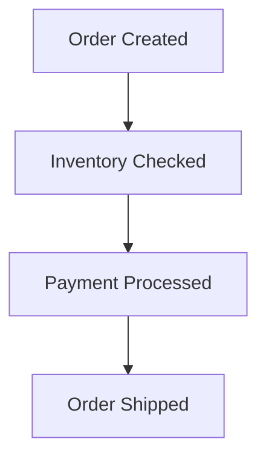

# **Debugging Scaling Integration: A Practical Troubleshooting Guide**

## **Introduction**
The **Scaling Integration** pattern addresses the challenge of managing high-throughput, distributed systems where multiple services or components need to interact efficiently at scale. Common use cases include microservices communication, event-driven architectures, and distributed data pipelines.

When issues arise—such as slow response times, failed transactions, or cascading failures—debugging can be complex due to the distributed nature of the system. This guide provides a structured approach to identifying and resolving scaling integration problems.

---

## **1. Symptom Checklist**
Before diving into debugging, confirm the presence of these symptoms:

| **Symptom**                          | **Description**                                                                 | **Possible Causes**                                                                 |
|---------------------------------------|---------------------------------------------------------------------------------|------------------------------------------------------------------------------------|
| High latency in inter-service calls   | API/RPC calls between services taking >200ms (adjust threshold as needed)        | Network congestion, throttling, insufficient scaling, or slow downstream services |
| Transaction failures / retries       | Increased error rates (e.g., `5xx`, timeouts) or excessive retry loops         | Database bottlenecks, deadlocks, or misconfigured retry policies                   |
| Data inconsistency across services   | Inconsistent state between services (e.g., unprocessed messages, stale data)  | Event sourcing errors, duplicate processing, or failed event deliveries          |
| API Gateway overload                 | Gateway 503/429 errors or slow response times                                    | Throttling limits, insufficient backend scaling, or malformed requests           |
| Resource exhaustion (CPU/Memory/Disk) | Services crashing due to high resource usage                                     | Unoptimized batch processing, memory leaks, or inefficient queries                 |
| Slow ingestion of events/data        | Events or messages queuing up in pub/sub systems or databases                   | Slow consumers, backpressure issues, or throttled producers                       |

If any of these are observed, proceed to diagnosis.

---

## **2. Common Issues and Fixes**
### **2.1 Slow Inter-Service Communication**
**Symptoms:**
- API calls between services taking >500ms (threshold varies by use case).
- Timeouts (`ETIMEDOUT`, `ECONNRESET`).

**Root Causes:**
- **Network latency:** Services communicating over public IPs or cross-AZ/DC boundaries.
- **Throttling:** API Gateway or service quotas not adjusted for traffic spikes.
- **Unoptimized payloads:** Large JSON/XML payloads or inefficient serialization (e.g., Protobuf vs. JSON).
- **No circuit breakers:** Cascading failures due to unchecked downstream calls.

**Fixes:**
#### **A. Reduce Latency**
- **Use internal networking:** Deploy services in the same VPC/subnet or use service meshes (Istio, Linkerd).
- **Enable connection pooling:** Reuse HTTP/TCP connections (e.g., `maxConnections` in `gRPC`/`HTTP` clients).
- **Optimize payloads:** Switch to binary formats (Protobuf, Avro) and compress data.

**Example (gRPC Connection Pooling in Node.js):**
```javascript
const client = new grpc.Client({
  target: 'my-service:50051',
  credentials: grpc.credentials.createInsecure(),
  'grpc.max_receive_message_length': -1, // Disable size limits (if needed)
  'grpc.keepalive_time_ms': 30000,       // Keep connections alive
  'grpc.keepalive_timeout_ms': 5000,
  'grpc.http2.min_time_between_pings_ms': 10000
});
```

#### **B. Implement Throttling & Circuit Breakers**
- Use **Hystrix**, **Resilience4j**, or **gRPC retries with fallback**:
```java
// Spring Boot with Resilience4j (circuit breaker)
@Retry(name = "serviceRetry", maxAttempts = 3)
@CircuitBreaker(name = "serviceCircuit", fallbackMethod = "fallbackResponse")
public String callExternalService() {
    return restTemplate.getForObject("http://external-service/api", String.class);
}

public String fallbackResponse(Exception e) {
    return "Fallback response from cache";
}
```

#### **C. Monitor End-to-End Latency**
- Use **distributed tracing** (Jaeger, Zipkin) to identify bottlenecks.
- Set up **SLOs** (Service Level Objectives) for key transactions.

---

### **2.2 Transaction Failures & Retries**
**Symptoms:**
- Increased `408 Request Timeout`, `504 Gateway Timeout`, or `429 Too Many Requests`.
- Logs show repeated retries with no success.

**Root Causes:**
- **Database timeouts:** Long-running queries blocking transactions.
- **No idempotency:** Duplicate processing due to retries.
- **Retry storms:** Exponential backoff misconfigured, leading to cascading failures.

**Fixes:**
#### **A. Optimize Database Transactions**
- **Use connection pooling** (HikariCP, PgBouncer).
- **Split large transactions:** Break into smaller atomic operations.
- **Add indexes:** Improve query performance for joined tables.

**Example (PostgreSQL Connection Pooling):**
```java
// HikariCP configuration (Java)
HikariConfig config = new HikariConfig();
config.setJdbcUrl("jdbc:postgresql://db:5432/mydb");
config.setMaximumPoolSize(20);
config.setConnectionTimeout(30000);
config.setIdleTimeout(600000);
config.addDataSourceProperty("prepStmtCacheSize", "250");
config.addDataSourceProperty("prepStmtCacheSqlLimit", "2048");
```

#### **B. Implement Idempotency**
- Use **idempotency keys** (UUIDs) to avoid duplicate processing.
- Example (REST API with idempotency):
```python
# Flask example with Redis-backed idempotency
from flask import request
import uuid
import redis

r = redis.Redis()

def enforce_idempotency():
    idempotency_key = request.headers.get('Idempotency-Key')
    if idempotency_key:
        if r.exists(idempotency_key):
            return "Already processed", 200
        r.setex(idempotency_key, 3600, "processed")  # Cache for 1 hour
```

#### **C. Configure Retry Policies Properly**
- Use **exponential backoff** with jitter:
```yaml
# Resilience4j retry config (application.yml)
resilience4j.retry:
  instances:
    serviceRetry:
      maxAttempts: 3
      waitDuration: 100ms
      exponentialBackoffMultiplier: 2
      enableExponentialBackoff: true
      randomizeSuccessThreshold: true
```

---

### **2.3 Data Inconsistency**
**Symptoms:**
- Event sourcing events not processed in order.
- Database replicas desynchronized.

**Root Causes:**
- **No exactly-once delivery:** Duplicates or missing events in pub/sub.
- **Eventual consistency misconfigured:** Too slow for business needs.
- **Manual transactions:** Missing ACID guarantees in distributed writes.

**Fixes:**
#### **A. Ensure Exactly-Once Processing**
- Use **transactional outbox pattern** (Kafka + DB transactions).
- Example (Kafka + PostgreSQL transaction):
```java
// Spring Boot with Kafka Transactional Producer
@Bean
ProducerFactory<String, String> producerFactory() {
    Map<String, Object> config = new HashMap<>();
    config.put(ProducerConfig.BOOTSTRAP_SERVERS_CONFIG, "kafka:9092");
    config.put(ProducerConfig.KEY_SERIALIZER_CLASS_CONFIG, StringSerializer.class);
    config.put(ProducerConfig.VALUE_SERIALIZER_CLASS_CONFIG, StringSerializer.class);
    config.put(ProducerConfig.TRANSACTIONAL_ID_CONFIG, "txn-producer");
    return new KafkaProducerFactory<>(config);
}

@Service
public class OrderService {
    @Transactional
    public void createOrder(Order order) {
        orderRepository.save(order);
        producer.send(new ProducerRecord<>("orders", order.getId(), order.toJson()))
                .addCallback(
                    (metadata, exception) -> {
                        if (exception != null) {
                            // Rollback DB transaction if send fails
                            throw new RuntimeException("Failed to send event");
                        }
                    }
                );
    }
}
```

#### **B. Use Causal Consistency**
- **Sagas pattern** for long-running transactions:


#### **C. Monitor Event Processing**
- **Kafka lag metrics:** Track consumer lag (`__consumer_offsets` topic).
- **Dead-letter queues (DLQ):** Route failed events to a side queue for reprocessing.

---

### **2.4 API Gateway Overload**
**Symptoms:**
- `503 Service Unavailable` or `429 Too Many Requests`.
- High latency in gateway responses.

**Root Causes:**
- **No rate limiting:** Sudden traffic spikes overwhelming backends.
- **No caching:** Repeated calls to expensive downstream services.
- **Unoptimized routing:** Complex rules slowing down request processing.

**Fixes:**
#### **A. Implement Rate Limiting**
- Use **NGINX**, **Envoy**, or **Spring Cloud Gateway** with rate limiting:
```yaml
# Spring Cloud Gateway rate limiting
spring:
  cloud:
    gateway:
      routes:
        - id: service-a
          uri: http://service-a:8080
          predicates:
            - Path=/api/a/**
          filters:
            - name: RequestRateLimiter
              args:
                redis-rate-limiter.replenishRate: 10
                redis-rate-limiter.burstCapacity: 20
```

#### **B. Enable Caching**
- **Cache responses** (Redis, CDN):
```java
// Spring Cache example
@Cacheable(value = "serviceB", key = "#id")
public String getServiceBData(String id) {
    // Fetch from downstream service
}
```

#### **C. Optimize Routing Logic**
- **Use path-based routing** instead of regex where possible.
- **Offload auth** to a dedicated service (e.g., Auth0, AWS Cognito).

---

### **2.5 Resource Exhaustion**
**Symptoms:**
- **OutOfMemoryError**, **ThreadPool exhausted**, or **disk full**.
- Slow garbage collection pauses.

**Root Causes:**
- **Memory leaks:** Unclosed connections, cached data not evicted.
- **Unbounded batch processing:** Infinite loops in consumers.
- **No auto-scaling:** Manual scaling lagging behind traffic.

**Fixes:**
#### **A. Monitor Resource Usage**
- **Metrics:** Prometheus + Grafana for CPU, memory, disk, and throughput.
- **Logs:** Check for unclosed resources (e.g., DB connections, HTTP clients).

#### **B. Fix Memory Leaks**
- **Use weak references** for caching:
```java
import java.lang.ref.WeakReference;
Map<String, WeakReference<Object>> cache = new HashMap<>();
```
- **Enable G1GC** (better for large heaps):
```java
-XX:+UseG1GC
-XX:MaxGCPauseMillis=200
```

#### **C. Optimize Batch Processing**
- **Limit batch size** in consumers (e.g., Kafka `fetch.max.bytes`).
- **Use async processing** to avoid blocking threads:
```java
// Spring Kafka async consumer
@KafkaListener(topics = "orders")
public CompletableFuture<Void> processOrder(String order) {
    return CompletableFuture.runAsync(() -> {
        // Process order in a separate thread
    });
}
```

#### **D. Auto-Scaling Config**
- **Cloud:** Use **Kubernetes HPA**, **AWS Auto Scaling**, or **ECS Scaling**.
- **On-prem:** Use **prometheus-operator** + **kube-autoscaler**.

---

## **3. Debugging Tools and Techniques**
| **Tool/Technique**       | **Purpose**                                                                 | **Example Use Case**                                  |
|--------------------------|-----------------------------------------------------------------------------|------------------------------------------------------|
| **Distributed Tracing**  | Track requests across services (latency, dependencies).                     | Identify slow gRPC calls between services.           |
| **APM (AppDynamics, Datadog)** | Monitor transaction flows, errors, and performance.                     | Detect cascading failures in a microservice.         |
| **Database Profiling**   | Analyze slow queries (EXPLAIN, slow query logs).                       | Optimize a stuck transaction in PostgreSQL.          |
| **Load Testing (Locust, Gatling)** | Simulate traffic to find bottlenecks.                                 | Validate scaling before production.                   |
| **Chaos Engineering (Gremlin, Chaos Mesh)** | Inject failures to test resilience.                                      | Test circuit breaker behavior under high load.        |
| **Logging Correlation IDs** | Trace a single request across services.                              | Debug a failed order processing flow.                 |
| **Metrics (Prometheus, Datadog)** | Track CPU, memory, latency, error rates.                             | Alert on high Kafka consumer lag.                    |
| **Heap Dumps (VisualVM, Eclipse MAT)** | Analyze memory leaks.                                                  | Find why a service is leaking connections.           |
| **Network Analysis (Wireshark, tcpdump)** | Inspect HTTP/gRPC traffic.                                           | Debug throttling or malformed requests.              |

**Example Tracing Setup (Jaeger + OpenTelemetry):**
```java
// Spring Boot + OpenTelemetry
@Bean
OpenTelemetry autoConfigureOpenTelemetry(OpenTelemetrySdkBuilder openTelemetrySdkBuilder) {
    return OpenTelemetry.noop();
}

// Configure in application.yml
opentelemetry:
  tracing:
    sampler: parentbased_always_on
    endpoint: http://jaeger:14268/api/traces
```

---

## **4. Prevention Strategies**
### **4.1 Design for Scalability Early**
- **Decouple services:** Use pub/sub (Kafka, RabbitMQ) instead of direct calls.
- **Stateless services:** Minimize session state to allow horizontal scaling.
- **Batch processing:** Process events in bulk where possible.

### **4.2 Automate Monitoring & Alerts**
- **SLO-based alerts:** Alert only when SLOs are violated (e.g., 99th percentile latency > 500ms).
- **Log aggregation:** Centralize logs (ELK, Loki) for easy debugging.
- **Synthetic monitoring:** Simulate user flows to detect outages early.

### **4.3 Test Scaling Before Production**
- **Load test:** Simulate 10x traffic with Locust/Gatling.
- **Chaos testing:** Randomly kill nodes to test resilience.
- **Canary deployments:** Gradually roll out changes to detect issues early.

### **4.4 Optimize for Performance**
- **Database:** Regularly optimize queries, add indexes, and use read replicas.
- **Caching:** Cache frequent queries (Redis, CDN).
- **Connection pooling:** Reuse DB/HTTP connections to reduce overhead.

### **4.5 Document Scaling Decisions**
- **Runbooks:** Document how to scale during incidents.
- **Architecture diagrams:** Show service dependencies for quick debugging.
- **Postmortems:** Analyze failures and update runbooks.

---

## **5. Step-by-Step Debugging Workflow**
When a scaling issue arises, follow this structured approach:

1. **Reproduce the Issue**
   - Check logs (centralized or service-specific).
   - Use load testing to simulate the problem.

2. **Identify the Hot Path**
   - Use tracing to see which services are slowest.
   - Check metrics for spikes in latency/errors.

3. **Isolate the Bottleneck**
   - Is it **network** (latency, throttling)?
   - **Database** (timeouts, slow queries)?
   - **Code** (unoptimized loops, memory leaks)?

4. **Apply Fixes**
   - Apply the fixes from **Section 2** based on the root cause.
   - Start with the least invasive changes (e.g., tuning vs. code changes).

5. **Validate & Monitor**
   - Verify the fix resolves the issue (metrics, logs).
   - Set up alerts to catch regressions.

6. **Prevent Recurrence**
   - Update runbooks, tests, and scaling policies.

---

## **6. Example Debugging Scenario**
**Problem:** API Gateway is returning `503` under heavy load, and downstream services are underutilized.

### **Debugging Steps:**
1. **Check Gateway Logs**
   - High `ERROR` logs for `ConnectionPoolExhausted` → **Likely cause:** Connection pooling exhausted.
2. **Monitor Metrics**
   - Prometheus shows `http_server_requests_in_flight` spiking → **Likely cause:** Too few connections.
3. **Optimize Gateway**
   - Increase connection pool size in Envoy/NGINX.
   - Enable **circuit breaking** for downstream services.
4. **Validate**
   - After changes, `503` errors drop, and CPU usage stabilizes.
5. **Prevent Future Issues**
   - Set up auto-scaling for the gateway.
   - Add **rate limiting** to prevent future overloads.

---

## **7. Key Takeaways**
| **Issue Type**          | **Quick Fix**                          | **Long-Term Solution**                     |
|--------------------------|----------------------------------------|--------------------------------------------|
| Slow inter-service calls | Enable connection pooling              | Use service mesh (Istio)                   |
| Transaction failures     | Optimize DB queries                    | Implement sagas or compensating actions     |
| Data inconsistency       | Use transactional outbox              | Adopt eventual consistency with causal IDs |
| API Gateway overload     | Enable rate limiting                   | Auto-scale gateway + caching               |
| Resource exhaustion      | Increase heap size                     | Use async processing + auto-scaling        |

---

## **8. Further Reading**
- [Google’s "Site Reliability Engineering" Book](https://sre.google/sre-book/)
- [Kafka’s Exactly-Once Semantics Docs](https://kafka.apache.org/documentation/#exactly_once)
- [Resilience4j Documentation](https://resilience4j.readme.io/docs)
- [Istio Service Mesh](https://istio.io/latest/docs/)

---
This guide provides a **practical, actionable** approach to debugging scaling integration issues. Start with **symptom isolation**, apply **proven fixes**, and **prevent recurrence** with monitoring and testing.