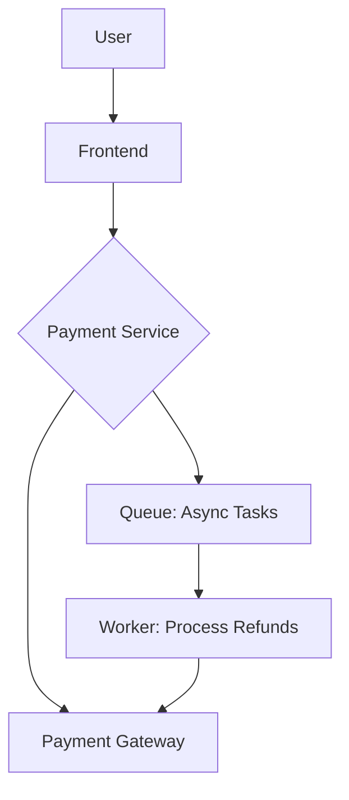

# **Debugging Payment Processing Patterns: A Troubleshooting Guide**

## **1. Introduction**
Payment processing is a critical component of any e-commerce, financial, or SaaS application. Poorly implemented payment processing patterns can lead to fraud, failed transactions, security breaches, or compliance violations. This guide provides a structured approach to diagnosing, resolving, and preventing common payment processing issues.

---

## **2. Symptom Checklist**
Before diving into debugging, identify which of these symptoms align with your issue:

| **Symptom** | **Description** | **Possible Causes** |
|-------------|----------------|---------------------|
| **Failed transactions** | Payments repeatedly fail without clear error messages. | Network issues, API timeouts, insufficient funds, misconfigured APIs. |
| **Duplicate charges** | Customers are charged multiple times for the same transaction. | Idempotency key mismanagement, race conditions, or unhandled retries. |
| **Refund failures** | Refunds are rejected or stuck in pending status. | Payment gateway limits, insufficient balance, or incorrect refund logic. |
| **Fraudulent transactions** | Unauthorized transactions are approved. | Weak fraud detection, insufficient validation, or bypassed security checks. |
| **Delayed confirmations** | Payments take longer than expected to process. | Gateway latency, manual review triggers, or asynchronous processing delays. |
| **API errors** | Payment gateway returns cryptic or unstructured errors. | Misconfigured API keys, rate limits, or malformed requests. |
| **Compliance violations** | PCI DSS, GDPR, or other regulatory warnings appear. | Poor logging, insecure storage, or missing encryption. |
| **Micropayment failures** | Small payments (e.g., subscriptions) repeatedly fail. | Sticky sessions, IP restrictions, or gateway rate limits. |
| **Lack of transaction history** | Payment records are missing or corrupted. | Database failures, improper logging, or API response parsing errors. |
| **Currency conversion issues** | Payments fail when switching currencies. | Incorrect exchange rate APIs, time zone mismatches, or unsupported currencies. |

---

## **3. Common Issues & Fixes (With Code Examples)**

### **3.1 Failed Transactions**
#### **Issue:**
Payments fail with generic errors like `502 Bad Gateway` or `429 Too Many Requests`.

#### **Root Causes:**
- **Network issues** (proxy, firewall, or gateway downtime).
- **API rate limits** (exceeded request limits).
- **Invalid request payload** (missing fields, wrong format).
- **Insufficient funds** (bank/credit card declined).

#### **Debugging Steps & Fixes:**
```javascript
// Check request structure before sending
const paymentRequest = {
  amount: 100.00,
  currency: "USD",
  transactionId: generateIdempotencyKey(), // Ensures uniqueness
  customerId: "cust_12345",
  paymentMethod: {
    type: "card",
    token: "tok_secure_token"
  }
};

// Example: Validate request before API call
function validateRequest(request) {
  if (!request.amount || !request.currency || !request.transactionId) {
    throw new Error("Missing required fields");
  }
  return true;
}

validateRequest(paymentRequest); // Throw error if invalid
```

**Solutions:**
- **Verify API rate limits** (check gateway documentation).
- **Implement exponential backoff** for retries:
  ```javascript
  const retryRequest = async (url, retries = 3) => {
    try {
      const response = await fetch(url);
      if (!response.ok) throw new Error(`HTTP ${response.status}`);
      return response.json();
    } catch (error) {
      if (retries > 0 && error.message.includes("429")) {
        await new Promise(res => setTimeout(res, 1000 * Math.pow(2, 3 - retries)));
        return retryRequest(url, retries - 1);
      }
      throw error;
    }
  };
  ```
- **Log network latency** to identify slow gateways:
  ```javascript
  const startTime = Date.now();
  const response = await fetch(url, { timeout: 5000 });
  const endTime = Date.now();
  console.log(`Request took ${endTime - startTime}ms`);
  ```

---

### **3.2 Duplicate Charges**
#### **Issue:**
A customer is charged twice for the same order.

#### **Root Causes:**
- **Missing idempotency keys** (duplicate request handling).
- **Race conditions** in concurrent payment attempts.
- **Retry logic without deduplication**.

#### **Debugging Steps & Fixes:**
```javascript
// Use idempotency keys to prevent duplicates
const paymentService = {
  async charge(customerId, amount) {
    const idempotencyKey = generateIdempotencyKey(); // UUIDv4
    const cache = new Map(); // In-memory cache (use Redis in production)

    if (cache.has(idempotencyKey)) {
      throw new Error("Duplicate charge detected");
    }

    cache.set(idempotencyKey, true); // Prevents retries

    return await fetchGateway("charge", {
      customerId,
      amount,
      idempotencyKey
    });
  }
};
```
**Solutions:**
- **Store idempotency keys in Redis** (distributed cache):
  ```javascript
  const client = redis.createClient();
  await client.connect();

  // Before charging
  const key = `payment:${generateIdempotencyKey()}`;
  const result = await client.set(key, "1", { EX: 3600 }); // Expires in 1h

  if (result) {
    throw new Error("Duplicate detected");
  }
  ```
- **Use database transactions** for deduplication:
  ```sql
  -- SQL example (PostgreSQL)
  INSERT INTO payments (customer_id, amount, status)
  VALUES ($1, $2, 'pending')
  ON CONFLICT (customer_id, amount) DO NOTHING;
  ```

---

### **3.3 Refund Failures**
#### **Issue:**
Refunds are rejected with `400 Bad Request` or stuck in `pending`.

#### **Root Causes:**
- **Refunding an already refunded transaction**.
- **Insufficient funds in gateway account**.
- **Incorrect refund amount** (partial vs. full).
- **Manual review required** (some gateways flag refunds).

#### **Debugging Steps & Fixes:**
```javascript
// Check refund eligibility before processing
async function canRefund(transactionId) {
  const txn = await fetchGateway(`transactions/${transactionId}`);
  if (txn.status !== "succeeded" || txn.amountRefunded >= txn.amount) {
    throw new Error("Refund not allowed");
  }
  return true;
}

async function refundTransaction(transactionId, amount) {
  if (!await canRefund(transactionId)) {
    throw new Error("Invalid refund attempt");
  }
  return await fetchGateway("refunds", {
    transactionId,
    amount
  });
}
```
**Solutions:**
- **Log refund reasons** for auditing:
  ```javascript
  const refundLog = {
    transactionId,
    amount,
    reason: "customer_request",
    status: "pending",
    timestamp: new Date()
  };
  await db.logRefund(refundLog);
  ```
- **Set up webhooks** to monitor refund status:
  ```javascript
  // Example webhook handler (Express.js)
  app.post("/webhooks/refund_status", (req, res) => {
    const { status, transactionId } = req.body;
    if (status === "failed") {
      console.error(`Refund failed for ${transactionId}`);
      // Notify admin or retry logic
    }
    res.status(200).send("OK");
  });
  ```

---

### **3.4 Fraudulent Transactions**
#### **Issue:**
Unauthorized transactions slip through.

#### **Root Causes:**
- **Lack of fraud detection rules** (e.g., velocity checks).
- **Bypassed 3D Secure (3DS) authentication**.
- **Weak IP/device fingerprinting**.

#### **Debugging Steps & Fixes:**
```javascript
// Example fraud detection middleware
function isFraudulent(req) {
  const { ip, customer } = req;
  const recentTxns = db.getRecentTransactions(ip);

  // Rule 1: Too many transactions from same IP
  if (recentTxns.length > 5) return true;

  // Rule 2: Unusual amount spike
  const avg = recentTxns.reduce((a, b) => a + b.amount, 0) / recentTxns.length;
  if (req.amount > avg * 5) return true;

  return false;
}

app.post("/pay", (req, res) => {
  if (isFraudulent(req)) {
    return res.status(403).send("Fraud detected");
  }
  // Proceed with payment
});
```
**Solutions:**
- **Integrate third-party fraud tools** (e.g., Signifyd, Riskified).
- **Enforce 3DS for high-risk transactions**:
  ```javascript
  async function perform3DS(txn) {
    const authUrl = await gateway.createAuthUrl(txn);
    // Redirect user to authUrl
    // After redirect, verify response
    const verification = await gateway.verifyAuth(req.query);
    return verification.isApproved;
  }
  ```
- **Block known malicious IPs/ASNs**:
  ```javascript
  const blockedIPs = new Set(["123.45.67.89", "192.168.1.0/24"]);
  if (blockedIPs.has(req.ip)) {
    return res.status(403).send("Access denied");
  }
  ```

---

### **3.5 Delayed Confirmations**
#### **Issue:**
Payments take hours/days to confirm.

#### **Root Causes:**
- **Asynchronous processing delays** (gateway side).
- **Manual review triggers** (fraud checks).
- **Sticky sessions** (gateway requires re-authentication).

#### **Debugging Steps & Fixes:**
```javascript
// Poll for status updates if immediate confirmation fails
async function waitForConfirmation(transactionId, maxRetries = 10) {
  for (let i = 0; i < maxRetries; i++) {
    const status = await fetchGateway(`transactions/${transactionId}`);
    if (status === "succeeded") return status;
    await new Promise(res => setTimeout(res, 5000)); // Wait 5s
  }
  throw new Error("Timeout: Transaction not confirmed");
}
```
**Solutions:**
- **Set up webhooks** for real-time updates:
  ```javascript
  // Example Stripe webhook listener
  app.post("/webhooks/stripe", (req, res) => {
    const event = req.body;
    if (event.type === "payment_intent.succeeded") {
      updateTransactionStatus(event.data.object.id, "confirmed");
    }
    res.status(200).send("OK");
  });
  ```
- **Enable auto-capture for subscriptions**:
  ```javascript
  // Stripe example
  const customer = await stripe.customers.create({ ... });
  const paymentIntent = await stripe.paymentIntents.create({
    customer,
    amount: 1000,
    currency: "usd",
    confirm: true,
    capture_method: "automatic"
  });
  ```

---

### **3.6 API Errors**
#### **Issue:**
Gateway returns unclear errors (e.g., `{"error":{"type":"unknown"}}`).

#### **Root Causes:**
- **Misconfigured API keys**.
- **Malformed request/response parsing**.
- **Gateway-specific error handling missing**.

#### **Debugging Steps & Fixes:**
```javascript
// Structured error parsing
async function fetchGateway(endpoint, payload) {
  try {
    const response = await fetch(`https://api.gateway.com/${endpoint}`, {
      method: "POST",
      headers: { "Authorization": `Bearer ${process.env.API_KEY}` },
      body: JSON.stringify(payload)
    });
    const data = await response.json();

    if (!response.ok) {
      // Custom error mapping
      const errorMap = {
        "invalid_request": new Error("Invalid payload format"),
        "insufficient_funds": new Error("Payment declined")
      };
      throw errorMap[data.error?.type] || new Error(`Gateway error: ${JSON.stringify(data)}`);
    }
    return data;
  } catch (error) {
    console.error("API Error:", error.message);
    throw error;
  }
}
```
**Solutions:**
- **Validate API keys** in logs:
  ```javascript
  console.log("API Key Prefix:", process.env.API_KEY?.substring(0, 4) + "****");
  ```
- **Use retry policies with jitter** (avoid thundering herds):
  ```javascript
  const retryWithJitter = async (fn, retries = 3) => {
    let delay = 1000;
    for (let i = 0; i < retries; i++) {
      try {
        return await fn();
      } catch (error) {
        if (i === retries - 1) throw error;
        const jitter = Math.random() * delay;
        await new Promise(res => setTimeout(res, delay + jitter));
      }
    }
  };
  ```

---

### **3.7 Compliance Violations**
#### **Issue:**
PCI DSS/GDPR warnings appear in security scans.

#### **Root Causes:**
- **Sensitive data stored in logs**.
- **No encryption for payment tokens**.
- **Lack of tokenization**.

#### **Debugging Steps & Fixes:**
```javascript
// Example: Never log full payment details
function sanitizePaymentData(payment) {
  const { cardLastFour, customerId, ...rest } = payment;
  return { ...rest, cardLastFour };
}

// Log sanitized data only
console.log("Sanitized payment:", sanitizePaymentData(payment));
```
**Solutions:**
- **Use tokenization** (never store raw card data):
  ```javascript
  // Stripe example
  const token = await stripe.token.create({
    card: {
      number: "4242424242424242",
      exp_month: 12,
      exp_year: 2025,
      cvc: "123"
    }
  });
  // Store only `token.id` in DB
  ```
- **Rotate API keys regularly**:
  ```bash
  # Generate a new key (example for Stripe CLI)
  stripe api-key -k $NEW_KEY
  ```
- **Enable PCI-compliant logging**:
  ```javascript
  const pino = require("pino")({
    level: "info",
    customLevel: (label) => label === "sensitive" ? "silent" : label
  });
  pino.info({ sensitiveData: "***REDACTED***" }); // Won't log sensitive data
  ```

---

## **4. Debugging Tools & Techniques**

| **Tool/Technique** | **Purpose** | **Example Use Case** |
|--------------------|------------|----------------------|
| **Postman/Newman** | Test API endpoints with saved collections. | Verify payment gateway responses under load. |
| **Redis Insight** | Monitor idempotency key cache. | Check for duplicate payment attempts. |
| **Stripe CLI** | Debug Stripe events locally. | Test webhook handling without live traffic. |
| **Prometheus + Grafana** | Track payment latency/metrics. | Detect slow transactions in real time. |
| **pcs (PCI Compliance Scanner)** | Audit for PCI DSS violations. | Scan for sensitive data leaks. |
| **Sentry** | Error tracking for payment failures. | Catch unhandled API errors. |
| **Charles Proxy** | Inspect HTTPS traffic. | Debug malformed gateway requests. |
| **Kubernetes Debug Pods** | Inspect container logs in cloud envs. | Troubleshoot payment service crashes. |
| **Chaos Engineering (Gremlin)** | Test system resilience. | Simulate gateway outages for failover testing. |
| **Custom Logging Middleware** | Log request/response payloads. | Debug API payload formatting issues. |

**Example Debugging Workflow:**
1. **Reproduce the issue** → Use Postman to send the failing request.
2. **Inspect logs** → Check Sentry/CloudWatch for stack traces.
3. **Monitor dependencies** → Use Prometheus to see if the gateway is slow.
4. **Test with test data** → Use Stripe CLI to simulate a successful payment.

---

## **5. Prevention Strategies**

### **5.1 Architectural Best Practices**
- **Separate payment service** from your main app (microservice).
- **Use a queue (Kafka/RabbitMQ)** for async payment processing.
- **Implement circuit breakers** (e.g., Hystrix) to avoid gateway cascading failures.
- **Design for idempotency** (all payment endpoints should be retriable).



### **5.2 Coding Standards**
- **Validate all inputs** (amount, currency, customerId).
- **Use type safety** (TypeScript, struct validation in Go).
- **Log audit trails** (who, what, when, status).
- **Follow the principle of least privilege** (restrict API keys).

```typescript
// Example validation with Zod
import { z } from "zod";

const paymentSchema = z.object({
  amount: z.number().positive(),
  currency: z.enum(["USD", "EUR", "GBP"]),
  customerId: z.string().uuid()
});

// Usage
const validatedData = paymentSchema.parse(rawInput);
```

### **5.3 Security Hardening**
- **Tokenize payment data** (never store raw cards).
- **Rate-limit API endpoints** (e.g., 3 attempts per minute).
- **Enable 3D Secure for high-risk transactions**.
- **Rotate API keys** every 90 days.

### **5.4 Monitoring & Alerts**
- **Set up dashboards** for:
  - Transaction success/failure rates.
  - Latency percentiles (P99).
  - Fraud detection alerts.
- **Alert on anomalies** (e.g., sudden spike in failures).
- **Test failover** (simulate gateway downtime).

**Example Alert Rules:**
| **Metric** | **Threshold** | **Action** |
|------------|--------------|------------|
| Failure rate > 5%