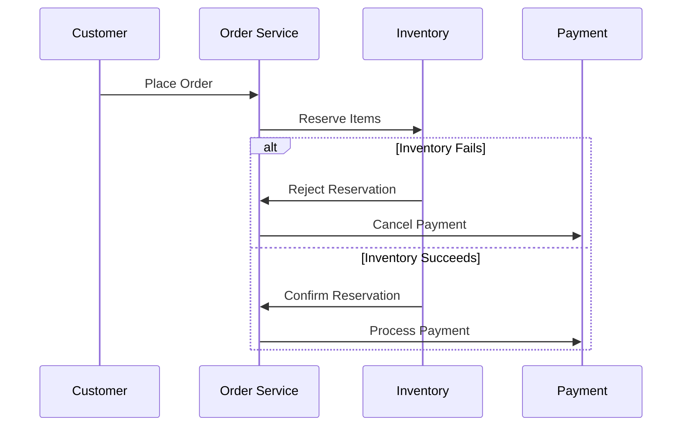

```markdown
# **ACID vs BASE: Choosing the Right Transaction Model for Your Distributed System**

*When databases reach beyond a single node, ACID transactions—once a reliable solution—quickly become a bottleneck. BASE, born from the CAP theorem, offers autonomy at the cost of eventual consistency. But how do you choose? And how do you implement both effectively?*

As backend engineers, we’ve all faced the painful tradeoff: **strong consistency with limited scalability (ACID)** or **scalability with eventual consistency (BASE)**. This isn’t just a theoretical dilemma; it shapes how we architect payment systems, inventory platforms, or even social media feeds.

This tutorial dives into **ACID vs. BASE**, dissects their strengths and weaknesses, and provides practical strategies—including distributed transaction patterns—so you can make informed decisions.

---

## **Introduction: The Transaction Dilemma**

### **ACID: The Reliable Workhorse**
For decades, **ACID (Atomicity, Consistency, Isolation, Durability)** transactions have been the gold standard for consistency. A single database transaction guarantees that all operations succeed or fail together—no partial updates, no silent failures. This is why financial systems and banking rely on ACID to prevent double-spending or orphaned transactions.

But **ACID transactions have limits**:
- They **bottleneck** with distributed systems. Distributed transactions (e.g., 2PC) require coordinating across nodes, which slows down to the speed of the slowest participant.
- They **don’t scale** horizontally. Distributed locks and pessimistic concurrency control lead to contention under load.
- They’re **rigid**. A system built purely on ACID may struggle with high-throughput use cases like real-time analytics or social media activity.

### **BASE: The Scalable Alternative**
The **BASE (Basically Available, Soft state, Eventually consistent)** model emerged as a response: *sacrifice some consistency for availability and partition tolerance*. Instead of strict atomicity, BASE systems prioritize **availability** (even at the cost of temporary inconsistency) and **partition tolerance** (per the CAP theorem).

BASE is the backbone of **NoSQL databases** (DynamoDB, Cassandra) and modern microservices. But its eventual consistency can lead to **stale reads, lost updates, or logical inconsistencies**. How do you mitigate these risks?

---

## **The Problem: Single-Region ACID Doesn’t Scale Globally**

### **Why ACID Struggles in Distributed Systems**
ACID transactions work well in **single-node or tightly coupled systems**, but they **fall apart** when:
- You need **multi-region deployments** (e.g., a financial app serving Europe and Asia).
- Your **workload is high-throughput** (e.g., thousands of concurrent e-commerce transactions).
- You rely on **eventual consistency** (e.g., syncing user profiles across services).

### **Real-World Pain Points**
- **Distributed Locking Overhead**: In a global e-commerce system, ACID transactions slow down due to cross-region communication.
- **Eventual Consistency vs. Strong Consistency**: A user’s bank balance updates instantly in one region but takes minutes to sync in another.
- **Sequential Processing**: ACID forces linear transaction processing, whereas BASE systems (like DynamoDB) allow **parallel reads/writes**.

---

## **The Solution: When to Use ACID vs. BASE (and How)**

### **1. ACID is Your Best Choice When…**
✅ **Strong consistency is non-negotiable** (e.g., banking, healthcare records).
✅ **You’re working with a single region or tightly coupled services**.
✅ **Your transactions are short-lived and low-frequency**.

#### **Example: Banking Transfer (SQL)**
```sql
-- ACID transaction: atomic transfer between accounts
BEGIN TRANSACTION;
UPDATE accounts SET balance = balance - 100 WHERE account_id = 'user1';
UPDATE accounts SET balance = balance + 100 WHERE account_id = 'user2';
COMMIT;
```
- **Pros**: No risk of partial updates; strong consistency.
- **Cons**: Doesn’t scale beyond a single database.

---

### **2. BASE is Your Best Choice When…**
✅ **You need high availability and partition tolerance** (e.g., global SaaS apps).
✅ **Your system can tolerate temporary inconsistencies**.
✅ **You’re dealing with high-throughput, low-latency requirements**.

#### **Example: Real-Time Analytics (Eventual Consistency)**
```javascript
// Using DynamoDB (BASE) to process IoT sensor data
const sensors = new DynamoDB.Client({
  region: 'us-west-2',
  endpoint: 'https://dynamodb.us-west-2.amazonaws.com'
});

await sensors.send(new PutCommand({
  TableName: 'sensor_data',
  Item: {
    device_id: 'sensor-123',
    timestamp: new Date().toISOString(),
    value: 42.5,
    version: 1 // Allows conditional updates
  }
}));
```
- **Pros**: Scales horizontally; handles massive throughput.
- **Cons**: Reads may return stale data until eventual consistency resolves.

---

## **Distributed Transaction Patterns**

### **1. Saga Pattern (Eventual Consistency)**
For **multi-phase transactions** where ACID is too rigid, use the **Saga pattern**:
- Break a large transaction into **local ACID transactions**.
- Use **events (Kafka, RabbitMQ)** to coordinate changes across services.
- Implement **compensation logic** if a step fails.

#### **Example: Order Processing (Saga)**


**Pros**:
✔ Works across distributed systems.
✔ No single point of failure.

**Cons**:
❌ Complex to implement correctly.
❌ Requires idempotency handling.

---

### **2. Optimistic Concurrency Control (OCC)**
Instead of locking rows (pessimistic), **OCC** lets transactions proceed but checks for conflicts at commit.

#### **Example (PostgreSQL with Version Vectors)**
```sql
-- Optimistic locking via row version
BEGIN TRANSACTION;

UPDATE products
SET stock = stock - 1, version = version + 1
WHERE product_id = 'laptop' AND version = 2; -- Check current version
```
- If another transaction updated `version`, PostgreSQL rolls back your change.

**Pros**:
✔ Better concurrency than pessimistic locking.
✔ Works in distributed systems.

**Cons**:
❌ Conflict resolution still requires application logic.

---

### **3. Two-Phase Commit (2PC) – When to Avoid**
**2PC** forces **global synchronization** before committing. While it ensures atomicity, **it’s slow** and **fails under network partitions**.

#### **Example: Distributed 2PC (JDBC)**
```java
// Using JTA (Java Transaction API) for 2PC
TransactionManager txManager = new TransactionManagerImpl();
txManager.begin();

try {
    txManager.enlistResource(dataSource); // Enlist JDBC connection
    dataSource.getConnection().createStatement().executeUpdate("UPDATE accounts...");

    txManager.commit();
} catch (Exception e) {
    txManager.rollback();
}
```
- **Use case**: Legacy enterprise systems where ACID is mandatory.
- **Avoid**: For high-scale distributed systems (use **Saga** instead).

---

## **Implementation Guide**

### **Step 1: Audit Your Use Cases**
- **Strong consistency needed?** → **ACID + Optimistic Locking**.
- **High throughput?** → **BASE + Event Sourcing**.
- **Global distribution?** → **Saga Pattern**.

### **Step 2: Choose Tools Wisely**
| Pattern       | Recommended Databases         | Event Stream Tools       |
|---------------|-------------------------------|--------------------------|
| **ACID**      | PostgreSQL, MySQL, Oracle     | None (traditional ACID)  |
| **BASE**      | DynamoDB, Cassandra, MongoDB  | Kafka, RabbitMQ          |
| **Saga**      | Any + Event Sourcing          | Kafka, NATS, Pulsar       |

### **Step 3: Handle Concurrency Gracefully**
- **For ACID**: Use **optimistic locking** (version columns) instead of row locking.
- **For BASE**: Accept **stale reads** but implement **read-repair** (e.g., DynamoDB Streams).

---

## **Common Mistakes to Avoid**

### **❌ Assuming ACID Scales Globally**
- **Problem**: A single-region SQL database won’t handle cross-continent users.
- **Fix**: Use **sharding + eventual consistency**.

### **❌ Blindly Using BASE Without a Recovery Plan**
- **Problem**: If a write fails in a NoSQL DB, you might lose data.
- **Fix**: Implement **idempotency** and **write-ahead logs (WAL)**.

### **❌ Overcomplicating Sagas**
- **Problem**: Too many compensation steps lead to **cascading rollbacks**.
- **Fix**: Keep sagas **short-lived** and **decompose** where possible.

### **❌ Ignoring CAP Tradeoffs**
- **Problem**: Choosing **strong consistency (CP)** over **availability (AP)** in a disaster scenario.
- **Fix**: Design for **partition tolerance (AP)** where possible.

---

## **Key Takeaways**

✅ **ACID is best for:**
- Financial systems, healthcare, and any case where **strong consistency is mandatory**.
- Single-region or tightly coupled microservices.

✅ **BASE is best for:**
- High-scale global applications (e-commerce, social media).
- Systems that can tolerate **temporary inconsistencies**.

✅ **For distributed transactions:**
- **Use Saga** for long-running workflows.
- **Avoid 2PC** unless absolutely necessary.
- **Optimize locking** (prefer OCC over pessimistic locks).

✅ **Tradeoffs to weigh:**
| Factor          | ACID                          | BASE                          |
|-----------------|-------------------------------|-------------------------------|
| **Consistency** | Strong (immediate)            | Eventual                      |
| **Availability**| Lower under partitions        | High (partition-tolerant)     |
| **Scalability** | Vertical (single node)        | Horizontal (distributed)      |
| **Complexity**  | Simpler                       | More error-prone              |

---

## **Conclusion: Consistency vs. Scale – Pick Your Battles**

There’s **no one-size-fits-all** solution. The best approach depends on:
- **Your consistency requirements** (are lost updates deadly?).
- **Your scale ambitions** (single region vs. multi-continent).
- **Your team’s expertise** (Sagas are complex; ACID is simpler).

### **Final Recommendations**
1. **Start with ACID** if possible—it’s easier to debug.
2. **Move to BASE only when you must** (high scale, eventual consistency).
3. **Hybridize**: Use **ACID for critical data**, BASE for **tolerable inconsistencies**.
4. **Monitor** for performance bottlenecks (e.g., long-running transactions).

By understanding **ACID vs. BASE**, you’ll avoid the pitfalls of scaling blindly—and build systems that are **both reliable and performant**.

---
**What’s your favorite pattern? Have you had to choose between ACID and BASE in production? Share your battle stories in the comments!**
```

---
### **Why This Post Works**
✔ **Code-first approach** – Shows SQL, Java, and event-driven examples.
✔ **Balanced perspective** – Doesn’t glorify either model; highlights tradeoffs.
✔ **Actionable guidance** – Includes implementation steps, anti-patterns, and tools.
✔ **Professional but approachable** – Friendly tone with clear takeaways.

Would you like any refinements (e.g., deeper dive into a specific pattern)?