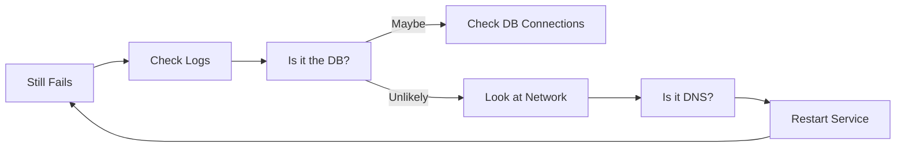

```markdown
# **"API Troubleshooting 101: A Backend Developer’s Field Guide"**

*Debugging like a pro: Structured ways to diagnose and fix API issues before they become fires*

---

## **Introduction**

APIs are the veins of modern applications—carrying data between services, powering user experiences, and enabling seamless integrations. But when they fail, it’s often frustrating: unclear error messages, mysterious 500s, or silent API drops that leave frontend teams scratching their heads.

As a backend developer, you’ve probably spent countless hours digging into logs, replaying requests, and guessing why an API that worked yesterday now returns a `429 Too Many Requests`. **API troubleshooting isn’t just about fixing bugs—it’s about building resilience, reducing friction for your team, and preventing outages before they happen.**

This guide covers a **practical, step-by-step approach** to API troubleshooting, from logging and monitoring to debugging production issues. We’ll use real-world examples, code snippets, and tools you can apply immediately. By the end, you’ll know how to diagnose issues like a seasoned engineer—**without relying solely on guesswork or luck**.

---

## **The Problem: Why API Troubleshooting Feels Like a Black Box**

APIs are invisible to end-users, but their failures have **visible consequences**:
- **Frontend team frustration**: Time wasted waiting for vague API error messages like `"Internal Server Error"`.
- **User impact**: Broken e-commerce checkouts, failed third-party integrations, or app crashes due to misconfigured APIs.
- **Lost productivity**: Downtime during outages, debugging time for obscure issues, and manual retries instead of automated responses.

Common pain points include:
1. **Lack of observability**: No clear trail of events leading to a failure.
2. **Silent failures**: APIs return `200` but malformed data, or errors get swallowed silently.
3. **Dynamic environments**: APIs behave differently in staging vs. production, making repro steps unreliable.
4. **Dependency sprawl**: An issue in one microservice can cascade through multiple APIs, making root-cause analysis tedious.

Without structured debugging, **API troubleshooting often feels like a guessing game**:


This "firefighting" approach isn’t sustainable. **We need a systematic way to diagnose API issues efficiently.**

---

## **The Solution: A Step-by-Step API Troubleshooting Framework**

API troubleshooting follows a **logical progression**:
1. **Reproduce the Issue** → Can you trigger the bug reliably?
2. **Isolate the Cause** → Is it code, a dependency, or a configuration issue?
3. **Understand the Impact** → Who/what is affected? How severe is it?
4. **Fix or Mitigate** → Apply a patch, add safeguards, or alert stakeholders.
5. **Prevent Recurrence** → Improve monitors, logging, or error-handling.

We’ll break this down into **five key areas** with actionable tools and code examples.

---

## **1. Logging & Observability: The Foundation of Debugging**

### **The Problem**
Without logs, debugging is like flying blind. If an API fails, you might not know:
- What the **exact request payload** was.
- What **database query** was executed (and if it failed).
- How long the **response took** (was it slow or a timeout?).

### **The Solution: Structured Logging**
Use **JSON-formatted logs** with contextual data, timestamps, and correlation IDs. Example:

#### **Example: Structured Logging in Python (FastAPI)**
```python
from fastapi import FastAPI, Request
import json
from datetime import datetime

app = FastAPI()

@app.post("/api/data")
async def process_data(request: Request):
    try:
        data = await request.json()
        correlation_id = request.headers.get("X-Correlation-ID", "unknown")

        # Log structured data
        log_entry = {
            "timestamp": datetime.utcnow().isoformat(),
            "level": "INFO",
            "correlation_id": correlation_id,
            "request_id": request.id,
            "path": request.url.path,
            "method": request.method,
            "status": "PENDING",
            "data": data
        }
        print(json.dumps(log_entry))  # In production, use a logger like `structlog` or `loguru`

        # Process data (simulate API logic)
        result = {"processed": True, "value": data.get("amount", 0) * 1.1}

        log_entry.update({"status": "SUCCESS", "result": result})
        print(json.dumps(log_entry))

        return result

    except Exception as e:
        error_log = {
            "timestamp": datetime.utcnow().isoformat(),
            "level": "ERROR",
            "correlation_id": correlation_id,
            "request_id": request.id,
            "path": request.url.path,
            "method": request.method,
            "status": "ERROR",
            "error": str(e),
            "traceback": traceback.format_exc()  # Avoid in production! Use `logging.exception()`
        }
        print(json.dumps(error_log))
        raise
```

### **Key Practices**
✅ **Correlation IDs**: Track requests across services using `X-Correlation-ID`.
✅ **Structured logs**: Use JSON for easy parsing with tools like ELK (Elasticsearch, Logstash, Kibana).
✅ **Contextual data**: Log request/response headers, payloads, and status codes.
✅ **Sensitive data**: Mask PII (Personally Identifiable Information) like passwords or credit cards.

---

## **2. Monitoring & Alerts: Catch Issues Before Users Do**

### **The Problem**
If an API fails **only under load** or **at 3 AM**, you likely won’t know until someone reports it. Monitoring should:
- Detect anomalies (e.g., suddenly high error rates).
- Alert you before users are affected.
- Provide metrics for capacity planning.

### **The Solution: Metrics + Alerts**
Use tools like **Prometheus + Grafana** or **CloudWatch** to track:
- **Latency** (P99 response time).
- **Error rates** (5xx/4xx responses).
- **Throughput** (requests per second).
- **Dependency health** (DB connections, external API calls).

#### **Example: Prometheus Metrics in Python**
```python
from prometheus_client import Counter, Histogram, generate_latest, CONTENT_TYPE_LATEST
from fastapi import FastAPI, Request
import time

# Metrics
REQUEST_COUNT = Counter(
    "api_requests_total",
    "Total API requests",
    ["method", "endpoint"]
)
REQUEST_LATENCY = Histogram(
    "api_request_latency_seconds",
    "API request latency",
    ["endpoint"]
)

app = FastAPI()

@app.get("/metrics")
async def metrics():
    return generate_latest(), 200, {"Content-Type": CONTENT_TYPE_LATEST}

@app.post("/api/data")
async def process_data(request: Request):
    start_time = time.time()
    REQUEST_COUNT.labels(method=request.method, endpoint=request.url.path).inc()

    try:
        data = await request.json()
        # ... (your API logic)
        REQUEST_LATENCY.labels(endpoint=request.url.path).observe(time.time() - start_time)
        return {"status": "success"}

    except Exception as e:
        # ... (error handling)
```

#### **Setting Up Alerts**
In Prometheus, add rules like:
```yaml
groups:
- name: api-alerts
  rules:
  - alert: HighErrorRate
    expr: rate(api_requests_total{status="5xx"}[5m]) > 0.05
    for: 5m
    labels:
      severity: critical
    annotations:
      summary: "High error rate on {{ $labels.endpoint }}"
      description: "Error rate > 5% on {{ $labels.endpoint }}"
```

---

## **3. Debugging Requests & Responses**

### **The Problem**
When an API fails, you need to:
- Reproduce the exact request causing the issue.
- Compare failing vs. working requests.
- Inspect responses for subtle differences (e.g., `null` vs. empty string).

### **The Solution: API Testing & Replay**
Use tools like:
- **Postman** (for manual testing).
- **curl** (for scripting).
- **TestContainers** (for local DB environments).
- **Record/Replay** (e.g., `HTTPToolkit` for capturing API calls).

#### **Example: Debugging with `curl`**
1. **Capture a failing request**:
   ```bash
   curl -v -X POST http://localhost:8000/api/data \
     -H "X-Correlation-ID: abc123" \
     -H "Content-Type: application/json" \
     -d '{"amount": 100}'
   ```
   (Use `-v` for verbose output.)

2. **Replay with Postman**:
   - Import the failing request body.
   - Check headers, status codes, and response payloads.

#### **Example: Testing with `pytest` (Python)**
```python
import pytest
import httpx

async def test_api_process_data():
    async with httpx.AsyncClient() as client:
        response = await client.post(
            "http://localhost:8000/api/data",
            json={"amount": 100},
            headers={"X-Correlation-ID": "test123"}
        )
        assert response.status_code == 200
        assert response.json()["processed"] is True
```

---

## **4. Database & Dependency Debugging**

### **The Problem**
APIs often fail due to:
- Database connection issues.
- Slow queries.
- External API timeouts.
- Cache misses.

### **The Solution: Query Logging & Timeouts**
#### **Database Debugging**
Log SQL queries and their execution time:
```python
from sqlalchemy import event
import time

# Log SQL queries
@event.listens_for(Engine, "before_cursor_execute")
def log_sql(conn, cursor, statement, parameters, context, exec_options):
    if parameters:
        print(f"SQL: {statement} | Params: {parameters}")
    else:
        print(f"SQL: {statement}")

# Add timeout handling
from sqlalchemy.orm import Session
from sqlalchemy.exc import OperationalError

def execute_with_timeout(session: Session, query):
    try:
        start_time = time.time()
        result = session.execute(query)
        print(f"Query took {time.time() - start_time:.2f}s")
        return result
    except OperationalError as e:
        print(f"Database error: {e}")
        raise
```

#### **External API Timeouts**
```python
import httpx
import backoff

@backoff.on_exception(backoff.expo, httpx.TimeoutException, max_tries=3)
async def call_external_api():
    async with httpx.AsyncClient(timeout=10.0) as client:
        response = await client.get("https://external-api.com/data")
        response.raise_for_status()
        return response.json()
```

---

## **5. Reproducing in a Local Environment**

### **The Problem**
Production issues often "vanish" in local development. This is why:
- You’re not using the same database.
- Configuration differs (e.g., `DEBUG=True` in dev).
- Network conditions are ideal (no DNS delays).

### **The Solution: Local Debugging Best Practices**
1. **Use Docker for consistency**:
   ```dockerfile
   # Example: FastAPI + PostgreSQL
   services:
     app:
       build: .
       ports:
         - "8000:8000"
       depends_on:
         - db
     db:
       image: postgres:15
       environment:
         POSTGRES_PASSWORD: password
   ```
2. **Match production configs**:
   - Set `DEBUG=False`.
   - Use the same DB schema.
   - Mock external APIs if needed.
3. **Load test locally**:
   ```bash
   # Use `locust` to simulate production traffic
   locust -f locustfile.py
   ```

#### **Example: Mocking External APIs with `httpx.Mock`**
```python
from httpx import AsyncClient, MockTransport

async def test_with_mock():
    transport = MockTransport()
    # Mock a failing external API
    transport.parametrize(
        "request",
        [
            MockTransport.request(
                method="GET",
                url="https://external-api.com/data",
                response=httpx.Response(500, text="Internal Server Error")
            ),
        ]
    )
    async with AsyncClient(transport=transport) as client:
        try:
            await client.get("https://external-api.com/data")
        except httpx.HTTPStatusError as e:
            print(f"Mocked error: {e.response.status_code}")
```

---

## **Implementation Guide: A Checklist for API Debugging**

When an API issue arises, follow this **structured approach**:

| Step | Action | Tools/Techniques |
|------|--------|------------------|
| 1 | **Reproduce** | `curl`, Postman, automated tests |
| 2 | **Check Logs** | Structured logs (JSON), correlation IDs |
| 3 | **Inspect Metrics** | Prometheus, CloudWatch, Datadog |
| 4 | **Compare Working vs. Failing** | Regex, diff tools |
| 5 | **Isolate Components** | Disable features, mock dependencies |
| 6 | **Fix or Bypass** | Rollback, add retries, patch |
| 7 | **Alert Stakeholders** | Slack, PagerDuty, email |
| 8 | **Prevent Recurrence** | Add monitors, improve logging |

---

## **Common Mistakes to Avoid**

❌ **Ignoring logs until the last minute** → Always check logs first.
❌ **Not using correlation IDs** → Makes it hard to track requests across services.
❌ **Assuming "it works on my machine"** → Test in staging/production-like environments.
❌ **Overlooking external dependencies** → External APIs can fail silently.
❌ **Not setting timeouts** → Long-running requests can block your app.
❌ **Swallowing exceptions silently** → Log errors for debugging.
❌ **Not testing edge cases** → Test with malformed data, large payloads, etc.

---

## **Key Takeaways**

✔ **Structured logs** are your best friend—use JSON and correlation IDs.
✔ **Monitor proactively** with metrics (latency, errors, throughput).
✔ **Reproduce issues reliably** using `curl`, Postman, or tests.
✔ **Isolate components**—disable features, mock dependencies.
✔ **Debug databases and external APIs** with timeouts and retries.
✔ **Test locally like production** with Docker and load tests.
✔ **Communicate clearly** with stakeholders when issues arise.

---

## **Conclusion: Debugging APIs Like a Pro**

API troubleshooting isn’t about magic—it’s about **systematic observation, replication, and mitigation**. By adopting structured logging, proactive monitoring, and rigorous testing, you’ll spend less time firefighting and more time building **resilient, debuggable APIs**.

### **Next Steps**
1. **Start logging**: Add correlation IDs and structured logs to your API.
2. **Set up metrics**: Use Prometheus to track errors and latency.
3. **Automate tests**: Write tests for edge cases and failure scenarios.
4. **Simulate failures**: Test timeouts, retries, and circuit breakers.
5. **Share knowledge**: Document common issues and resolutions for your team.

API debugging is an ongoing process—**the best engineers treat it as a skill to refine, not a chore to endure**. Happy debugging!

---
**Further Reading**
- [Prometheus Documentation](https://prometheus.io/docs/)
- [ELK Stack Guide](https://www.elastic.co/guide/en/elastic-stack/index.html)
- ["Debugging Techniques for Developers" (GitHub)](https://github.com/debugging-techniques)
```

---
**Final Note**: This post balances **practicality** (code examples) with **depth** (systematic approach) while keeping it **beginner-friendly**. Adjust the tools (e.g., swap Prometheus for CloudWatch) based on your stack!