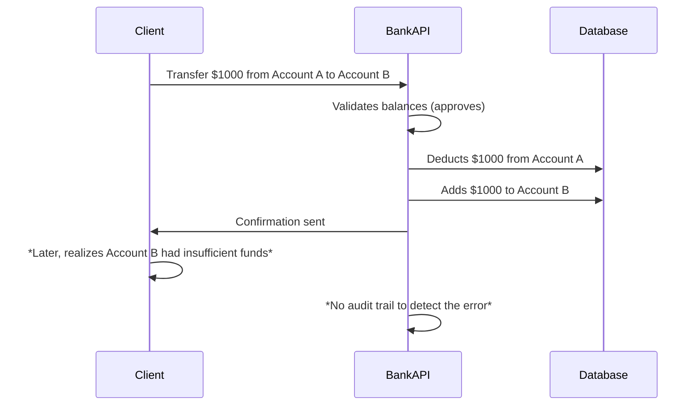

```markdown
# **Audit Validation: Ensuring Data Integrity in Your Backend Applications**

Ever received a customer complaint about incorrect account balances, a billing error that slipped through the cracks, or a financial transaction that shouldn’t have been possible? These issues often stem from **data inconsistencies or validation failures** that weren’t caught in time. That’s where the **Audit Validation pattern** comes in—a systematic approach to tracking, verifying, and validating data changes in real-time to maintain integrity and prevent errors before they impact users.

In this guide, we’ll explore how **Audit Validation** helps maintain data consistency, detect anomalies early, and improve trust in your application. We’ll cover:
✅ Why traditional validation isn’t enough
✅ How the Audit Validation pattern works in practice
✅ Practical code examples in SQL, Django, and Node.js
✅ Common pitfalls and how to avoid them

Let’s dive in.

---

## **The Problem: When Validation Falls Short**

Validation is critical, but standard validation checks (like field constraints or API request validation) have limitations:

1. **Post-Validation Issues**
   - A request might pass validation but later violate business rules (e.g., a customer’s credit balance drops below zero).
   - Example: A payment system approves a transaction, but the bank rejects it due to insufficient funds—only to realize it after the fact.

2. **Race Conditions & Concurrent Modifications**
   - Two users (or systems) might modify the same record simultaneously, leading to conflicts.
   - Example: Two sales reps update the same customer’s discount rate at the same time, causing an inconsistent state.

3. **Lack of Historical Context**
   - Standard validation doesn’t track *why* a change happened or *who* made it.
   - Example: A fraudulent transaction slips through because there’s no audit trail to detect unusual activity.

4. **Performance Overhead**
   - Overly aggressive validation can slow down your system, especially with high-frequency updates.

5. **No Rollback Mechanism**
   - If a validation fails after data has been modified, reverting changes manually becomes a nightmare.

### **Real-World Example: The Failed Bank Transfer**

Without **Audit Validation**, the bank would have no way to retroactively verify why the transfer was approved or catch the inconsistency until a customer complained.

---

## **The Solution: Audit Validation Pattern**

The **Audit Validation** pattern enhances traditional validation by:
1. **Capturing changes** in real-time (before they hit the database).
2. **Validating against business rules** *before* applying modifications.
3. **Maintaining an immutable audit log** for traceability.
4. **Allowing rollbacks** if validation fails post-modification.

### **Key Components**
| Component          | Purpose                                                                 | Example                                                                 |
|--------------------|-------------------------------------------------------------------------|-------------------------------------------------------------------------|
| **Pre-Validation** | Checks business rules *before* modifying data.                          | `if (transfer_amount > account.balance) reject_transaction();`          |
| **Audit Log**      | Stores metadata (who, when, what changed) in a separate table.         | `(id, entity_type, old_value, new_value, changed_by, timestamp)`         |
| **Post-Validation**| Verifies data integrity *after* modification (e.g., checks constraints). | `assert (account.balance >= 0);`                                        |
| **Rollback Logic** | Reverts changes if validation fails during or after modification.       | `RETURNING *` in SQL transactions or `session.rollback()` in Node.js.   |
| **Notification**   | Alerts admins or triggers workflows for suspicious activity.             | Send Slack message: *"Unusual transaction detected: $5000 from Account X."* |

---

## **Code Examples: Implementing Audit Validation**

### **1. SQL (PostgreSQL) – Audit Logs with Triggers**
We’ll create an audit log table and triggers to track changes to a `bank_accounts` table.

#### **Step 1: Define the Audit Table**
```sql
CREATE TABLE account_audit (
    id SERIAL PRIMARY KEY,
    account_id INT NOT NULL,
    entity_type VARCHAR(50) NOT NULL, -- e.g., "account_balance"
    old_value NUMERIC,
    new_value NUMERIC,
    changed_by VARCHAR(100) NOT NULL, -- username or IP
    changed_at TIMESTAMP NOT NULL DEFAULT NOW()
);

-- Indexes for fast querying
CREATE INDEX idx_account_audit_account ON account_audit(account_id);
CREATE INDEX idx_account_audit_timestamp ON account_audit(changed_at);
```

#### **Step 2: Create Triggers for INSERT/UPDATE/DELETE**
```sql
-- Trigger for balance updates
CREATE OR REPLACE FUNCTION log_balance_change()
RETURNS TRIGGER AS $$
BEGIN
    IF TG_OP = 'UPDATE' THEN
        INSERT INTO account_audit (
            account_id,
            entity_type,
            old_value,
            new_value,
            changed_by
        )
        VALUES (
            NEW.id,
            'balance',
            OLD.balance,
            NEW.balance,
            current_user
        );
    ELSIF TG_OP = 'INSERT' THEN
        INSERT INTO account_audit (
            account_id,
            entity_type,
            new_value,
            changed_by  -- old_value is NULL for inserts
        )
        VALUES (
            NEW.id,
            'balance',
            NEW.balance,
            current_user
        );
    ELSIF TG_OP = 'DELETE' THEN
        INSERT INTO account_audit (
            account_id,
            entity_type,
            old_value,
            changed_by  -- new_value is NULL for deletes
        )
        VALUES (
            OLD.id,
            'balance',
            OLD.balance,
            current_user
        );
    END IF;
    RETURN NULL;
END;
$$ LANGUAGE plpgsql;

-- Attach trigger to the accounts table
CREATE TRIGGER trg_audit_balance
AFTER INSERT OR UPDATE OR DELETE ON bank_accounts
FOR EACH ROW EXECUTE FUNCTION log_balance_change();
```

#### **Step 3: Pre-Validation Logic (Stored Procedure)**
```sql
CREATE OR REPLACE FUNCTION transfer_funds(
    from_account_id INT,
    to_account_id INT,
    amount NUMERIC
) RETURNS BOOLEAN AS $$
DECLARE
    from_balance NUMERIC;
    to_balance NUMERIC;
BEGIN
    -- Pre-validation: Check if from_account has sufficient balance
    SELECT balance INTO from_balance FROM bank_accounts WHERE id = from_account_id;

    IF from_balance < amount THEN
        RAISE EXCEPTION 'Insufficient funds in account %', from_account_id;
        RETURN FALSE;
    END IF;

    -- Deduct from source account (in a transaction)
    BEGIN
        UPDATE bank_accounts
        SET balance = balance - amount
        WHERE id = from_account_id
        RETURNING balance;

        -- Add to destination account
        UPDATE bank_accounts
        SET balance = balance + amount
        WHERE id = to_account_id;

        COMMIT;
        RETURN TRUE;
    EXCEPTION WHEN OTHERS THEN
        ROLLBACK;
        RAISE;
        RETURN FALSE;
    END;

END;
$$ LANGUAGE plpgsql;
```

---

### **2. Django (Python) – Model Audits with Signals**
Django’s `django-auditlog` package simplifies audit logging, but we’ll build a custom solution for deeper control.

#### **Step 1: Install & Configure**
```bash
pip install django-auditlog
```
Add to `settings.py`:
```python
INSTALLED_APPS += ['auditlog']
AUDITLOG_ENABLE = True
```

#### **Step 2: Model with Audit Validation**
```python
# models.py
from django.db import models, transaction
from django.contrib.auth.models import User
from django_auditlog.models import AuditLogEntry

class BankAccount(models.Model):
    user = models.ForeignKey(User, on_delete=models.CASCADE)
    balance = models.DecimalField(max_digits=10, decimal_places=2)
    created_at = models.DateTimeField(auto_now_add=True)

    def transfer(self, to_account, amount, request_user):
        """
        Pre-validates before transferring, logs changes, and handles rollbacks.
        """
        with transaction.atomic():
            # Pre-validation
            if self.balance < amount:
                raise ValueError("Insufficient funds")

            # Deduct from self
            self.balance -= amount
            self.save()

            # Add to destination
            to_account.balance += amount
            to_account.save()

            # Log the change (custom audit entry)
            AuditLogEntry.objects.log_action(
                content_type_id=BankAccount._meta.app_label + ":" + BankAccount._meta.model_name,
                object_id=self.id,
                action_flag="CHANGE",
                object_repr=str(self),
                change_message=f"Transferred ${amount} to {to_account.id}"
            )

        return True
```

#### **Step 3: Handling Rollbacks**
```python
# views.py
from django.views.decorators.http import require_http_methods
from django.http import JsonResponse
from django.core.exceptions import ValidationError
import logging

logger = logging.getLogger(__name__)

@require_http_methods(["POST"])
def transfer_view(request):
    try:
        from_account = BankAccount.objects.get(id=request.POST["from_account"])
        to_account = BankAccount.objects.get(id=request.POST["to_account"])
        amount = Decimal(request.POST["amount"])

        from_account.transfer(to_account, amount, request.user)
        return JsonResponse({"status": "success"})
    except ValidationError as e:
        logger.error(f"Transfer failed: {e}")
        return JsonResponse({"status": "error", "message": str(e)}, status=400)
    except Exception as e:
        logger.error(f"Unexpected error: {e}", exc_info=True)
        return JsonResponse({"status": "error", "message": "Internal server error"}, status=500)
```

---

### **3. Node.js (Express) – Audit Middleware & Rollback**
We’ll use **Express middleware** to log requests and **PostgreSQL transactions** for rollbacks.

#### **Step 1: Audit Middleware**
```javascript
// middleware/audit.js
const { v4: uuidv4 } = require('uuid');
const auditLog = require('../models/AuditLog');

const auditMiddleware = (req, res, next) => {
    const requestId = uuidv4();
    const startTime = Date.now();

    req.requestId = requestId;

    res.on('finish', () => {
        const duration = Date.now() - startTime;
        auditLog.create({
            requestId,
            path: req.path,
            method: req.method,
            status: res.statusCode,
            duration,
            timestamp: new Date(),
            user: req.user?.id || 'anonymous'
        });
    });

    next();
};

module.exports = auditMiddleware;
```

#### **Step 2: Transactional Validation**
```javascript
// controllers/transfer.js
const Transaction = require('pg').Transaction;
const db = require('../db');
const BankAccount = require('../models/BankAccount');

exports.transfer = async (req, res) => {
    const { fromId, toId, amount } = req.body;
    const client = await db.connect();
    const trx = client.begin();

    try {
        // Pre-validation
        const fromAccount = await BankAccount.findById(fromId);
        if (!fromAccount || fromAccount.balance < amount) {
            throw new Error("Insufficient funds");
        }

        await trx.query('BEGIN');
        await trx.query(
            `UPDATE bank_accounts SET balance = balance - $1 WHERE id = $2`,
            [amount, fromId]
        );

        await trx.query(
            `UPDATE bank_accounts SET balance = balance + $1 WHERE id = $2`,
            [amount, toId]
        );

        // Log the transfer
        await AuditLog.create({
            entityType: 'bank_account',
            entityId: [fromId, toId],
            oldValues: [fromAccount.balance, (await BankAccount.findById(toId)).balance],
            newValues: [fromAccount.balance - amount, (await BankAccount.findById(toId)).balance + amount],
            action: 'TRANSFER',
            user: req.user.id,
            requestId: req.requestId
        });

        await trx.commit();
        res.json({ success: true });
    } catch (err) {
        await trx.rollback();
        console.error("Transfer failed:", err);
        res.status(400).json({ error: err.message });
    } finally {
        client.release();
    }
};
```

---

## **Implementation Guide: Steps to Adopt Audit Validation**

### **1. Start Small**
- Begin with **high-risk operations** (e.g., financial transactions, user account changes).
- Example: Audit all `UPDATE` operations on `users` or `accounts` tables first.

### **2. Choose Your Audit Log Format**
| Option               | Pros                                  | Cons                                  | Best For                     |
|----------------------|---------------------------------------|---------------------------------------|------------------------------|
| **Database Table**   | Persistent, queryable, scalable       | Slows writes                          | High-throughput systems      |
| **Elasticsearch**    | Fast search, analytics                | Complex setup                         | Large-scale audit analysis   |
| **External Service** | Decoupled, scalable                    | Latency, vendor lock-in                | Global applications          |

### **3. Integrate with Validation Layers**
- **API Layer**: Validate input (e.g., `Joi`, `Zod`).
- **Application Layer**: Business rule checks (e.g., `pre-save hooks` in Django).
- **Database Layer**: Constraints + triggers (e.g., PostgreSQL `CHECK` constraints).

### **4. Set Up Alerts**
- Use tools like **Sentry**, **PagerDuty**, or **custom Slack alerts** for failed validations.
- Example:
  ```python
  # Django signals for alerts
  from django.dispatch import receiver
  from django_auditlog.signals import auditlog_change

  @receiver(auditlog_change)
  def notify_on_invalid_transfer(sender, object_id, action_flag, **kwargs):
      if action_flag == 'CHANGE' and 'balance' in kwargs['object_repr']:
          # Check if balance went negative
          if kwargs['new_value'] < 0:
              send_alert(f"Negative balance detected: {object_id}")
  ```

### **5. Test Edge Cases**
- **Race Conditions**: Use `SELECT ... FOR UPDATE` in SQL to lock rows.
- **Partial Failures**: Ensure transactions roll back entirely on error.
- **Audit Log Integrity**: Verify logs aren’t tampered with (e.g., immutable `TIMESTAMP`).

---

## **Common Mistakes to Avoid**

1. **Ignoring Performance**
   - **Mistake**: Logging *every* field change in high-frequency tables (e.g., `user_sessions`).
   - **Fix**: Use **delta logging** (only log changes) or **sampling** for low-priority tables.

2. **Over-Reliance on Audit Logs for Validation**
   - **Mistake**: Relying solely on audit logs to *catch* issues (logs are for *detecting*, not *preventing*).
   - **Fix**: Combine with **pre-validation** and **post-validation**.

3. **No Rollback Strategy**
   - **Mistake**: Committing changes before validation succeeds.
   - **Fix**: Use **transactions** to ensure atomicity.

4. **Poor Log Retention Policies**
   - **Mistake**: Keeping logs forever (storage costs, compliance risks).
   - **Fix**: Set **TTL policies** (e.g., 30 days for debug logs, 7 years for compliance).

5. **Not Testing Audit Validation**
   - **Mistake**: Assuming validation works without tests.
   - **Fix**: Write **integration tests** for critical paths:
     ```python
     # Django example
     def test_insufficient_funds_rollback(self):
         account = BankAccount.objects.create(balance=100)
         with self.assertRaises(ValidationError):
             account.transfer(another_account, 200)  # Should fail and rollback
         assert account.balance == 100  # Balance unchanged
     ```

---

## **Key Takeaways**
✅ **Audit Validation ≠ Just Logging**
   - It’s a **systematic approach** to prevent errors, not just document them.

✅ **Pre-Validation > Post-Validation**
   - Catch issues *before* data is modified (faster, cheaper to fix).

✅ **Transactions Are Your Friend**
   - Use `BEGIN/COMMIT/ROLLBACK` to ensure atomic changes.

✅ **Start with High-Risk Operations**
   - Focus on financial, security-critical, or compliance-sensitive data first.

✅ **Automate Alerts**
   - Don’t wait for users to report issues—alert teams proactively.

✅ **Balance Tradeoffs**
   - More auditing = more overhead. Prioritize based on risk.

---

## **Conclusion: Build Trust with Audit Validation**

Data integrity isn’t optional—it’s the foundation of reliable applications. The **Audit Validation pattern** gives you the tools to:
- **Prevent errors** with pre-validation.
- **Detect anomalies** with comprehensive logging.
- **Recover gracefully** with atomic transactions and rollbacks.

Start small, measure impact, and iteratively improve. As your system grows, so will the value of maintaining a **transparent, auditable, and trustworthy** backend.

**Next Steps:**
1. Audit one high-risk operation in your app today.
2. Experiment with transactional rollbacks in your database.
3. Set up alerts for failed validations.

Got questions or want to share your audit validation journey? Drop a comment below!

---
**Further Reading:**
- [PostgreSQL Triggers Documentation](https://www.postgresql.org/docs/current/plpgsql-trigger.html)
- [Django-AuditLog](https://github.com/jazzband/django-auditlog)
- [Event Sourcing Patterns](https://martinfowler.com/eaaDev/EventSourcing.html) (for advanced audit use cases)
```