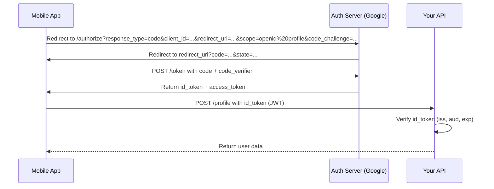

```markdown
---
title: "*Modern Authentication Standards: A Backend Developer's Guide to Secure, Scalable Auth"
date: 2024-01-20
description: "Dive deep into authentication standards—OAuth 2.0, JWT, OpenID Connect, and more—with practical implementations, tradeoffs, and real-world use cases."
tags: ["backend", "security", "authentication", "patterns", "api-design", "oauth", "jwt", "openid-connect"]
author: "Jamie Miller"
---

# **Modern Authentication Standards: A Backend Developer’s Guide to Secure, Scalable Auth**

Authentication is the unsung hero of backend development. A single misstep—like weak tokens, insecure flows, or overly permissive roles—can break trust, expose sensitive data, or even lead to compliance violations. Yet, crafting a robust authentication system goes beyond just "making it work." It requires balancing **security**, **scalability**, **developer experience**, and **user-friendliness**.

In this guide, we’ll dissect modern authentication standards—OAuth 2.0, JWT (JSON Web Tokens), OpenID Connect (OIDC), and their variants—with a focus on **practical implementations**, **tradeoffs**, and **real-world patterns**. You’ll leave with a toolbox of techniques to design systems that scale, resist attacks, and integrate seamlessly with frontends, third-party services, and compliance requirements.

---

## **The Problem: Why Authentication Standards Matter**

Before diving into solutions, let’s explore the pain points of auth systems that lack standardization:

### **1. Spaghetti Auth: The "Just Make It Work" Approach**
Many systems start with a simple `username/password` backend or a DIY token system. Problems arise quickly:
- **No clear boundaries**: Auth logic scatters across endpoints, middleware, and services, making maintenance a nightmare.
- **Security holes**: Custom token schemes often lack standard expiration, refresh mechanisms, or secure storage.
- **Scalability limits**: DIY solutions can’t handle concurrent user growth without redesigns.

Example: A startup builds an API with a basic `/login` endpoint returning a raw JDBC session ID. As the user base grows, they hit rate limits, and the team adds a "hack" to rotate session keys—now they’re stuck maintaining a legacy system.

### **2. The "One-Size-Fits-All" Trap**
Using a single auth pattern for every use case leads to:
- **Overcomplication**: OAuth 2.0 might seem like a cure-all, but its 12+ grant types can bloat your system with unused complexity.
- **Confusion**: Frontend devs mix up session cookies, JWTs, and opaque tokens without clear guidelines.
- **Vendor lock-in**: Relying on a single provider’s SDK (e.g., Firebase Auth) limits flexibility for future migrations.

### **3. Compliance and Auditing Nightmares**
Regulations like **GDPR**, **PCI DSS**, or **HIPAA** demand:
- **Token revocation**: How do you invalidate a token if a user changes passwords or gets hacked?
- **Audit trails**: Who accessed which resource? Standardized auth logs make this easier.
- **Multi-factor support**: DIY solutions often lack built-in MFA capabilities.

### **4. Frontend-Backend Mismatches**
A common scenario:
- Backend uses **OAuth 2.0** with PKCE for mobile apps.
- Frontend team “simplifies” by embedding a custom JWT flow in React.
- Result: **CSRF risks**, **token leakage**, and **failed audits**.

---

## **The Solution: Modern Authentication Standards**

Authentication standards like **OAuth 2.0**, **JWT**, and **OpenID Connect (OIDC)** provide structured, secure, and scalable solutions. They address the spaghetti-auth problem by:

1. **Separating concerns**: Define clear roles for clients, servers, and tokens.
2. **Standardizing flows**: Use proven patterns (e.g., PKCE, refresh tokens).
3. **Extensibility**: Plug in providers (Google, Auth0) or build custom backends.
4. **Compliance-ready**: Built-in features for revocation, logging, and MFA.

---
## **Components/Solutions: The Building Blocks**

### **1. OAuth 2.0: The Swiss Army Knife**
OAuth 2.0 is a **de facto standard** for authorization (not just auth). It’s flexible but complex—understand the core components first:

#### **Key Concepts:**
- **Resource Owner (User)**: The person authenticating (e.g., a Google user).
- **Client**: Your app (web/mobile) requesting access.
- **Authorization Server**: Issues tokens (e.g., Auth0, Keycloak, your custom backend).
- **Resource Server**: Protects endpoints (e.g., your `/user/profile` API).
- **Access Token**: Grants access to resources (short-lived, often JWT).
- **Refresh Token**: Long-lived token to get new access tokens.

#### **Standard Flows:**
| Flow               | Use Case                          | Security Notes                          |
|--------------------|-----------------------------------|----------------------------------------|
| **Authorization Code** | Web/mobile apps (best practice)    | Uses PKCE (Proof Key for Code Exchange) to prevent code interception. |
| **Implicit**       | Legacy web apps (avoid)           | No code verification; vulnerable to CSRF. |
| **Client Credentials** | Machine-to-machine auth           | No user involved; risky if client secrets leak. |
| **Password Grant** | Legacy apps (avoid)               | Sends passwords to your server; use only for internal systems. |

#### **Example: OAuth 2.0 with PKCE (Authorization Code Flow)**
**Scenario**: A mobile app (client) wants to access a user’s profile on `api.example.com`.

1. **Redirect to Auth Server**:
   The mobile app redirects users to `auth.example.com/authorize?response_type=code&client_id=...&redirect_uri=...&scope=profile`.
   PKCE adds a `code_challenge` to prevent token theft.

2. **User Authenticates**:
   The user logs in via Google/email/password. Auth server returns a `code`.

3. **Exchange Code for Tokens**:
   The app sends the `code` + `code_verifier` to `auth.example.com/token` and gets:
   ```json
   {
     "access_token": "eyJhbGciOiJSUzI1NiIs...",
     "token_type": "Bearer",
     "expires_in": 3600,
     "refresh_token": "long-lived-refresh-token"
   }
   ```

4. **Use Access Token**:
   The app attaches the `access_token` to requests to `api.example.com`.

---
### **2. JWT: Structured Tokens with Tradeoffs**
JWT (JSON Web Tokens) are **stateless** tokens that encode claims (e.g., user ID, roles) in a signed payload. They’re popular but come with pitfalls.

#### **When to Use JWT:**
- Frontend-hosted authentication (e.g., SPAs, mobile apps).
- Short-lived access tokens (avoids server-side sessions).
- Microservices where distributed auth is needed.

#### **When to Avoid JWT:**
- **High-security environments** (e.g., banking): Use opaque tokens (server-stored).
- **Long-lived tokens**: JWTs are vulnerable to replay attacks if not short-lived.
- **Large payloads**: JWTs bloat payloads with data (e.g., user profile).

#### **Example: JWT Flow (with Refresh Token)**
```javascript
// 1. Auth server returns JWT + refresh token
{
  "access_token": "eyJhbGciOiJIUzI1NiIsInR5cCI6IkpXVCJ9...",
  "refresh_token": "long-lived-refresh-token",
  "token_type": "Bearer",
  "expires_in": 3600
}

// 2. Client stores tokens (securely!) and uses `access_token` for API calls
fetch("/user/profile", {
  headers: { Authorization: `Bearer ${access_token}` }
});

// 3. When token expires, refresh it
fetch("/refresh", {
  method: "POST",
  data: { refresh_token: "long-lived-refresh-token" }
});
```

#### **JWT Security Best Practices:**
- **Short expiration**: Set `exp` to ≤ 15 minutes.
- **Use asymmetric signing**: Prefer `RS256` (RSA) over `HS256` (HMAC).
- **Store securely**: Never log tokens; use `HttpOnly`, `Secure` cookies for web.
- **Validate claims**: Check `iss`, `aud`, and `exp` on the server.

---
### **3. OpenID Connect (OIDC): OAuth on Steroids**
OIDC **layers identity validation** on top of OAuth 2.0. It adds:
- **Standardized user profile claims** (e.g., `name`, `email`, `sub`).
- **Identity providers (IdPs)**: Google, Auth0, Okta, or self-hosted (Keycloak).

#### **OIDC Flow Example (PKCE + Code)**


#### **Key OIDC Tokens:**
- **Access Token**: Grants API access (same as OAuth 2.0).
- **ID Token**: Signed JWT with user claims (e.g., `sub`, `email`).
  ```json
  {
    "sub": "user-123",
    "name": "Jamie Miller",
    "email": "jamie@example.com",
    "iss": "https://auth.example.com",
    "exp": 1705000000
  }
  ```

#### **Pros of OIDC:**
- **Standardized user data**: No need to parse custom claims.
- **Built-in MFA**: IdPs handle factors (e.g., Google Authenticator).
- **Audit trails**: IdPs log logins, making compliance easier.

#### **Cons:**
- **Vendor lock-in**: Relying on Google Auth0 limits portability.
- **Latency**: Requires round trips to IdP for every login.
- **Cost**: IdPs charge per user/month (e.g., Auth0’s free tier has limits).

---
### **4. Alternative: Session Tokens (Opcode)**
For high-security systems (e.g., banking), **opaque tokens** (server-stored) are safer than JWTs. Example:

```javascript
// 1. Login returns an opaque token (no payload)
{
  "session_token": "a1b2c3...",  // Stored server-side
  "expires_in": 3600
}

// 2. API validates by checking the server
fetch("/user/profile", {
  headers: { Authorization: `Bearer a1b2c3...` }
});
// Server queries a Redis cache for the session.
```

**Pros**:
- No JWT payload bloat or replay risks.
- Easy to revoke by invalidating server-side records.

**Cons**:
- Requires server-side state (higher cost).
- Less flexible for distributed systems.

---

## **Implementation Guide: Building a Scalable Auth System**

### **Step 1: Choose Your Standards**
| Use Case                     | Recommended Standard          | Example Providers               |
|------------------------------|-------------------------------|----------------------------------|
| Web/Mobile Auth              | OAuth 2.0 + PKCE              | Auth0, Okta, Keycloak           |
| SPAs (React/Angular)         | JWT + Refresh Tokens          | Firebase Auth, Supabase         |
| Microservices                | OpenID Connect + OAuth 2.0    | Google Cloud IAM, AWS Cognito   |
| High-Security Systems        | Opaque Tokens + OAuth 2.0     | Custom backend + Redis          |

### **Step 2: Design Your Flows**
1. **Frontend**:
   - For mobile/web: Use OAuth 2.0 PKCE.
   - For SPAs: Use JWTs with `HttpOnly` cookies (not localStorage).
2. **Backend**:
   - Validate tokens on **every request**.
   - Cache refresh tokens to avoid database calls.
   - Log token issuance/revocation for auditing.

### **Step 3: Token Management**
- **Access Tokens**:
  - Short-lived (`exp` ≤ 15 min).
  - Store in `HttpOnly` cookies (for web) or memory (for mobile).
- **Refresh Tokens**:
  - Long-lived (`exp` ≥ 30 days).
  - Store securely (e.g., encrypted in `localStorage` with `secure` flag).
  - Revoke on password changes or suspicious activity.

### **Step 4: Secure Your Implementation**
- **Never trust the client**: Always validate tokens on the server.
- **Use PKCE for mobile/web**: Prevents code interception attacks.
- **Rotate secrets**: Change `client_id`/`client_secret` periodically.
- **Rate-limit auth endpoints**: Block brute-force attacks.

### **Step 5: Handle Edge Cases**
| Scenario                     | Solution                                    |
|------------------------------|---------------------------------------------|
| Token revocation              | Blacklist refresh tokens in Redis.          |
| Expired access token         | Redirect to refresh endpoint.               |
| Lost device                   | Force re-authentication.                   |
| Phishing attempts             | Use `State` parameter to prevent CSRF.     |

---
## **Common Mistakes to Avoid**

### **1. Using JWT for Everything**
- **Problem**: JWTs are stateless and hard to revoke. Overusing them leads to security holes.
- **Fix**: Use opaque tokens for high-value operations (e.g., money transfers).

### **2. Storing Tokens Insecurely**
- **Problem**: `localStorage` for refresh tokens? `HttpOnly` cookies for web apps?
- **Fix**:
  - Web: `HttpOnly`, `Secure`, `SameSite=Strict` cookies.
  - Mobile: Encrypted `Keychain` (iOS) or `Keystore` (Android).

### **3. Ignoring Token Expiration**
- **Problem**: Long-lived JWTs leak data even after password changes.
- **Fix**: Set `exp` to ≤ 15 minutes for access tokens.

### **4. DIY Token Validation**
- **Problem**: Manually parsing JWTs or OAuth tokens leads to bugs.
- **Fix**: Use libraries like:
  - [node-jose](https://github.com/panva/jose) (JWT)
  - [oauth2-server](https://github.com/auth0/node-oauth2-server) (OAuth 2.0)
  - [openid-client](https://github.com/panva/node-openid-client) (OIDC)

### **5. Not Handling Refresh Tokens Properly**
- **Problem**: Refresh tokens are often revoked too aggressively or not at all.
- **Fix**:
  - Revoke on password changes, suspicious logins, or user request.
  - Use **short-lived refresh tokens** (e.g., 30 days) + **long-lived opaque tokens** (e.g., 90 days).

### **6. CSRF in OAuth Flows**
- **Problem**: Implicit flow or lack of `state` parameter opens CSRF risks.
- **Fix**: Always use the **Authorization Code flow** with PKCE.

### **7. Overcomplicating Roles**
- **Problem**: Granular roles lead to permission sprawl.
- **Fix**: Start simple (e.g., `user`, `admin`) and extend as needed.

---
## **Key Takeaways**
Here’s what to remember when designing auth systems:

✅ **Use OAuth 2.0 + PKCE** for web/mobile apps—it’s the gold standard.
✅ **Prefer short-lived JWTs** for SPAs/mobile, but store them securely.
✅ **OpenID Connect** adds identity claims but adds complexity—only use if needed.
✅ **Opaque tokens** are safer for high-security systems (e.g., banking).
✅ **Validate tokens on the server**—never trust the client.
✅ **Lock down token storage**:
   - Web: `HttpOnly` cookies.
   - Mobile: Encrypted storage.
✅ **Rotate secrets** and revoke tokens proactively.
✅ **Audit logs**: Track token issuance/revocation for compliance.
✅ **Start simple**, but design for scale (e.g., cache refresh tokens).

---
## **Conclusion: Build Secure, Scalable Auth Today**

Authentication is rarely the "fun" part of backend development, but it’s the foundation of trust. By leveraging **OAuth 2.0**, **JWT**, and **OpenID Connect** (where appropriate), you can avoid the pitfalls of DIY auth and build systems that are **secure**, **scalable**, and **audit-ready**.

### **Next Steps:**
1. **Audit your current auth system**: Does it use standardized flows? Are tokens secure?
2. **Start small**: Replace a legacy auth endpoint with OAuth 2.0 + PKCE.
3. **Automate validation**: Use libraries to avoid token-parsing errors.
4. **Test for edge cases**: Simulate token leaks, revocations, and brute-force attacks.

Remember, there’s no "perfect" auth system—only one that balances **security**, **usability**, and **maintainability**. Choose your standards wisely, and your users (and auditors) will thank you.

---
### **Further Reading**
- [OAuth 2.0 RFC](https://datatracker.ietf.org/doc/html/rfc6749)
- [JWT Best Practices](https://auth0.com/blog/jwt-best-practices/)
- [OpenID Connect Spec](https://openid.net/specs/openid-connect-core-1_0.html)
- [CVE-2021-41773 (OAuth 2.0 PKCE Vulnerability)](https://nvd.nist.gov/vuln/detail/CVE-2021-41773