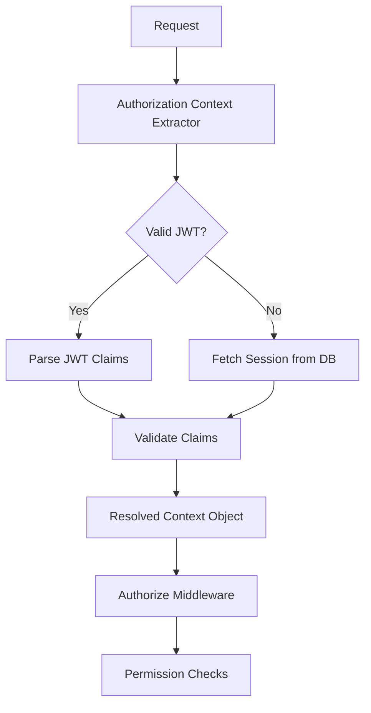

```markdown
---
title: "Authorization Context Extraction: A Practical Pattern for Clean, Scalable AuthZ"
author: "Alex Carter"
date: "June 15, 2024"
tags: ["authentication", "authorization", "backend patterns", "JWT", "OAuth"]
description: "Learn how to implement the Authorization Context Extraction pattern to avoid authorization sprawl and create maintainable permission checks. Real-world code examples included."
---

# **Authorization Context Extraction: A Practical Pattern for Clean, Scalable AuthZ**

As backend engineers, we often face the challenge of building authorization systems that are both performant and maintainable. Many teams struggle with **authorization sprawl**—a tangle of hardcoded checks, ad-hoc solutions, and context leakage that make the codebase brittle and hard to debug.

This is where the **Authorization Context Extraction (ACE) pattern** shines. ACE centralizes the extraction of authorization-relevant information—such as roles, tenant IDs, or custom claims—into a structured, reusable context object. This ensures that every authorization decision is based on the same authoritative source of truth, reducing inconsistency and making permissions logic easier to test and refactor.

In this post, we’ll explore:
- Why authorization contexts often fail
- How ACE solves these problems
- A practical implementation with real-world examples
- Common pitfalls and tradeoffs

Let’s dive in.

---

## **The Problem: Authorization Context Chaos**

Authorization logic often starts small—maybe just a single `if (user.role === "admin")` check. But as applications grow:
- **Context leakage** happens when roles or permissions are passed around as query parameters, headers, or hidden in business logic.
- **Inconsistency** arises when different parts of the app fetch user data (e.g., JWT vs. database) using slightly different schemas.
- **Performance bottlenecks** emerge from repeated database queries or redundant JWT decoding.

Here’s a common (and fragile) example of context leakage:

```javascript
// Controller logic (inconsistent extraction)
function updateUserProfile(req, res) {
  // Who should have access?
  const userId = req.user.id; // From JWT?
  const tenantId = req.headers['x-tenant-id']; // Or header?
  const isSuperAdmin = req.query.admin === "true"; // Or query param?

  // Now check permissions...
  if (isSuperAdmin || userIsAdminInTenant(userId, tenantId)) {
    // Proceed
  }
}
```

**Problems with this approach:**
1. **No single source of truth** for user identity and permissions.
2. **Hidden dependencies** (e.g., `x-tenant-id` header) make the code harder to reason about.
3. **Redundant calls** if we need to fetch user data multiple times.

ACE solves these issues by **extracting and normalizing** authorization context upfront.

---

## **The Solution: Authorization Context Extraction (ACE)**

The ACE pattern structures authorization by:
1. **Extracting** claims and metadata from tokens, sessions, or database records.
2. **Standardizing** these into a single context object.
3. **Injecting** this context into authorization checks.



### **Core Components of ACE**
| Component               | Purpose                                                                 |
|-------------------------|-------------------------------------------------------------------------|
| **Context Extractor**   | Parses JWTs, sessions, or database records to build the context.       |
| **Context Object**      | A structured object containing `userId`, `tenantId`, `roles`, `claims`. |
| **Middleware/Decorator**| Injects context into request objects or dependency injection.         |
| **Permission Evaluator**| Uses the context to enforce rules (e.g., ABAC, RBAC).                 |

---

## **Implementation Guide: Step-by-Step**

### **1. Define the Context Object**
Start by designing a simple interface for your context. Here’s an example using TypeScript for type safety:

```typescript
interface AuthContext {
  userId: string;
  tenantId: string;
  roles: string[]; // ["user", "admin", "billing-approver"]
  customClaims: Record<string, any>; // { "department": "finance" }
  expiresAt?: Date; // For short-lived sessions
}
```

### **2. Extract Context from JWT**
If using JWT, implement a context extractor that parses tokens and validates claims:

```javascript
// jwt-extractor.js
import jwt from 'jsonwebtoken';
import { AuthContext } from './context';

export function extractFromJwt(token: string): AuthContext {
  try {
    const decoded = jwt.verify(token, process.env.JWT_SECRET!) as {
      sub: string;
      tenant_id: string;
      roles: string[];
      custom?: Record<string, any>;
      exp?: number;
    };

    return {
      userId: decoded.sub,
      tenantId: decoded.tenant_id,
      roles: decoded.roles,
      customClaims: decoded.custom || {},
      expiresAt: decoded.exp ? new Date(decoded.exp * 1000) : undefined,
    };
  } catch (err) {
    throw new Error('Invalid JWT');
  }
}
```

### **3. Extract Context from Session (Database)**
For session-based auth, fetch user data from the database:

```sql
-- User table with roles and tenant
CREATE TABLE users (
  id SERIAL PRIMARY KEY,
  tenant_id VARCHAR(36) NOT NULL,
  role VARCHAR(50) NOT NULL,
  custom_data JSONB,
  -- ...
);
```

```javascript
// db-extractor.js
import { pool } from './db';

export async function extractFromSession(sessionId: string): Promise<AuthContext> {
  const { rows } = await pool.query(
    'SELECT id, tenant_id, role, custom_data FROM users WHERE session_id = $1',
    [sessionId]
  );

  if (!rows.length) throw new Error('Session not found');

  const [user] = rows;
  return {
    userId: user.id,
    tenantId: user.tenant_id,
    roles: [user.role], // Simple RBAC (roles array for ABAC later)
    customClaims: user.custom_data || {},
  };
}
```

### **4. Build a Middleware Factory**
Create reusable middleware to inject the context into HTTP requests:

```javascript
// auth-middleware.js
import { extractFromJwt } from './jwt-extractor';
import { extractFromSession } from './db-extractor';

export function authMiddleware(extractFn: (req) => Promise<AuthContext>) {
  return async (req, res, next) => {
    try {
      const context = await extractFn(req);
      req.authContext = context; // Attach to request
      next();
    } catch (err) {
      res.status(401).send('Unauthorized');
    }
  };
}

// Usage:
app.use('/secure', authMiddleware(extractFromJwt));
```

### **5. Use Context in Permission Checks**
Now, any route can access `req.authContext` to enforce rules:

```javascript
// Example: Tenant-scoped permission
app.post('/order', (req, res) => {
  const { userId, tenantId, roles } = req.authContext;

  // ABAC (Attribute-Based Access Control)
  const allowedRoles = ['admin', 'finance-manager'];
  if (!allowedRoles.some(role => roles.includes(role))) {
    return res.status(403).send('Forbidden');
  }

  // Proceed to business logic...
});
```

---

## **Common Mistakes to Avoid**

### **1. Overcomplicating the Context Object**
- **Problem:** Adding too many fields (e.g., `userData`, `sessionHistory`) slows down extraction.
- **Solution:** Keep it minimal—only include what’s needed for auth checks.

**Bad:**
```typescript
interface OverloadedContext {
  userId: string;
  tenantId: string;
  roles: string[];
  userEmail: string;
  customerName: string;
  // ⚠️ Too much data!
}
```

### **2. Not Validating Context Early**
- **Problem:** Fetching context only when needed leads to redundant work.
- **Solution:** Always extract and validate at the middleware layer.

**Bad:**
```javascript
// What if the user's role changes between extraction and permission check?
const permissions = checkPermissions(userId, roles); // races with DB updates?
```

### **3. Ignoring Race Conditions**
- **Problem:** If context is extracted at runtime (e.g., from a database), concurrent requests might read stale data.
- **Solution:** Use optimistic locking or short-lived sessions.

```javascript
// Example: Optimistic lock with ETag
app.use('/secure', authMiddleware(async (req) => {
  const { rows } = await pool.query(`
    SELECT * FROM users
    WHERE id = $1
    FOR UPDATE OF tenant_id
  `, [req.authContext.userId]);
  // Now the tenant_id is guaranteed to be current
}));
```

---

## **Key Takeaways**
✅ **Centralize context extraction** to avoid hidden dependencies.
✅ **Standardize JWT, session, and DB schemas** for consistency.
✅ **Use middleware** to inject context early in the pipeline.
✅ **Keep the context object lean**—only include auth-relevant fields.
✅ **Validate context upfront** to fail fast with clear errors.
❌ **Avoid over-fetching** user data (e.g., don’t include `userName` unless needed for auth).
❌ **Don’t hardcode roles**—always derive them from the context.

---

## **When to Use ACE vs. Alternatives**
| Pattern               | Best For                          | When to Avoid                     |
|-----------------------|-----------------------------------|-----------------------------------|
| **Authorization Context Extraction** | Microservices, multi-tenant apps | Simple CRUD apps with no roles     |
| **OAuth2 Scopes**     | Decentralized permission checking | Complex tenant/role hierarchies    |
| **Attribute-Based Access Control (ABAC)** | Fine-grained policies         | Legacy systems with RBAC-only needs |

---

## **Conclusion**
The Authorization Context Extraction pattern is a **proven way to decouple authentication from authorization**, reducing boilerplate and improving maintainability. By standardizing how your app fetches and validates user context, you eliminate hidden dependencies and make permission logic easier to test and debug.

### **Next Steps**
1. **Audit your auth codebase** for context leakage.
2. **Start small**: Extract context for one high-traffic route first.
3. **Automate tests**: Verify context extraction behaves as expected.

Would you like a deeper dive into integrating ACE with OAuth2 or how to handle multi-factor auth contexts? Let me know in the comments!

---
```