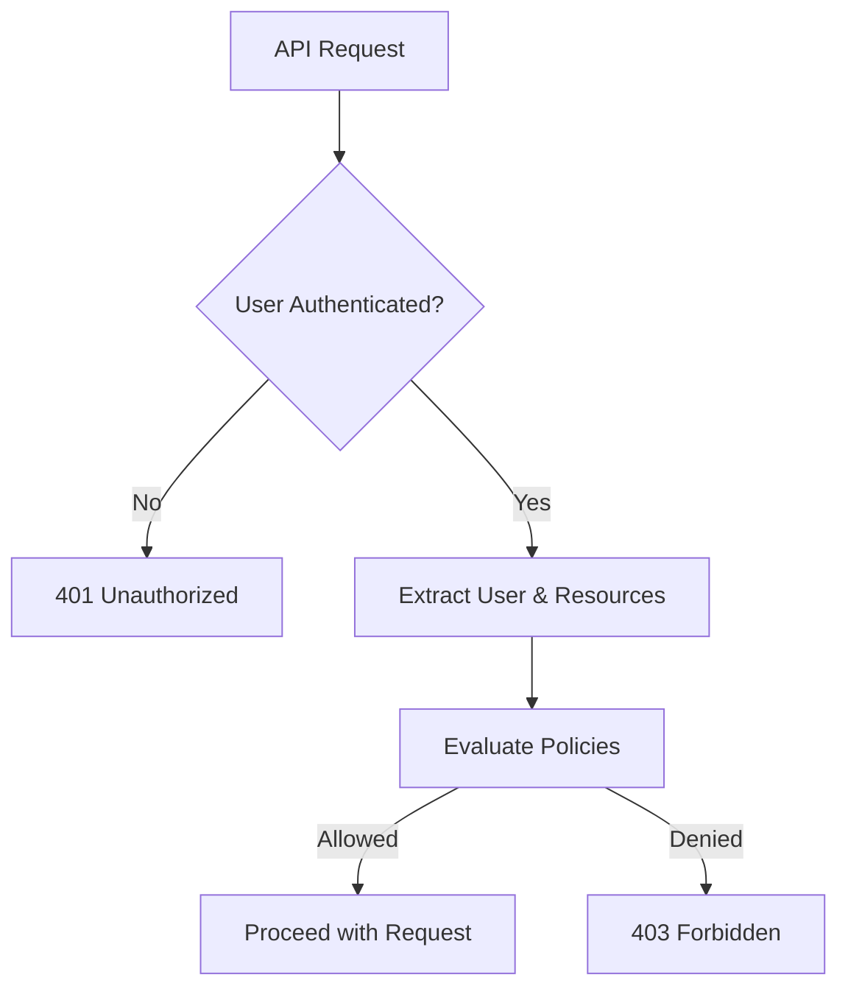

```markdown
---
title: "Authorization Setup: A Practical Guide for Backend Engineers"
date: 2023-11-05
author: "Alex Carter"
description: "Learn how to implement robust authorization in your backend systems with real-world examples and best practices."
tags: ["backend", "authentication", "authorization", "security", "API design"]
---

# Authorization Setup: Building a Secure Backend from Scratch

Every backend system needs to answer one critical question: **"Who gets to do what?"** This isn't just about locking doors—it's about giving users precise access to resources while keeping your system flexible for future needs. Poor authorization design can lead to security breaches, frustrated users, and technical debt that compounds over time.

In this guide, we'll walk through a **practical implementation of authorization setup** using a real-world example: a task management API for a small team. We'll cover core concepts, tradeoffs, and code examples you can adapt to your projects. By the end, you'll know how to structure authorization logic that scales while avoiding common pitfalls.

---

## The Problem: Why Authorization is Harder Than It Looks

Authorization isn't just "checking if a user is logged in." It’s about **fine-grained access control**—ensuring users can only interact with resources they’re allowed to modify. Without proper setup, you’ll face:

1. **Security risks**: Over-permissive policies can let malicious users bypass security (e.g., a server admin accidentally able to delete user data)
2. **Complexity**: Mixing authentication and authorization logic in your API makes debugging harder
3. **Scalability**: Hard-coded rules don’t work as teams grow or requirements change
4. **User friction**: Overly restrictive rules frustrate legitimate users (e.g., a team lead unable to edit their own team’s tasks)

### Real-World Example: The Task Management API
Imagine a simple API with endpoints like:
- `GET /tasks` – List all tasks
- `POST /tasks` – Create a new task
- `PUT /tasks/{id}` – Update a task
- `DELETE /tasks/{id}` – Delete a task

Without authorization, every user could edit or delete any task. With proper setup, we’d expect:
- Users only edit/delete their own tasks
- Team leads can edit all their team’s tasks
- Admins can do everything

---

## The Solution: A Modular Authorization Pattern

The **Authorization Setup Pattern** combines these strategies for a balanced approach:

| Component               | Purpose                                                                 |
|-------------------------|--------------------------------------------------------------------------|
| **User roles**          | Categorize users by job function (admin, team lead, regular user)       |
| **Resource ownership**  | Tie resources to users/teams for granular control                       |
| **Policy-as-code**      | Define rules in an explicit, testable format                           |
| **Middleware**          | Decouple authorization logic from route handlers                        |
| **Caching**             | Optimize permission checks for high-traffic routes                      |

Here’s how we’ll implement this for our task API:



---

## Implementation: Step-by-Step Code Examples

We’ll use **Node.js + Express + PostgreSQL** as our stack, but the concepts apply to any backend.

### 1. Database Schema: Roles and Ownership

First, set up the database to track users and their roles. We’ll also add `assigned_to` and `team_id` to tasks for ownership checks.

```sql
-- users table: stores users and their roles
CREATE TABLE users (
    id SERIAL PRIMARY KEY,
    username VARCHAR(50) UNIQUE NOT NULL,
    email VARCHAR(100) UNIQUE NOT NULL,
    role VARCHAR(20) NOT NULL CHECK (role IN ('admin', 'team_lead', 'member')),
    created_at TIMESTAMP DEFAULT CURRENT_TIMESTAMP
);

-- teams table: for team-based ownership
CREATE TABLE teams (
    id SERIAL PRIMARY KEY,
    name VARCHAR(50) NOT NULL,
    created_by INTEGER REFERENCES users(id)
);

-- tasks table: with ownership fields
CREATE TABLE tasks (
    id SERIAL PRIMARY KEY,
    title VARCHAR(100) NOT NULL,
    description TEXT,
    assigned_to INTEGER REFERENCES users(id),
    team_id INTEGER REFERENCES teams(id),
    created_at TIMESTAMP DEFAULT CURRENT_TIMESTAMP
);
```

### 2. Role-Based Access Control (RBAC) Model

Define roles and their permissions in code:

```javascript
// rbac.js
const ROLES = {
  ADMIN: 'admin',
  TEAM_LEAD: 'team_lead',
  MEMBER: 'member',
};

const PERMISSIONS = {
  [ROLES.ADMIN]: ['read', 'create', 'update', 'delete', 'manage_teams'],
  [ROLES.TEAM_LEAD]: ['read', 'create', 'update', 'delete'],
  [ROLES.MEMBER]: ['read', 'create', 'update'],
};

module.exports = { ROLES, PERMISSIONS };
```

### 3. Middleware for Authorization

Create middleware to check permissions before allowing a route:

```javascript
// authMiddleware.js
const { ROLES, PERMISSIONS } = require('./rbac');

const checkPermission = (requiredPermission) => {
  return (req, res, next) => {
    const user = req.user; // Attached by auth middleware (e.g., JWT)
    if (!user) return res.status(401).send('Unauthorized');

    const hasPermission = PERMISSIONS[user.role].includes(requiredPermission);
    if (!hasPermission) {
      return res.status(403).send('Forbidden');
    }
    next();
  };
};

// Example usage
const createTaskRouter = require('express').Router();
createTaskRouter.post(
  '/',
  checkPermission('create'),
  (req, res) => {
    // Create task logic
  }
);

module.exports = createTaskRouter;
```

### 4. Ownership-Based Policies

Extend the middleware to check resource ownership:

```javascript
// ownershipMiddleware.js
const { Task } = require('./models'); // Assume we have a Task model

const ownsResource = (resourceId) => async (req, res, next) => {
  try {
    const resource = await Task.findByPk(resourceId);
    if (!resource) return res.status(404).send('Resource not found');

    // Check if user owns the resource or is a team lead
    const isOwner = resource.assigned_to === req.user.id;
    const isTeamLead = req.user.role === ROLES.TEAM_LEAD &&
                       resource.team_id === req.user.team_id;

    if (!isOwner && !isTeamLead) {
      return res.status(403).send('Forbidden: Not authorized to edit this task');
    }
    next();
  } catch (error) {
    res.status(500).send('Server error');
  }
};

// Example usage
const updateTaskRouter = require('express').Router();
updateTaskRouter.put(
  '/:id',
  ownsResource('id'), // Dynamic ownership check
  (req, res) => {
    // Update task logic
  }
);

module.exports = updateTaskRouter;
```

### 5. Policy-as-Code: ABAC (Attribute-Based Access Control)

For more complex rules, use a policy engine. Here’s a simple implementation:

```javascript
// policyEngine.js
class PolicyEngine {
  constructor() {
    this.policies = [];
  }

  addPolicy(name, condition) {
    this.policies.push({ name, condition });
  }

  checkPolicy(req, policyName) {
    const policy = this.policies.find(p => p.name === policyName);
    if (!policy) return false;
    return policy.condition(req);
  }

  evaluate(req, policyNames) {
    return policyNames.every(name => this.checkPolicy(req, name));
  }
}

// Example: "CanDeleteTask" policy
const policyEngine = new PolicyEngine();
policyEngine.addPolicy('CanDeleteTask', (req) => {
  const task = req.task; // Assigned in middleware
  return (
    task.assigned_to === req.user.id ||
    (req.user.role === ROLES.TEAM_LEAD && task.team_id === req.user.team_id)
  );
});

// Middleware to evaluate policies
const checkPolicy = (policyNames) => (req, res, next) => {
  if (policyEngine.evaluate(req, policyNames)) {
    next();
  } else {
    res.status(403).send('Forbidden');
  }
};
```

### 6. Combining All Components

Here’s how the full API might look:

```javascript
// server.js
const express = require('express');
const { checkPermission, ownsResource } = require('./middleware');
const { Task } = require('./models');
const { ROLES } = require('./rbac');

const app = express();

// Mock auth middleware (in reality, use JWT or session)
app.use((req, res, next) => {
  // Attach a mock user for testing
  req.user = {
    id: 1,
    role: ROLES.TEAM_LEAD,
    team_id: 1
  };
  next();
});

// Task routes
app.post(
  '/tasks',
  checkPermission('create'),
  async (req, res) => {
    const task = await Task.create({
      ...req.body,
      assigned_to: req.user.id,
      team_id: req.user.team_id,
    });
    res.status(201).send(task);
  }
);

app.put(
  '/tasks/:id',
  ownsResource('id'),
  async (req, res) => {
    const task = await Task.findByPk(req.params.id);
    if (!task) return res.status(404).send('Task not found');

    // Update task (e.g., title)
    task.title = req.body.title;
    await task.save();
    res.send(task);
  }
);

app.delete(
  '/tasks/:id',
  ownsResource('id'),
  checkPermission('delete'), // Redundant here but shows redundancy checks
  async (req, res) => {
    await Task.destroy({ where: { id: req.params.id } });
    res.status(204).send();
  }
);

app.listen(3000, () => console.log('Server running on port 3000'));
```

---

## Implementation Guide: Key Decisions

### 1. Choose Your RBAC Model
- **Flat roles**: Simple but inflexible (e.g., only `admin`, `user`).
- **Hierarchical roles**: Roles can inherit permissions (e.g., `team_lead` → `member` permissions + extras).
- **Dynamic roles**: Assign roles at runtime (e.g., for temporary access).

**Example of hierarchical roles:**
```javascript
const PERMISSIONS = {
  [ROLES.ADMIN]: ['*'], // Admin has all permissions
  [ROLES.TEAM_LEAD]: ['read', 'create', 'update', 'delete', ...PERMISSIONS[ROLES.MEMBER]],
  [ROLES.MEMBER]: ['read', 'create', 'update'],
};
```

### 2. Ownership vs. Roles
- **Ownership**: Best for user-specific resources (e.g., tasks assigned to a user).
- **Roles**: Best for system-wide access (e.g., database admin).
- **Hybrid**: Use both (e.g., `team_lead` can edit tasks in their team).

### 3. Caching Policies
For high-traffic APIs, cache policy evaluations to avoid repeated DB queries:
```javascript
const NodeCache = require('node-cache');
const cache = new NodeCache({ stdTTL: 300 }); // 5-minute cache

app.use((req, res, next) => {
  const cacheKey = `policy:${req.originalUrl}:${req.user.id}`;
  const cached = cache.get(cacheKey);
  if (cached) return res.status(403).send('Forbidden (cached)');

  // Evaluate policy and cache result
  const hasPermission = evaluatePolicy(req);
  if (!hasPermission) {
    cache.set(cacheKey, true, 300);
    return res.status(403).send('Forbidden (cached)');
  }
  next();
});
```

### 4. Testing Authorization
Write tests to verify:
- Users without roles get `401`.
- Users with insufficient roles get `403`.
- Permissions are updated when roles change.

**Example test (Jest):**
```javascript
describe('Authorization', () => {
  it('should deny admins from reading private tasks', async () => {
    const res = await request(app)
      .get('/tasks/private-task')
      .set('Authorization', 'Bearer admin-token');

    expect(res.status).toBe(403);
  });
});
```

---

## Common Mistakes to Avoid

1. **Mixing Authentication and Authorization**
   - *Problem*: Checking `req.user` directly in route handlers leaks authorization logic.
   - *Fix*: Use middleware to enforce policies before handlers.

2. **Overly Complex Permissions**
   - *Problem*: A permissions list like `['read:task:id', 'write:task:id', ...]` becomes unwieldy.
   - *Fix*: Group permissions by role or resource type.

3. **Ignoring Edge Cases**
   - *Problem*: Not handling:
     - Concurrent role changes (e.g., user promotes themselves).
     - Guest users (e.g., public API endpoints).
   - *Fix*: Test edge cases and document assumptions.

4. **Hard-Coded Policies**
   - *Problem*: Policies baked into route handlers are hard to modify.
   - *Fix*: Externalize policies (e.g., config file, database table).

5. **Not Validating Inputs**
   - *Problem*: A user might tamper with IDs (e.g., `PUT /tasks/-1`).
   - *Fix*: Validate all inputs and resource IDs.

---

## Key Takeaways

- **Start simple**: Begin with roles and ownership, then add complexity as needed.
- **Decouple logic**: Separate auth middleware from route handlers.
- **Test thoroughly**: Authorization is security-critical—test like it’s production.
- **Document policies**: Clearly define "who can do what" for other developers.
- **Plan for scale**: Assume your system will grow—design for flexibility.
- **Balance security and usability**: Overly restrictive rules frustrate users; overly permissive rules are insecure.

---

## Conclusion

Authorization isn’t a one-time setup—it’s an ongoing process. By modularizing your approach (roles, ownership, policies, middleware), you’ll build a system that’s secure, maintainable, and adaptable. Start with the basics, test rigorously, and refine as you go.

### Next Steps:
1. **Read further**: [OAuth 2.0 vs. OpenID Connect](https://auth0.com/docs/quickstart/webapp/authorization-code-flow) for advanced auth flows.
2. **Experiment**: Try implementing a policy engine like [Casbin](https://casbin.org/).
3. **Review**: [OWASP Authorization Cheat Sheet](https://cheatsheetseries.owasp.org/cheatsheets/Authorization_Cheat_Sheet.html).

Now go build a system where users can only access what they’re supposed to—without breaking a sweat!

---
```