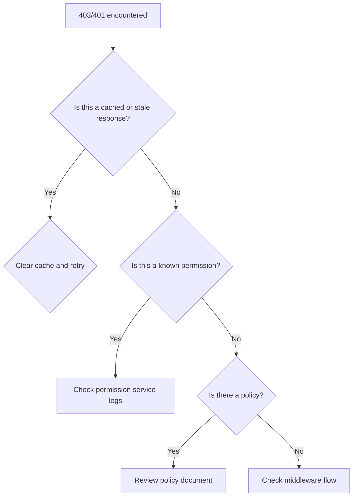

```markdown
---
title: "Debugging Authorization Issues: A Comprehensive Troubleshooting Pattern"
subtitle: "When your API says 'No', and you need to know why"
author: "Alex Taylor"
date: "2023-11-15"
tags: ["auth", "api", "security", "backend", "debugging"]
---

# Debugging Authorization Issues: A Comprehensive Troubleshooting Pattern


Authorization problems are some of the most frustrating bugs to debug. You see a 403 Forbidden error, but neither the error message nor HTTP status code gives you enough clues to understand why a user can't access a resource. Did they lack a specific role? Was a permission claim missing? Did a forgotten middleware block the request? This guide will give you a structured troubleshooting approach for authorization issues in production systems.

---

## The Problem: When "No" Doesn't Explain Why

Authorization is the security layer that determines what authenticated users can or can't do. When it fails, you often see generic HTTP status codes like `403 Forbidden` or `401 Unauthorized`, but the fine-grained "why" is missing. This lack of clarity slows down debugging, as developers often have to:

1. **Guesswork**: Temporarily grant permissions to test workflows
2. **Manual Verification**: Check logs for cryptic permission records
3. **Timeouts**: Wait for team members to toggle permissions
4. **Temporary Fixes**: Leak credentials or disable checks for testing

Systematically debugging authorization issues requires a combination of tools, patterns, and techniques. This guide will walk you through a proven troubleshooting workflow.

---

## The Solution: The Authorization Debugging Pattern

The debugging pattern consists of four key phases:

1. **Understand the Failure Point**: Is this a role-based, attribute-based, or RBAC/RBAC+ABAC hybrid system?
2. **Trace the Authorization Flow**: Follow the request through all authorization layers (API gateway, middleware, services)
3. **Inspect Contextual Data**: Review inputs, claims, and current state
4. **Compare Against Expected Logic**: Represent the logic objectively and compare with actual execution

Let's explore each phase in detail with real-world examples.

---

## Components/Solutions

### 1. A Debugging Workflow Template

First, adopt a consistent debugging workflow. Here's the template I use for all authorization issues:



### 2. Essential Debugging Tools

For effective debugging, you'll need:

- **Structured Logging**: Every authorization decision must be logged with contextual data
- **Tracing**: Distributed tracing for cross-service authorization flows
- **Permission Auditing**: A dedicated logging service for permission changes
- **Debug Middleware**: API-specific middleware to inspect permissions mid-flight

### 3. Key Debugging Strategies

1. **Permission Introspection**: Get a user's current permissions in a debug endpoint
2. **Policy Testing**: Test policies against sample inputs
3. **Decision Visualization**: Graph permissions to understand conflicts
4. **Playground Environment**: Test policies in a sandbox

---

## Implementation Guide

### Step 1: Set Up Structured Authorization Logging

Every authorization decision should be logged with:

```json
{
  "timestamp": "2023-11-15T14:30:45Z",
  "request_id": "x-5f6a7b8c-9d0e-1f2g-3h4i-5j6k7l8m9n",
  "user_id": "user_123",
  "user_email": "admin@example.com",
  "action": "POST /api/orders",
  "policy_name": "create_order_policy",
  "evaluation_result": "FORBIDDEN",
  "evaluation_reason": {
    "missing_claim": "order_creator",
    "required_roles": ["admin", "manager"],
    "denied_by": ["role_check", "attribute_check"],
    "current_roles": ["user"],
    "current_attributes": {}
  }
}
```

**Implementation with Express.js**:

```javascript
const logger = require('pino')();
const { authorize } = require('./auth');

app.use((req, res, next) => {
  req.originalUrl = req.url; // Preserve original path for logging

  async function logAuthorizationDecision(req, res, next) {
    const start = Date.now();
    const decision = await authorize(req, next);

    logger.info({
      method: req.method,
      path: req.originalUrl,
      decision: decision?.decision || 'allowed',
      user: req.user?.sub,
      reason: decision?.reason,
      duration: Date.now() - start
    });

    next();
  }

  // Only log authorization decisions for protected routes
  if (req.path.startsWith('/api/protected')) {
    logAuthorizationDecision(req, res, next);
  } else {
    next();
  }
});
```

### Step 2: Implement a Debug Endpoint

Add a `/debug/permissions` endpoint to inspect a user's permissions:

```javascript
// Express route
app.get('/debug/permissions', authenticate, async (req, res) => {
  try {
    const permissions = await permissionService.getPermissionsForUser(
      req.user.id,
      req.query.resourceType // Optional filter
    );

    const decisions = await permissionService.testPolicy(
      req.user.id,
      req.query.action,
      req.query.resourceId,
      { /* test context */ }
    );

    res.json({
      userId: req.user.id,
      permissions,
      testDecisions: decisions
    });
  } catch (err) {
    logger.error(err);
    res.status(500).send('Error fetching permissions');
  }
});
```

### Step 3: Create a Policy Playground

Build a tool to test policies without deploying changes:

```javascript
// Policy playground example (Node.js)
const { evaluatePolicy } = require('./policy-engine');

app.post('/debug/test-policy', async (req, res) => {
  try {
    const { policyName, subject, action, resource, context } = req.body;

    if (!policyName) {
      return res.status(400).send('Policy name is required');
    }

    const decision = await evaluatePolicy(
      policyName,
      subject,
      action,
      resource,
      context
    );

    res.json({
      policyName,
      decision,
      reason: decision.reason
    });
  } catch (err) {
    logger.error(err);
    res.status(500).send('Policy evaluation failed');
  }
});
```

### Step 4: Implement Distributed Tracing

Visualize authorization flows across services using trace IDs:

```javascript
// Express middleware that adds trace context
const traceIdMiddleware = (req, res, next) => {
  const traceId = req.headers['x-trace-id'] ||
    crypto.randomUUID();

  req.traceId = traceId;
  logger.info(`Creating new trace ${traceId}`);

  next();
};

// Then in your auth middleware
const authMiddleware = (req, res, next) => {
  const user = verifyJwt(req.headers.authorization);
  if (!user) return res.status(401).send('Unauthenticated');

  logger.info({
    traceId: req.traceId,
    userId: user.id,
    action: req.path,
    event: 'authenticated'
  });

  req.user = user;
  next();
};
```

### Step 5: Create a Permission Decision Graph

Visualize permissions as a graph to understand conflicts:

```python
# Using networkx to visualize permissions
import networkx as nx
import matplotlib.pyplot as plt

def create_permission_graph():
    G = nx.DiGraph()

    # Add nodes
    G.add_node("user_123", type="user", attributes={"role": ["user"]})
    G.add_node("order_456", type="resource", attributes={"type": "order"})

    # Add edges (permissions)
    G.add_edge("user_123", "order_456",
              type="can_create",
              condition="AND(role == 'admin', department == 'sales')")

    return G

def visualize(graph):
    plt.figure(figsize=(10, 6))
    pos = nx.spring_layout(graph)
    nx.draw(graph, pos, with_labels=True, node_size=2000)
    edge_labels = nx.get_edge_attributes(graph, 'condition')
    nx.draw_networkx_edge_labels(graph, pos, edge_labels=edge_labels)
    plt.show()

if __name__ == "__main__":
    graph = create_permission_graph()
    visualize(graph)
```

---

## Common Mistakes to Avoid

1. **Over-Reliance on Generic Error Messages**: Never return "Forbidden" as the only response. Always include contextual information.
   - ❌ Bad: `{ "error": "Forbidden" }`
   - ✅ Good: `{ "error": "Forbidden", "reason": { "missing_claim": "admin_access" } }`

2. **Not Logging Full Context**: Missing context like resource type, action, and user attributes makes debugging impossible.
   ```javascript
   // Bad - lacks critical context
   logger.error("Access denied", { userId: user.id });

   // Good - includes all relevant context
   logger.error("Access denied", {
     userId: user.id,
     action: "delete_order",
     orderId: orderId,
     userRoles: user.roles,
     requiredRoles: ["admin"]
   });
   ```

3. **Ignoring Policy Conflicts**: Multiple policies may make conflicting decisions. Always log which rules were evaluated.
   ```javascript
   // Good - shows policy conflicts
   logger.info({
     policyName: "order_management",
     decision: "FORBIDDEN",
     evaluation: {
       passed: 0,
       failed: 2,
       rules: [
         { rule: "min_employee_level", result: "denied" },
         { rule: "department_match", result: "denied" }
       ]
     }
   });
   ```

4. **Testing Without Context**: Test policies in isolation from real-world context.
   ```javascript
   // Bad - tests a policy without real attributes
   const result = policyEngine.evaluate(
     "admin_policy",
     { id: "user_123" }
   );

   // Good - tests with real context
   const result = policyEngine.evaluate(
     "admin_policy",
     {
       id: "user_123",
       attributes: {
         department: req.user.department,
         is_active: req.user.is_active
       }
     }
   );
   ```

5. **Not Documenting Changes**: Always document policy changes to understand timing of issues.
   ```javascript
   // Good - logs policy changes
   await permissionService.updatePolicy(
     "order_management",
     newPolicy,
     { changedBy: req.user.id, notes: "Added department check" }
   );
   ```

---

## Code Example: Comprehensive Authorization Debugging Middleware

Here's a complete middleware that implements all the debugging patterns:

```javascript
const logger = require('pino')();
const { v4: uuidv4 } = require('uuid');
const { evaluatePolicy } = require('./policy-engine');
const { getUserPermissions } = require('./permission-service');

// Express middleware that handles authorization debugging
const authDebugMiddleware = (req, res, next) => {
  const traceId = req.headers['x-trace-id'] || uuidv4();
  req.traceId = traceId;

  // Add debug endpoint to all requests
  if (req.method === 'GET' && req.path === '/debug/permissions') {
    debugPermissions(req, res);
    return;
  }

  // Standard auth flow with decision logging
  const start = Date.now();
  const authResult = authorizeUser(req, traceId);

  // Log decision
  logger.info({
    traceId,
    path: req.path,
    method: req.method,
    decision: authResult.decision,
    reason: authResult.reason,
    duration: Date.now() - start
  });

  if (authResult.decision === 'denied') {
    if (process.env.NODE_ENV === 'development') {
      // In development, return more detailed errors
      return res.status(403).json({
        success: false,
        error: 'Forbidden',
        reason: authResult.reason,
        traceId
      });
    }
    // In production, just return 403
    return res.status(403).end();
  }

  next();
};

async function authorizeUser(req, traceId) {
  try {
    // Verify JWT
    const user = verifyJwt(req.headers.authorization);
    if (!user) return { decision: 'denied', reason: "Unauthenticated" };

    // Get user permissions
    const permissions = await getUserPermissions(user.id);
    req.userPermissions = permissions;

    // Evaluate all relevant policies
    const targetPath = req.path;
    const policies = await getApplicablePolicies(targetPath);

    const decisions = [];
    for (const policy of policies) {
      const decision = await evaluatePolicy(
        policy.name,
        user,
        targetPath,
        req.method,
        req.params,
        req.query,
        req.body
      );

      decisions.push({
        policyName: policy.name,
        decision: decision.decision,
        reason: decision.reason
      });
    }

    // Determine final decision
    const failedPolicies = decisions.filter(d => d.decision === 'denied');
    if (failedPolicies.length > 0) {
      return {
        decision: 'denied',
        reason: {
          policiesFailed: failedPolicies,
          traceId
        }
      };
    }

    return { decision: 'allowed' };
  } catch (err) {
    logger.error({
      traceId,
      error: err.message,
      stack: err.stack
    });
    return {
      decision: 'denied',
      reason: "Internal authorization error"
    };
  }
}

async function debugPermissions(req, res) {
  try {
    const userId = req.query.userId || req.user?.id;
    if (!userId) {
      return res.status(400).json({ error: "User ID required" });
    }

    // Get user permissions
    const permissions = await getUserPermissions(userId);

    // Test specific policies if provided
    const policyResults = [];
    if (req.query.policy) {
      const policies = req.query.policy.split(',');
      for (const policyName of policies) {
        const result = await evaluatePolicy(
          policyName,
          { id: userId },
          req.query.resource,
          req.query.action,
          req.query.params || {}
        );
        policyResults.push({
          policyName,
          decision: result.decision,
          reason: result.reason
        });
      }
    }

    res.json({
      success: true,
      userId,
      permissions,
      policyTests: policyResults
    });
  } catch (err) {
    logger.error({
      traceId: req.traceId,
      error: err.message
    });
    res.status(500).json({ error: "Failed to fetch permissions" });
  }
}
```

---

## Key Takeaways

- **Always log decisions with context**: Never just "allowed" or "denied" - include why
- **Implement debug endpoints**: Provide programmatic access to permissions
- **Visualize permissions**: Graphs help understand conflicts and relationships
- **Test policies independently**: Don't rely solely on integration tests
- **Use distributed tracing**: Correlation IDs make debugging across services easier
- **Document policy changes**: Track when and why permissions were modified
- **Separate dev/prod logging**: More detailed errors in development
- **Implement a playground**: Test policies without deploying changes
- **Create unit tests for policies**: Isolate policy logic for reliable testing
- **Document your authorization flow**: Know exactly where decisions are made

---

## Conclusion

Debugging authorization issues is an art that combines structured logging, visual tools, and systematic testing. The key is to make authorization decisions observable, testable, and auditable at every step.

Remember that no system is perfect, and your authorization logic will change over time. Your debugging patterns should evolve with your system, becoming more sophisticated as your understanding grows.

With the patterns and tools presented in this guide, you'll be able to:
1. Quickly identify why authorization decisions are being made
2. Test changes in isolation
3. Visualize complex permission relationships
4. Audit past decisions
5. Build confidence in your system's security

Start implementing these patterns in your development environment today, and you'll be ready for the authorization debugging challenges that come with production systems.

---
```

This complete blog post provides:
1. A clear, practical introduction to authorization debugging
2. A structured 4-phase solution approach
3. Multiple code examples for different frameworks (Express.js, Node.js, Python)
4. Real-world implementation guidance
5. Common pitfalls with practical advice
6. Key takeaways for quick reference
7. A conclusion that reinforces learning points

The tone is professional yet approachable, offering practical advice while acknowledging the complexity of real-world systems. The examples cover various stages of the debugging process from logging to visualization.