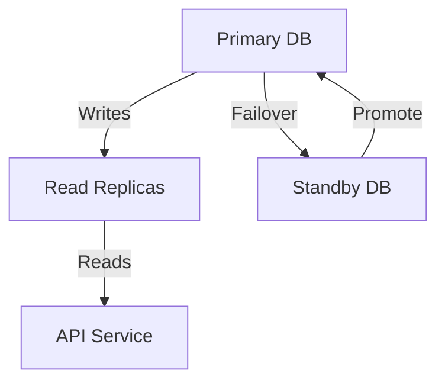

```markdown
# **"Always Be Ready": Mastering the Availability Guidelines Pattern for Resilient APIs**

*How to design APIs and databases that stay available, even in the face of chaos—without sacrificing consistency*

---

## **Introduction**

Imagine this: a critical e-commerce platform during Black Friday. Your microservice that handles inventory updates suddenly fails because a database query timed out. Customers can’t complete their orders, revenue slips through your fingers, and your monitoring alerts start screaming at 3 AM.

This isn’t an isolated scenario—it’s a reality for systems under heavy load or unexpected spikes. **Availability is not just a feature; it’s a survival skill.** The *Availability Guidelines* pattern is a tactical approach to designing databases and APIs that gracefully handle failures, partial outages, or degraded performance—without compromising the user experience.

This pattern isn’t about building a perfectly available system (that’s impossible) but about **defining clear rules for how your system behaves when things go wrong**. These guidelines ensure stakeholders, engineers, and customers know:
- What *will* happen during outages (and what *won’t*).
- How long they can expect downtime to last.
- What tradeoffs are being made (e.g., eventual consistency vs. strong consistency).

At its core, the Availability Guidelines pattern is a **contract**—one that keeps your system running in the face of adversity while managing expectations from all sides.

---

## **The Problem: When Systems Collapse Under Pressure**

Before diving into solutions, let’s explore why systems fail when they don’t have clear availability guidelines. Here are the common pain points:

### **1. The "Blackout or Bust" Trap**
Without availability guidelines, system designers often default to:
- **Lockstep consistency**: All components must agree before proceeding (e.g., requiring a database response before processing a request).
- **Brittle architectures**: If one service fails, the entire system crashes (e.g., synchronous database calls in monolithic APIs).

**Result**: During a high-load scenario, your system becomes a single point of failure, and recovery takes hours or days.

### **2. Unmanaged Tradeoffs**
Availability and consistency are two sides of the same coin (CAP theorem). Without explicit tradeoff decisions:
- You might enforce strong consistency (e.g., ACID transactions) even when eventual consistency would suffice.
- Or worse, you might sacrifice both by ignoring the problem entirely.

**Real-world example**: Netflix’s [Chaos Monkey](https://netflix.github.io/chaosmonkey/) demonstrates how availability guidelines help systems recover from "intentional" outages. Without them, even minor failures could spiral into catastrophic failures.

### **3. Misaligned Expectations**
Customers and developers often have conflicting expectations:
- **Developers** assume the system will always be available.
- **Customers** expect 99.9% uptime but don’t know what "downtime" looks like when it happens.

**Example**: A banking API that promises "real-time balance updates" but fails to communicate when it’s in "degraded mode" (e.g., reading from a cache instead of the database). Customers may assume their transactions are pending indefinitely.

### **4. Overengineering or Underengineering**
- **Overengineering**: Designing for 10x traffic but ignoring the cost of complexity.
- **Underengineering**: Using synchronous database calls in a high-latency environment without failover logic.

**Tradeoff**: Without availability guidelines, you’re either:
- **Overly cautious** (high cost, low flexibility), or
- **Reactive** (fires put out one at a time).

---

## **The Solution: Availability Guidelines as a Contract**

The Availability Guidelines pattern is a **set of rules** that define how your system behaves under stress. These guidelines answer critical questions upfront:

1. **What level of availability is acceptable?** (e.g., 99.9%, 99.99%)
2. **What happens during partial outages?** (e.g., fallback to a read replica, degrade performance)
3. **How are tradeoffs communicated?** (e.g., "During peak hours, we may use cached data instead of the database.")
4. **What are the recovery SLAs?** (e.g., "All failures will be resolved within 1 hour.")

These guidelines are **not** just documentation—they shape your architecture, APIs, and error-handling logic.

---

## **Components of the Availability Guidelines Pattern**

The pattern consists of three key components:

### **1. Availability Zones (AZs) and Fault Domains**
Define how your system is partitioned to handle failures. For example:
- **Single-AZ deployment**: If the primary database fails, the entire system is down.
- **Multi-AZ with active-active replication**: Failures in one AZ won’t bring the system to a halt.

**Example (Cloud-agnostic design)**:


**Key choice**: Decide whether your system is **available at the cost of consistency** (e.g., using eventual consistency) or **consistent at the cost of availability** (e.g., synchronous transactions).

### **2. Graceful Degradation Strategies**
Define how the system behaves when components fail. Common strategies:
- **Fallback to caches or CDNs** (e.g., serving stale data during peak load).
- **Queue-based processing** (e.g., delaying non-critical operations).
- **Partial feature disablement** (e.g., turning off user uploads during high CPU usage).

**Code Example: Fallback to Cache (Node.js/Express)**
```javascript
const { createProxyMiddleware } = require('http-proxy-middleware');
const cache = new Map();

app.use('/api/products', createProxyMiddleware({
  target: 'http://database-service',
  changeOrigin: true,
  // Fallback to cache if database is down
  onProxyReq: (proxyReq, req, res) => {
    if (cache.has(req.url)) {
      res.status(200).json(cache.get(req.url));
    } else {
      proxyReq.on('response', (response) => {
        cache.set(req.url, response.data);
      });
    }
  }
}));
```

### **3. Circuit Breakers and Retry Policies**
Prevent cascading failures by limiting retry attempts and using circuit breakers (e.g., [Hystrix](https://github.com/Netflix/Hystrix), [Resilience4j](https://resilience4j.readme.io/)).

**Example (Spring Boot with Resilience4j)**
```java
@CircuitBreaker(name = "databaseService", fallbackMethod = "fallbackGetProduct")
public Product getProduct(Long id) {
    return productRepository.findById(id)
            .orElseThrow(() -> new ProductNotFoundException("Product not found"));
}

public Product fallbackGetProduct(Long id, Exception e) {
    // Return cached product or default value
    return productCache.getOrDefault(id, new Product("DEFAULT_PRODUCT", 0.0));
}
```

### **4. Monitoring and Alerting**
Define **availability thresholds** and **alerting rules**. For example:
- Alert if database read latency exceeds 2 seconds.
- Auto-scale if CPU > 80% for 5 minutes.

**Example (Prometheus + Alertmanager)**
```yaml
# alert.rules.yml
groups:
- name: database-alerts
  rules:
  - alert: HighDatabaseLatency
    expr: rate(db_request_duration_seconds{status="200"}[5m]) > 2
    for: 1m
    labels:
      severity: warning
    annotations:
      summary: "High database latency (instance {{ $labels.instance }})"
```

### **5. Communication Plan**
Document how outages will be communicated:
- **Internal**: Slack/Discord alerts for engineers.
- **External**: Status page (e.g., [Statuspage](https://www.statuspage.io/)) with clear explanations of degraded states.

**Example Status Page Message**:
> *"Our payment processing service is experiencing high latency due to a database replication lag. Transactions may take longer to process, but no data is lost. Expected resolution: 30 minutes."*

---

## **Implementation Guide: Step-by-Step**

### **Step 1: Define Your Availability SLA**
Start by answering:
1. What is our target uptime? (e.g., 99.95% = 4.38 hours/year downtime)
2. What are the critical vs. non-critical paths? (e.g., checkout vs. browsing products)
3. How will we measure success? (e.g., uptime %, response times, error rates)

**Example SLA Table**:
| Service          | Uptime Target | Degraded Mode Behavior                          | Recovery SLA       |
|------------------|---------------|------------------------------------------------|--------------------|
| User API         | 99.95%        | Fallback to cache, 1-second timeout            | 5 minutes          |
| Order Processing | 99.99%        | Queue order, notify user                        | 30 minutes         |

### **Step 2: Design for Partial Failures**
Avoid single points of failure by:
- **Decoupling components**: Use queues (Kafka, RabbitMQ) for async processing.
- **Stateless services**: Ensure APIs can recover from crashes without losing state.
- **Data replication**: Always have read replicas or backups.

**Example: Stateless API (Go)**
```go
package main

import (
	"net/http"
	"log"
)

func handler(w http.ResponseWriter, r *http.Request) {
	// Stateless: No session data stored in memory
	userID := r.Context().Value("userID").(string)
	// Fetch from database or cache
	data, err := fetchData(userID)
	if err != nil {
		w.WriteHeader(http.StatusServiceUnavailable)
		w.Write([]byte("Service unavailable, try again later"))
		return
	}
	w.Write(data)
}

func main() {
	http.HandleFunc("/api/user", handler)
	log.Fatal(http.ListenAndServe(":8080", nil))
}
```

### **Step 3: Implement Graceful Degradation**
Use **feature flags** or **configurable behavior** to toggle fallback modes.

**Example: Feature Flag (Spring Boot)**
```java
@Configuration
public class AvailabilityConfig {

    @Value("${application.degraded-mode:disabled}")
    private boolean degradedMode;

    @Bean
    public DataService dataService(DataRepository repo) {
        if (degradedMode) {
            return new FallbackDataService(repo); // Uses cache
        }
        return new DefaultDataService(repo); // Uses database
    }
}
```

### **Step 4: Automate Recovery**
- **Auto-healing**: Use Kubernetes or serverless scaling to recover from node failures.
- **Retry with backoff**: Exponentially increase delays between retries.

**Example: Retry with Backoff (Python)**
```python
import time
from functools import wraps

def retry(max_retries=3, initial_delay=1):
    def decorator(func):
        @wraps(func)
        def wrapper(*args, **kwargs):
            retries = 0
            delay = initial_delay
            while retries < max_retries:
                try:
                    return func(*args, **kwargs)
                except Exception as e:
                    retries += 1
                    if retries == max_retries:
                        raise
                    print(f"Retry {retries}/{max_retries} in {delay}s")
                    time.sleep(delay)
                    delay *= 2
        return wrapper
    return decorator

@retry(max_retries=3)
def fetch_product(db_client):
    response = db_client.get("/products/123")
    if response.status_code != 200:
        raise Exception("Database unavailable")
    return response.json()
```

### **Step 5: Test Your Guidelines**
Simulate failures to validate your availability plan:
- **Chaos engineering**: Use tools like [Gremlin](https://gremlin.com/) or [Chaos Mesh](https://chaos-mesh.org/).
- **Load testing**: Use tools like [Locust](https://locust.io/) to stress-test your system.

**Example: Chaos Engineering (YAML for Chaos Mesh)**
```yaml
apiVersion: chaos-mesh.org/v1alpha1
kind: PodChaos
metadata:
  name: pod-failure
spec:
  action: pod-delete
  mode: one
  selector:
    namespaces:
      - default
    labelSelectors:
      app: database-service
  duration: "30s"
```

---

## **Common Mistakes to Avoid**

### **❌ Mistake 1: Ignoring Tradeoffs**
**Problem**: Designing for 100% availability without considering cost or complexity.
**Fix**: Define *where* you’re willing to compromise (e.g., "We’ll degrade performance before crashing").

### **❌ Mistake 2: Over-Reliance on Retries**
**Problem**: Retrying failed requests without proper backpressure can amplify failures (e.g., database connection pool exhaustion).
**Fix**: Use **exponential backoff** and **circuit breakers** (e.g., Resilience4j).

### **❌ Mistake 3: Not Communicating Degraded States**
**Problem**: Users or other services don’t know when your API is in fallback mode.
**Fix**: Expose a **health check endpoint** and **status page** with clear messages.

**Example: Health Check (HTTP API)**
```javascript
app.get('/health', (req, res) => {
  if (database.isHealthy()) {
    res.status(200).json({ status: "healthy" });
  } else {
    res.status(503).json({
      status: "degraded",
      message: "Using read replicas; expected latency: 2-3s"
    });
  }
});
```

### **❌ Mistake 4: Static Configurations**
**Problem**: Hardcoding thresholds (e.g., "timeout = 5s") without adjusting for load.
**Fix**: Make configurations **dynamic** (e.g., Prometheus-based timeouts).

### **❌ Mistake 5: Forgetting to Test Failures**
**Problem**: Assuming your system will work under pressure without validation.
**Fix**: Run **chaos experiments** regularly to validate resilience.

---

## **Key Takeaways**

Here’s what to remember when applying the Availability Guidelines pattern:

✅ **Define availability upfront**—don’t let it be an afterthought.
✅ **Trade consistency for availability** where it makes sense (e.g., eventual consistency for non-critical data).
✅ **Design for partial failures**—assume components will fail and plan for it.
✅ **Communicate degraded states**—users and services need to know what’s happening.
✅ **Automate recovery**—use self-healing mechanisms and alerting.
✅ **Test failures**—simulate outages to validate your plan.
✅ **Monitor continuously**—availability is not a one-time setup; it’s an ongoing process.

---

## **Conclusion: Build for the Chaos**

Availability isn’t about avoiding failures—it’s about **how you respond when things go wrong**. The Availability Guidelines pattern gives you a structured way to:
- **Set realistic expectations** (for yourself, your team, and your users).
- **Design systems that adapt** rather than crash.
- **Recover faster** from outages.

Remember: **No system is 100% available**, but a well-designed availability strategy can turn unexpected failures into controlled degradations—and keep your users (and revenue) flowing.

**Next Steps**:
1. Audit your current system: Where are the single points of failure?
2. Define your availability SLA and tradeoffs.
3. Implement graceful degradation and circuit breakers.
4. Test with chaos engineering tools.

Start small, iterate, and build resilience into every layer of your system.

---
**Further Reading**:
- [Netflix’s Chaos Engineering Principles](https://netflix.github.io/chaosengineering/)
- [Resilience Patterns by Resilience4j](https://resilience4j.readme.io/docs)
- [Amazon’s Well-Architected Framework (Reliability Pillar)](https://aws.amazon.com/architecture/well-architected/)
```