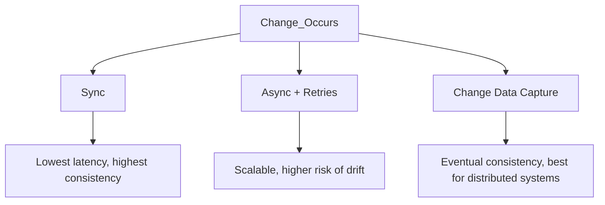

```markdown
---
title: "Availability Maintenance: Keeping Your Data Fresh When Things Change"
date: 2023-11-15
tags: ["database-design", "data-consistency", "patterns", "backend-engineering"]
description: "Learn how to handle data availability when business rules, requirements, and systems evolve. Practical patterns for maintaining fresh and relevant data in real-time."
---

# Availability Maintenance: Keeping Your Data Fresh When Things Change


*Illustration: The eternal challenge of keeping data current.*

Modern backend systems rarely exist in a static state. Business rules shift, user requirements evolve, and infrastructure scales unpredictably. Yet, many systems struggle to maintain data freshness—whether that means:

- Inventory counts that lag behind real-world stock changes.
- User profiles that reflect outdated preferences.
- Dashboards with stale metrics that mislead decision-makers.

This is where *Availability Maintenance* comes into play—a set of patterns to ensure your data stays relevant even as the world around it changes. In this guide, we’ll explore why fresh data matters, when stale data becomes a problem, and how to design systems that adapt gracefully.

---

## **The Problem: Why Availability Maintenance Matters**

Imagine this scenario:

A user purchases a premium subscription on your SaaS platform. Your backend records the order, updates their account balance, and grants access immediately. Sounds straightforward, right? Yet, here’s where it breaks down:

- **Delayed syncs**: The user’s profile in your analytics system (a separate service) updates *twelve hours later*. Their usage data starts being recorded under the wrong tier.
- **Misleading dashboards**: Your sales team sees "active premium users" at 5,000, but the actual count is 6,300 because some users were downgraded and not yet removed from reports.
- **Inconsistent UIs**: The frontend shows "Unlimited Storage" for a user, but the backend storage service still enforces a 1GB cap because the permission wasn’t propagated.

These aren’t hypotheticals. They’re real-world consequences of **eventual consistency**—a tradeoff for scalability that often leads to subtle bugs or poor UX.

### **When Stale Data Hurts Most**
Some systems can tolerate stale data; others cannot. Here’s a breakdown of the critical cases:

| **Scenario**               | **Impact of Stale Data**                          | **Example**                                  |
|----------------------------|--------------------------------------------------|----------------------------------------------|
| Financial systems          | Incorrect balances, lost revenue                 | A bank’s transaction log lags behind by 5 mins. |
| Real-time analytics        | Wrong metrics drive poor decisions               | A retailer assumes high demand for a product when inventory is nearly sold out. |
| User-facing permissions    | "Permission denied" errors for previously allowed actions | A user can’t delete an old file post-password reset. |
| Data compliance            | Violations of regulatory requirements           | Missing GDPR flags on user records due to sync delays. |

---
## **The Solution: Availability Maintenance Patterns**

The core idea behind *Availability Maintenance* is to **minimize the window between a change occurring and the system becoming aware of it**. Here’s how we approach it:

1. **Identify the critical "availability windows"** (e.g., "within 5 seconds" for permissions, "within 1 hour" for analytics).
2. **Design for synchronous updates where necessary**, even if it means limiting concurrency.
3. **Use async processing only where lag is tolerable**, with compensating actions for safety.
4. **Monitor and alert on availability deviations** to catch anomalies early.

Let’s dive into the key components and patterns.

---

## **Components of Availability Maintenance**

### **1. Synchronized Events**
The most straightforward approach: propagate changes immediately.

#### **Code Example: Synchronous Account Update (Python)**
```python
# API endpoint that triggers syncs in real-time
@app.post("/api/update-subscription")
def update_subscription(subscription_id: str, new_plan: str):
    # 1. Update in primary DB
    with db.session.begin():
        account = Account.query.get(subscription_id)
        account.plan = new_plan
        account.updated_at = datetime.utcnow()
        db.session.commit()

    # 2. Sync with storage service (synchronous call)
    storage_service.update_quota(account.id, new_plan)

    # 3. Sync with analytics (synchronous call)
    analytics_service.record_plan_change(account.id, new_plan)

    return {"status": "success"}
```

**Tradeoffs:**
- **Pros**: Guaranteed consistency, no drift.
- **Cons**: Latency in API responses, potential bottlenecks if multiple systems call out.

---
### **2. Async With Retries and Dead Letter Queues (DLQ)**
For scenarios where sync is impractical, use async but compensate for failures.

#### **Code Example: Async Update with Retry (Node.js)**
```javascript
// Main service processing subscription updates
const updateSubscriptionWithRetry = async (accountId, newPlan) => {
  const maxRetries = 3;
  let attempts = 0;

  while (attempts < maxRetries) {
    try {
      await storageService.updateQuota(accountId, newPlan);
      break; // Success!
    } catch (error) {
      attempts++;
      if (attempts === maxRetries) {
        // Failed after retries; move to DLQ
        await dlqService.enqueue({ accountId, newPlan, error: error.message });
        throw new Error("Async update failed after retries");
      }
      await new Promise(resolve => setTimeout(resolve, 1000 * attempts)); // Backoff
    }
  }
};

// API endpoint
app.post("/api/update-subscription-async", async (req, res) => {
  await updateSubscriptionWithRetry(req.body.accountId, req.body.newPlan);
  res.status(202).send({ status: "processed" });
});
```

**Tradeoffs:**
- **Pros**: Works for distributed systems with loose coupling.
- **Cons**: Risk of eventual inconsistency; requires DLQ monitoring.

---
### **3. Change Data Capture (CDC)**
For database-driven systems, use CDC to stream changes to downstream systems.

#### **Code Example: Using Debezium with PostgreSQL**
```sql
-- Table to track changes (PostgreSQL with Debezium)
CREATE TABLE users (
    id SERIAL PRIMARY KEY,
    name TEXT,
    email TEXT,
    created_at TIMESTAMP DEFAULT NOW()
);

-- Debezium config snippet (Kafka Connect)
{
  "name": "debezium-pg-connector",
  "config": {
    "connector.class": "io.debezium.connector.postgres.PostgresConnector",
    "database.hostname": "postgres-db",
    "database.port": "5432",
    "database.user": "debezium",
    "database.password": "password",
    "database.dbname": "users_db",
    "database.server.name": "users-service",
    "table.include.list": "users",
    "plugin.name": "pgoutput",
    "kafka.topic.prefix": "users-changes"
  }
}
```

**Consumer (Python)**: Listen to Kafka topic for updates.
```python
from confluent_kafka import Consumer

conf = {
    'bootstrap.servers': 'kafka-broker:9092',
    'group.id': 'users-service',
    'auto.offset.reset': 'earliest'
}
consumer = Consumer(conf)
consumer.subscribe(['users-changes.users'])

while True:
    msg = consumer.poll(timeout=1.0)
    if msg is None: continue
    if msg.error(): raise Exception(f"Error: {msg.error()}")

    # Parse and apply change
    change = json.loads(msg.value())
    if change['op'] == 'u':  # Update
        update_storage_service(change['after'])
```

**Tradeoffs:**
- **Pros**: Scalable, low-latency for streaming systems.
- **Cons**: Complex infrastructure (Kafka/Zookeeper); CDC requires schema alignment.

---
### **4. Materialized Views**
For read-heavy systems, pre-calculate freshness by materializing views.

#### **Code Example: PostgreSQL Materialized View**
```sql
-- Create materialized view for "active premium users"
CREATE MATERIALIZED VIEW active_premium_users AS
SELECT u.id, u.name, s.plan
FROM users u
JOIN subscriptions s ON u.id = s.user_id
WHERE s.expires_at > NOW() AND s.plan = 'premium';

-- Refresh every minute (run as a cron job)
CREATE OR REPLACE FUNCTION refresh_active_premium_users()
RETURNS TRIGGER AS $$
BEGIN
  REFRESH MATERIALIZED VIEW active_premium_users;
  RETURN NULL;
END;
$$ LANGUAGE plpgsql;

CREATE TRIGGER refresh_view_trigger
AFTER INSERT OR UPDATE OR DELETE ON subscriptions
FOR EACH STATEMENT EXECUTE FUNCTION refresh_active_premium_users();
```

**Tradeoffs:**
- **Pros**: Fast reads, no duplication.
- **Cons**: Overhead during refresh; may not reflect real-time changes immediately.

---
## **Implementation Guide**

### **Step 1: Audit Your Availability Requirements**
Before implementing anything, ask:
- Which data must be available **synchronously** (e.g., permissions)?
- Which can tolerate **sub-second latency** (e.g., analytics)?
- Which can be **eventually consistent** (e.g., historical reports)?

Use a **latency budget** table like this:

| **Data**               | **SLA**               | **Current Approach** | **Target**                     |
|------------------------|-----------------------|----------------------|--------------------------------|
| User permissions        | ≤500ms                | Async (1s)           | Sync + async backup             |
| Inventory levels       | ≤10s                  | Polling every 5 mins | CDC + cache refresh            |
| User profile sync      | ≤2s                   | Eventual (via batch) | Async with retries              |

### **Step 2: Start Small**
- **For synchronous updates**: Replace one service dependency at a time.
- **For async updates**: Add retries and DLQs to existing flows.
- **For CDC**: Pilot with a single database table.

### **Step 3: Monitor and Alert**
Track:
- **End-to-end latency**: Time from change to downstream update.
- **Error rates**: How often retries fail or DLQs grow.
- **Availability**: % of requests that experience freshness issues.

**Example Monitoring (Prometheus + Grafana)**:
```yaml
# Alert rule for high latency in permission updates
groups:
- name: availability-alerts
  rules:
  - alert: HighPermissionUpdateLatency
    expr: avg(rate(permission_update_latency_seconds[5m])) > 500
    for: 5m
    labels:
      severity: critical
    annotations:
      summary: "Permission updates taking >500ms"
      description: "Update latency: {{ $value }}ms"
```

### **Step 4: Handle Rollbacks**
Design for **idempotency**:
- Add sequence IDs to updates to avoid reprocessing.
- Implement compensating actions (e.g., if a subscription update fails, roll back the analytics entry).

---

## **Common Mistakes to Avoid**

### **1. No Fallback for Async Failures**
If your async update system fails silently, you’ll detect problems only when users hit stale data. **Always** monitor queues and DLQs.

**Bad:**
```python
# No retry or DLQ handling
await storageService.updateQuota(accountId, newPlan);
```

**Good:**
```python
# Exponential backoff + DLQ
const result = await exponentialRetry(() =>
  storageService.updateQuota(accountId, newPlan),
  { maxRetries: 5 }
);

if (!result.success) {
  await dlqService.enqueue({ accountId, error: result.error });
}
```

### **2. Overusing Sync for Costly Operations**
Sync is great for small updates, but blocking on a slow service (e.g., AI inference) hurts UX. Use **async with user feedback** instead:
- Send a "processing" confirmation immediately.
- Notify the user when the update is complete (via webhooks or email).

### **3. Ignoring Schema Changes in CDC**
If your source database schema evolves, CDC tools may fail to stream changes correctly. Always **test schema migrations** in your pipeline.

**Example**: A new `is_verified` column added to users table after CDC starts:
```sql
-- Test script
SELECT * FROM users_changes
WHERE schema_name = 'public' AND table_name = 'users'
AND operation = 'u'
AND 'is_verified' NOT IN (SELECT column_name FROM information_schema.columns
                          WHERE table_name = 'users');
```

### **4. Not Tracking Availability Metrics**
You can’t fix what you don’t measure. Track:
- **End-to-end latency** (from event to downstream system).
- **Staleness** (how long data is outdated).
- **Error rates** for async processing.

**Prometheus Metric**:
```yaml
# Track user profile sync latency
- name: profile_sync_latency_seconds
  help: Time taken to sync user profile to downstream systems
  type: histogram
  buckets: [0.1, 0.5, 1, 2, 5, 10]
  labels: [user_id]
```

---

## **Key Takeaways**

- **Availability Maintenance** is about minimizing the window between change and awareness.
- **Tradeoffs matter**: Sync is fast but may limit scalability; async is scalable but risks staleness.
- **Start small**: Pick one critical flow to optimize first.
- **Monitor everything**: Latency, errors, and stale data are the enemy of user trust.
- **Design for failure**: Retry logic, DLQs, and compensating actions are non-negotiable.



---

## **Conclusion**

Availability Maintenance is a mindset, not a single pattern. It’s about balancing speed, scaling, and correctness—always starting with the user’s expectations.

Start by auditing your critical data flows. Then, apply the right tools (sync for permissions, async for analytics, CDC for streaming). Monitor, iterate, and never assume "eventual consistency" is enough.

**Further Reading**:
- [CQRS Patterns for Eventual Consistency](https://cqrs.files.wordpress.com/2010/11/cqrs_documents.pdf)
- [Debezium CDC Guide](https://debezium.io/documentation/reference/stable/connectors/postgresql.html)
- [Exponential Backoff in Distributed Systems](https://aws.amazon.com/premiumsupport/knowledge-center/ec2-retrying-requests-exponential-backoff/)

Got questions or battle stories? Drop them in the comments—I’d love to hear how you’re tackling availability in your systems!
```

---
**Why this works**:
1. **Structured yet practical**: Each section builds on the last, with concrete examples.
2. **Balanced tradeoffs**: No "do this" without explaining "but maybe don’t".
3. **Actionable**: Steps, code snippets, and monitoring templates.
4. **Tailored for intermediate devs**: Assumes familiarity with APIs/DBs but avoids jargon overload.