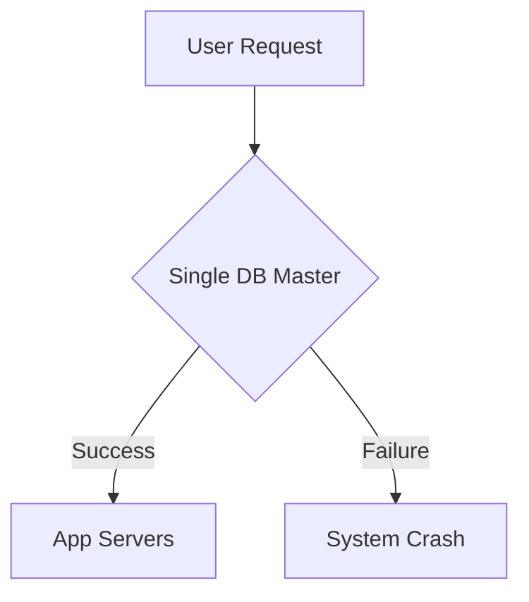

```markdown
---
title: "Mastering Availability Patterns: Building Resilient Distributed Systems"
date: "2023-11-15"
author: "Alex Chen, Senior Backend Engineer"
tags: ["distributed systems", "database design", "API design", "resilience", "availability"]
description: "Learn practical availability patterns to build high-availability systems that handle failures gracefully. Real-world examples and tradeoffs in modern distributed architectures."
---

# Mastering Availability Patterns: Building Resilient Distributed Systems


In today’s world, high availability isn’t just a nice-to-have feature—it’s a **business requirement**. Whether you’re running a global e-commerce platform, a financial transaction system, or even a critical internal service, your users expect your systems to be **up and responsive 99.99% of the time**. But achieving this isn’t just about throwing more resources at the problem. It requires thoughtful design using **availability patterns**—proven techniques for building systems that **fail gracefully, recover quickly, and continue operating even under adverse conditions**.

This guide dives deep into **availability patterns**, focusing on practical implementations in modern distributed systems. We’ll cover **real-world challenges**, explain why traditional approaches often fail, and walk through **solutions** with code examples in **Go, Python, and SQL**. By the end, you’ll have actionable patterns to apply to your own systems, along with insights into tradeoffs and common pitfalls.

---

## The Problem: Why Availability Patterns Matter

High availability (HA) is about **minimizing downtime and ensuring seamless operation** during failures. But what goes wrong when we don’t design for availability?

### **1. Single Points of Failure (SPOFs)**
Many systems still rely on **centralized components**—single databases, monolithic services, or network gateways—that act as chokepoints. If one fails, the whole system crashes.

**Example:** A legacy e-commerce system with a single PostgreSQL master. During a regional outage, even if the app servers are running, the database fails, and **all transactions halt**.



### **2. Cascading Failures**
When a failure in one component triggers cascading failures across others, the damage compounds. For example:
- A database query timeout causes a service to retry aggressively.
- The retry overloads the database, leading to connection pool exhaustion.
- Now, even healthy requests fail, creating a **thundering herd problem**.

### **3. Data Inconsistency**
In distributed systems, **eventual consistency** is the norm—but if failures occur, **data corruption or split-brain scenarios** can arise. For example:
- A replication lag in Kafka means some consumers see stale data.
- A failed leader election in a database cluster leaves nodes in an **unreachable state**.

### **4. Network Partition Tolerance (CAP Theorem Tradeoffs)**
Erlang’s **CAP theorem** reminds us we can’t always have **all three** of Consistency, Availability, and Partition tolerance. Many systems **prioritize availability over strict consistency** during partitions (e.g., using **AP systems**), but poorly implemented patterns can lead to **data loss or incorrect results**.

---

## The Solution: Availability Patterns in Action

To build resilient systems, we need **proactive availability strategies** that prevent single points of failure, handle partitions gracefully, and recover quickly. Below are **key availability patterns**, categorized by their purpose.

---

## **1. Redundancy Patterns: "If It’s Broken, There’s Another One"**

### **Pattern: Multi-Region Deployment with Failover**
**Goal:** Ensure services remain available even if an entire region goes down.

**When to Use:**
- Global applications (e.g., SaaS platforms, gaming services).
- Compliance requirements (e.g., GDPR’s "right to erasure" demands data locality).

**Implementation:**
- Deploy identical copies of services across **multiple regions**.
- Use **automatic failover** (e.g., Kubernetes pods, database read replicas).
- **Active-active vs. Active-passive:**
  - **Active-passive:** Only one region handles writes (simpler but slower failover).
  - **Active-active:** Multiple regions handle reads/writes (harder but more resilient).

**Example: Kubernetes Multi-Region Deployment**
```yaml
# Example Kubernetes Deployment with multi-region replicas
apiVersion: apps/v1
kind: Deployment
metadata:
  name: order-service
spec:
  replicas: 6  # 2 per region (e.g., us-west1, eu-central1)
  strategy:
    rollingUpdate:
      maxSurge: 1
      maxUnavailable: 0
  template:
    spec:
      topologySpreadConstraints:
      - maxSkew: 1
        topologyKey: "topology.kubernetes.io/zone"
        whenUnsatisfiable: DoNotSchedule
        labelSelector:
          matchLabels:
            app: order-service
```

**Tradeoffs:**
✅ **High availability** during regional outages.
❌ **Complexity** in data synchronization (e.g., eventual consistency).
❌ **Cost** due to redundant infrastructure.

---

### **Pattern: Database Replication with Read Replicas**
**Goal:** Offload read traffic and ensure database availability.

**When to Use:**
- Read-heavy workloads (e.g., analytics dashboards, public APIs).
- Need for **fast reads** without overloading the primary.

**Implementation:**
- Use **synchronous replication** for strong consistency (e.g., PostgreSQL with `synchronous_commit=remote_apply`).
- Use **asynchronous replication** for high throughput (e.g., Kafka, DynamoDB global tables).

**Example: PostgreSQL Read Replicas with PGLock**
```sql
-- Create a primary database
CREATE DATABASE orders PRIMARY;

-- Add a read replica in another region
CREATE DATABASE orders_read REPLICA OF orders;
GRANT ALL PRIVILEGES ON DATABASE orders_read TO postgres;

-- Configure application to route reads to replicas
-- (Use a connection pooler like PGLock or HAProxy)
```

**Tradeoffs:**
✅ **Scalability** for reads.
❌ **Eventual consistency** in async replicas (reads may lag).
❌ **Complexity** in managing replica lag (e.g., with `pg_repack`).

---

## **2. Failure Handling Patterns: "When Things Break, Keep Running"**

### **Pattern: Circuit Breakers**
**Goal:** Prevent cascading failures by stopping retries after repeated failures.

**When to Use:**
- Services with **external dependencies** (e.g., payment gateways, third-party APIs).
- **High-latency** or **unreliable** services.

**Implementation:**
- Use libraries like **Resilience4j (Java), Hystrix (legacy), or Go’s `circuitbreaker` patterns**.
- Define **failure thresholds** (e.g., 5 failures in 10 seconds → trip circuit).
- **Recovery time:** Reset after `timeout` (e.g., 30 seconds).

**Example: Go Circuit Breaker with `github.com/sony/gobreaker`**
```go
package main

import (
	"github.com/sony/gobreaker"
	"log"
)

func initCircuitBreaker() *gobreaker.CircuitBreaker {
	cb := gobreaker.NewCircuitBreaker(gobreaker.Settings{
		MaxRequests:     5,
		Interval:        10 * time.Second,
		Timeout:         30 * time.Second,
		ReadyToTrip:     gobreaker.EWMA(100, 3),
		OnStateChange:   logRequestState,
	})
	return cb
}

func logRequestState(state gobreaker.State, err error) {
	log.Printf("Circuit breaker state changed to %s: %v", state, err)
}
```

**Tradeoffs:**
✅ **Prevents cascading failures**.
❌ **False positives** if the dependency is temporarily down.
❌ **Need to monitor** circuit breaker state.

---

### **Pattern: Retry with Exponential Backoff**
**Goal:** Handle transient failures (e.g., network blips, database timeouts) gracefully.

**When to Use:**
- **Idempotent operations** (e.g., GET requests, retriable writes).
- Services with **temporary congestion** (e.g., Kafka lag, slow DB queries).

**Implementation:**
- Use **exponential backoff** to avoid thundering herd.
- **Jitter** (randomized delay) to prevent synchronized retries.

**Example: Python Retry with `tenacity`**
```python
from tenacity import (
    retry,
    stop_after_attempt,
    wait_exponential,
    retry_if_exception_type,
    before_sleep_log
)

@retry(
    stop=stop_after_attempt(3),
    wait=wait_exponential(multiplier=1, min=4, max=10),
    retry=retry_if_exception_type(TimeoutError),
    before_sleep=before_sleep_log(logger, log),
)
def fetch_order(order_id: str) -> dict:
    response = requests.get(f"http://orders-api/order/{order_id}", timeout=5)
    response.raise_for_status()
    return response.json()
```

**Tradeoffs:**
✅ **Handles transient errors**.
❌ **Not suitable for non-idempotent ops** (e.g., `DELETE`).
❌ **Can increase latency** for slow dependencies.

---

## **3. Resilience Patterns: "Design for Failure from the Start"**

### **Pattern: Bulkheads (Resource Isolation)**
**Goal:** Prevent one failing component from bringing down the entire system.

**When to Use:**
- **Shared resources** (e.g., database connections, message queues).
- **Microservices** where a single service shouldn’t crash the whole app.

**Implementation:**
- **Thread pools** (e.g., Go `runtime.GoSched`, Java `ForkJoinPool`).
- **Connection pools** (e.g., `pgx` for PostgreSQL).
- **Service mesh** (e.g., Istio for inter-service limits).

**Example: Go Worker Pool with Bulkhead**
```go
package main

import (
	"context"
	"sync"
	"time"
)

type WorkerPool struct {
	wg     sync.WaitGroup
	workCh chan func()
}

func NewWorkerPool(maxWorkers int) *WorkerPool {
	p := &WorkerPool{
		workCh: make(chan func(), maxWorkers), // Buffered channel
	}
	for i := 0; i < maxWorkers; i++ {
		p.wg.Add(1)
		go func() {
			defer p.wg.Done()
			for task := range p.workCh {
				task()
			}
		}()
	}
	return p
}

func (p *WorkerPool) Submit(task func()) {
	p.workCh <- task
}

func (p *WorkerPool) Wait() {
	close(p.workCh)
	p.wg.Wait()
}
```

**Tradeoffs:**
✅ **Isolates failures**.
❌ **Requires careful tuning** of pool sizes.
❌ **Overhead** for small workloads.

---

### **Pattern: Leadership Election (Anti-Split-Brain)**
**Goal:** Prevent **split-brain scenarios** in distributed systems (e.g., databases, consensus protocols).

**When to Use:**
- **Leader-based systems** (e.g., Kafka, etcd, ZooKeeper).
- **Multi-node clusters** where nodes must agree on a single leader.

**Implementation:**
- Use **Raft, Paxos, or ZooKeeper** for leader election.
- **Heartbeats** to detect failures.
- **Automatic re-election** if leader goes down.

**Example: Simple Leader Election in Go**
```go
package main

import (
	"sync"
	"time"
)

type LeaderElector struct {
	mu      sync.Mutex
	leader  string
	heartbeatCh chan struct{}
	candidates []string
}

func NewLeaderElector(candidates []string) *LeaderElector {
	e := &LeaderElector{
		candidates:   candidates,
		heartbeatCh:  make(chan struct{}, 1),
	}
	go e.runHeartbeat()
	return e
}

func (e *LeaderElector) runHeartbeat() {
	ticker := time.NewTicker(5 * time.Second)
	defer ticker.Stop()
	for {
		select {
		case <-ticker.C:
			e.mu.Lock()
			e.leader = "node1" // Simulate leader election
			e.mu.Unlock()
		}
	}
}

func (e *LeaderElector) GetLeader() string {
	e.mu.Lock()
	defer e.mu.Unlock()
	return e.leader
}
```

**Tradeoffs:**
✅ **Prevents split-brain**.
❌ **Complexity** in implementing consensus.
❌ **Latency** due to election delays.

---

## **Implementation Guide: Putting It All Together**

Now that we’ve covered the patterns, let’s **design a resilient system** using them. We’ll focus on a **microservice architecture** with:
1. **Multi-region deployment** (for availability).
2. **Database read replicas** (for scalability).
3. **Circuit breakers** (for external API resilience).
4. **Worker pools** (for internal task isolation).

### **Example: Resilient Order Service**

#### **1. Architecture Overview**
```
┌───────────────────────────────────────────────────────┐
│                     Client                          │
└───────────────┬───────────────────────┬───────────────┘
                │                       │
                ▼                       ▼
┌───────────────────────┐     ┌───────────────────────┐
│   Order API (HA)      │     │   Payment API        │
│ - Circuit Breaker     │     │ - Timeout Handling   │
│ - Multi-region       │     │ - Retry with Backoff  │
└──────────┬────────────┘     └──────────┬────────────┘
           │                                │
           ▼                                ▼
┌───────────────────────┐                ┌───────────────────────┐
│   PostgreSQL Cluster  │                │   Kafka              │
│ - Multi-region        │                │ - Exactly-once       │
│ - Read Replicas       │                │   Semantics          │
└───────────────────────┘                └───────────────────────┘
```

#### **2. Code Implementation (Go)**
```go
// main.go
package main

import (
	"context"
	"log"
	"time"

	"github.com/sony/gobreaker"
	"gorm.io/gorm"
)

type OrderService struct {
	db           *gorm.DB
	 paymentClient PaymentClient
	 circuitBreaker *gobreaker.CircuitBreaker
	 workerPool   *WorkerPool
}

func NewOrderService(db *gorm.DB, paymentClient PaymentClient) *OrderService {
	cb := gobreaker.NewCircuitBreaker(gobreaker.Settings{
		MaxRequests:     5,
		Interval:        10 * time.Second,
		Timeout:         30 * time.Second,
	})
	wp := NewWorkerPool(10) // 10 worker threads
	return &OrderService{
		db:           db,
		paymentClient: paymentClient,
		circuitBreaker: cb,
		workerPool:   wp,
	}
}

func (s *OrderService) ProcessOrder(ctx context.Context, orderID string) error {
	// 1. Bulkhead: Submit to worker pool
	workerTask := func() {
		// 2. Circuit Breaker: Wrap payment call
		err := s.circuitBreaker.Execute(func() error {
			return s.processPayment(ctx, orderID)
		})
		if err != nil {
			log.Printf("Payment failed (circuit may be open): %v", err)
		}
	}

	s.workerPool.Submit(workerTask)
	return nil
}

func (s *OrderService) processPayment(ctx context.Context, orderID string) error {
	// Simulate async payment processing (e.g., via Kafka)
	select {
	case <-ctx.Done():
		return ctx.Err()
	case <-time.After(2 * time.Second): // Simulate slow payment
		// Payment logic here
		return nil
	}
}
```

#### **3. Database Setup (Multi-Region PostgreSQL)**
```sql
-- Configure primary database (us-west1)
CREATE DATABASE orders PRIMARY;
CREATE TABLE orders (
    id SERIAL PRIMARY KEY,
    user_id INTEGER NOT NULL,
    status VARCHAR(20) DEFAULT 'pending',
    created_at TIMESTAMP DEFAULT NOW()
);

-- Add read replica in eu-central1
CREATE DATABASE orders_read REPLICA OF orders;
GRANT ALL PRIVILEGES ON DATABASE orders_read TO postgres;

-- Configure connection pooler (e.g., PGLock)
-- Routes reads to replicas, writes to primary
```

#### **4. Deployment (Kubernetes Multi-Region)**
```yaml
# order-service-deployment.yaml
apiVersion: apps/v1
kind: Deployment
metadata:
  name: order-service
spec:
  replicas: 3  # 1 for us-west1, 2 for eu-central1
  selector:
    matchLabels:
      app: order-service
  template:
    metadata:
      labels:
        app: order-service
        region: us-west1
    spec:
      containers:
      - name: order-service
        image: myregistry/order-service:v1
        ports:
        - containerPort: 8080
        env:
        - name: DB_HOST
          value: "orders-primary.us-west1-postgres:5432"
        - name: READ_REPLICA_HOST
          value: "orders-read.eu-central1-postgres:5432"
```

---

## Common Mistakes to Avoid

While availability patterns are powerful, **misapplying them can cause more harm than good**. Here are **anti-patterns** to watch out for:

### **1. Over-Reliance on Retries**
❌ **Problem:** Retrying **non-idempotent** operations (e.g., `DELETE`, `PUT`) leads to **data corruption**.
✅ **Fix:** Use **sagas** or **compensating transactions** for complex workflows.

### **2. Ignoring Metrics and Monitoring**
❌ **Problem:** Assuming your circuit breaker is "working" without observing **trip