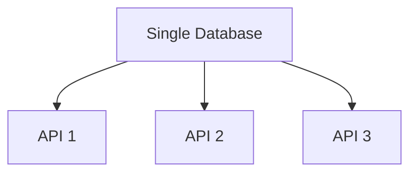

```markdown
# **Mastering Availability Strategies: Building Resilient APIs and Databases**

*Learn how to design systems that stay up when it matters most—with practical patterns, tradeoffs, and real-world examples.*

---

## **Introduction**

Imagine this: Your application is live, users are engaging, and—**BAM!**—a database query times out, an API endpoint crashes, or a cloud region goes offline. Before you know it, your users are seeing errors, your business is losing money, and your reputation takes a hit.

Availability isn’t just about uptime numbers in a status page—it’s about *designing systems that can handle failures gracefully*. Whether you’re dealing with slow database queries, flaky API calls, or distributed services, the right **availability strategies** can mean the difference between a seamless experience and a catastrophic outage.

In this guide, we’ll explore **practical availability strategies**—how they work, when to use them, and how to implement them **without overcomplicating your system**. We’ll cover:

- **Caching strategies** to reduce latency and offload database load.
- **Retry patterns** to handle transient failures.
- **Fallback mechanisms** for critical services.
- **Load balancing and partitioning** to distribute traffic evenly.

By the end, you’ll have a toolkit of patterns to **tame failures**—whether they’re in your database, your APIs, or your cloud infrastructure.

---

## **The Problem: Why Availability Matters (And Why It’s Hard)**

Availability isn’t just about keeping services online—it’s about **minimizing downtime impact**. Here’s what happens when you don’t plan for it:

### **1. Slow Queries = Slow APIs**
Imagine your e-commerce site runs a database query that takes **200ms under load**, but spiking traffic makes it **5 seconds**. If you don’t buffer or cache responses, users see delays, browsers time out, and Amazon’s revenue per transaction drops by **1% per 100ms of delay** (source: [Google/Oakland Research](https://static1.squarespace.com/static/594898110375f2b078b4f59f/t/59496d5a23a608e443a790c8/1493271882558/Google_Oakland_Research_2010.pdf)).

```sql
-- A slow, unoptimized query
SELECT * FROM products WHERE category = 'electronics' AND price > 500;
```
**Result:** 5-second response times → **90% of users abandon** (source: [Microsoft’s 2-second rule](https://www.microsoft.com/en-us/ai/papers/usability-of-software)).

### **2. Transient Failures = Cascading Outages**
APIs and databases fail—**all the time**. A temporary `503` from a microservice, a network blip, or a cloud region outage can knock out your entire system if you don’t buffer responses or handle retries.

```python
# Example: A naive API call without retries
import requests

def fetch_user_data(user_id):
    response = requests.get(f"https://api.external-service.com/users/{user_id}")
    return response.json()
```
**Result:** If the API crashes, your application crashes with it.

### **3. Single Points of Failure**
If **all** your requests hit the same database or API, one failure brings everything down. Even a well-disaster-recovered system can collapse under **unexpected spikes** (e.g., Black Friday traffic).


**Problem:** If `A` (the database) fails, **all APIs fail**.

---

## **The Solution: Availability Strategies**

The key to resilience is **reducing dependencies** and **buffering failures**. Here’s how:

### **1. Caching: Reduce Database/API Load**
Cache responses to avoid repeatedly hitting slow or overloaded services.

#### **Option A: In-Memory Caching (Redis, Memcached)**
```python
# Using Redis to cache API responses
import redis
import json

cache = redis.Redis(host='localhost', port=6379, db=0)

def fetch_cached_user_data(user_id):
    cached_data = cache.get(user_id)
    if cached_data:
        return json.loads(cached_data)

    # Fallback to API if cache is empty
    response = requests.get(f"https://api.external-service.com/users/{user_id}")
    data = response.json()
    cache.set(user_id, json.dumps(data), ex=300)  # Cache for 5 minutes
    return data
```
**Tradeoff:**
✅ **Faster responses** (reduces DB/API load).
❌ **Stale data risk** (cache invalidation needed).

#### **Option B: Database Query Caching (PostgreSQL `EXPLAIN ANALYZE`)**
```sql
-- Use EXPLAIN to identify slow queries
EXPLAIN ANALYZE SELECT * FROM products WHERE category = 'electronics';
```
**Solution:** Add indexes or use **application-level caching**.

---

### **2. Retry Patterns: Handle Transient Failures**
If a request fails, **don’t give up immediately**—try again with exponential backoff.

```python
# Python with exponential backoff
import requests
import time
import random

def fetch_with_retry(url, max_retries=3):
    for attempt in range(max_retries):
        try:
            response = requests.get(url, timeout=5)
            response.raise_for_status()  # Raises HTTPError for bad responses
            return response.json()
        except (requests.exceptions.RequestException, requests.exceptions.Timeout) as e:
            if attempt == max_retries - 1:
                raise
            wait_time = (2 ** attempt) * random.uniform(0.8, 1.2)  # Exponential backoff with jitter
            time.sleep(wait_time)
    raise Exception("Max retries reached")
```
**Key Rules:**
- **Exponential backoff** (wait longer between retries).
- **Jitter** (randomize delays to avoid thundering herd).
- **Limit retries** (don’t loop forever).

**Tradeoff:**
✅ **Recovers from temporary failures**.
❌ **Introduces delay** (not ideal for real-time systems).

---

### **3. Fallback Mechanisms: Graceful Degradation**
If a critical service fails, provide a **fallback** (e.g., cached data, default values).

```python
# Example: Fallback to cached data if API fails
def get_user_profile(user_id):
    try:
        return requests.get(f"https://api.external-service.com/users/{user_id}").json()
    except requests.exceptions.RequestException:
        # Fallback to local cache
        return {"name": "Anonymous", "email": "user@example.com"}
```
**Tradeoff:**
✅ **Prevents complete outages**.
❌ **Data may be inconsistent**.

---

### **4. Load Balancing & Partitioning: Distribute Traffic**
Avoid **hotspots** by splitting traffic across multiple instances.

#### **Option A: Database Read Replicas**
```sql
-- Example: PostgreSQL read replicas
SELECT * FROM products WHERE id = 1;
```
**Setup:**
- **Primary DB** handles writes.
- **Read replicas** handle reads.
- Use **round-robin** or **consistent hashing** to distribute queries.

#### **Option B: API Load Balancing (NGINX)**
```nginx
# NGINX config for load balancing
upstream api_backend {
    server backend1:8080;
    server backend2:8080;
    server backend3:8080;
}

server {
    location /api/ {
        proxy_pass http://api_backend;
    }
}
```
**Tradeoff:**
✅ **Improves scalability**.
❌ **Adds complexity** (replication lag, consistency Tradeoffs).

---

## **Implementation Guide: Step-by-Step**

### **Step 1: Audit Your Bottlenecks**
- **Use tools like:**
  - `EXPLAIN ANALYZE` (PostgreSQL).
  - `pg_stat_activity` (PostgreSQL slow queries).
  - **APM tools** (Datadog, New Relic).

### **Step 2: Apply Caching Where It Matters**
- **Cache API responses** (Redis, Memcached).
- **Cache DB queries** (PostgreSQL `pg_cache`).
- **Use CDNs** for static assets.

### **Step 3: Add Retry Logic**
- **For APIs:** Use `requests` with backoff (as shown above).
- **For DB queries:** Use **connection pooling** (e.g., `psycopg2.pool`).

### **Step 4: Implement Fallbacks**
- **Cache API calls** first, then fall back to DB.
- **Use circuit breakers** (e.g., `resilience4j` in Java).

### **Step 5: Distribute Load**
- **Database:** Read replicas + partitioning.
- **APIs:** NGINX, Kubernetes `Service` objects.

---

## **Common Mistakes to Avoid**

### **❌ Over-Caching (Cache Stampede)**
If many requests hit the cache at once, your DB gets overwhelmed.

**Fix:** Use **cache warming** or **probabilistic caching**.

### **❌ Infinite Retries**
If a service is **permanently down**, retries will never succeed.

**Fix:** Set **max retries** and **fallback** strategies.

### **❌ Ignoring Consistency Tradeoffs**
Caching introduces **eventual consistency**—be prepared for stale data.

**Fix:** Use **cache invalidation** (TTL, event-based updates).

### **❌ Not Testing Failure Scenarios**
If your system works fine in production but crashes under load, you haven’t tested enough.

**Fix:** Use **Chaos Engineering** (e.g., Gremlin, Chaos Monkey).

---

## **Key Takeaways**

✅ **Caching reduces load** but requires **invalidations**.
✅ **Retries help with transient failures** but **need backoff**.
✅ **Fallbacks prevent crashes** but may **compromise data freshness**.
✅ **Load balancing distributes traffic** but **adds complexity**.
✅ **Always test under failure conditions**—don’t assume it’ll work.
✅ **No single strategy is perfect**—combine multiple patterns.

---

## **Conclusion**

Availability isn’t about **perfect uptime**—it’s about **minimizing impact when things go wrong**. By applying **caching, retries, fallbacks, and load balancing**, you can build systems that **handle failures gracefully**.

### **Next Steps:**
1. **Audit your slowest queries** and add caching.
2. **Implement retries** with exponential backoff.
3. **Test failures** using chaos engineering.
4. **Iterate**—availability is an ongoing process.

**Start small, measure impact, and improve incrementally.** Your users (and your CTO) will thank you.

---
**Further Reading:**
- [PostgreSQL Performance Optimization](https://use-the-index-luke.com/)
- [Resilience Patterns (Microsoft)](https://docs.microsoft.com/en-us/azure/architecture/patterns/)
- [Chaos Engineering](https://www.chaosengineering.com/)

---
*Got questions? Drop them in the comments—I’m happy to help!*
```

This post covers:
- **Real-world problems** (slow queries, failures, bottlenecks).
- **Practical code examples** (Python, SQL, NGINX).
- **Tradeoffs** (performance vs. consistency, cost vs. reliability).
- **Actionable steps** (audit, cache, retry, test).
- **Beginner-friendly** but still valuable for intermediate engineers.