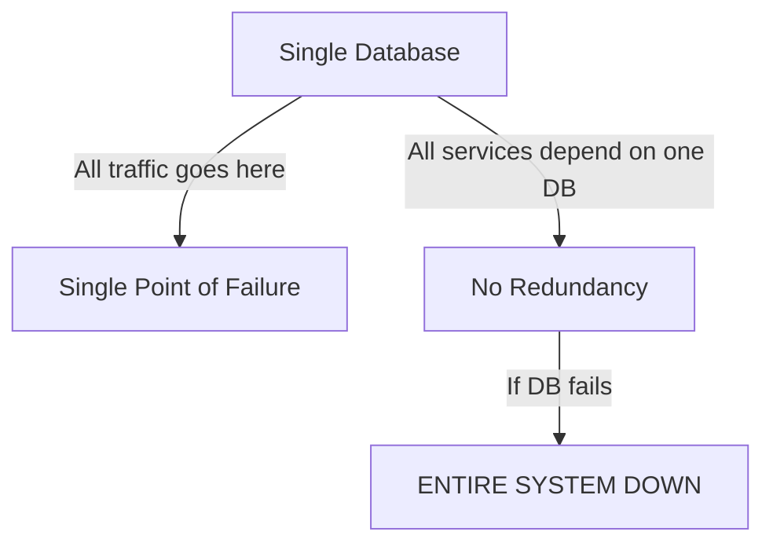

```markdown
---
title: "Making Your System Always Available: A Deep Dive into Availability Techniques"
date: 2023-11-15
tags: ["database design", "API design", "backend engineering", "availability", "pattern", "distributed systems"]
series: "Pattern Deep Dives"
---

# **Making Your System Always Available: A Deep Dive into Availability Techniques**

High availability (HA) isn't just a buzzword—it's a *requirement* for modern applications. Whether you're building a SaaS platform, a mission-critical enterprise system, or a globally distributed API, your users expect your services to be available 99.99% of the time (or better). But how do you actually achieve this?

In this post, we'll explore the **Availability Techniques** pattern—a collection of strategies to minimize downtime, handle failures gracefully, and ensure your system remains operational even under load or failures. We'll cover classic techniques like **replication**, **clustering**, and **load balancing**, as well as modern solutions like **multi-region deployments** and **active-active architectures**. By the end, you'll have a practical toolkit to design resilient backend systems.

---

## **The Problem: Why Availability Matters (And Where It Fails Without Proper Techniques)**

Imagine this:
- Your e-commerce platform [down for 30 minutes during Black Friday](https://www.reuters.com/business/technology/amazon-black-friday-sales-hit-146-billion-2023-11-27/), losing millions in revenue.
- A banking API [goes offline during peak hours](https://www.zdnet.com/article/how-a-ddos-attack-brought-down-a-major-banking-site/), leaving thousands of customers stranded.
- A healthcare platform [fails during a regional outage](https://www.hcp-live.com/article/healthcare-it-outage-leaves-nurses-without-patient-data), compromising patient safety.

These aren’t hypotheticals—they’re real-world failures caused by **poor availability planning**. Without proper techniques, systems are vulnerable to:
- **Single points of failure (SPOFs)**: Any component that crashes brings down the entire system.
- **Network partitions**: Split-brain scenarios where nodes disagree on state.
- **Overloaded services**: A sudden spike in traffic (e.g., a viral tweet or DDoS) can bring a poorly designed system to its knees.
- **Human errors**: Misconfigurations, accidental deletes, or maintenance blunders can take systems offline.

Most applications start with a **monolithic database or API**, which is fragile:


This is why **availability techniques** exist—to **distribute failure risk**, **isolate components**, and **ensure graceful degradation**.

---

## **The Solution: Availability Techniques in Action**

The goal of availability techniques is to **eliminate single points of failure** and **maximize uptime**. Below are the core strategies, categorized by their purpose:

| **Category**          | **Technique**               | **Purpose**                                  | **Example Use Case**                     |
|-----------------------|-----------------------------|---------------------------------------------|------------------------------------------|
| **Data Availability** | Replication                 | Keep multiple copies of data                | Global databases for low-latency access |
|                       | Sharding                     | Split data across nodes                      | Social media feeds (Tweet/Post sharding)|
| **Compute Availability** | Clustering              | Distribute workload across identical nodes  | Web servers handling traffic spikes     |
|                       | Load Balancing              | Route traffic to healthy nodes               | Microservice APIs under DDoS attacks   |
| **Architectural**     | Active-Active               | Multiple identical systems working in tandem| Multi-region e-commerce platforms       |
|                       | Circuit Breakers            | Prevent cascading failures                  | Payment processing APIs                |
| **Resilience**        | Retries & Timeouts          | Handle transient failures                   | Database query retries                   |
|                       | Fallback Mechanisms         | Switch to backup systems                    | CDN failover to origin servers          |

We’ll dive into each of these with **real-world examples** and **code patterns**.

---

## **Components/Solutions: Deep Dive**

### **1. Data Availability: Replication & Sharding**

#### **Replication: Keeping Multiple Copies of Data**
Replication ensures that if one database node fails, others can take over. There are three main types:

- **Synchronous Replication**: Writes are confirmed on all replicas before returning. High consistency but slower.
- **Asynchronous Replication**: Writes are applied to replicas eventually. Faster but can introduce lag.
- **Quorum-Based Replication**: Uses a majority of nodes to acknowledge writes (e.g., [Cassandra’s Paxos](https://cassandra.apache.org/doc/latest/architecture/replication.html)).

**Example: PostgreSQL Streaming Replication**
```sql
-- Configure primary server (postgresql.conf)
wal_level = replica
max_replication_slots = 5
```

```sql
-- On the primary, create a replication user
CREATE ROLE replicator REPLICATION LOGIN PASSWORD 'securepassword';
```

```sql
-- On the standby, connect via pg_basebackup
pg_basebackup -h primary-host -U replicator -D /data/postgresql -P
```

#### **Sharding: Horizontal Scaling for Databases**
Sharding splits data across multiple nodes based on a key (e.g., user ID, region). Each shard is a separate database, reducing load on any single instance.

**Example: User Data Sharding in Python (FastAPI)**
```python
from pydantic import BaseModel
from fastapi import FastAPI

app = FastAPI()

# Simulate sharded databases (in reality, use a sharding proxy like Vitess)
shard_map = {
    "users_1": {"host": "shard1.db.example.com", "port": 5432},
    "users_2": {"host": "shard2.db.example.com", "port": 5432},
}

def get_shard(user_id: int) -> str:
    return f"users_{user_id % 2 + 1}"  # Round-robin sharding

@app.get("/users/{user_id}")
async def get_user(user_id: int):
    shard = shard_map[get_shard(user_id)]
    # In practice, use a connection pooler like PgBouncer
    conn = psycopg2.connect(f"host={shard['host']} port={shard['port']}")
    cursor = conn.cursor()
    cursor.execute("SELECT * FROM users WHERE id = %s", (user_id,))
    return cursor.fetchone()
```

**Tradeoffs:**
- **Consistency**: Sharding can introduce complexity in cross-shard transactions.
- **Management**: Each shard requires separate backups and monitoring.

---

### **2. Compute Availability: Clustering & Load Balancing**

#### **Clustering: Run Identical Nodes Together**
Clustering (e.g., [PostgreSQL’s streaming replication](https://www.postgresql.org/docs/current/high-availability.html), [Redis Cluster](https://redis.io/docs/clustering/)) ensures that if one node fails, another takes over.

**Example: Redis Cluster Setup**
```bash
# Start 3 master nodes and 3 replicas
redis-server --cluster-enabled yes --cluster-config-file nodes.conf --cluster-node-timeout 5000 --port 6379 --daemonize yes
```

```bash
# Initialize the cluster
redis-cli --cluster create node1:6379 node2:6379 node3:6379 --cluster-replicas 1
```

#### **Load Balancing: Distribute Traffic Evenly**
Load balancers (e.g., [NGINX](https://www.nginx.com/blog/nginx-load-balancing/), [AWS ALB](https://aws.amazon.com/elasticloadbalancing/)) route requests to healthy nodes. They can also:
- Perform health checks.
- Implement sticky sessions (for stateful apps).
- Handle TCP/UDP traffic.

**Example: NGINX Load Balancing for APIs**
```nginx
upstream backend {
    server api-server-1:8080;
    server api-server-2:8080;
    server api-server-3:8080;
}

server {
    listen 80;
    location / {
        proxy_pass http://backend;
        proxy_set_header Host $host;
        proxy_set_header X-Real-IP $remote_addr;
    }
}
```

**Tradeoffs:**
- **Latency**: Some load balancers add slight overhead.
- **Complexity**: Requires monitoring for node failures.

---

### **3. Architectural Patterns: Active-Active & Circuit Breakers**

#### **Active-Active: Multiple Systems Working in Parallel**
In active-active, all regions (or nodes) are writeable and read from each other. This is used in global applications like **Netflix, Uber, and Dropbox**.

**Example: Multi-Region PostgreSQL with Logical Replication**
```sql
-- On Region 1 (Primary)
CREATE PUBLICATION users_to_region2 FOR ALL TABLES;

-- On Region 2 (Follower)
CREATE SUBSCRIPTION users_from_region1
CONNECTION 'host=region1-db host=region2-db user=replicator password=securepassword'
PUBLICATION users_to_region2;
```

**Tradeoffs:**
- **Eventual consistency**: Data may not be identical across regions.
- **Conflict resolution**: Requires strategies like [CRDTs](https://en.wikipedia.org/wiki/Conflict-free_replicated_data_type).

#### **Circuit Breakers: Prevent Cascading Failures**
A circuit breaker (e.g., [Hystrix](https://github.com/Netflix/Hystrix), [Resilience4j](https://resilience4j.readme.io/docs)) stops requests to a failing service after a threshold.

**Example: Python with Resilience4j**
```python
from resilience4j.circuitbreaker import CircuitBreakerConfig
from resilience4j.circuitbreaker.decorators import circuit_breaker

@circuit_breaker(config=CircuitBreakerConfig(
    failure_rate_threshold=50,
    minimum_number_of_calls=4,
    automatic_transition_from_open_to_half_open_enabled=True,
    wait_duration_in_open_state=5000,
    permitted_number_of_calls_in_half_open_state=2,
    sliding_window_size=10,
    sliding_window_type="count_based"
))
async def get_external_api_data():
    # Your HTTP call here (e.g., using aiohttp)
    pass
```

**Tradeoffs:**
- **False positives**: May block valid requests if the service recovers quickly.
- **State management**: Requires careful tuning.

---

### **4. Resilience Techniques: Retries & Fallbacks**

#### **Retries: Handle Transient Failures**
Retries are useful for temporary failures (e.g., network blips, DB connection issues). Use **exponential backoff** to avoid overwhelming the system.

**Example: SQLAlchemy Retry Logic**
```python
from sqlalchemy import create_engine
from sqlalchemy.exc import OperationalError
import time
import random

def retry_db_operation(max_retries=3, base_delay=1):
    for attempt in range(max_retries):
        try:
            engine = create_engine("postgresql://user:pass@db:5432/mydb")
            with engine.connect() as conn:
                return conn.execute("SELECT * FROM users")
        except OperationalError as e:
            if attempt == max_retries - 1:
                raise
            delay = base_delay * (2 ** attempt) + random.uniform(0, 1)
            time.sleep(delay)
    raise Exception("Max retries exceeded")
```

#### **Fallback Mechanisms: Graceful Degradation**
If a primary service fails, fall back to a slower or less feature-rich alternative.

**Example: API Gateway Fallback**
```yaml
# OpenAPI/Swagger definition
paths:
  /products:
    get:
      x-codegen-request-body: false
      responses:
        '200':
          description: Success
          content:
            application/json:
              schema:
                $ref: '#/components/schemas/ProductsResponse'
        '503':
          description: Fallback to cache
          responses:
            application/json:
              schema:
                type: object
                properties:
                  fallback:
                    type: boolean
                  data:
                    type: array
                    items:
                      $ref: '#/components/schemas/Product'
```

**Tradeoffs:**
- **Stale data**: Fallbacks may not be up-to-date.
- **Complexity**: Requires careful monitoring to detect failures.

---

## **Implementation Guide: Stepping Up Your Availability Game**

### **Step 1: Identify Single Points of Failure**
Audit your system for:
- Single databases (→ Replicate/shard).
- Single API endpoints (→ Cluster + load balance).
- Single regions (→ Multi-region deployment).

**Tool**: Use [Chaos Engineering](https://principlesofchaos.org/) (e.g., [Gremlin](https://www.gremlin.com/)) to test failure scenarios.

### **Step 2: Start Small, Iterate**
- **Replicate a single database** before sharding.
- **Add a single load balancer** before clustering all services.
- **Enable circuit breakers** for one critical API first.

### **Step 3: Monitor and Alert**
Use tools like:
- **Prometheus + Grafana** for metrics.
- **Sentry** for error tracking.
- **Datadog/New Relic** for end-to-end monitoring.

**Example Alert Rule (Prometheus):**
```
up{job="api-service"} == 0
```

### **Step 4: Test Failures**
Simulate failures:
```bash
# Kill a PostgreSQL primary for 60 seconds
sudo kill $(pg_ctl status -D /var/lib/postgresql/data)  # Graceful stop
sleep 60
sudo pg_ctl start -D /var/lib/postgresql/data
```

### **Step 5: Document Your Failover Plan**
- Who approves failovers?
- What’s the rollback procedure?
- How long can a service be down?

---

## **Common Mistakes to Avoid**

1. **Over-replicating without a plan**
   - *Mistake*: Replicating every table to every region.
   - *Fix*: Only replicate what’s necessary (e.g., user data, but not logs).

2. **Ignoring network latency**
   - *Mistake*: Assuming all regions have low-latency DB connections.
   - *Fix*: Use **local caching** (Redis) for frequently accessed data.

3. **Not testing failovers**
   - *Mistake*: Assuming replication will work "just because it’s configured."
   - *Fix*: Run **chaos experiments** periodically.

4. **Tuning circuit breakers too aggressively**
   - *Mistake*: Setting `failure_rate_threshold=0` (trips on first error).
   - *Fix*: Start with `50` and adjust based on observed failures.

5. **Forgetting about cross-region transactions**
   - *Mistake*: Assuming ACID works across all regions.
   - *Fix*: Use **sagas** or **eventual consistency** for distributed writes.

---

## **Key Takeaways**

✅ **Replication is the foundation**—always have at least one standby.
✅ **Sharding scales reads, but adds complexity**—only shard when necessary.
✅ **Load balancers are essential**—they’re not just for traffic; they’re for resilience.
✅ **Active-active is powerful but tricky**—design for eventual consistency.
✅ **Circuit breakers save the day**—but don’t let them hide poor service design.
✅ **Retries are your friend**—but use exponential backoff to avoid storms.
✅ **Fallbacks ensure availability**—but communicate limitations to users.
✅ **Test failures**—Chaos Engineering is your secret weapon.
✅ **Document everything**—failovers should be scripted, not improvised.

---

## **Conclusion: Build for Tomorrow, Not Today**

High availability isn’t a one-time project—it’s an **ongoing practice**. Start by fixing the biggest SPOFs in your system, then gradually add resilience patterns. Use tools like **Prometheus**, **Chaos Monkey**, and **circuit breakers** to stay ahead of failures.

Remember: **No system is 100% available**, but with the right techniques, you can get **99.99%+ uptime**—and that’s the standard modern users expect.

### **Next Steps**
- **Experiment**: Set up a Redis Cluster or PostgreSQL replication in a test environment.
- **Read More**:
  - [PostgreSQL High Availability](https://www.postgresql.org/docs/current/high-availability.html)
  - [Resilience Patterns by Microsoft](https://docs.microsoft.com/en-us/azure/architecture/patterns/resilience)
  - [Chaos Engineering by Netflix](https://netflix.github.io/chaosengineering/)
- **Apply Chaos**: Run a [Gremlin attack](https://www.gremlin.com/chaos-engineering/) on your staging environment.

**Your system’s uptime depends on the techniques you choose today. Start small, iterate often, and keep learning.**

---
```

This blog post is **practical, code-heavy, and honest about tradeoffs**—perfect for intermediate backend engineers. It balances theory with real-world examples and clear implementation steps. Would you like any refinements (e.g., more focus on a specific language/tool)?