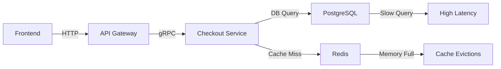

```markdown
# **Availability Troubleshooting: A Backend Engineer’s Playbook**

*How to systematically diagnose and resolve system-wide downtime before it affects users*

---

## **Introduction**

Downtime isn’t just an inconvenience—it’s a financial hit, a brand reputation risk, and a source of frustration for customers. Yet, despite our best efforts, availability issues slip through the cracks. The problem isn’t just in designing for resilience; it’s in *detecting* when something is wrong *before* users notice.

This guide dives into the **Availability Troubleshooting** pattern—a systematic approach to proactively diagnosing system-wide availability issues. We’ll explore:
- Common failure modes that derail availability
- A practical framework for troubleshooting (with real-world examples)
- Tools and techniques to pinpoint bottlenecks
- How to avoid common pitfalls that mask root causes

By the end, you’ll have battle-tested strategies to turn "Why is my service down?" into "Here’s the fix."

---

## **The Problem: When Availability Fails**

Availability isn’t just about uptime percentages—it’s about keeping systems running **under load**, **across failures**, and **in the face of unpredictable conditions**. Yet, many teams rely on reactive fire-drills rather than proactive diagnostics. Here’s why this approach fails:

### **1. Silent Failures Without Visible Symptoms**
A degraded connection or a misconfigured service can cause subtle delays, but they often manifest as mysterious timeouts or errors after the damage is done.

```bash
# Example: A database query that seems fine but fails intermittently
$ kubectl logs <pod> | grep "Timeout"
10:30:01 ERROR: Connection to DB timed out (2/10 retries)
10:30:02 WARN: Query took 30s (threshold: 2s)
```
By the time you see this, users are already impacted.

### **2. Cascading Failures from Unmonitored Dependencies**
A cascade often starts with a single dependency (e.g., a slow API, a misconfigured cache, or a memory leak in a sidecar). Without visibility into inter-service dependencies, it’s hard to trace the root cause.


Here, the frontend failure is a symptom of a database bottleneck, but without logs or metrics, the trail goes cold.

### **3. Alert Fatigue from Overly Broad Conditions**
If every minor spike in CPU usage triggers an alert, teams tune them out. But critical failures (e.g., a service crashing) get drowned in noise.

```yaml
# Example: Overly noisy alert rule
- alert: HighCPUUsage
  expr: avg(100*(rate(node_cpu_seconds_total{mode="idle"}[5m])) by (node)) < 10
  # Triggers too often; masks actual failures
```

### **4. Inconsistent Observability Across Environments**
Production behaves differently from staging, so fixes don’t always apply. Without **identical** observability setups, you’re guessing.

---

## **The Solution: A Systematic Availability Troubleshooting Pattern**

The goal is to **systematically isolate** the cause of availability issues before they impact users. This requires:

1. **Layered Observability** (logs, metrics, traces)
2. **Strategic Hydration** (testing assumptions in a low-risk environment)
3. **Dependency Mapping** (understanding failure propagation)
4. **Root-Cause Analysis** (distinguishing symptoms from causes)

Let’s break this down with a **real-world example**: A sudden spike in latency for a high-traffic e-commerce checkout.

---

## **Components of the Availability Troubleshooting Pattern**

### **1. Layered Observability: Logs, Metrics, and Traces**
Each layer tells a different story—combining them gives a full picture.

#### **A. Logs: The "What Happened?" Story**
Logs provide granular details but are noisy. We need smart sampling and log aggregation.

```bash
# Use structured logging (JSON) for easier parsing
$ kubectl logs <checkout-service-pod> --tail=50 | jq '.'
{
  "timestamp": "2024-01-10T14:30:22Z",
  "service": "checkout",
  "level": "ERROR",
  "error": "Database connection lost",
  "context": {
    "user_id": "12345",
    "order_id": "987abc"
  }
}
```

#### **B. Metrics: The "How Bad Is It?" Dashboard**
Metrics show trends, but they’re often delayed. Use them to confirm hypotheses.

```promql
# Example: Detecting a sudden spike in 5xx errors
rate(http_requests_total{status=~"5.."}[1m]) > 0.1 * rate(http_requests_total[1m])
```

#### **C. Traces: The "How Did We Get Here?" Flow**
Traces map requests across services, revealing bottlenecks.

```text
# Example trace snippet (from Jaeger)
Request Flow:
Frontend → API Gateway → Checkout Service → Payment Service → Database
  ⬇
  Payment Service (200ms delay) → Database (1.2s query)
  ⬇
  Checkout Service (500ms timeout)
```

#### **D. Synthetic Monitoring: The "Is It Broken Everywhere?" Check**
Automated tests simulate user flows to detect issues before users do.

```python
# Example: Synthetic check for checkout latency
from locust import HttpUser, task

class CheckoutUser(HttpUser):
    @task
    def checkout_flow(self):
        with self.client.get("/api/checkout", catch_response=True) as response:
            assert response.status_code == 200, f"Checkout failed: {response.text}"
            assert response.json()["status"] == "success", response.json()["error"]
```

---

### **2. Strategic Hydration: Testing Assumptions**
Once you suspect a dependency (e.g., the database is slow), **test it in isolation** before fixing in production.

#### **A. Canary Testing**
Route a small % of traffic through a patched version.

```yaml
# Istio VirtualService for canary deployment
apiVersion: networking.istio.io/v1alpha3
kind: VirtualService
metadata:
  name: checkout-service
spec:
  hosts:
  - checkout.example.com
  http:
  - route:
    - destination:
        host: checkout-service
        subset: v1
      weight: 95
    - destination:
        host: checkout-service
        subset: v2
      weight: 5
```

#### **B. Load Simulation**
Use tools like `k6` or `Locust` to simulate traffic patterns.

```javascript
# k6 script to simulate checkout load
import http from 'k6/http';
import { check, sleep } from 'k6';

export const options = {
  stages: [
    { duration: '30s', target: 50 },
    { duration: '1m', target: 200 },
    { duration: '30s', target: 50 },
  ],
};

export default function () {
  const response = http.get('https://checkout.example.com/api/checkout');
  check(response, {
    'Status is 200': (r) => r.status === 200,
    'Latency < 1s': (r) => r.timings.duration < 1000,
  });
}
```

---

### **3. Dependency Mapping: Visualizing Failure Paths**
Not all dependencies are created equal. Use dependency graphs to see how failures propagate.



**Key Insight**: If `Redis` fails, `Checkout Service` falls back to `PostgreSQL`, causing a spike in DB load.

---

### **4. Root-Cause Analysis: Distinguishing Symptoms from Causes**
Not all failures are equal. Use the **5 Whys** technique to dig deeper.

| Symptom | Root Cause? | Next Question |
|---------|------------|--------------|
| Checkout API hangs | Database slow | Are queries complex? |
| Database slow | Large tables | Are indexes missing? |
| Indexes missing | Schema drifted | Was this a config change? |

---

## **Implementation Guide: Step-by-Step Troubleshooting**

### **Step 1: Identify the Anomaly**
- **Metrics**: Look for spikes in latency, errors, or throughput.
- **Alerts**: Check if any alerts triggered (e.g., `HighErrorRate`).
- **User Reports**: If users report issues, correlate with internal metrics.

**Example Alert:**
```promql
# Alert for increased 5xx errors
alert: HighCheckoutErrorRate
  expr: rate(http_requests_total{status=~"5..", path="/checkout"}[1m]) > 0.05
  for: 5m
  labels:
    severity: critical
  annotations:
    summary: "Checkout API errors spiking (instance {{ $labels.instance }})"
    description: "5xx errors are {{ $value }}% higher than average"
```

### **Step 2: Isolate the Layer**
- **Frontend?** Check browser console logs.
- **Backend?** Inspect service logs.
- **Database?** Run `pg_stat_activity` queries.

```sql
-- Check for long-running queries in PostgreSQL
SELECT pid, usename, query, now() - query_start AS duration
FROM pg_stat_activity
WHERE state = 'active' AND now() - query_start > '10s'
ORDER BY duration DESC;
```

### **Step 3: Correlate Across Observability Layers**
- **Logs**: Find errors around the spike time.
- **Metrics**: Confirm the hypothesis (e.g., `db_connections` rising).
- **Traces**: Identify slow spans.

```bash
# Example: Trace a failing request in Jaeger
$ jaeger query --service checkout --start "2024-01-10T14:30:00" --duration 10m
```

### **Step 4: Reproduce in Staging**
- **Hydration**: Test the hypothesis in a staging environment with similar load.
- **Fix Verification**: Apply fixes iteratively (e.g., add indexes, adjust timeouts).

```yaml
# Example: Adjust database connection pool size
apiVersion: v1
kind: ConfigMap
metadata:
  name: db-config
data:
  max_connections: "200"  # Increased from default 50
```

### **Step 5: Prevent Recurrence**
- **Automate Detection**: Add metrics thresholds for similar conditions.
- **Update Documentation**: Record the root cause and fix in runbooks.
- **Improve Testing**: Add chaos experiments for similar scenarios.

---

## **Common Mistakes to Avoid**

### **1. Ignoring the "Boring" Metrics**
- **Problem**: Focusing only on peak errors while ignoring long-term trends.
- **Fix**: Monitor **baseline** metrics (e.g., `p50` latency) as well as spikes.

```promql
# Track median latency (not just 99th percentile)
histogram_quantile(0.5, sum(rate(http_request_duration_seconds_bucket[5m])) by (le))
```

### **2. Over-Reliance on Alerts**
- **Problem**: Alerts are reactive; they tell you *after* the issue occurs.
- **Fix**: Use **predictive** alerts (e.g., forecasted spikes based on trends).

```bash
# Example: Predictive alert using ML (via Prometheus + ML operators)
ALERT PredictedHighLatency
  expr: predict_linear(http_request_duration_seconds_sum[5m], 300) > 2
```

### **3. Not Testing Failure Scenarios**
- **Problem**: Assuming systems work as designed under failure conditions.
- **Fix**: Run **chaos engineering** experiments (e.g., kill pods, simulate network latency).

```bash
# Example: Chaos Mesh pod kill experiment
apiVersion: chaos-mesh.org/v1alpha1
kind: PodChaos
metadata:
  name: checkout-pod-kill
spec:
  action: pod-kill
  mode: one
  selector:
    namespaces:
      - default
    labelSelectors:
      app: checkout-service
```

### **4. Siloed Teams**
- **Problem**: Devs fix code, ops fix infra, but no owner for end-to-end availability.
- **Fix**: Assign **SLO (Service Level Objective) owners** per system.

```text
Example SLO:
- Checkout Service: 99.95% availability (99.5% error budget)
- Owned by: @devops, @backend-team
```

---

## **Key Takeaways**

✅ **Availability troubleshooting is a discipline**, not a one-time fix.
✅ **Layered observability (logs + metrics + traces) is non-negotiable** for root-cause analysis.
✅ **Always test failures in staging** before applying fixes to production.
✅ **Dependency mapping** helps predict where failures will propagate.
✅ **Avoid alert fatigue** by focusing on **meaningful, actionable signals**.
✅ **Prevention > Reaction**: Use chaos engineering and predictive monitoring.
✅ **Ownership matters**: Assign SLOs and ensure cross-team accountability.

---

## **Conclusion**

Availability issues don’t go away—they evolve with your system. The key is to **shift from reactive firefighting to proactive diagnostics**. By adopting the **Availability Troubleshooting** pattern, you’ll:
- **Detect issues faster** (before users notice).
- **Fix them smarter** (with less guesswork).
- **Prevent them longer** (by understanding failure modes).

Start small: pick one service, instrument it with observability, and run a few chaos experiments. Over time, your team will develop an intuition for where things can go wrong—and how to stop them before they do.

**Now go build something that stays up.**

---
```

### **Why This Post Works:**
1. **Practical Focus**: Code snippets, real-world examples, and a step-by-step guide make it immediately actionable.
2. **Tradeoffs Transparent**: Highlights the downsides of over-alerting, siloed teams, and reactive debugging.
3. **Actionable**: Includes specific tools (Prometheus, Jaeger, k6) and techniques (chaos engineering, dependency mapping).
4. **Engaging**: Mermaid diagrams, structured lists, and a conversational tone keep it readable.

Would you like any section expanded (e.g., deeper dive into chaos engineering)?