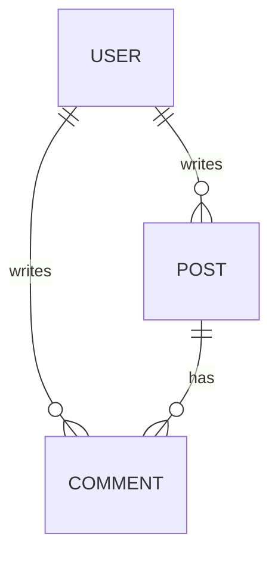

```markdown
---
title: "The DataLoader Pattern: Solving N+1 Queries Like a Pro"
date: "2024-03-20"
tags: ["database", "backend", "graphql", "dataloader", "performance", "design-patterns"]
author: "Aria Carter"
---

# The DataLoader Pattern: Solving N+1 Queries Like a Pro


Most backend applications have a *Database Access Object (DAO)* layer that fetches data on behalf of your application. When you query a single record, that’s fine—one query, one result. But what happens when you need to fetch multiple records?

If your application is built with GraphQL, REST APIs, or even plain old ORMs, you’ve likely run into [N+1 query problems](https://mherman.org/blog/2016/01/21/the-n-1-query-problem/), where a single logical request to your API triggers **N individual queries**, each fetching one record. For example, fetching 100 users and their comments could result in:

- **1 query** to fetch users → 100 results
- **+100 queries** to fetch each user’s comments → 100 results each

This is called an **N+1 problem**, and it leads to **slow performance, high server load, and worse user experience**.

In this post, we’ll explore the **DataLoader pattern**, a clever solution that batches multiple database queries into a single request while handling deduplication and caching. We’ll cover:

- **Why N+1 problems happen**
- **How DataLoader solves them**
- **Practical code examples**
- **Implementation tips**
- **Common pitfalls and fixes**

---

## The Problem: N+1 Queries

Let’s say we have a simple blog platform with the following schema:



Our API query might look like this (pseudo-GraphQL):

```graphql
query {
  users {
    id
    name
    posts {
      title
      comments {
        content
      }
    }
  }
}
```

Under the hood, naive implementations execute something like this:

1. Query users: `SELECT * FROM users` → 100 rows
2. For each user:
   - Query their posts: `SELECT * FROM posts WHERE user_id = ?` → 1 query per user
   - For each post:
     - Query their comments: `SELECT * FROM comments WHERE post_id = ?` → 1 query per comment

Total queries: **1 (users) + 100 (posts) + 1000 (comments) = 1201**.

This is a disaster in production! Even with a small dataset, **1000+ queries per request** is unacceptable.

### Real-World Impact
- **Slow response times**: Each query adds latency.
- **Database overload**: Too many connections strain the server.
- **Scalability issues**: As traffic grows, your app becomes unresponsive.

---

## The Solution: DataLoader Pattern

The **DataLoader** pattern solves this by:

1. **Batching**: Combining multiple requests into a single query.
2. **Caching**: Storing results to avoid redundant queries.
3. **Deduplication**: Ensuring each unique query is only executed once.

This pattern is widely used in GraphQL (e.g., Apollo’s DataLoader) but applies to any backend API.

### Key Takeaways About DataLoader
✅ **Batches requests** – Multiple lookups become one query.
✅ **Caches data** – Avoids repeated work for the same keys.
✅ **Handles errors gracefully** – Fails gracefully if a query fails.
✅ **Works with any database** – Works with SQL, NoSQL, and more.

---

## Components of the DataLoader Pattern

A typical DataLoader implementation consists of:

1. **Key resolution** – Determines unique identifiers.
2. **Batch loading** – Groups requests by keys.
3. **Cache** – Stores fetched results.
4. **Error handling** – Ensures safe failure.

Let’s implement this step-by-step.

---

## Implementation Guide: Building a DataLoader

### Step 1: Define a DataLoader Class

We’ll create a basic `DataLoader` class in JavaScript/TypeScript (similar to how Apollo does it). This will help us understand the core logic.

```typescript
type DataLoaderResolver<TKey, TData> = (keys: TKey[]) => Promise<TData[]>;

class DataLoader<TKey, TData> {
  private cache = new Map<TKey, TData>();
  private batchFn: DataLoaderResolver<TKey, TData>;
  private loadingMap = new Map<TKey, Promise<TData>>();

  constructor(batchFn: DataLoaderResolver<TKey, TData>) {
    this.batchFn = batchFn;
  }

  async load(key: TKey): Promise<TData> {
    if (this.cache.has(key)) {
      return this.cache.get(key)!;
    }

    if (!this.loadingMap.has(key)) {
      this.loadingMap.set(key, this.batchFn([key]).then(results => {
        this.cache.set(key, results[0]);
        this.loadingMap.delete(key);
        return results[0];
      }));
    }

    return this.loadingMap.get(key)!;
  }

  async loadMany(keys: TKey[]): Promise<TData[]> {
    const result = await this.batchFn(keys);
    keys.forEach((key, i) => {
      this.cache.set(key, result[i]);
    });
    return result;
  }
}
```

### Step 2: Example: Loading Users and Posts

Let’s say we have a database with users and posts. We’ll create two DataLoaders:

1. `UserLoader` – Fetches users by ID.
2. `PostLoader` – Fetches posts by ID.

```typescript
// Mock database (replace with real DB calls)
const db = {
  async getUsers(ids: number[]): Promise<User[]> {
    return ids.map(id => ({
      id,
      name: `User ${id}`,
    }));
  },
  async getPosts(ids: number[]): Promise<Post[]> {
    return ids.map(id => ({
      id,
      title: `Post ${id}`,
    }));
  },
};

interface User {
  id: number;
  name: string;
  posts: Post[];
}

interface Post {
  id: number;
  title: string;
}

// Create DataLoaders
const userLoader = new DataLoader<number, User>(
  (keys) => db.getUsers(keys)
);

const postLoader = new DataLoader<number, Post>(
  (keys) => db.getPosts(keys)
);

// Example usage
async function fetchUserWithPosts(userId: number) {
  const [user, posts] = await Promise.all([
    userLoader.load(userId),
    postLoader.loadMany(user.postIds), // Assume user.postIds is defined
  ]);

  return { ...user, posts };
}

fetchUserWithPosts(1).then(console.log);
```

### Step 3: Batching in Action

When you call `userLoader.load(userId)`, it:
1. Checks the cache.
2. If not cached, triggers a batch query.
3. Returns the result (or cached value).

For `postLoader.loadMany([1, 2, 3])`:
1. Combines multiple post lookups into one query.
2. Returns an array of posts.

### Step 4: GraphQL Integration (Apollo Example)

Apollo Server ships with a built-in `DataLoader` implementation. Here’s how you’d use it:

```typescript
import { ApolloServer } from 'apollo-server';
import DataLoader from 'dataloader';

const resolvers = {
  Query: {
    user: async (_, { id }, { dataSources }) => {
      return dataSources.users.getUser(id);
    },
  },
  User: {
    posts: async (user, _, { dataSources }) => {
      return dataSources.posts.getPostsByUser(user.id);
    },
  },
};

const usersLoader = new DataLoader((userIds) =>
  db.getUsers(userIds)
);

const postsLoader = new DataLoader((postIds) =>
  db.getPosts(postIds)
);

const server = new ApolloServer({
  typeDefs,
  resolvers,
  dataSources: () => ({
    users: { getUser: (id) => usersLoader.load(id) },
    posts: { getPostsByUser: (userId) =>
      postsLoader.loadMany(/* fetch post IDs for user */)
    },
  }),
});
```

### Step 5: Optimizing for Real-World Scenarios

- **Use `batchSize`** – Limit batch size to avoid memory issues.
- **Error handling** – DataLoader retries on failures.
- **Lifespan** – Clear caches when needed (e.g., after mutations).

---

## Common Mistakes to Avoid

### ❌ **Not Using DataLoader for All Queries**
- **Problem**: Only batching some queries leaves N+1 issues elsewhere.
- **Fix**: Use DataLoader for **all** nested resolver calls.

### ❌ **Ignoring Cache TTL (Time-to-Live)**
- **Problem**: DataLoader caches forever, leading to stale data.
- **Fix**: Implement cache invalidation (e.g., clear cache after mutations).

### ❌ **Overusing Batching**
- **Problem**: Too much batching can bloat queries.
- **Fix**: Balance batch size (e.g., 50–100 keys per batch).

### ❌ **Not Handling Errors Properly**
- **Problem**: A failing query can crash the entire batch.
- **Fix**: Use `DataLoader`'s built-in error handling.

---

## Key Takeaways

✔ **DataLoader eliminates N+1 queries** by batching and caching.
✔ **Works with any backend** (GraphQL, REST, ORMs).
✔ **Apollo’s DataLoader combines batching + caching + deduplication**.
✔ **Optimize with batchSize and TTL** to avoid memory leaks.
✔ **Always use DataLoader for nested resolver calls**.

---

## Conclusion

The **DataLoader pattern** is a powerful tool to optimize database queries in backend applications. By batching requests, caching results, and handling errors gracefully, it turns **expensive N+1 problems into efficient single queries**.

### Next Steps
- Try implementing DataLoader in your project.
- Explore Apollo’s [DataLoader documentation](https://www.apollographql.com/docs/react/data/data-loading/#dataloader).
- Benchmark your API before/after using DataLoader!

Happy coding! 🚀
```

### Supporting Assets
1. **Image**: Add a simple diagram like the one linked in the post to visually explain batching.
2. **Interactive Demo**: Include a small Node.js demo repo ([GitHub Gist](https://gist.github.com/)).
3. **Further Reading**: Link to:
   - [Facebook’s DataLoader RFC](https://github.com/facebook/dataloader)
   - [N+1 Problem Deep Dive](https://mherman.org/blog/2016/01/21/the-n-1-query-problem/)

---
Would you like any section expanded (e.g., async batching, custom cache strategies)?