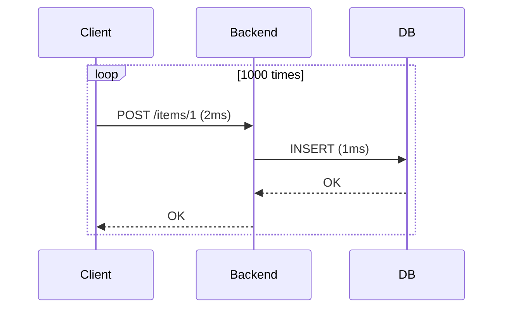

```markdown
# **Batch Processing vs. Individual Requests: How to Build APIs That Scale**

Every backend engineer knows the frustration of slow, chatty APIs. A loop of 1000 small database operations can take minutes—while the same data, batched efficiently, might complete in seconds. This isn’t just about performance; it’s about design. **Batch processing**—combining multiple operations into a single request—is a fundamental pattern that reduces overhead, minimizes latency, and prevents resource exhaustion.

In this post, we’ll explore why batching matters, how it compares to individual requests, and when to use it. We’ll dive into **real-world tradeoffs**, **code-first examples**, and best practices to implement batching effectively in your APIs. By the end, you’ll understand how to design systems that scale efficiently under load.

---

## **The Problem: Why Small Requests Fail Under Load**

Most APIs were designed for simplicity, not scalability. Processing items **one at a time** feels intuitive, but it introduces hidden inefficiencies that cripple performance under even modest traffic:

### **1. Network Round-Trip Overhead**
Every HTTP request—even to your own backend—requires:
- DNS resolution (~20ms)
- TCP handshake (~100ms)
- Serialization/deserialization (~5ms)
- Database round-trips (~1ms–10ms)

A loop of 1000 `INSERT` calls? That’s **1000×** these overheads.

```bash
# Example: 1000 individual requests vs. one batch
curl -X POST http://api.example.com/items/1    # 150ms
curl -X POST http://api.example.com/items/2    # 150ms
...
curl -X POST http://api.example.com/items/1000 # 150ms each
```
**Total time:** ~150 minutes (2.5 hours)

### **2. Database Transaction Explosion**
Modern databases (PostgreSQL, MySQL) optimize for **batch operations**:
- A single `INSERT INTO table VALUES (1, 'a'), (2, 'b')` is **10–100x faster** than 1000 separate statements.
- Transaction management (locks, autocommit, connection handling) becomes a bottleneck.

```sql
-- Slow: 1000 individual inserts
INSERT INTO users (id, name) VALUES (1, 'Alice');
INSERT INTO users (id, name) VALUES (2, 'Bob');
...
-- Fast: Batch insert
INSERT INTO users (id, name) VALUES
(1, 'Alice'), (2, 'Bob'), (3, 'Charlie');
```

### **3. Connection Pool Exhaustion**
Databases (like PostgreSQL) maintain a connection pool. Each small request:
- Takes a connection from the pool.
- Releases it after microseconds of work.
- Under heavy load, this **starves long-running queries**.


**Result:** Pool exhaustion, timeouts, and degraded performance.

### **4. N+1 Query Problem**
Even in APIs, small requests lead to:
- **API chattiness**: A frontend fetches 100 items in a loop → 100 network calls.
- **Database N+1**: Queries like `GET /users` fetch user data one by one, requiring 100 `SELECT` statements.

```javascript
// Bad: N+1 in a loop
const users = [];
for (let i = 0; i < 100; i++) {
  const user = await fetchUser(i); // 100 DB rounds
  users.push(user);
}
```

---

## **The Solution: Batch Processing**

**Batching** combines multiple operations into a single request, amortizing fixed costs across many items. This reduces:
- Network latency (1 request vs. 1000).
- Database overhead (single statement vs. 1000).
- Connection pressure (1 pool entry vs. 1000).

### **When to Batch**
| Scenario                     | Batch? | Why?                                                                 |
|------------------------------|--------|----------------------------------------------------------------------|
| Inserting 100+ records        | ✅ Yes  | Single `INSERT` is **10–100x faster**.                               |
| Updating bulk data           | ✅ Yes  | Reduces transaction locks and retries.                               |
| API aggregations (e.g., `/stats`) | ✅ Yes | Avoids 100 `SELECT` queries.                                         |
| Long-running jobs (ETL)      | ✅ Yes  | Processes data in chunks to avoid OOM errors.                        |
| High-frequency API calls     | ❌ No   | Batching adds latency; use async queues instead.                     |

---

## **Implementation Guide: How to Batch Effectively**

### **1. Database-Level Batching**
Most databases support bulk operations. Here’s how to use them:

#### **PostgreSQL: `COPY` for High-Volume inserts**
The `COPY` command is **orders of magnitude faster** than `INSERT` for large datasets.

```sql
-- Slow: Individual inserts (1000x slower)
INSERT INTO users (id, name) VALUES (1, 'Alice');
INSERT INTO users (id, name) VALUES (2, 'Bob');

-- Fast: COPY from temp file (~100ms for 1M rows)
COPY users(id, name) FROM '/tmp/users.txt' WITH (FORMAT csv);
```

#### **MySQL: `LOAD DATA INFILE`**
```sql
LOAD DATA INFILE '/tmp/data.csv'
INTO TABLE users
FIELDS TERMINATED BY ','
LINES TERMINATED BY '\n';
```

#### **Generic `INSERT VALUES` for Smaller Batches**
For batches under 10k rows, use `VALUES` with multiple rows:
```sql
INSERT INTO users (id, name, email)
VALUES
(1, 'Alice', 'alice@example.com'),
(2, 'Bob', 'bob@example.com'),
(3, 'Charlie', 'charlie@example.com');
```

---

### **2. API-Level Batching**
Expose endpoints that accept **arrays of items** instead of single objects.

#### **Example: Batch Insert Endpoint (REST)**
```http
POST /api/v1/users
Content-Type: application/json

[{
  "id": 1,
  "name": "Alice",
  "email": "alice@example.com"
}, {
  "id": 2,
  "name": "Bob",
  "email": "bob@example.com"
}]
```

#### **Implementation (Node.js/Express)**
```javascript
const express = require('express');
const { Pool } = require('pg');

const app = express();
app.use(express.json());

const pool = new Pool({ connectionString: 'postgres://...' });

app.post('/api/v1/users', async (req, res) => {
  const users = req.body; // Array of user objects

  // Batch insert
  const query = `
    INSERT INTO users(id, name, email)
    VALUES ${users.map(() => '(?, ?, ?)').join(', ')}
    RETURNING id;
  `;

  const values = users.flatMap(user => [user.id, user.name, user.email]);

  try {
    const result = await pool.query(query, values);
    res.status(201).json({ insertedIds: result.rows.map(row => row.id) });
  } catch (err) {
    res.status(500).json({ error: err.message });
  }
});

app.listen(3000, () => console.log('Server running'));
```

#### **Example: Batch Update Endpoint (GraphQL)**
```graphql
type Mutation {
  updateUsers(input: [UpdateUserInput!]!): [User!]!
}

input UpdateUserInput {
  id: ID!
  name: String
  status: String
}
```

```javascript
// GraphQL resolver (using Prisma)
mutation UpdateUsers($input: [UpdateUserInput!]!) {
  updateUsers(input: $input) {
    id
    name
  }
}
```

---

### **3. Chunking for Large Batches**
Batching isn’t always a single operation. For **very large datasets** (e.g., >10k rows), split work into chunks:

#### **Example: Chunked Processing in Python**
```python
import psycopg2
from tqdm import tqdm

def batch_insert(users, batch_size=1000):
    conn = psycopg2.connect("dbname=test user=postgres")
    cursor = conn.cursor()

    for i in tqdm(range(0, len(users), batch_size)):
        chunk = users[i:i + batch_size]
        query = f"""
        INSERT INTO users(id, name, email)
        VALUES {', '.join(['(%s, %s, %s)'] * len(chunk))}
        """
        cursor.executemany(query, [
            (user['id'], user['name'], user['email'])
            for user in chunk
        ])

    conn.commit()
    cursor.close()

# Usage
users = [{'id': 1, 'name': 'Alice'}, {'id': 2, 'name': 'Bob'}, ...] * 10000
batch_insert(users)
```

---

## **Common Mistakes to Avoid**

### **1. Over-Batching**
- **Problem:** A single batch of 1M rows may fail due to:
  - Memory limits (e.g., `pq: query was too long` in PostgreSQL).
  - Transaction timeouts (e.g., 8-second timeout for long `INSERT`).
- **Solution:** Limit batch size (e.g., 1k–10k rows) and **chunk** work.

### **2. Not Handling Errors Gracefully**
- **Problem:** A batch failure (e.g., duplicate key) may silently corrupt data.
- **Solution:** Use **transactions with rollback**:
  ```sql
  BEGIN;
  INSERT INTO users (...) VALUES (...); -- May fail
  -- If no error, commit; else rollback
  ```

### **3. Ignoring Database Limits**
- **Problem:** Some databases (e.g., SQLite) have **no native batching** and require workarounds.
- **Solution:** Check your DB’s limits:
  - PostgreSQL: `max_prepared_transactions` (default: 10).
  - MySQL: `max_allowed_packet` (default: 16MB).

### **4. Assuming All APIs Can Batch**
- **Problem:** Real-time systems (e.g., chat apps) **cannot** batch. Batching adds latency.
- **Solution:** Use **async queues** (e.g., RabbitMQ, Kafka) for offload.

---

## **Key Takeaways**
✅ **Batch when:**
- Processing **100+ items** of the same type.
- Avoiding **N+1 queries** in APIs.
- Working with **bulk data** (ETL, analytics).

❌ **Don’t batch when:**
- Latency matters (real-time systems).
- Data is **highly variable** (e.g., dynamic payloads).
- Your DB **doesn’t support batching** (e.g., SQLite).

🔧 **Best practices:**
1. **Start small:** Test with batches of 100–1k items.
2. **Use transactions:** Always wrap batches in a `BEGIN`/`COMMIT`.
3. **Monitor:** Track batch size vs. performance (e.g., `EXPLAIN` queries).
4. **Fallback:** For failures, implement **retry logic** with exponential backoff.

---

## **Conclusion: Build for Scale, Not Just Speed**

Batching isn’t about making requests "faster"—it’s about **designing for scale**. Small requests may work for prototypes, but they fail under real-world load. By understanding when to batch and how to implement it effectively, you’ll build APIs that:
- **Handle 10x more traffic** with the same resources.
- **Reduce latency** from seconds to milliseconds.
- **Avoid connection pool exhaustion** under load.

Start small, measure performance, and iterate. The best batching strategy is one that **balances throughput with reliability**.

---

### **Further Reading**
- [PostgreSQL `COPY` vs `INSERT`](https://www.postgresql.org/docs/current/sql-copy.html)
- [MySQL Bulk Loading Guide](https://dev.mysql.com/doc/refman/8.0/en/load-data.html)
- [N+1 Query Problem in Rails](https://www.railstutorial.org/book/advanced_mysql#sec-n_plus_one)
- [Event-Driven Architecture with Batching](https://www.martinfowler.com/articles/event-driven-pitfalls-of.html)

---
**What’s your biggest challenge with batching? Hit me up on [Twitter](https://twitter.com/yourhandle) or [GitHub](https://github.com/yourhandle) with your use case!**
```