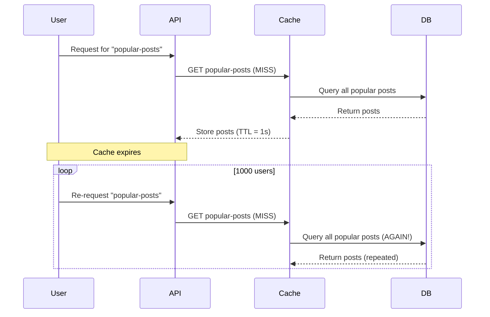

```markdown
# **Caching Conventions: A Practical Guide for Consistent, Scalable API Responses**


Caching is the secret weapon of high-performance backend systems—except when it’s not. Without clear conventions, your caching layer can become a tangled mess of inconsistent logic, cache stampedes, and missed opportunities for optimization. The **"Caching Conventions"** pattern isn’t just about *caching*—it’s about **standardizing how, when, and why** we cache data to ensure predictability, scalability, and maintainability.

In this guide, we’ll dissect the challenges of unstructured caching, explore the principles behind effective caching conventions, and walk through practical implementations for APIs, databases, and microservices. By the end, you’ll have a battle-tested framework to apply to your own systems, complete with tradeoffs, anti-patterns, and code-first examples.

---

## **The Problem: The Chaos of Ad-Hoc Caching**

Caching is often treated as an afterthought—an optimization added reactively when APIs slow down. But without **explicit conventions**, caching introduces new problems:

### **1. Inconsistent Cache Policies**
Imagine two teams working on the same API endpoint:
- Team A caches user profiles for **5 minutes** if the user is logged in.
- Team B caches the same profiles for **30 minutes** by default.

Now, a user’s profile might be stale in one part of the system while fresh in another. **Client-side perceptions of consistency suffer**, leading to confusing UX issues.

```javascript
// Team A's caching logic (5 min TTL)
const cachedUser = redis.get(`user:${userId}:profile`);
if (!cachedUser) {
  cachedUser = await db.query('SELECT * FROM users WHERE id = ?', [userId]);
  redis.setex(`user:${userId}:profile`, 300, JSON.stringify(cachedUser)); // 5 min expiry
}
```

```javascript
// Team B's caching logic (30 min TTL)
const cachedUser = redis.get(`user:${userId}:all`);
if (!cachedUser) {
  cachedUser = await db.query('SELECT * FROM users');
  redis.setex(`user:${userId}:all`, 1800, JSON.stringify(cachedUser)); // 30 min expiry
}
```

**Result:** Race conditions, stale data, and debugging headaches.

---

### **2. Cache-Shattering and Thundering Herds**
When a cache key’s TTL expires, every request for that key triggers a **cache miss**, flooding your database with redundant queries. This is the **"thundering herd"** problem:



Adding **cache warming** or **dynamic TTLs** can help, but without conventions, these fixes become inconsistent and hard to maintain.

---

### **3. Cache Invalidation Nightmares**
When data changes, how do you invalidate the cache?
- **Full table flushes?** Too aggressive, degrades performance.
- **Per-key invalidation?** What if a single update affects 100 related caches?
- **No strategy?** Stale data creeps in silently.

```sql
-- Example: Incrementing a user's badge count
UPDATE users SET badges = badges + 1 WHERE id = 123;

-- How do you invalidate these caches?
-- 1. Delete `user:123:profile`?
-- 2. Delete `user:123:activity`?
-- 3. Delete `leaderboard:weekly` (if badges affect rankings)?
```

Without conventions, teams debate which keys to invalidate, leading to **under-invalidation (stale data)** or **over-invalidation (cache misses)**.

---

## **The Solution: Caching Conventions**

Caching conventions are **design rules** that standardize:
1. **Cache key naming** – Consistent identifiers for data.
2. **TTL strategies** – Rules for expiration based on data volatility.
3. **Invalidation protocols** – How caches are updated when data changes.
4. **Cache layers** – Where to cache (client, edge, app, DB).
5. **Fallback behavior** – How to handle cache misses gracefully.

The goal isn’t to force rigidity—it’s to **reduce mental overhead** so teams can focus on business logic, not cache logic.

---

## **Components of Effective Caching Conventions**

### **1. Cache Key Design**
Bad keys are cryptic and unpredictable. Good keys follow **semantic naming** and include:
- **Entity type** (`user`, `product`, `order`)
- **Identifier** (`id`, `email`, `sku`)
- **Optional qualifiers** (`?withImages`, `?v2` for versioning)

#### **Example Key Formats**
| Use Case               | Key Example                     | Notes                          |
|------------------------|---------------------------------|--------------------------------|
| User profile           | `user:123:profile`              | Simple, unique id-based key    |
| Product with variants  | `product:abc123:details?v=2`    | Versioned for schema changes   |
| Real-time leaderboard  | `leaderboard:weekly:hot`        | Context-aware (e.g., weekly)   |
| Aggregated stats       | `user:123:stats:monthly`        | Time-bound aggregations        |

**Avoid:**
- Arbitrary hashes (`cacheKey_abc123`).
- Overly complex patterns (`user#123#profile#2024#v1.5`).

---

### **2. TTL Strategies**
Not all data deserves the same cache lifetime. Use these **heuristics**:

| Data Type               | Recommended TTL | Why?                                  |
|-------------------------|-----------------|----------------------------------------|
| Static assets (CSS/JS)  | 1 year          | Rarely change                         |
| User preferences        | 1–7 days        | Often manual, but can be refreshed    |
| Time-sensitive (news)   | 1–24 hours      | Freshness matters                     |
| Static product data     | 1 week          | Rarely updated                        |
| Real-time data (chat)   | 5–30 minutes    | High volatility                       |

**Dynamic TTLs:**
For volatile data, adjust TTL based on access patterns:
```javascript
// Example: Adjust TTL based on last access time
const accessTime = redis.get(`access:${cacheKey}`);
const lastAccess = new Date(accessTime).getTime();
const now = Date.now();
const timeSinceAccess = (now - lastAccess) / (1000 * 60); // Minutes

if (timeSinceAccess < 5) {
  // If accessed recently, extend TTL
  redis.expire(cacheKey, 3600); // 1 hour
} else {
  // If stale, use default TTL
  redis.expire(cacheKey, 600); // 10 minutes
}
```

---

### **3. Invalidation Protocols**
Define **explicit rules** for when caches must be cleared:

| Strategy               | Use Case                          | Example                          |
|------------------------|-----------------------------------|----------------------------------|
| **Event-driven**       | Real-time updates (e.g., WebSockets) | Trigger cache invalidation on DB event |
| **Time-based**         | Scheduled refreshes (e.g., daily stats) | `CRON` job to clear `daily-stats` cache |
| **Dependency-based**   | When related data changes (e.g., updating a product invalidates its categories) | Invalidate `product:abc123:categories` when `product:abc123` is updated |
| **Write-through**      | Strong consistency required (e.g., financial data) | Cache is updated on every write |

**Example: Event-Driven Invalidation**
```javascript
// When a product is updated, publish an event
await eventBus.publish('product.updated', { id: 'abc123' });

// Subscriber invalidates caches
eventBus.subscribe('product.updated', (data) => {
  // Invalidate product details
  redis.del(`product:${data.id}:details`);

  // Invalidate related categories
  redis.del(`product:${data.id}:categories`);

  // Invalidate aggregations (e.g., inventory stats)
  redis.del(`inventory:stats`);
});
```

---

### **4. Cache Layers**
Where you cache matters. **Don’t cache everything in one layer!**
| Layer          | Use Case                          | Example Tools                |
|----------------|-----------------------------------|------------------------------|
| **Client-side**| Reduce latency for repeated requests | Browser `localStorage`, Service Workers |
| **Edge**       | Geo-distributed users (CDN)       | Cloudflare, Fastly, Vercel Edge |
| **Application**| Business logic cache             | Redis, Memcached             |
| **Database**   | Query-level caching               | PostgreSQL `pg_cache`, MySQL Query Cache |

**Example: Hybrid Caching**
```mermaid
graph TD
    Client-->|HTTP| API
    API-->|Cache Miss| Redis
    Redis-->|Cache Hit| API
    API-->|DB Query| Database
    Database-->|Data| API
    API-->|Cache Set| Redis
    Note over API: "Edge cache (CDN) for static assets"
```

---

### **5. Cache Fallbacks**
When the cache fails, define **graceful degradation**:
- **Stale-while-revalidate:** Return cached data while fetching fresh data in the background.
- **Fallback to DB:** If cache is down, query the database directly (with circuit breakers).
- **Circuit breakers:** Fail fast if the cache layer is unavailable.

```javascript
async function getUserProfile(userId, fallbackToDb = false) {
  try {
    const cached = await redis.get(`user:${userId}:profile`);
    if (cached) return JSON.parse(cached);

    if (!fallbackToDb) {
      throw new Error("Cache unavailable");
    }

    const dbData = await db.query('SELECT * FROM users WHERE id = ?', [userId]);
    redis.setex(`user:${userId}:profile`, 300, JSON.stringify(dbData));
    return dbData;
  } catch (err) {
    if (err.message === "Cache unavailable") {
      return await getUserProfile(userId, true); // Fallback
    }
    throw err;
  }
}
```

---

## **Implementation Guide: Step-by-Step**

### **Step 1: Define Cache Key Conventions**
Start with a **naming schema** and enforce it via:
- **Code linting** (ESLint, Prettier plugins).
- **API design docs** (OpenAPI/Swagger annotations).
- **Infrastructure-as-Code** (Terraform/Ansible templates).

**Example: `.eslintrc.js` for Cache Key Validation**
```javascript
module.exports = {
  rules: {
    'no-magic-numbers': ['error', { ignoreArrayIndexes: true }],
    'cache-key-valid': [
      'error',
      {
        validKeys: [
          '^user:\\d+:profile$', // user:123:profile
          '^product:[a-z0-9]+:details$', // product:abc123:details
        ],
      },
    ],
  },
};
```

---

### **Step 2: Implement TTL Policies**
Use **default TTLs per data type** and allow overrides only in well-documented cases.

**Example: TTL Configuration (JSON)**
```json
{
  "default_ttl": 600, // 10 minutes
  "exceptions": {
    "user:*:profile": 3600, // 1 hour for profiles
    "product:*:inventory": 60, // 1 minute for volatile stock
    "leaderboard:*": 300 // 5 minutes for ranking data
  }
}
```

**Apply in code:**
```javascript
function getTTL(key) {
  const defaultTtl = 600; // Default: 10 minutes
  const [entity, id, _] = key.split(':');
  const entityTtl = ttls[entity] || defaultTtl;

  if (key.includes('inventory')) return 60; // Exception
  return entityTtl;
}

await redis.setex(key, getTTL(key), value);
```

---

### **Step 3: Automate Invalidation**
Use **event-driven architectures** to invalidate caches proactively:
1. **Database triggers** → Publish events on updates.
2. **Message queues** (Kafka, RabbitMQ) → Decouple invalidation logic.
3. **CDN invalidation hooks** → For edge caches.

**Example: PostgreSQL Trigger for Cache Invalidation**
```sql
CREATE OR REPLACE FUNCTION invalidate_user_profile()
RETURNS TRIGGER AS $$
BEGIN
  PERFORM pg_notify('user.updated', json_build_object('id', NEW.id)::text);
  RETURN NEW;
END;
$$ LANGUAGE plpgsql;

CREATE TRIGGER trigger_invalidate_user_profile
AFTER UPDATE ON users
FOR EACH ROW
EXECUTE FUNCTION invalidate_user_profile();
```

**Subscriber (Node.js):**
```javascript
const redis = require('redis');
const pubsub = redis.createClient().duplicate();

pubsub.subscribe('user.updated');
pubsub.on('message', (channel, message) => {
  const { id } = JSON.parse(message);
  redis.del(`user:${id}:profile`);
  redis.del(`user:${id}:activity`);
});
```

---

### **Step 4: Monitor Cache Hit Ratios**
Without metrics, you can’t optimize. Track:
- **Cache hit/miss ratios** per endpoint.
- **TTL effectiveness** (are caches expiring too soon?).
- **Invalidation latency** (how fast are caches cleared?).

**Example: Prometheus Metrics**
```javascript
const { collectDefaultMetrics, Counter } = require('prom-client');

// Track cache hits/misses
const cacheHits = new Counter({
  name: 'cache_hits_total',
  help: 'Total cache hits',
  labelNames: ['key_prefix'],
});

const cacheMisses = new Counter({
  name: 'cache_misses_total',
  help: 'Total cache misses',
  labelNames: ['key_prefix'],
});

async function getWithMetrics(key) {
  const value = await redis.get(key);
  if (value) {
    cacheHits.inc({ key_prefix: key.split(':')[0] });
    return value;
  }
  cacheMisses.inc({ key_prefix: key.split(':')[0] });
  return null;
}
```

---

### **Step 5: Document Your Conventions**
Write a **living document** (in your `docs/` folder or wiki) covering:
1. **Cache key schema** (with examples).
2. **TTL rules** (per data type).
3. **Invalidation workflows**.
4. **Tools used** (Redis, CDN, etc.).
5. **Troubleshooting guide** (e.g., "How to debug a 100% cache miss rate").

**Example: Cache Conventions Cheatsheet**
| Key Prefix       | TTL  | Invalidation Trigger          | Notes                          |
|------------------|------|--------------------------------|--------------------------------|
| `user:*:profile` | 3600 | `user.updated` event           | Invalidate on profile updates   |
| `product:*`      | 3600 | `product.updated` event       | Versioned keys for breaking changes |
| `cart:*`         | 60   | `cart.item.removed` event     | High volatility               |

---

## **Common Mistakes to Avoid**

### **1. Over-Caching**
- **Problem:** Caching too much (e.g., entire database tables) leads to **cache pollution**—wasting memory on rarely used data.
- **Fix:** Cache only **hot data** (frequently accessed, volatile items).

```javascript
// Bad: Cache everything
const allUsers = await db.query('SELECT * FROM users');
redis.setex('all_users', 300, JSON.stringify(allUsers)); // Memory waste!

// Good: Cache only if requested
const userId = req.params.id;
const cachedUser = await redis.get(`user:${userId}:profile`);
```

---

### **2. Inconsistent TTLs**
- **Problem:** Changing TTLs arbitrarily breaks consistency.
- **Fix:** **Freeze TTLs** for stable APIs. Use **dynamic TTLs only** for volatile data.

```javascript
// Bad: Arbitrary TTL changes
if (isAdmin) {
  redis.setex(`user:${id}:profile`, 86400); // 1 day for admins
} else {
  redis.setex(`user:${id}:profile`, 3600); // 1 hour for users
}

// Good: Document exceptions
const TTL = user.isAdmin ? 86400 : 3600; // Explicit rule
redis.setex(`user:${id}:profile`, TTL, ...);
```

---

### **3. Ignoring Cache Warmup**
- **Problem:** Cold starts when a cache expires and many users request it simultaneously.
- **Fix:** **Pre-warm caches** for predictable loads (e.g., daily digest emails).

```javascript
// Pre-warm leaderboard before midnight
async function warmLeaderboard() {
  const leaderboard = await fetchLeaderboard();
  await redis.setex('leaderboard:weekly', 3600, JSON.stringify(leaderboard));
}

// Schedule with Node.js cron
const cron = require('node-cron');
cron.schedule('0 0 * * *', warmLeaderboard); // Run daily at midnight
```

---

### **4. No Circuit Breakers**
- **Problem:** If the cache fails, your entire system slows down.
- **Fix:** Implement **fallback mechanisms** and **circuit breakers**.

```javascript
const CircuitBreaker = require('opossum');

const cacheBreaker = new CircuitBreaker(
  async () => redis.get(key),
  { timeout: 1000, errorThresholdPercentage: 5