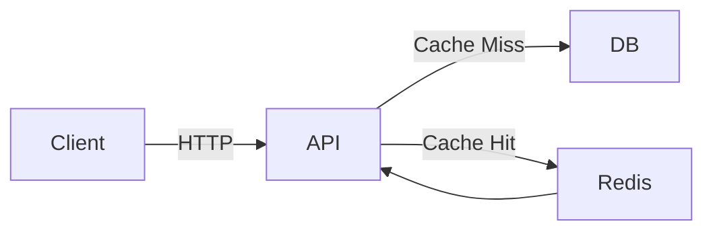

```markdown
# **Caching Guidelines: A Practical Guide to Optimizing Performance Without Breaking Your System**

In today’s high-performance web applications, caching is often treated as a magic bullet—slap some Redis or Memcached in front of your API, and suddenly everything runs faster. But without proper guidelines, caching can introduce more problems than it solves: stale data, inconsistent states, and cascading failures that are hard to debug.

As a backend engineer, you’ve likely faced this dilemma: *where* to cache, *how* long to cache, and *what* to cache. These choices aren’t just about performance—they directly impact data consistency, user experience, and reliability.

In this guide, we’ll break down **Caching Guidelines**—a structured approach to caching that ensures performance gains without sacrificing correctness. We’ll cover:
- How caching gone wrong can cripple your application
- A systematic way to decide caching strategies
- Practical implementation patterns in Go (with Redis)
- Anti-patterns that waste time and money

By the end, you’ll have a reusable checklist to apply caching responsibly in your next project.

---

## **The Problem: Caching Without Boundaries**

Caching is one of the most cost-effective ways to improve API response times, but it’s often implemented haphazardly. Here are the common issues:

### **1. Cache Invalidation Nightmares**
Imagine an e-commerce system where product prices are cached for 1 hour. If a sale happens during that window, customers might see outdated prices while admins frantically update them. Worse, if multiple services depend on the same cache key, misaligned invalidations can lead to inconsistent data.

```go
// Bad: Hardcoded cache TTL with no awareness of business logic
func getProductPrice(productID int) (float64, error) {
    cacheKey := fmt.Sprintf("product_price:%d", productID)
    cachedPrice, err := redis.Get(cacheKey).Float64()
    if err == nil {
        return cachedPrice, nil
    }

    // Query DB, cache for 1 hour (arbitrary!)
    price, err := db.QueryProductPrice(productID)
    if err != nil {
        return 0, err
    }
    redis.Set(cacheKey, price, 3600) // 1 hour
    return price, nil
}
```

### **2. Cache Stampedes and Thundering Herd**
When a cache key expires, multiple requests flood the database simultaneously, causing temporary overload:

```go
// Example of a cache stampede: All expired keys hit DB at once
for i := 0; i < 100; i++ {
    go func() {
        // All requests race to re-fetch from DB
    }()
}
```

### **3. Over-Caching Unnecessary Data**
Storing every possible query result in cache bloats memory, increases eviction rates, and complicates debugging. For example, caching raw SQL query results without filtering could expose sensitive data.

### **4. No Monitoring or Observability**
Without tracking cache hits/misses or cache latency, you can’t tell if caching is helping—or hurting—your system.

---

## **The Solution: Caching Guidelines**

A **Caching Guideline** is a structured approach that balances performance and correctness. It answers key questions:
1. **What** data to cache?
2. **Where** to cache it (client, server, CDN)?
3. **How long** to cache it?
4. **How to invalidate** it?
5. **How to monitor** its effectiveness?

Here’s how we’ll implement a robust caching strategy:

| **Guideline**         | **Example**                                                                 |
|-----------------------|-----------------------------------------------------------------------------|
| Prefer **read-heavy** data for caching | User profiles, product catalogs (not frequently updated)                    |
| Use **TTL with logic** | Dynamic TTL based on data volatility (e.g., 5 min for trending items)       |
| Handle **stampedes**  | Implement **cache warming** and **lazy loading**                           |
| **Version keys**      | Append timestamps/ETags to cache keys to force freshness                    |
| **Monitor**           | Track cache hit ratio, evictions, and latency                                |

---

## **Components/Solutions**

### **1. Layered Caching Strategy**
Use multiple caching layers to optimize trade-offs between latency and consistency:

- **Client-Side Caching** (Browser, App): Reduces server load for static data (e.g., images, HTML snippets).
- **Server-Side Caching** (Redis, Memcached): Ideal for API responses with short TTLs.
- **Database Caching**: Query-level caching (e.g., Redis for SQL results).



### **2. Smart Cache Invalidation**
Instead of blindly invalidating entire keys, use:
- **Event-based invalidation** (e.g., publish a message on product update → delete cache keys).
- **TTL with delta updates** (e.g., cache for 10 minutes but update every 2 minutes).

```go
// Event-based invalidation with Redis Pub/Sub
redis.Publish("product:updated", productID)
```

### **3. Cache Stampede Protection**
Use **token bucket** or **probabilistic early expiration** to mitigate stampedes:

```go
// Example: Cache-aside with probabilistic early expiration
func getProduct(productID int) (*Product, error) {
    key := fmt.Sprintf("product:%d", productID)
    cached, err := redis.Get(key)
    if err == nil {
        return cached, nil
    }

    // Check if cache is "stale" (probabilistic early expiration)
    if shouldRefreshEarly(key) { // 10% chance to refresh early
        product, err := db.GetProduct(productID)
        if err != nil {
            return nil, err
        }
        redis.Set(key, product, 300) // 5 min TTL
        return product, nil
    }
    return nil, fmt.Errorf("cache missed")
}
```

### **4. Cache Key Design**
Avoid collisions and ensure uniqueness with:
- **Composite keys** (e.g., `user:123:orders`).
- **Versioning** (e.g., `product:123:v2`).
- **Context-aware keys** (e.g., `user:123:cart:location:NY`).

```go
// Bad: Ambiguous key that could conflict
"product:123"

// Good: Context-aware with version
"product:123:category:electronics:v2"
```

---

## **Implementation Guide**

### **Step 1: Define Caching Levels**
Determine which data should be cached where:

| **Data Type**       | **Client Cache** | **Server Cache** | **Database** |
|---------------------|------------------|------------------|--------------|
| User profiles       | ✅ Yes           | ✅ Yes           | ❌ No        |
| Product catalogs    | ❌ No            | ✅ Yes           | ❌ No        |
| Real-time orders    | ❌ No            | ❌ No            | ✅ Yes       |

### **Step 2: Set TTLs Based on Volatility**
Use dynamic TTLs for data with varying update frequencies:

```go
func getTTLForProduct(productID int) time.Duration {
    product, _ := db.GetProduct(productID)
    if product.IsHot() {
        return 60 * time.Second // Trending items: 1 min
    }
    return 5 * 60 * time.Minute // Regular items: 5 min
}
```

### **Step 3: Implement Cache-Aside Pattern**
Fetch from cache first; if missed, query DB and cache the result:

```go
// Cache-aside pattern in Go with Redis
func getUser(userID int) (*User, error) {
    key := fmt.Sprintf("user:%d", userID)
    cached, err := redis.Get(key)
    if err == nil {
        var user User
        json.Unmarshal([]byte(cached), &user)
        return &user, nil
    }

    // Fetch from DB and cache
    user, err := db.GetUser(userID)
    if err != nil {
        return nil, err
    }
    redis.Set(key, user.JSON(), 10*60) // Cache for 10 minutes
    return user, nil
}
```

### **Step 4: Add Monitoring**
Track cache hit/miss ratios and latency:

```go
var (
    cacheHits   int64
    cacheMisses int64
    cacheLatency time.Duration
)

func trackCache(key string, duration time.Duration) {
    atomic.AddInt64(&cacheHits, 1)
    atomic.AddInt64(&cacheMisses, 1) // Simplified for example
    cacheLatency = duration
}
```

### **Step 5: Handle Failures Gracefully**
If Redis is down, fall back to DB (with a warning):

```go
func getWithFallback(userID int) (*User, error) {
    cached, err := redis.Get(fmt.Sprintf("user:%d", userID))
    if err == nil {
        return cached, nil
    }

    // Fallback to DB (and log warning)
    log.Warn("Cache miss, falling back to DB")
    return db.GetUser(userID)
}
```

---

## **Common Mistakes to Avoid**

### **1. Caching Too Much**
- **Problem**: Caching raw SQL results or large blobs (e.g., PDFs).
- **Fix**: Cache only what’s frequently read and small enough to fit in memory.

### **2. Ignoring TTL**
- **Problem**: Setting a TTL too long leads to stale data; too short causes too many cache misses.
- **Fix**: Use **TTL based on data volatility** (e.g., 1 hour for static data, 1 minute for dynamic).

### **3. No Cache Invalidation Strategy**
- **Problem**: Hardcoding TTLs without handling updates.
- **Fix**: Use **event-driven invalidation** (e.g., Redis Pub/Sub) or **versioned keys**.

### **4. Forgetting to Monitor**
- **Problem**: No visibility into cache hit ratios or latency.
- **Fix**: Track metrics (e.g., Prometheus) and set alerts for high miss rates.

### **5. Overlooking Cache Stampedes**
- **Problem**: All requests hit DB when cache expires.
- **Fix**: Use **probabilistic early expiration** or **cache warming**.

---

## **Key Takeaways**

✅ **Cache only what’s read-heavy and volatile** (avoid over-caching).
✅ **Use layered caching** (client → server → DB) for optimal trade-offs.
✅ **Set TTLs dynamically** based on data freshness needs.
✅ **Invalidate caches intelligently** (event-based or versioned keys).
✅ **Protect against stampedes** with probabilistic early expiration.
✅ **Monitor cache performance** (hit ratios, latency, evictions).
✅ **Always have a fallback** to DB when caching fails.

---

## **Conclusion**

Caching is a powerful tool, but it requires discipline. Without clear guidelines, you risk introducing inconsistencies, performance degradation, or even system failures.

By following this structured approach—**defining what to cache, where to cache it, and how to invalidate it**—you can build reliable, high-performance systems. Start with a small scope (e.g., user profiles), measure the impact, and gradually scale caching across your application.

**Next steps:**
- Experiment with Redis or Memcached in a staging environment.
- Use Prometheus to track cache metrics.
- Automate cache invalidation with event-driven systems.

Happy caching! 🚀
```