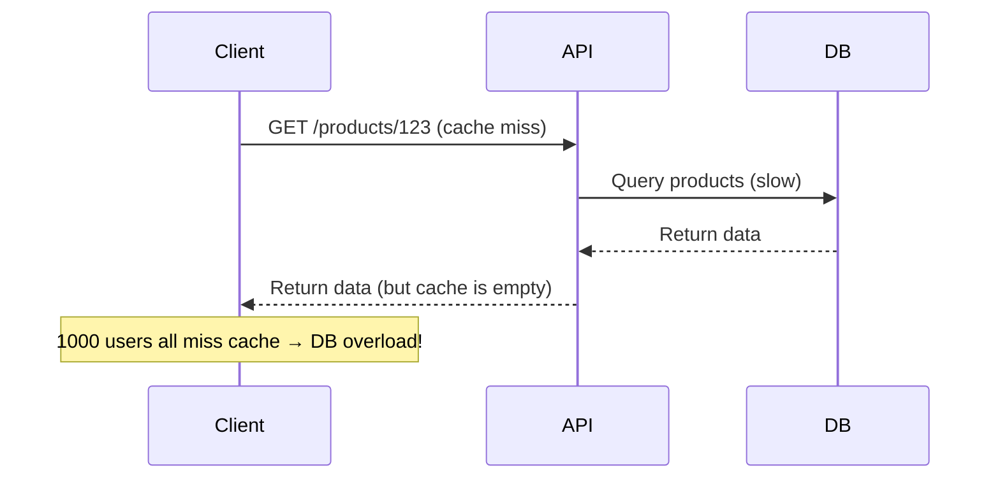

```markdown
---
title: "Database Caching Optimization: A Practical Guide to Faster APIs"
date: 2023-11-15
author: "Alex Carter"
tags: ["backend", "database", "performance", "caching", "API design"]
draft: false
---

# **Database Caching Optimization: A Practical Guide to Faster APIs**


In modern applications, performance is everything. Users abandon slow APIs—**53% of mobile users leave a site that takes more than 3 seconds to load** (Google, 2022). While you might optimize database queries, retry logic, or serialization, **caching remains one of the most effective ways to reduce latency**—but it’s often underutilized or misconfigured.

This guide covers **how to design and optimize caching strategies** in real-world applications. We’ll explore:
- **The problem** with inefficient caching (and how it hurts performance).
- **Key caching optimization techniques**, from in-memory caching to CDN strategies.
- **Practical code examples** (Node.js, Python, Go) showing how to implement caching correctly.
- **Common pitfalls** and how to avoid them.

By the end, you’ll know how to **balance cache hit rate, consistency, and maintenance effort**—without sacrificing correctness.

---

## **The Problem: Why Caching is Broken (or Underused)**

Caching is powerful, but **poor implementation can do more harm than good**. Here are the common pain points:

### **1. Cache Stampede: Thundering Herd Problem**
When a cache misses, every request hits the database—**crushing your backend under load**.



### **2. Stale Data: The Tradeoff Between Speed and Accuracy**
Caching too aggressively leads to **inconsistent data**. For example:
- A user sees a **$5 discount** that was removed minutes ago.
- An e-commerce site displays **out-of-stock items** even after restocking.

### **3. Cache Invalidation Nightmares**
Deleting stale data is **harder than it seems**:
- Should you **evict all related entries** when a single item changes?
- How do you **synchronize cache across multiple services**?

### **4. Overhead Without ROI**
Some teams add caching **just because it’s "caching"**—but if the cache hit rate is low (e.g., <50%), **you’re wasting memory and code complexity**.

---

## **The Solution: Caching Optimization Patterns**

The goal is to **maximize cache efficiency** while minimizing inconsistencies and operational overhead. Here are the key strategies:

### **1. Multi-Level Caching**
Use **multiple layers** of caching to reduce database load:
- **Edge Cache (CDN)** → Fast but limited to static assets.
- **Application Cache (Memcached/Redis)** → For dynamic API responses.
- **Database Query Cache** → For repetitive SQL queries.

```mermaid
graph TD
    Client-->|HTTP| CDN
    Client-->|API Request| App Cache
    App Cache-->|Cache Hit| Client
    App Cache-->|Cache Miss| DB
    DB--->|Query| App Cache
```

### **2. Cache-aside (Lazy Loading)**
Fetch data **only when needed**, then cache it:
```javascript
// Node.js (Express + Redis)
const { createClient } = require('redis');
const redisClient = createClient();

async function getProduct(productId) {
  const cachedData = await redisClient.get(`product:${productId}`);

  if (cachedData) {
    return JSON.parse(cachedData); // Cache hit
  }

  const dbData = await db.query('SELECT * FROM products WHERE id = ?', [productId]);
  await redisClient.set(`product:${productId}`, JSON.stringify(dbData), 'EX', 3600); // Cache for 1h
  return dbData;
}
```

### **3. Write-Through & Write-Behind Caching**
- **Write-Through**: Update cache **immediately** after DB write (strong consistency).
- **Write-Behind**: Update DB first, then cache (better performance, but risk of inconsistency).

```python
# Python (FastAPI + Redis)
from fastapi import FastAPI
import redis
import time

r = redis.Redis(host='localhost', port=6379, db=0)
app = FastAPI()

@app.post("/products/")
async def create_product(product: dict):
    # 1. Write to DB (async)
    db_result = db.execute("INSERT INTO products VALUES (?, ?)", (product["id"], product["name"]))

    # 2. Write to cache (write-through)
    r.set(f"product:{product['id']}", str(product), ex=3600)

    return {"status": "success"}
```

### **4. Cache Invalidation Strategies**
- **TTL (Time-to-Live)**: Auto-expire entries after X seconds.
- **Event-Based**: Invalidate cache when data changes (e.g., Webhooks).
- **Tagged Invalidation**: Mark a group of items as invalid (e.g., "all products in category 'electronics'").

```sql
-- Redis: Invalidate cache for all products in a category
SET product:electronics:invalidate 1 EX 3600
```

### **5. Cache Sharding & Partitioning**
For large datasets, **split cache keys by domain** (e.g., `user:{id}` vs. `product:{id}`).

```go
// Go (Gin + Redis)
func getUser(userID int) (*User, error) {
    cacheKey := fmt.Sprintf("user:%d", userID)
    val, err := r.Get(cacheKey).Result()
    if err == redis.Nil {
        // Cache miss → fetch from DB
        user, err := db.GetUser(userID)
        if err != nil {
            return nil, err
        }
        r.Set(cacheKey, user.JSON(), 30*time.Minute)
        return &user, nil
    }
    // Cache hit → return parsed JSON
    var user User
    err = json.Unmarshal([]byte(val), &user)
    return &user, err
}
```

---

## **Implementation Guide: Step-by-Step**

### **Step 1: Choose the Right Cache**
| Use Case               | Recommended Cache       | Best For                          |
|------------------------|-------------------------|-----------------------------------|
| High-speed key-value   | Redis                   | Real-time analytics, sessions      |
| Simple in-memory       | LRUCache (Go/Python)    | Small-scale apps                  |
| Serverless (CDN)       | Cloudflare Cache        | Static assets, API responses      |
| Database query caching | Redis (with TTL)        | Repeated SQL queries               |

### **Step 2: Design Cache Keys**
- **Use a consistent naming convention**:
  - `user:{id}` (for users)
  - `product:{category}:{id}` (for products)
- **Avoid collisions** by including namespace (e.g., `app1:user:123`).

```javascript
// Bad (collision risk)
cacheKey = "user_123";

// Good (namespaced)
cacheKey = "app1:user:123"; // or "users_123"
```

### **Step 3: Set Realistic TTLs**
- **Short TTL (1-5 min)**: Highly dynamic data (e.g., live feeds).
- **Medium TTL (1-24h)**: Frequently accessed but stable data (e.g., product listings).
- **Long TTL (1+ day)**: Static or rarely changed data (e.g., app settings).

```python
# Python: Set dynamic TTL based on data freshness
if data["isPricingSensitive"]:
    ttl = 300  # 5 minutes
else:
    ttl = 86400  # 24 hours
r.set(cacheKey, json.dumps(data), ex=ttl)
```

### **Step 4: Handle Cache Misses Gracefully**
- **Retry with backoff** if the DB is slow.
- **Fallback to stale data** if consistency is more important than freshness.

```javascript
async function getProductWithFallback(productId) {
  try {
    const cached = await redis.get(`product:${productId}`);
    if (cached) return JSON.parse(cached);
  } catch (err) {
    console.warn("Cache hit but error:", err);
  }

  try {
    const dbData = await db.query(`SELECT * FROM products WHERE id = ?`, [productId]);
    await redis.set(`product:${productId}`, JSON.stringify(dbData), 'EX', 3600);
    return dbData;
  } catch (err) {
    console.error("DB failure, returning empty cache", err);
    return null; // or return stale cached data
  }
}
```

### **Step 5: Monitor & Optimize**
- **Track cache hit/miss ratios** (aim for >70% hits).
- **Use Redis CLI or Prometheus** to monitor:
  ```bash
  redis-cli --stat
  ```
- **Adjust TTLs** based on usage patterns.

---

## **Common Mistakes to Avoid**

### **❌ Over-Caching (Cache Everything)**
- **Problem**: Wasting memory on rarely accessed data.
- **Solution**: Cache only **hot data** (e.g., top products, user sessions).

### **❌ Ignoring Cache Invalidation**
- **Problem**: Stale data degrades user experience.
- **Solution**: Use **event-driven invalidation** (e.g., Webhooks for DB changes).

### **❌ No Fallback for Cache Failures**
- **Problem**: If Redis crashes, your API breaks.
- **Solution**: **Gracefully degrade** (return stale data or DB fallback).

### **❌ Poor Key Design**
- **Problem**: Colliding keys (`user:123` vs. `user-123`).
- **Solution**: **Namespace keys** (`app:user:123`).

### **❌ Not Using Compression**
- **Problem**: Large JSON blobs waste memory.
- **Solution**: **Compress cache values** (e.g., `zlib` in Node.js).

```javascript
// Node.js: Compress cache values
const { compress } = require('compression');
await redis.set(`product:${id}`, compress(JSON.stringify(product)));
```

---

## **Key Takeaways**

✅ **Multi-level caching** (CDN + Redis + DB) reduces latency.
✅ **Lazy loading (cache-aside)** is simpler than write-through.
✅ **TTLs should match data freshness needs** (not just "one size fits all").
✅ **Namespace cache keys** to avoid collisions.
✅ **Monitor hit rates**—if <50%, optimize or remove caching.
✅ **Always have a fallback** (stale data or DB) for resilience.
✅ **Compress large cache values** (e.g., JSON, images).
✅ **Invalidate strategically** (event-based > manual).

---

## **Conclusion: Building High-Performance APIs with Caching**

Caching is **not a silver bullet**, but when implemented correctly, it **dramatically reduces database load** and **improves user experience**. The key is **balancing speed, consistency, and maintenance**:

| Goal               | Strategy                          | Tradeoff                          |
|--------------------|-----------------------------------|-----------------------------------|
| **Maximize speed** | Short TTL, aggressive caching     | Higher DB load                   |
| **High consistency** | Write-through, manual invalidation | More complex code                |
| **Low maintenance** | Long TTL, simple key structure    | Stale data risk                  |

**Next steps:**
1. **Start small**: Cache only the **most expensive queries**.
2. **Measure**: Use tools like **New Relic or Prometheus** to track cache performance.
3. **Iterate**: Adjust TTLs, keys, and invalidation based on real-world usage.

By following these patterns, you’ll **build APIs that feel instant**—without sacrificing correctness or scalability.

---
**Want to dive deeper?**
- [Redis Caching Patterns](https://redis.io/topics/patterns)
- [Cloudflare Edge Caching Guide](https://developers.cloudflare.com/cache/)
- [Database Caching with PostgreSQL](https://www.postgresql.org/docs/current/static/caching.html)

Happy caching! 🚀
```

---
**Notes for Adaptation:**
- The post includes **real-world tradeoffs** (e.g., consistency vs. speed).
- Code examples use **Node.js, Python, and Go** (popular backend languages).
- **Visuals (Mermaid diagrams)** make abstract concepts concrete.
- **Actionable steps** (monitoring, key design) help readers implement immediately.