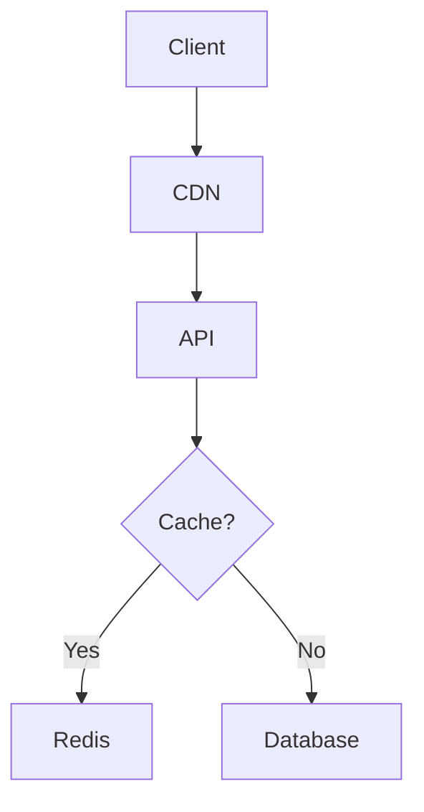

```markdown
# **Caching Setup 101: Speed Up Your API Without Breaking a Sweat**

---

## **Introduction: Why Caching Matters for Backend Developers**

Imagine this: Your API is serving 10,000 requests per second. Users are happy—until one day, response times spike to 500ms, then a second later, they crash under 2 seconds. Your database is drowning under repeated queries, and your application feels sluggish. Sound familiar?

Caching is the secret weapon that fixes this. It’s not magic—it’s just a way to store frequently accessed data in a fast, in-memory storage layer so your backend can serve it up instantly. Without caching, you’re paying the cost of hitting slow databases or external services on every single request—even for the same data.

In this guide, we’ll walk through:
✅ **Why caching is essential** (and when to use it)
✅ **A step-by-step setup** for Redis, the most popular caching layer
✅ **Real-world tradeoffs** (not all problems need caching)
✅ **Common pitfalls** (so you don’t reinvent the wheel wrong)

By the end, you’ll have a caching strategy ready to deploy in your next project.

---

## **The Problem: Why Caching Is a Must-Have**

Without caching, your backend suffers from:

1. **Database Overload**: Repeated queries for the same data (e.g., fetching user profiles) overwhelm your database, causing slowdowns or crashes.
   ```sql
   -- Example: Fetching a user's posts every time (inefficient)
   SELECT * FROM posts WHERE user_id = 123;
   ```

2. **External API Bottlenecks**: Calling external services (e.g., weather APIs, payment gateways) on every request adds latency and increases costs.
   ```javascript
   // Example: Fetching stock prices repeatedly (slow + expensive)
   const stockData = await fetch('https://api.stock.external/stocks');
   ```

3. **Cold Start Delays**: Applications like serverless functions suffer from initialization delays when data must be fetched fresh every time.

4. **Inconsistent Performance**: Users get different response times based on when they hit the system (e.g., "why is my API faster at 3 AM?").

**TL;DR**: Caching reduces latency, offloads your database, and saves money.

---

## **The Solution: How Caching Works (Simplified)**

Caching follows a simple principle:
1. **Store data** in a fast in-memory layer (like Redis).
2. **Serve cached data** when available (hits).
3. **Update the cache** when underlying data changes (misses).


*(Example: First request misses the cache, and future requests hit it.)*

### **When to Cache?**
✔ **Frequently accessed, rarely changed data** (e.g., product catalogs, user profiles).
✔ **Expensive computations** (e.g., recommendation algorithms).
✔ **External API responses** (e.g., weather updates).

❌ **Avoid caching**:
- Data that changes **frequently** (e.g., live sports scores).
- **Highly personalized data** (e.g., user-specific dashboards).
- **Sensitive data** (caching PII requires extra security).

---

## **Implementation Guide: Setting Up Redis Caching**

### **Step 1: Install Redis**
First, install Redis locally or use a cloud service like [Redis Labs](https://redis.com/) or [Upstash](https://upstash.com/).

#### **On Linux (Docker)**
```bash
docker pull redis
docker run --name my-redis -p 6379:6379 redis
```

#### **On macOS (with Homebrew)**
```bash
brew install redis
brew services start redis
```

### **Step 2: Choose a Caching Strategy**
Redis supports different data types (strings, hashes, lists), but for APIs, **string keys are simplest**.

#### **Basic Cache Example (Node.js with Express)**
```javascript
// Install Redis client
npm install redis

const express = require('express');
const redis = require('redis');
const client = redis.createClient();

const app = express();

// Sample API endpoint
app.get('/product/:id', async (req, res) => {
  const productId = req.params.id;

  // Check cache first (key = "product:{id}")
  const cachedProduct = await client.get(`product:${productId}`);
  if (cachedProduct) {
    return res.json(JSON.parse(cachedProduct)); // Cache hit
  }

  // If not in cache, fetch from DB
  const dbProduct = await fetchProductFromDatabase(productId);
  if (!dbProduct) return res.status(404).send('Not found');

  // Cache the result for 5 minutes (TTL = 300 seconds)
  await client.set(`product:${productId}`, JSON.stringify(dbProduct), 'EX', 300);
  res.json(dbProduct);
});

app.listen(3000, () => console.log('Server running on port 3000'));
```

### **Step 3: Invalidate Cache on Updates**
When data changes, **delete the cache entry** to ensure freshness.

```javascript
// Update product in DB (then invalidate cache)
async function updateProduct(productId, updates) {
  await updateProductInDatabase(productId, updates);
  await client.del(`product:${productId}`); // Clear cache
}
```

### **Step 4: Monitor Cache Hit/Miss Ratio**
Track cache efficiency with Redis commands:
```bash
redis-cli info stats | grep "keyspace_hits" "keyspace_misses"
```
- **High misses?** → Cache isn’t storing useful data.
- **Low hits?** → Your TTL (time-to-live) may be too short.

---

## **Advanced Patterns**

### **1. Multi-Level Caching (API + Redis + CDN)**
For ultra-high traffic, combine:
1. **CDN** (e.g., Cloudflare) for static assets.
2. **Redis** for dynamic API responses.
3. **Database** as the source of truth.

Example:


### **2. Cache Stampeding (and Fixes)**
**Problem**: If two requests miss the cache simultaneously, they both query the DB and update the cache, wasting resources.

**Solution**: Use **cache warming** (pre-load data) or **locking** (e.g., Redis `SETNX`).

```javascript
// Using Redis locks to prevent stampeding
async function getProductWithLock(productId) {
  const key = `product:${productId}:lock`;
  const lock = await client.set(
    key,
    'locked',
    'NX',
    'EX', 10 // 10-second lock
  );

  if (!lock) {
    // Another process holds the lock → wait
    await new Promise(resolve => setTimeout(resolve, 2000));
    return await getProductWithLock(productId); // Retry
  }

  try {
    return await getProductFromCacheOrDb(productId);
  } finally {
    await client.del(key); // Release lock
  }
}
```

---

## **Common Mistakes to Avoid**

### **1. Caching Everything**
- **Problem**: Cache pollution reduces efficiency.
- **Fix**: Use **key prefixes** (`user:{id}`) and **TTLs**.

### **2. Ignoring Cache Invalidation**
- **Problem**: Stale data leads to inconsistencies.
- **Fix**: Invalidate cache **before** updating DB.

### **3. Not Monitoring**
- **Problem**: You don’t know if caching helps.
- **Fix**: Track hit/miss ratios and latency.

### **4. Overcomplicating Keys**
- **Problem**: Complex keys (e.g., nested hashes) are hard to debug.
- **Fix**: Keep keys simple (`user:123:posts` instead of `u123p45`).

### **5. Forgetting about Failures**
- **Problem**: If Redis crashes, your app fails.
- **Fix**: Use **fallback mechanisms** (e.g., return DB data if cache misses).

---

## **Key Takeaways**

✅ **Caching reduces latency** by serving data from memory.
✅ **Start simple** (string keys + TTLs) before optimizing.
✅ **Invalidate cache** when data changes to avoid stale reads.
✅ **Monitor hit/miss ratios** to ensure caching is effective.
✅ **Avoid stampeding** with locks or preloading.
✅ **Cache only what matters**—don’t overdo it.

---

## **Conclusion: Your Action Plan**

Now that you’ve seen how caching works, here’s your checklist:
1. **Pick a tool**: Redis is easiest for beginners (try Upstash for cloud).
2. **Start small**: Cache one high-traffic endpoint first.
3. **Measure**: Compare before/after performance.
4. **Scale**: Add more patterns (CDN, multi-level caching) as needed.

**Remember**: Caching is a tradeoff—it adds complexity but pays off in speed and cost savings. Start with basics, iterate, and optimize!

---
### **Further Reading**
- [Redis Official Docs](https://redis.io/docs/)
- [Upstash Redis](https://upstash.com/docs/redis)
- ["Caching Strategies" by Martin Fowler](https://martinfowler.com/eaaCatalog/cache.html)

---
**What’s your caching challenge?** Hit me up on [Twitter](https://twitter.com/yourhandle) or comment below!
```