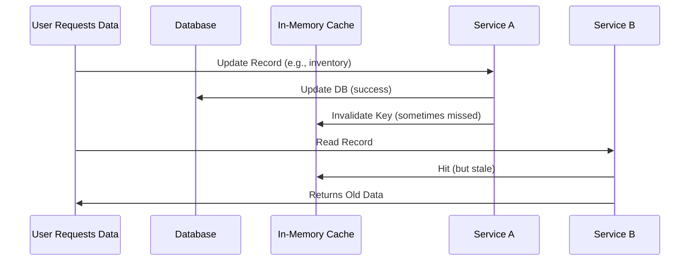

## **The Problem: Why Caching Without Standards is a Nightmare**

Caching is supposed to simplify things—but without rules, it complicates them.

### **1. Inconsistent Data & Race Conditions**
Imagine a scenario where:
- Service A updates a database record.
- Service B reads the same record from cache but doesn’t invalidate it.
- Service C reads an even older version.

The result? **Stale, inconsistent data** across services.



This isn’t just rare—it happens **all the time** when caching isn’t standardized.

### **2. Debugging Hell**
Without clear caching rules, logs become a mess:
- **"Why did this request take 500ms when it should be cached?"**
- **"Did this miss the cache, or was it a cache invalidation issue?"**
- **"Who is responsible for cache invalidation?"**

### **3. Performance Overhead Without Benefits**
Some teams cache **everything**, leading to:
- **Cache stampedes** (many requests flood the database when cache is missing).
- **Memory bloat** (unused cached data clogging up Redis).
- **Cold starts** (scaling out because cache warming is inconsistent).

### **4. Security Risks**
Unauthorized data exposure happens when:
- Sensitive cached responses aren’t properly expired.
- Cache keys leak sensitive data (e.g., `user_123_session_data` instead of `session_123`).
- Cache poisoning occurs due to weak invalidation rules.

---

## **The Solution: Caching Standards**

A **caching standard** is a set of rules, patterns, and tools that ensure:
✅ **Consistent behavior** across services.
✅ **Predictable performance** with clear tradeoffs.
✅ **Easy debugging** with standardized logging and monitoring.
✅ **Scalability** with controlled cache size and invalidation.

We’ll break this down into **three key components**:

1. **Cache Layering Strategy** (Where to cache)
2. **Cache Invalidation Policy** (How to keep data fresh)
3. **Cache Monitoring & Tooling** (How to observe and optimize)

---

## **Components of a Caching Standard**

### **1. Choose the Right Cache Layer**

Not all caches are equal. Here’s a practical approach:

| **Cache Type**       | **Best For**                          | **Example Use Cases**                     | **Tradeoffs** |
|----------------------|---------------------------------------|------------------------------------------|---------------|
| **In-Memory (Local)** | Fast, single-service reads            | Session storage, formula computations    | Not shared, risk of inconsistency |
| **Distributed (Redis)** | Multi-service, durable caching      | API responses, database query results    | Adds network latency, requires clustering |
| **CDN (Edge Cache)**  | Global, low-latency delivery         | Static assets, API responses for users    | Limited TTL, harder to invalidate |
| **Database Indexing** | Query optimization                    | Slowly changing data (e.g., reports)     | Not a "cache," just optimized access |

#### **Code Example: Choosing the Right Cache Layer in Go**

```go
package main

import (
	"context"
	"fmt"
	"sync"
	"time"

	"github.com/go-redis/redis/v8"
)

// LocalCache is a simple in-memory cache for single-service use
type LocalCache struct {
	data map[string]string
	mu   sync.RWMutex
}

func (lc *LocalCache) Get(key string) (string, bool) {
	lc.mu.RLock()
	defer lc.mu.RUnlock()
	val, exists := lc.data[key]
	return val, exists
}

func (lc *LocalCache) Set(key, value string, ttl time.Duration) {
	lc.mu.Lock()
	defer lc.mu.Unlock()
	lc.data[key] = value
	time.AfterFunc(ttl, func() {
		lc.mu.Lock()
		delete(lc.data, key)
		lc.mu.Unlock()
	})
}

// RedisDistributedCache is for multi-service shared caching
type RedisDistributedCache struct {
	client *redis.Client
}

func NewRedisDistributedCache(addr string) *RedisDistributedCache {
	rdb := redis.NewClient(&redis.Options{
		Addr: addr,
	})
	return &RedisDistributedCache{client: rdb}
}

func (rdc *RedisDistributedCache) Get(ctx context.Context, key string) (string, error) {
	return rdc.client.Get(ctx, key).Result()
}

func (rdc *RedisDistributedCache) Set(ctx context.Context, key, value string, ttl time.Duration) error {
	return rdc.client.Set(ctx, key, value, ttl).Err()
}
```

**When to use which?**
- **Local cache** → High-frequency, single-service reads (e.g., `price_calculator`).
- **Redis** → Multi-service shared data (e.g., `user_profile_123`).
- **CDN** → Global, read-heavy data (e.g., `product_page_456`).

---

### **2. Define a Cache Invalidation Policy**

The **most critical part** of caching is ensuring data freshness. Common invalidation strategies:

| **Strategy**          | **Description**                          | **When to Use**                          | **Tradeoffs** |
|-----------------------|------------------------------------------|------------------------------------------|---------------|
| **Time-Based (TTL)**  | Cache expires after a set duration.      | Low-frequency updates, tolerates slight staleness. | Risk of stale data if updates are frequent. |
| **Event-Based**       | Cache invalidates when related data changes. | Real-time systems (e.g., stock prices). | Requires event publishing (e.g., Kafka, DB triggers). |
| **Write-Through**     | Cache is updated **and** DB is updated.  | Strong consistency required.            | Higher write latency. |
| **Write-Behind**      | Cache is updated asynchronously.        | High-throughput writes.                 | Risk of inconsistency if cache fails. |
| **Hybrid (TTL + Event)** | TTL + manual invalidation on updates. | Balances simplicity and freshness.      | More complex to implement. |

#### **Code Example: Event-Based Invalidation with Kafka**

```go
package main

import (
	"context"
	"log"

	"github.com/confluentinc/confluent-kafka-go/kafka"
)

// UserService handles user data and cache invalidation
type UserService struct {
	redisCache *RedisDistributedCache
	kafkaProd *kafka.Producer
}

func (us *UserService) UpdateUser(ctx context.Context, userID string, data map[string]string) error {
	// Update DB first
	if err := us.updateDB(userID, data); err != nil {
		return err
	}

	// Invalidate cache via Kafka event
	if err := us.invalidateUserCache(ctx, userID); err != nil {
		return err
	}

	return nil
}

func (us *UserService) invalidateUserCache(ctx context.Context, userID string) error {
	// Publish an "UserUpdated" event to Kafka
	topic := "user-updates"
	msg := kafka.Message{
		TopicPartition: kafka.TopicPartition{Topic: &topic, Partition: kafka.PartitionAny},
		Value:          []byte(userID),
	}
	return us.kafkaProd.Produce(ctx, &msg, nil)
}

// CacheInvalidator listens for Kafka events and invalidates Redis
type CacheInvalidator struct {
	redisCache *RedisDistributedCache
	kafkaCons *kafka.Consumer
}

func (ci *CacheInvalidator) Start() {
	ci.kafkaCons.SubscribeTopics([]string{"user-updates"}, nil)

	for {
		msg, err := ci.kafkaCons.ReadMessage(-1)
		if err != nil {
			log.Printf("Error reading message: %v", err)
			continue
		}

		userID := string(msg.Value)
		ci.redisCache.client.Del(context.Background(), "user_profile_"+userID)
	}
}
```

**Why this works:**
- **Strong consistency** → Cache is invalidated **immediately** when data changes.
- **Decoupled** → No tight coupling between services.
- **Scalable** → Kafka handles high throughput.

**Tradeoffs:**
- **Complexity** → Requires Kafka setup.
- **Latency** → If Kafka fails, cache may not invalidate immediately.

---

### **3. Standardize Monitoring & Logging**

Without visibility, caching becomes a **black box**.

#### **Key Metrics to Track:**
1. **Cache Hit/Miss Ratio** → Are we getting value from caching?
   ```sql
   SELECT
     COUNT(*) as total_requests,
     SUM(CASE WHEN cache_hit = true THEN 1 ELSE 0 END) as hits,
     SUM(CASE WHEN cache_hit = false THEN 1 ELSE 0 END) as misses
   FROM api_requests;
   ```
2. **Cache Size Growth** → Is Redis memory usage spiking?
   ```bash
   redis-cli info | grep used_memory
   ```
3. **Invalidation Latency** → Are cache invalidations slow?
   ```go
   // Log cache invalidation time
   start := time.Now()
   err := redisClient.Del(ctx, key)
   log.Printf("Cache invalidation for %s took %v", key, time.Since(start))
   ```
4. **Stale Data Incidents** → Are users seeing old data?

#### **Code Example: Prometheus Metrics for Caching**

```go
package main

import (
	"github.com/prometheus/client_golang/prometheus"
	"github.com/prometheus/client_golang/prometheus/promhttp"
)

// CacheMetrics tracks cache performance
var (
	cacheHits = prometheus.NewCounterVec(
		prometheus.CounterOpts{
			Name: "cache_hits_total",
			Help: "Total cache hits",
		},
		[]string{"cache_type"},
	)
	cacheMisses = prometheus.NewCounterVec(
		prometheus.CounterOpts{
			Name: "cache_misses_total",
			Help: "Total cache misses",
		},
		[]string{"cache_type"},
	)
	cacheLatency = prometheus.NewHistogramVec(
		prometheus.HistogramOpts{
			Name:    "cache_latency_seconds",
			Help:    "Latency of cache operations",
			Buckets: prometheus.DefBuckets,
		},
		[]string{"cache_type", "operation"},
	)
)

func init() {
	prometheus.MustRegister(cacheHits, cacheMisses, cacheLatency)
}

func (rdc *RedisDistributedCache) Get(ctx context.Context, key string) (string, error) {
	start := time.Now()
	defer func() {
		cacheLatency.WithLabelValues("redis", "get").Observe(time.Since(start).Seconds())
	}()

	val, err := rdc.client.Get(ctx, key).Result()
	if err == redis.Nil {
		cacheMisses.WithLabelValues("redis").Inc()
		return "", nil
	}
	cacheHits.WithLabelValues("redis").Inc()
	return val, err
}
```

**Expose metrics on `/metrics`:**
```go
http.Handle("/metrics", promhttp.Handler())
go http.ListenAndServe(":8080", nil)
```

**Visualize with Grafana:**


---

## **Implementation Guide: Step-by-Step**

### **Step 1: Define Cache Layers per Service**
| Service          | Cache Layer       | Purpose                          |
|------------------|-------------------|----------------------------------|
| `Auth Service`   | Redis (TTL: 5m)   | User sessions                     |
| `Product Service`| Redis + CDN (TTL: 1h)| Product listings                 |
| `Reporting`      | Database Indexes  | Aggregated sales data             |

### **Step 2: Implement a Cache Invalidation Strategy**
- **For `Auth Service`:** Use **TTL + Event-Based** (invalidate on logout).
- **For `Product Service`:** Use **Hybrid (TTL + Event-Based)** (invalidate on price change).

### **Step 3: Add Monitoring**
- **Prometheus + Grafana** for metrics.
- **Alert if cache misses > 10% for critical endpoints.**

### **Step 4: Document the Standard**
Example in `README.md`:
```markdown
## Caching Standards

### Cache Layers
| Service      | Cache Type   | TTL       | Invalidation |
|--------------|--------------|-----------|--------------|
| Auth         | Redis        | 5m        | Event-based  |
| Products     | Redis + CDN  | 1h        | Hybrid       |

### Cache Keys
- `user_123_session` → Use `session_123` (avoid PII in keys)
- `product_456_details` → CDN + Redis sync

### Debugging
- Check `/metrics` for cache hit/miss ratios.
- Use `redis-cli` to inspect keys.
```

---

## **Common Mistakes to Avoid**

### **❌ Mistake 1: Caching Everything**
- **Problem:** Cache bloat, higher memory usage, slower invalidations.
- **Fix:** Only cache **expensive, read-heavy operations**.

### **❌ Mistake 2: No Cache Invalidation**
- **Problem:** Stale data, inconsistent states.
- **Fix:** Always define an invalidation strategy (TTL + Event).

### **❌ Mistake 3: Poor Cache Key Design**
- **Problem:** Hardcoding keys, leaking sensitive data.
- **Fix:**
  ```go
  // BAD: Leaks user ID
  cacheKey := "user_data_" + userID

  // GOOD: Generic and safe
  cacheKey := "user_profile_" + userID
  ```

### **❌ Mistake 4: Ignoring Cache Wars**
- **Problem:** Two services compete for the same cache key, causing race conditions.
- **Fix:** Use **distributed locks** or **unique key prefixes**.

  ```go
  // Use service-specific prefixes
  cacheKey := "products_serviceA_456"
  ```

### **❌ Mistake 5: No Fallback for Cache Failures**
- **Problem:** If Redis crashes, the app breaks.
- **Fix:** Implement **cache-aside pattern** with fallbacks.

  ```go
  func getUserProfile(userID string) (User, error) {
      // Try cache first
      cached, err := rdc.Get(ctx, "user_profile_"+userID)
      if err == redis.Nil {
          // Cache miss → fall back to DB
          user, err := db.GetUser(userID)
          if err != nil {
              return User{}, err
          }
          // Cache the result
          if err := rdc.Set(ctx, "user_profile_"+userID, user.JSON(), 1*time.Hour); err != nil {
              log.Println("Failed to cache user profile:", err)
          }
          return user, nil
      }
      // Parse and return cached data
      var user User
      if err := json.Unmarshal([]byte(cached), &user); err != nil {
          return User{}, err
      }
      return user, nil
  }
  ```

---

## **Key Takeaways**

✅ **Standardize cache layers** (local vs. distributed vs. CDN).
✅ **Define clear invalidation policies** (TTL, event-based, etc.).
✅ **Monitor cache performance** (hit/miss ratio, latency, size).
✅ **Document caching rules** for the team.
✅ **Avoid common pitfalls** (caching everything, no fallbacks, poor key design).

---

## **Conclusion**

Caching is **not a one-size-fits-all solution**. Without standards, it becomes a **chaotic mix of ad-hoc decisions**, leading to inconsistent performance, debugging headaches, and even security risks.

By defining **clear cache layers, invalidation policies, and monitoring**, you can build a **scalable, maintainable caching strategy** that actually improves your system.

### **Next Steps:**
1. **Audit your current caching**—where are the inconsistencies?
2. **Pick one service** and apply the patterns here.
3. **Monitor and iterate**—caching standards evolve as your system grows.

Happy caching! 🚀

---
**Further Reading:**
- [Redis Cache Aside Pattern](https://redis.io/topics/caching)
- [Kafka for Event-Driven Architectures](https://kafka.apache.org/)
- [Prometheus Best Practices](https://prometheus.io/docs/practices/)