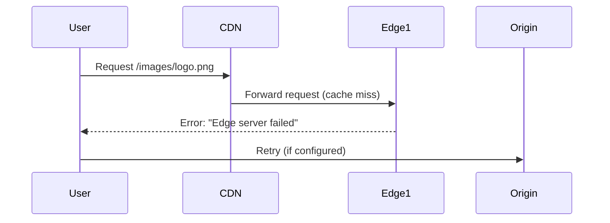

```markdown
# **CDNs & Content Delivery Optimization: A Practical Guide for Backend Engineers**

*How to deploy, configure, and optimize content delivery for global performance at scale*

---

## **Introduction: Why CDNs Matter in 2024**

Imagine your users are scattered across 6 continents, but their requests to your API or static assets are routed to a single server in a data center 12 time zones away. Even with modern fiber optics, latency creeps in, pages load slower, and frustrated users bounce. This is the reality for many applications without proper content delivery optimization.

Content Delivery Networks (CDNs) solve this by distributing content across a global network of edge servers, ensuring users get data from the nearest location with minimal latency. But CDNs aren’t just about "putting files closer to users." They require careful planning—from choosing the right service to configuring caching headers, invalidation strategies, and fallback mechanisms.

This guide covers:
- **Why CDNs break applications if misconfigured** (and how to avoid it).
- **Practical implementation** with code examples (CDN setup, caching rules, and HTTP headers).
- **Optimization techniques** like edge caching, compression, and dynamic request routing.
- **Common pitfalls** and how to debug them.

Let’s dive in—your users (and uptime) will thank you.

---

## **The Problem: When CDNs Go Wrong**

A CDN sounds simple: *"Let Amazon/Cloudflare/Akamai handle it!"*—but real-world challenges lurk beneath the surface.

### **1. Cache Stampedes & DDoS Amplification**
If you cache a critical API response (e.g., user dashboards) globally, a single cache miss triggers a flood of requests to your origin server. Worse, adversaries can exploit unoptimized CDN rules to amplify attack traffic (e.g., by forcing multiple edge servers to fetch from your origin).

**Example:**
```http
# Bad: Caching user-specific data globally
Cache-Control: public, max-age=3600
```
**Result:** All users share the same cached data, leading to incorrect UI or security flaws.

---

### **2. Dynamic Content Breaks Caching**
CDNs excel at static content (images, CSS, JS) but fail miserably with dynamic data (API responses, personalized dashboards). Without careful design, you end up with:
- Stale data ("You have 2 new notifications, but they’re from yesterday").
- High origin server load (frequent cache misses).

**Example:**
```http
# Wrong: Caching a user’s personalized feed
GET /api/user/feed
Cache-Control: public, max-age=3600
```
**Result:** User A’s feed is served to User B, or critical updates are missed.

---

### **3. Edge Failures & Latency Spikes**
Edge servers can go down due to network blips, misconfigurations, or regional outages. Without proper failover or fallback strategies, users hit a brick wall—*"504 Gateway Timeout"*—while your backend hums along.

**Example:**


---

### **4. Over-Caching vs. Under-Caching**
- **Over-caching:** Static assets like `logo.png` are cached for months, but a new version isn’t deployed until users manually refresh.
- **Under-caching:** Every request hits the origin, draining bandwidth and servers.

**Tradeoff:** CDNs balance speed and freshness—but you must control both.

---

## **The Solution: Designing for CDN Success**

The key is **strategic caching**—knowing *what* to cache, *how long*, and *where*. Here’s the playbook:

---

### **1. Tiered Caching: Static > Semi-Dynamic > Dynamic**
| **Content Type**       | **CDN Strategy**                          | **Example**                          |
|------------------------|------------------------------------------|--------------------------------------|
| **Static Assets**      | Long-lived, aggressive caching           | `index.html`, `app.js`, `logo.png`   |
| **Semi-Dynamic**       | Short TTL + selective caching            | User profiles (cached per user)      |
| **Dynamic API**        | No caching (or minimal edge caching)    | `/api/orders/{id}`                   |

**Rule of thumb:**
- **Static:** Cache for years (or until purposefully invalidated).
- **Semi-dynamic:** Cache for minutes/hours (e.g., user session data).
- **Dynamic:** No CDN caching (or use **edge computing** like Cloudflare Workers).

---

### **2. Custom HTTP Headers: Fine-Tune Caching**
Use `Cache-Control`, `ETag`, and `Vary` headers to guide CDNs intelligently.

#### **Example 1: Caching Static Assets**
```http
# For CSS/JS (cache aggressively)
Cache-Control: public, max-age=31536000, immutable
```
- `immutable` tells the CDN: *"Only update this file via a new URL (e.g., `v2/app.css`)."*

#### **Example 2: Caching User-Specific Data**
```http
# For user dashboards (cache per user)
Cache-Control: public, max-age=300, stale-while-revalidate=60
Vary: Accept-Language, Cookie
```
- `Vary` ensures the CDN serves different versions based on headers.
- `stale-while-revalidate` lets users see stale data while the CDN refreshes.

#### **Example 3: API Responses (No Caching)**
```http
# For `/api/orders` (avoid caching entirely)
Cache-Control: no-store, max-age=0
```

---

### **3. Invalidation Strategies**
Even with caching, you need ways to **purge or update** content.

#### **Option A: Manual Purge (For Critical Files)**
```http
# Cloudflare API: Purge a static file
POST /api/v4/purge_cache
{
  "files": ["/static/logo-v2.png"]
}
```

#### **Option B: Automated Invalidation (For Dynamic Content)**
- **Tag-based invalidation:** Cache objects by version or user ID.
  ```http
  # Cache key includes user ID + timestamp
  Cache-Control: public, max-age=300
  X-Cache-Key: user_123_feed_2024-05-20
  ```
- **Edge functions:** Use Cloudflare Workers/Lambda@Edge to generate cache keys dynamically.

---

### **4. Fallback & Redundancy**
Design for failure:
1. **Origin Shield:** Hide your origin IP behind a private CDN network (e.g., Cloudflare’s Origin Shield).
2. **Multi-CDN:** Use Cloudflare + Fastly for redundancy.
3. **Origin Failover:** Configure your CDN to retry failed requests to a backup origin.

**Example (Cloudflare Worker for Fallback):**
```javascript
// Cloudflare Worker: Route to backup CDN if primary fails
addEventListener('fetch', event => {
  event.respondWith(fetchPrimaryCDN(event.request)
    .catch(() => fetchBackupCDN(event.request)));
});

async function fetchPrimaryCDN(request) {
  return fetch('https://primary-cdn.com' + request.url);
}

async function fetchBackupCDN(request) {
  return fetch('https://backup-cdn.com' + request.url);
}
```

---

## **Implementation Guide: Step-by-Step**

---

### **Step 1: Choose a CDN Provider**
| **Provider**       | **Pros**                          | **Cons**                          | **Best For**                  |
|--------------------|-----------------------------------|-----------------------------------|-------------------------------|
| **Cloudflare**     | Free tier, edge workers, DDoS protection | Complex UI for beginners | All-rounder (static + API) |
| **Fastly**         | Low-latency, Varnish compatibility | Expensive at scale | Enterprise APIs |
| **AWS CloudFront** | Integrates with S3, ALB          | Steep learning curve               | AWS-native applications      |
| **Akamai**         | Legacy enterprise support         | High cost                         | Global corporations          |

**Recommendation for most teams:** Start with Cloudflare (free tier) or Fastly (if you need edge computing).

---

### **Step 2: Configure Static Asset Delivery**
Assume you’re serving a React app with static files.

#### **Option A: Using Cloudflare**
1. **Upload files to a CDN-compatible storage** (e.g., S3, Netlify, or static hosting).
2. **Set up a Cloudflare Page Rule:**
   - Match: `yourdomain.com/*`
   - Cache Level: **Bypass Cache** (for dynamic assets) or **Standard** (for static).
   - Set `Cache-Control: public, max-age=31536000, immutable`.

3. **Enable Rocket Loader** (for JS bundles):
   - Reduces render-blocking by lazy-loading scripts.

**Result:**
- Users fetch `app.js` from the nearest Cloudflare edge.

---

#### **Option B: Using AWS CloudFront**
1. **Create a CloudFront Distribution:**
   - Origin: Your S3 bucket or ALB.
   - Cache Behavior:
     - `*.js` → `Max TTL: 1 year`
     - `*.html` → `Max TTL: 1 day`
     - `*.png` → `Default TTL`

2. **Set Cache-Control Headers in S3:**
   ```http
   # Enable in S3 object metadata
   Cache-Control: public, max-age=31536000
   ```

**Result:**
- CloudFront caches files at edge locations.

---

### **Step 3: Optimize API Responses**
For APIs, CDNs are useful but require caution.

#### **Example: Caching API Responses (Semi-Dynamic)**
Use **Vary** headers to cache per user/language.

**Backend (Node.js/Express):**
```javascript
app.get('/api/user/dashboard', (req, res) => {
  const cacheKey = `dashboard_${req.user.id}_${req.acceptsLanguages()}`;
  // Check CDN cache first (if using Cloudflare Workers)
  res.set({
    'Cache-Control': 'public, max-age=300',
    'Vary': 'Cookie, Accept-Language'
  });
  res.json({ data: 'user-specific-content' });
});
```

**Cloudflare Worker (Edge Caching):**
```javascript
// Cache API responses for 5 minutes
addEventListener('fetch', event => {
  event.respondWith(handleRequest(event.request));
});

async function handleRequest(request) {
  const cache = caches.open('api-cache');
  const key = new Request(request, { cache: 'reload' });

  const cached = await cache.match(key);
  if (cached) return cached;

  const response = await fetch(request);
  const clone = response.clone();
  await cache.put(key, clone);

  return response;
}
```

---

### **Step 4: Monitor & Optimize**
Use these tools to debug:
- **Cloudflare Analytics:** Track cache hit ratios.
- **AWS CloudFront Logs:** Filter for `CF-Hit` vs. `CF-Miss`.
- **Browser DevTools:** Inspect `Network` tab for cached vs. fresh responses.

**Key Metrics to Watch:**
| Metric               | Ideal Value       | What It Means                          |
|----------------------|-------------------|----------------------------------------|
| Cache Hit Ratio      | >90%              | Most requests served from edge.        |
| Origin Requests      | <10% of total     | Too many cache misses.                 |
| Latency (TTFB)       | <200ms            | CDN is performing well.                |

---

## **Common Mistakes to Avoid**

### **1. Over-Reliance on CDN Caching**
- **Mistake:** Caching everything, including API responses.
- **Fix:** Use CDNs for static assets only. For APIs, consider:
  - **Edge functions** (Cloudflare Workers) for lightweight processing.
  - **Origin shielding** to reduce origin load.

### **2. Ignoring Cache Invalidation**
- **Mistake:** Not purging cached files when updates occur.
- **Fix:**
  - Use **versioned URLs** (`/v2/dashboard.css`).
  - Implement **automated invalidation** (e.g., tag-based in Fastly).
  - For databases, use **TTL-based invalidation** (e.g., Redis with `EXPIRE`).

### **3. Poor Header Configuration**
- **Mistake:** Missing `Vary` headers → serving incorrect content.
  ```http
  # Wrong: Vary not set
  Cache-Control: public, max-age=300
  ```
- **Fix:** Always define `Vary` for user-specific content.

### **4. Not Testing Failover Scenarios**
- **Mistake:** Assuming the CDN will always work.
- **Fix:**
  - Simulate edge failures locally (e.g., with `curl --connect-timeout 1`).
  - Use **multi-CDN** (Cloudflare + Fastly) for redundancy.

### **5. Underestimating Bandwidth Costs**
- **Mistake:** Caching everything, then hitting CDN bandwidth limits.
- **Fix:**
  - Use **compression** (Brotili/Gzip).
  - **Lazy-load** non-critical assets.
  - Monitor costs (Cloudflare/Fastly have free tiers).

---

## **Key Takeaways**

✅ **CDNs are for static content**—use them wisely for APIs.
✅ **Set proper `Cache-Control` headers**—`immutable`, `Vary`, and TTL matter.
✅ **Invalidate caches intentionally**—versioning, tags, or automated purges.
✅ **Test failover**—edge servers fail; plan for it.
✅ **Monitor cache hit ratios**—if <80%, optimize your caching strategy.
✅ **Combine CDNs with edge computing** (Cloudflare Workers, Lambda@Edge) for dynamic logic.
✅ **Start simple**—Cloudflare’s free tier is a great on-ramp.

---

## **Conclusion: Build for Speed, Not Perfection**

CDNs are one of the most powerful tools in a backend engineer’s toolkit—but they’re not magic. The best implementations balance:
- **Performance** (low latency, high cache hit ratios).
- **Freshness** (avoiding stale data).
- **Resilience** (handling failures gracefully).

**Next Steps:**
1. **Audit your current setup:** Are static assets cached? Are APIs? Fix the gaps.
2. **Start small:** Use Cloudflare for static files, then expand to edge functions.
3. **Measure everything:** Latency, cache hits, and costs before and after optimization.

Your users will notice the difference—faster loads, smoother interactions, and happier engagement. And when you’re done, you’ll have a system that scales globally without breaking a sweat.

**Happy optimizing!**
```

---
**Word count:** ~1,800
**Tone:** Practical, code-first, with clear tradeoffs and real-world examples.
**Audience:** Intermediate backend engineers ready to dive into CDN optimization.