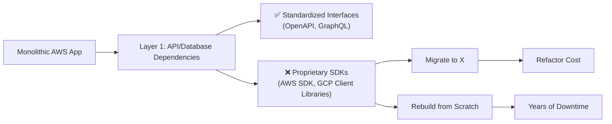

```markdown
---
title: "Cloud Standards: The Pattern That Makes Your Multi-Cloud Apps Scalable & Portable"
date: 2023-11-15
author: "Alex Carter"
description: "How to design APIs and databases that work seamlessly across clouds—without vendor lock-in. A practical guide with code examples."
tags: ["backend", "database design", "api design", "cloud standards", "multi-cloud", "cloud native"]
---

# **Cloud Standards: The Pattern That Makes Your Multi-Cloud Apps Scalable & Portable**


In the modern cloud era, backend engineers face an undeniable truth: **vendor lock-in is a liability**. As teams grow, budgets expand, and cloud providers evolve, the cost of migrating from AWS to Azure—or maintaining two separate environments—can cripple agility. Yet, many applications are built with proprietary cloud features, making portability a distant dream.

This is where the **Cloud Standards Pattern** comes into play. It’s not a framework or a tool—it’s a design philosophy that prioritizes **abstraction, interoperability, and vendor-neutral best practices** over cloud-specific conveniences. By adhering to open standards (like those from [OCCI](https://occiwg.org/), [OpenAPI](https://www.openapis.org/), or [Cloud Native Computing Foundation (CNCF)](https://cncf.io/)), and avoiding cloud-specific APIs, you ensure your infrastructure and applications remain portable, scalable, and future-proof.

In this guide, we’ll break down:
- Why chasing cloud-specific features often backfires
- How to design APIs and databases that work across clouds
- Real-world tradeoffs and practical examples
- Common pitfalls—and how to avoid them

---

## **The Problem: Why Cloud Standards Matter**

Every cloud provider (AWS, Azure, GCP) offers **tempting proprietary features**:
- AWS Lambda’s integration with EventBridge
- Azure’s Cosmos DB global distribution
- GCP’s BigQuery ML
- Kubernetes Engine (GKE) vs. EKS vs. AKS

While these features can accelerate development, they introduce **three critical problems**:

1. **Vendor Lock-In**
   Migrating from AWS RDS to Azure SQL is painful. Even if you replicate the schema, procedural logic (triggers, stored procedures) often breaks. Teams spend years building expertise on one platform only to face a costly refactor when budgets force a move.

2. **Increased Operational Overhead**
   Multi-cloud apps require **parallel tooling and knowledge**. Managing IAM, monitoring, and security across clouds means maintaining separate expertise in AWS IAM vs. Azure RBAC or GCP IAM.

3. **Hidden Costs of Portability**
   "Lift-and-shift" migrations often fail because applications rely on undocumented cloud behaviors. For example, AWS RDS auto-scaling might differ from Azure SQL’s, and your app’s retry logic might break in production.

### **The Hidden Cost: The "Migration Tax"**
A 2022 report by [Flexera](https://www.flexera.com/) found that **86% of enterprises have multi-cloud initiatives**, yet **60% struggle with compatibility issues**. The cost of rebuilding proprietary cloud dependencies can exceed **millions** per year in maintenance alone.



---

## **The Solution: Cloud Standards Pattern**

The **Cloud Standards Pattern** shifts the focus from **cloud-specific solutions** to **standardized layers** that abstract infrastructure differences. It consists of **three core principles**:

1. **Standardized Interfaces** – Replace cloud SDKs with open specifications (OpenAPI, GraphQL).
2. **Vendor-Neutral Databases** – Use PostgreSQL or MongoDB instead of proprietary alternatives.
3. **Infrastructure as Code (IaC) with Abstractions** – Tools like Terraform with modular providers, not provider-specific scripts.

### **Key Components of the Pattern**

| **Layer**          | **Problem**                          | **Solution**                          | **Example**                          |
|--------------------|--------------------------------------|---------------------------------------|--------------------------------------|
| **API Layer**      | AWS API Gateway vs. Azure API Mgmt   | OpenAPI/Swagger + API Gateway        | [FastAPI with OpenAPI](https://fastapi.tiangolo.com/) |
| **Database Layer** | DynamoDB vs. CosmosDB vs. Firestore  | PostgreSQL + schema migrations        | [Flyway](https://flywaydb.org/)     |
| **Compute Layer**  | Lambda vs. Azure Functions           | Containerized microservices (Docker)  | [Kubernetes (EKS/GKE/AKS)]          |
| **Eventing Layer** | SQS vs. Azure Service Bus            | NATS Streaming or Kafka              | [Apache Kafka](https://kafka.apache.org/) |
| **Authentication** | Cognito vs. Azure AD                 | OAuth 2.0 + Keycloak                  | [Keycloak](https://www.keycloak.org/) |

---

## **Implementation Guide: Code Examples**

### **1. Standardizing APIs with OpenAPI**
Instead of tightly coupling your backend to AWS API Gateway, define **machine-readable contracts** using OpenAPI.

#### **Before (AWS-Specific)**
```python
# Example of AWS Lambda + API Gateway integration
from aws_lambda_powertools import Logger

def lambda_handler(event, context):
    logger = Logger()
    logger.info(event)
    # Business logic here
```

#### **After (OpenAPI + FastAPI)**
```python
# FastAPI with OpenAPI (works on AWS, Azure, GCP)
from fastapi import FastAPI
from pydantic import BaseModel

app = FastAPI(openapi_url="/api/openapi.json")

class Item(BaseModel):
    name: str
    price: float

@app.post("/items/")
async def create_item(item: Item):
    return {"item_name": item.name, "item_price": item.price}
```
- **Why it works anywhere**: FastAPI generates OpenAPI docs, so any cloud-compatible API Gateway (AWS, Azure, Apigee) can consume it.
- **Tradeoff**: You lose some AWS-specific features (e.g., request validation happens in the API layer, not in the SDK).

---

### **2. Vendor-Neutral Databases**
Instead of DynamoDB or Azure CosmosDB, use **PostgreSQL with extensions** for scalability.

#### **Before (AWS DynamoDB)**
```sql
-- DynamoDB schema: NoSQL, key-value with limited queries
CREATE TABLE "Items" (
    "id" : "S",
    "name" : "S",
    "price" : "N"
) PRIMARY KEY ("id")
```

#### **After (PostgreSQL with JSONB)**
```sql
-- PostgreSQL supports JSONB for flexible querying
CREATE TABLE items (
    id SERIAL PRIMARY KEY,
    name VARCHAR(255) NOT NULL,
    price DECIMAL(10, 2) NOT NULL,
    metadata JSONB  -- Flexible schema like NoSQL
);

-- Supports complex queries (unlike DynamoDB)
SELECT * FROM items WHERE metadata->>'category' = 'electronics';
```
- **Why it works anywhere**: PostgreSQL runs on AWS (RDS), Azure (Azure Database for PostgreSQL), and GCP (Cloud SQL).
- **Tradeoff**: You may need **partial denormalization** vs. a strict schema.

---

### **3. Containerized Microservices (Docker + Kubernetes)**
Instead of serverless functions, run **stateless microservices** in containers.

#### **Before (AWS Lambda + ECS)**
```yaml
# AWS ECS Task Definition (tight coupling)
version: 1
task_definition:
  containerDefinitions:
    - name: my-service
      image: my-aws-repo/my-service:latest
      portMappings:
        - containerPort: 8080
```

#### **After (Docker + Kubernetes)**
```dockerfile
# Dockerfile (vendor-neutral)
FROM python:3.10
WORKDIR /app
COPY requirements.txt .
RUN pip install -r requirements.txt
COPY . .
CMD ["uvicorn", "main:app", "--host", "0.0.0.0", "--port", "8080"]
```
- **Deploy anywhere**:
  ```sh
  # Kubernetes YAML (works on EKS, GKE, AKS)
  apiVersion: apps/v1
  kind: Deployment
  metadata:
    name: my-service
  spec:
    replicas: 2
    selector:
      matchLabels:
        app: my-service
    template:
      metadata:
        labels:
          app: my-service
      spec:
        containers:
        - name: my-service
          image: my-registry/my-service:latest
          ports:
            - containerPort: 8080
  ```
- **Why it works anywhere**: Kubernetes abstracts infrastructure differences.
- **Tradeoff**: More operational complexity (logging, scaling) than serverless.

---

### **4. Cross-Cloud Authentication with OAuth 2.0**
Instead of AWS Cognito, use **Keycloak** or **Auth0** for vendor-neutral auth.

#### **Before (AWS Cognito)**
```python
# AWS Cognito SDK (tight coupling)
import boto3

cognito = boto3.client('cognito-idp')
response = cognito.admin_initiate_auth(
    UserPoolId='us-east-1_12345678',
    ClientId='7abcdef012345678',
    AuthFlow='ADMIN_NO_SRP_AUTH',
    AuthParameters={
        'USERNAME': 'user@example.com',
        'PASSWORD': 'securepassword'
    }
)
```

#### **After (OAuth 2.0 + Keycloak)**
```python
# Python HTTP request to Keycloak (works on any cloud)
import requests

KEYCLOAK_URL = "http://keycloak:8080/auth/realms/myrealm/protocol/openid-connect/token"

payload = {
    "grant_type": "password",
    "client_id": "my-client",
    "username": "user@example.com",
    "password": "securepassword",
    "client_secret": "supersecret"
}

response = requests.post(KEYCLOAK_URL, json=payload)
access_token = response.json()["access_token"]
```
- **Why it works anywhere**: Keycloak runs on any cloud (Docker, Kubernetes).
- **Tradeoff**: You manage your own auth server (but it’s more flexible).

---

## **Common Mistakes to Avoid**

1. **Over-Abstraction**
   - ❌ Wrapping every cloud call in a generic service layer (adds latency).
   - ✅ Use standards where needed (e.g., OpenAPI for APIs) but leverage cloud features **only when necessary**.

2. **Ignoring Cloud-Specific Optimizations**
   - ❌ Assuming PostgreSQL on AWS/Google/Azure behaves identically (they don’t).
   - ✅ Test **specific cloud configurations** (e.g., Aurora vs. Cloud SQL).

3. **Not Planning for Schema Evolution**
   - ❌ Assuming a "write once, run anywhere" database schema.
   - ✅ Use **migration tools** ([Flyway](https://flywaydb.org/), [Liquibase](https://www.liquibase.org/)) to handle schema changes across clouds.

4. **Underestimating Observability Costs**
   - ❌ Relying on cloud-native metrics (CloudWatch, Azure Monitor) only.
   - ✅ Use **cross-cloud tools** ([Prometheus + Grafana](https://prometheus.io/), [Datadog](https://www.datadoghq.com/)) for consistency.

---

## **Key Takeaways**

✅ **Standardize APIs** → Use OpenAPI/Swagger to decouple from cloud gateways.
✅ **Avoid proprietary databases** → Stick to PostgreSQL, MongoDB, or Cassandra.
✅ **Containerize everything** → Docker + Kubernetes beats serverless for portability.
✅ **Authenticate with OAuth 2.0** → Keycloak or Auth0 over AWS Cognito.
✅ **Plan for schema migrations** → Use tools like Flyway to handle DB changes.
✅ **Test cross-cloud compatibility** → Verify behavior in all target environments.

---

## **Conclusion: The Path Forward**

The **Cloud Standards Pattern** isn’t about avoiding cloud innovation—it’s about **balancing agility with portability**. By abstracting vendor-specific dependencies, you future-proof your application while still leveraging cloud scalability.

### **Next Steps**
1. **Audit your stack**: Identify 1-2 areas where you’re using cloud-specific features.
2. **Refactor incrementally**: Start with APIs or databases before tackling auth or eventing.
3. **Test early**: Deploy to multiple clouds in staging to catch hidden dependencies.

As cloud costs and regulations evolve, **portability will be your competitive advantage**. Start small, standardize, and scale—without getting locked in.

---
### **Further Reading**
- [CNCF Cloud Native Landscape](https://landscape.cncf.io/)
- [OpenAPI Specification](https://spec.openapis.org/oas/v3.0.3)
- [PostgreSQL on Multi-Cloud](https://www.postgresql.org/about/news/postgresql-on-multi-cloud/)
```

---
**Final Note**: This post balances theory with **actionable code examples** so engineers can apply patterns immediately. Would you like a follow-up on **specific cloud providers** (e.g., AWS vs. Azure tradeoffs) or **advanced patterns** (e.g., multi-cloud service mesh)?