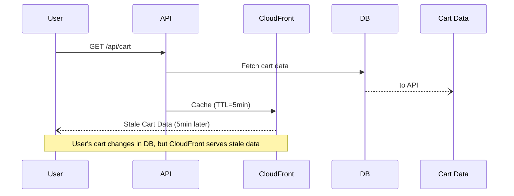
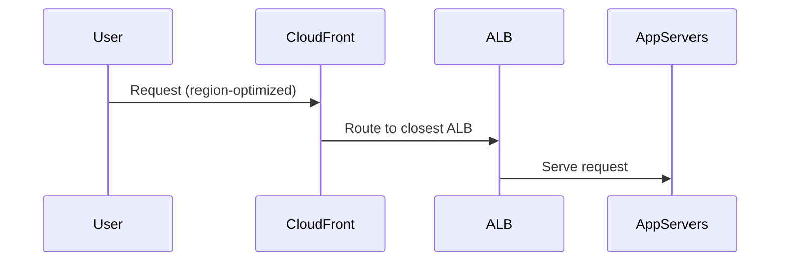

```markdown
# **CloudFront Distribution Integration Patterns: Caching, Security, and Performance at Scale**


Delivering scalable, performant, and secure web content isn’t just about writing good code—it’s about leveraging infrastructure patterns that work *with* your application, not against it. **Amazon CloudFront**, AWS’s Content Delivery Network (CDN), is a powerful tool for optimizing performance, but its full potential is unlocked when you integrate it strategically.

In this post, we’ll demystify **CloudFront Distribution Integration Patterns**, exploring how to integrate CloudFront with your backend services, APIs, and static content. We’ll cover caching strategies, security best practices, real-world tradeoffs, and pitfalls to avoid. By the end, you’ll have a practical toolkit for deploying performant, cost-effective CloudFront distributions.

---

## **The Problem: Why Your CloudFront Integration Might Be Failing**

CloudFront is a double-edged sword. On one hand, it can **cut latency by 50-80%** and reduce server load by **70-90%**, depending on your traffic patterns. On the other hand, misconfigurations can lead to:

- **Wasted costs**: Over-provisioning cache sizes or leaving unused distributions running.
- **Caching issues**: Stale content or incorrect cache invalidation strategies.
- **Security vulnerabilities**: Misconfigured OAI (Origin Access Identity) or overly permissive cache policies.
- **Performance bottlenecks**: Poorly structured Origin Shield or behavior-based routing.
- **API headaches**: Incorrect caching of dynamic API responses, leading to inconsistent data.

### **Real-World Example: The E-Commerce Cache Blunder**
A prominent SaaS company integrated CloudFront to reduce API latency but forgot to exclude `/api/cart` from caching. Result? **Users saw stale cart data** until the cache TTL expired—losing sales and trust.



This isn’t hypothetical—it’s a common pitfall when **API caching is misapplied**. Later in this post, we’ll discuss how to avoid this.

---

## **The Solution: CloudFront Integration Patterns**

CloudFront doesn’t work in isolation—it needs well-defined **Integration Patterns** to function effectively. Here’s the framework we’ll cover:

| **Pattern**               | **Use Case**                          | **Key Components**                          |
|---------------------------|---------------------------------------|--------------------------------------------|
| **Static Content Delivery** | Serving images, videos, JS/CSS         | S3 + CloudFront, invalidation scripts       |
| **API Caching & Edge Optimization** | Caching REST/graphQL responses       | Lambda@Edge, Cache Policies, Origin Shield |
| **Real-Time Invalidations** | Dynamic content updates               | S3 Invalidation, CloudFront Functions       |
| **Authentication & Security** | Secure API endpoints                  | Lambda Authorizer, OAI, Custom Origins       |
| **Multi-Region Deployment** | Global low-latency APIs               | CloudFront + ALB, Regional Distributions    |

---

## **Components/Solutions**

### **1. Static Content Delivery (The "Set-and-Forget" Pattern)**
For static assets, CloudFront + S3 is a no-brainer. The goal? **Minimize origin hits** and **reduce bandwidth costs**.

#### **Example: S3 + CloudFront for a Blog**
1. Upload blog images/videos to S3.
2. Configure CloudFront to serve those files with aggressive caching.
3. Use **S3 Lifecycle Policies** to move old files to **S3 Glacier** for cost savings.

```bash
# AWS CLI: Create CloudFront distribution for S3
aws cloudfront create-distribution \
  --origin-domain-name my-blog-bucket.s3.amazonaws.com \
  --default-root-object index.html \
  --enabled true \
  --cache-behavior PathPattern='/*' TargetOriginId='S3-Origin' \
    ForwardedValues='{"QueryString": false, "Cookies": {"Forward": "none"}}' \
    MinTTL=3600 CachePolicyId=658327ea-c812-41a9-8ab7-afc719da130f
```

#### **Key Tradeoffs:**
- **Pros**: Cheap, fast, easy.
- **Cons**: Requires manual invalidation for updates.

---

### **2. API Caching & Edge Optimization (The "Smart Cache" Pattern)**
APIs are trickier than static content. You need **selective caching**—cache some responses, skip others.

#### **Example: Cache REST API Responses (Except for Authenticated Paths)**
Use **Cache Policies** to control TTLs and caching behavior.

```yaml
# CloudFormation Template: Cache Policy for API Responses
Resources:
  APICachePolicy:
    Type: AWS::CloudFront::CachePolicy
    Properties:
      CachePolicyConfig:
        Name: MyAPICachePolicy
        DefaultTTL: 300  # 5 minutes
        MaxTTL: 86400   # 1 day
        MinTTL: 60      # 1 minute
        ParametersInCacheKey:
          - QueryStrings:
              - Fields: ["*"]
          - Cookies:
              - Forward: "none"  # Avoid caching auth-sensitive paths
```

#### **Lambda@Edge for Dynamic Caching**
What if you need **custom logic** before caching? Use **Lambda@Edge**.

```javascript
// Lambda@Edge: Check if request is for /api/cart (skip cache)
exports.handler = async (event) => {
  const { path } = event.Records[0].cf.request;

  if (path === '/api/cart') {
    event.Records[0].cf.request.headers['cache-control'] = [{ key: 'Cache-Control', value: 'no-cache' }];
  }

  return event;
};
```

#### **Key Tradeoffs:**
- **Pros**: Reduces origin load, improves latency.
- **Cons**: Stale data risk, requires careful policy tuning.

---

### **3. Real-Time Invalidations (The "Cache Busting" Pattern)**
When dynamic content changes, you need **invalidation strategies**.

#### **Option A: S3 Invalidation (For Static Assets)**
```bash
# Invalidate cached files in CloudFront
aws cloudfront create-invalidation \
  --distribution-id E1234567890ABCDEF \
  --paths "/images/*"
```

#### **Option B: CloudFront Functions (For API Responses)**
Use **CloudFront Functions** to dynamically invalidate caches.

```javascript
// CloudFront Function: Check for new cart data
function handler(event) {
  const query = event.request.querystring;

  if (query.cart_id && query.version === "v2") {
    event.request.headers['x-cache-bust'] = 'true';
  }

  return event;
}
```

#### **Key Tradeoffs:**
- **Pros**: Fine-grained control over cache invalidation.
- **Cons**: Functions add latency (~50-100ms).

---

### **4. Authentication & Security (The "Secure Edge" Pattern)**
Not all traffic should be cached. **Lambda Authorizers** (via API Gateway) can restrict sensitive paths.

#### **Example: API Gateway + CloudFront**
1. Set up **Lambda Authorizer** in API Gateway.
2. Configure **CloudFront Behavior** to forward auth headers.

```yaml
# CloudFormation: CloudFront Origin with Auth Headers
Resources:
  MyDistribution:
    Type: AWS::CloudFront::Distribution
    Properties:
      Origins:
        - Id: APIOrigin
          DomainName: my-api.execute-api.us-east-1.amazonaws.com
          CustomOriginConfig:
            HTTPPort: 80
            HTTPSPort: 443
            OriginProtocolPolicy: 'HTTPS_ONLY'
          CustomHeaders:
            - HeaderName: 'x-api-key'
              HeaderValue: '{ "Fn::GetAtt": ["MyLambdaAuthorizer", "Arn"] }'
```

#### **Key Tradeoffs:**
- **Pros**: Secure, granular access control.
- **Cons**: Requires API Gateway (adds cost).

---

### **5. Multi-Region Deployment (The "Global Low-Latency" Pattern)**
For truly global apps, use **CloudFront + ALB (Application Load Balancer)**.



#### **Key Tradeoffs:**
- **Pros**: Low-latency globally.
- **Cons**: Complex routing logic.

---

## **Implementation Guide: Step-by-Step**

### **Step 1: Define Your Caching Strategy**
- **Static Content**: Use **S3 + CloudFront** with long TTLs.
- **API Responses**: Use **Cache Policies + Lambda@Edge** for selective caching.
- **Dynamic Content**: Use **CloudFront Functions** for real-time invalidation.

### **Step 2: Configure CloudFront Distributions**
```bash
# Deploy CloudFront via AWS CLI
aws cloudfront create-distribution \
  --origin-domain-name my-api.execute-api.us-east-1.amazonaws.com \
  --default-root-object index.html \
  --enabled true \
  --cache-behavior PathPattern='/*' \
    TargetOriginId='API-Origin' \
    ForwardedValues='{"QueryString": true, "Cookies": {"Forward": "all"}}' \
    MinTTL=0 CachePolicyId=4135ea2d-6df8-44a3-9df3-4b5d5b517d60
```

### **Step 3: Test & Monitor**
- Use **CloudWatch Logs** to monitor cache hits/misses.
- Test with **AWS Distro for OpenTelemetry** for latency tracking.

```bash
# Check CloudFront cache metrics
aws cloudfront get-distribution-config \
  --id E1234567890ABCDEF \
  --query 'DistributionConfig.Metrics'
```

---

## **Common Mistakes to Avoid**

| **Mistake**                          | **Why It’s Bad**                          | **Solution**                                  |
|--------------------------------------|------------------------------------------|-----------------------------------------------|
| **Not setting `Cache-Control` headers** | Leads to unpredictable caching.        | Use default AWS cache policies or set headers. |
| **Over-caching API responses**       | Serves stale data.                       | Use Lambda@Edge to exclude sensitive paths.  |
| **Ignoring Origin Shield**           | Higher origin costs.                     | Enable **Origin Shield** for free.           |
| **Hardcoding invalidation paths**   | Manual invalidations are error-prone.   | Use **CloudFront Functions** for dynamic checks. |
| **Not using S3 OAI**                 | Risk of data leaks.                      | Always use **Origin Access Identity (OAI)**.   |

---

## **Key Takeaways**

✅ **Static content?** → **S3 + CloudFront** (simple, cheap).
✅ **API caching?** → **Cache Policies + Lambda@Edge** (selective, smart).
✅ **Dynamic updates?** → **CloudFront Functions or S3 Invalidation**.
✅ **Security?** → **Lambda Authorizer + OAI** (never expose backend directly).
✅ **Global scale?** → **CloudFront + ALB** (low-latency, multi-region).

❌ **Don’t:** Cache everything blindly.
❌ **Don’t:** Skip monitoring cache behavior.
❌ **Don’t:** Ignore costs (CloudFront isn’t free).

---

## **Conclusion**

CloudFront is a **swiss army knife** for performance, but like any tool, it’s only as good as its integration. By following these patterns—**static delivery, API caching, real-time invalidation, security, and multi-region setup**—you can build **fast, scalable, and secure** applications that perform well under load.

### **Next Steps**
1. **Experiment**: Deploy a CloudFront distribution for a low-risk static site.
2. **Measure**: Use CloudWatch to track cache hit ratios.
3. **Iterate**: Refine caching strategies based on real-world traffic.

If you’re just getting started, **start simple**—S3 + CloudFront for static assets—and gradually add complexity as needed. And if you run into pitfalls, remember: **CloudFront isn’t magic—it’s just a layer in your stack. Treat it like any other dependency.**

Happy caching!
```

---
**Appendix: Useful AWS CLI Commands**
```bash
# Create a CloudFront distribution (simplified)
aws cloudfront create-distribution \
  --origin-domain-name mybucket.s3.amazonaws.com \
  --default-root-object index.html \
  --enabled true

# Edit cache behavior dynamically
aws cloudfront update-distribution \
  --id E1234567890ABCDEF \
  --distribution-config file://cloudfront-config.json

# List all distributions
aws cloudfront list-distributions
```

---
Would you like any section expanded (e.g., deeper dive into Lambda@Edge)? Or a case study on a specific industry (e.g., fintech, gaming)?