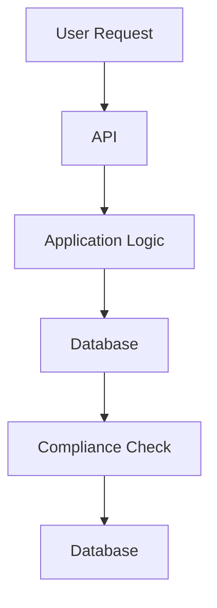

```markdown
---
title: "Compliance Approaches: Secure and Auditable Database Design in a Regulated World"
date: 2023-10-15
tags: ["database design", "api patterns", "compliance", "security", "auditing"]
description: "Learn how to implement compliance approaches in database and API designs to meet regulatory requirements while maintaining performance and developer productivity."
author: "Alex Chen"
---

# Compliance Approaches: Secure and Auditable Database Design in a Regulated World


*Building compliance into your systems from the ground up isn't just about checking boxes—it's about creating a defensible architecture that scales with your business while meeting regulatory requirements.*

As backend engineers, we're increasingly building systems that must comply with an ever-expanding set of regulations: GDPR for data privacy, HIPAA for healthcare, PCI-DSS for payments, SOX for financial reporting, and countless industry-specific standards. These regulations often require:
- **Data encryption** at rest and in transit
- **Audit trails** for all sensitive operations
- **Access controls** that track who did what
- **Data retention** policies that aren't arbitrarily enforced
- **Consistent data validation** across all business operations

The challenge isn't just implementing these features—it's doing so *without* creating a spaghetti architecture of bolted-on compliance layers that slow down development and introduce security vulnerabilities. That's where **compliance approaches** come in—a collection of patterns and principles that bake compliance into your database and API design from the beginning.

In this post, we'll explore:
- Why compliance can't be an afterthought
- Common architectures that fall short
- A pattern-based approach to compliance that scales
- Practical implementations in SQL, API design, and application code
- Common pitfalls and how to avoid them

---

## The Problem: When Compliance Is an Afterthought

Let's start with a case study of what happens when compliance is tacked on later:

### **Case Study: The eHealth Startup's Compliance Nightmare**

A healthcare startup, **MedSync**, built a patient management system with rapid iteration—no compliance in mind. Here's what they ended up with:



1. **Regulatory Violation**: They discovered after launch that they weren't properly logging access to sensitive patient records (HIPAA violation).

2. **Performance Havoc**: Adding audit logging to every query became a bottleneck—some operations slowed down by 300%.

3. **Developer Frustration**: Developers had to jump through hoops:
   ```javascript
   // Example of bolted-on compliance code
   async function getPatient(patientId) {
     // 1. Verify auth token
     // 2. Check if user has access to this patient
     // 3. Log the access attempt (even failures!)
     // 4. Query database
     // 5. Log the retrieval
     // 6. Return data
     // All this for a simple CRUD operation!
   }
   ```

4. **Security Risks**: The initial encryption layer was weak and needed to be completely replaced, requiring a painful migration.

This isn't an isolated story—many companies discover too late that compliance isn't just about keeping regulators happy; it's about protecting users, preventing breaches, and maintaining business continuity.

---

## The Solution: Compliance Approaches Pattern

The **Compliance Approaches** pattern is about creating a **defensible architecture** where compliance requirements are:
- **Embedded in the database schema** (not just application logic)
- **Transparent to business logic** (no spaghetti code)
- **Audit-proof** (no gaps in logging)
- **Performance-aware** (compliance doesn't become a bottleneck)

The pattern combines **database design patterns**, **API layer patterns**, and **application architecture** to create a system where compliance is a property of the system—not an add-on.

### Core Principles of the Pattern:
1. **Separation of Concerns**: Compliance functions should be modular and testable.
2. **Immutable Audit Trails**: Once written, audit data shouldn't be modified.
3. **Least Privilege**: Systems should operate with minimal permissions.
4. **Defense in Depth**: Multiple layers of protection against compromise.
5. **Data Minimization**: Only collect and store what's necessary.

---

## Components of the Compliance Approach Pattern

Let's break down the pattern into key components:

### 1. **Compliance-Aware Database Schema**
The database isn't just a data store—it's your first line of defense. We'll use a **GDPR-compliant patient data system** as our example.

#### Key Schema Elements:
- **Access Control Tables**:
  ```sql
  CREATE TABLE access_log (
    id SERIAL PRIMARY KEY,
    user_id UUID NOT NULL REFERENCES users(id),
    entity_type VARCHAR(50) NOT NULL, -- 'patient', 'prescription', etc.
    entity_id UUID NOT NULL,
    action VARCHAR(20) NOT NULL, -- 'READ', 'WRITE', 'DELETE'
    ip_address INET NOT NULL,
    user_agent TEXT,
    timestamp TIMESTAMPTZ NOT NULL DEFAULT NOW(),
    CONSTRAINT unique_access_log UNIQUE (user_id, entity_type, entity_id, action, timestamp)
  );
  ```

- **Data Retention Policies**:
  ```sql
  CREATE TABLE data_retention_policies (
    entity_type VARCHAR(50) PRIMARY KEY,
    retention_days INTEGER NOT NULL,
    retention_by VARCHAR(50) NOT NULL -- 'DELETION', 'ARCHIVE', etc.
  );

  -- Example: Patient data must be archived after 10 years
  INSERT INTO data_retention_policies VALUES ('patient', 3650, 'ARCHIVE');
  ```

- **Compliant Data Structures**:
  ```sql
  CREATE TYPE consent_type AS ENUM ('explicit', 'implicit', 'inherited');
  CREATE TABLE patient_consent (
    id SERIAL PRIMARY KEY,
    patient_id UUID NOT NULL REFERENCES patients(id),
    purpose VARCHAR(255) NOT NULL, -- 'treatment', 'research', etc.
    consent_type consent_type NOT NULL,
    granted_at TIMESTAMPTZ NOT NULL,
    expires_at TIMESTAMPTZ,
    consented_by VARCHAR(50) NOT NULL -- 'user', 'legacy_system', etc.
  );
  ```

### 2. **Compliance Enforcement Layer**
We'll create a **Compliance Enforcement Service** (CES) that sits between the API and database. This service validates requests against compliance rules before they reach the database.

**Example CES in Go:**
```go
package ces

import (
	"errors"
	"time"
)

type Planner struct {
	accessLogRepo AccessLogRepository
	retentionRepo RetentionRepository
	consentRepo   ConsentRepository
}

func (p *Planner) ValidateAccess(userID string, entityType string, entityID string, action string) error {
	// 1. Check if user has consent to access this entity
	if !p.checkConsent(userID, entityType, entityID) {
		return errors.New("access denied: no valid consent")
	}

	// 2. Check retention policies
	if p.retentionRepo.IsRetained(entityType, entityID) {
		return errors.New("access denied: data is under retention")
	}

	// 3. Log the access attempt
	return p.accessLogRepo.LogAccess(userID, entityType, entityID, action)
}

func (p *Planner) checkConsent(userID string, entityType string, entityID string) bool {
	// Implementation would query patient_consent table
	// and verify user has proper consent
	return true // simplified
}
```

### 3. **Compliant API Design**
Our API should follow these principles:
- **Immutable Operations**: No API should allow modification of audit data.
- **Clear Compliance Metadata**: All requests should carry compliance context.
- **Rate Limiting for Sensitive Operations**: Prevent brute-force attacks.

**Example API Specification (OpenAPI 3.0):**
```yaml
paths:
  /patients/{id}:
    get:
      summary: Get patient record
      parameters:
        - $ref: '#/components/parameters/PatientId'
        - $ref: '#/components/parameters/ComplianceContext'
      responses:
        '200':
          description: Patient record
          content:
            application/json:
              schema:
                $ref: '#/components/schemas/Patient'
        '403':
          description: Access denied (no consent or retention)
          content: {}

  /access-logs:
    get:
      summary: Get access logs (for auditors)
      security:
        - api_key: []
      responses:
        '200':
          description: List of access logs
          content:
            application/json:
              schema:
                type: array
                items:
                  $ref: '#/components/schemas/AccessLog'
```

### 4. **Application Layer Integration**
The application layer should:
- Use the CES to validate operations
- Handle compliance context transparently
- Implement proper error handling for compliance violations

**Example in Python with FastAPI:**
```python
from fastapi import FastAPI, Depends, HTTPException, Security
from pydantic import BaseModel
from typing import Optional
from datetime import datetime

app = FastAPI()

# Mock CES dependency
async def ces_dependency():
    class MockCES:
        async def validate_access(self, user_id: str, entity_type: str, entity_id: str, action: str) -> bool:
            # In a real implementation, this would call the actual CES
            return True  # Simplified for example
    return MockCES()

class Patient(BaseModel):
    id: str
    name: str
    # ... other fields

@app.get("/patients/{patient_id}")
async def get_patient(
    patient_id: str,
    ces: MockCES = Depends(ces_dependency)
):
    # Validate compliance before querying database
    if not await ces.validate_access("current_user_id", "patient", patient_id, "READ"):
        raise HTTPException(status_code=403, detail="Access denied")

    # Query database (simplified)
    patient = get_patient_from_db(patient_id)
    return patient
```

### 5. **Audit-Proof Infrastructure**
- **Database Triggers**: For critical operations that must be logged
  ```sql
  CREATE OR REPLACE FUNCTION log_patient_access()
  RETURNS TRIGGER AS $$
  BEGIN
    INSERT INTO access_log (user_id, entity_type, entity_id, action, ip_address)
    VALUES (NEW.user_id, 'patient', NEW.id, 'UPDATE', inet::NEW.ip_address);
    RETURN NEW;
  END;
  $$ LANGUAGE plpgsql;

  CREATE TRIGGER tr_log_patient_update
  AFTER UPDATE ON patients
  FOR EACH ROW WHEN (OLD.name <> NEW.name OR OLD.doctor <> NEW.doctor)
  EXECUTE FUNCTION log_patient_access();
  ```

- **Immutable Audit Tables**: Use sequences or UUIDs to prevent tampering
- **Regular Integrity Checks**: Automated scripts to verify audit logs

---

## Implementation Guide: Step-by-Step

Let's walk through implementing this pattern in a real project.

### 1. Assess Your Compliance Requirements
Start by documenting:
- Which regulations apply to your system
- What data is considered "sensitive"
- What operations require auditing
- What data retention policies exist

**Example Compliance Matrix:**

| Regulation | Data Type       | Required Actions                          |
|------------|-----------------|-------------------------------------------|
| GDPR       | Patient Data    | Consent tracking, access logging, deletion|
| HIPAA      | Health Records  | Audit trails, encryption, access controls |
| PCI-DSS    | Payment Data    | Tokenization, access logging, encryption |

### 2. Design Your Compliance-Aware Schema
Use the patterns from earlier to structure your database:
- Create access control tables
- Add consent tracking
- Implement retention policies
- Design immutable audit tables

### 3. Build the Compliance Enforcement Service
Implement a service that:
- Validates all operations against compliance rules
- Logs access attempts (including failures)
- Enforces retention policies
- Handles consent verification

**Example Architecture:**
```
┌─────────────┐       ┌─────────────┐       ┌─────────────────┐
│   API       │───────│ Compliance  │───────│   Application  │
│ (OpenAPI)   │       │ Enforcement │       │   Layer         │
└─────────────┘       └─────────────┘       └─────────────────┘
      │                          │
      ▼                          ▼
┌─────────────┐       ┌─────────────┐
│ Database    │       │ Audit Logs  │
│ (PostgreSQL)│       │ (Immutable) │
└─────────────┘       └─────────────┘
```

### 4. Design Your Compliance-Aware API
Follow these principles:
- **Immutable Operations**: Never allow API calls that modify audit data
- **Clear Compliance Metadata**: Include compliance context in all requests
- **Rate Limiting**: Implement for sensitive operations
- **Compliant Authentication**: All requests must include valid compliance context

**Example API Flow:**
1. Client requests `/patients/123`
2. API validates compliance context (consent, retention, etc.)
3. If valid, queries database
4. Logs successful access to audit table
5. Returns patient data

### 5. Implement Application Layer Integration
Have your application:
- Depend on the CES for validation
- Handle compliance errors gracefully
- Never bypass compliance checks

### 6. Set Up Audit-Proof Infrastructure
- **Database**: Use sequences/UUIDs for immutable audit tables
- **Triggers**: Log critical operations automatically
- **Encryption**: Encrypt sensitive data at rest
- **Backups**: Verify audit logs are included in backups

### 7. Test Your Compliance Implementation
Write tests that verify:
- All sensitive operations are properly logged
- Access denied scenarios return appropriate errors
- Retention policies are enforced
- Audit data cannot be tampered with

**Example Test in Python:**
```python
import pytest
from fastapi.testclient import TestClient
from main import app

client = TestClient(app)

def test_access_without_consent():
    response = client.get("/patients/123")
    assert response.status_code == 403
    assert response.json()["detail"] == "Access denied: no valid consent"

def test_access_with_valid_consent():
    # First, establish consent
    consent_data = {"patient_id": "123", "purpose": "treatment", "consent_type": "explicit"}
    client.post("/consents", json=consent_data)

    response = client.get("/patients/123")
    assert response.status_code == 200
    assert "name" in response.json()
```

### 8. Document Your Compliance Architecture
Create documentation that:
- Explains how compliance is enforced
- Documents all compliance checks
- Shows the flow of compliance context
- Describes audit procedures

---

## Common Mistakes to Avoid

1. **Bolt-On Compliance**: Adding compliance features after the system is built leads to technical debt and security risks.

2. **Over-Logging**: Logging every single operation can create performance bottlenecks and storage issues. Focus on critical operations.

3. **Ignoring Data Retention**: Not implementing retention policies can lead to violations (e.g., storing data longer than required by GDPR).

4. **Weak Access Control**: Not properly validating user permissions before database operations can lead to data leaks.

5. **Tamperable Audit Logs**: Making audit data mutable defeats the purpose of having it. Use immutable tables and triggers.

6. **Inconsistent Compliance**: Having some parts of the system enforce compliance while others don't creates security gaps.

7. **Overly Complex Permissions**: Too many permission levels can create maintenance headaches. Start simple and expand as needed.

8. **Ignoring Encryption**: Not encrypting sensitive data at rest can lead to severe violations if the database is compromised.

9. **No Audit Trail for Failures**: Always log denied access attempts—they're often as important as successful ones.

10. **Not Testing Compliance**: Compliance checks should be part of your test suite, not an afterthought.

---

## Key Takeaways

- **Compliance is an architectural concern**: Don't treat compliance as an afterthought; design it into your system from the beginning.

- **Separation of concerns matters**: Keep compliance logic modular and testable.

- **Audit trails should be immutable**: Once data is recorded in your audit logs, it shouldn't change.

- **Least privilege is key**: Your system should operate with minimal permissions.

- **Performance matters**: Compliance shouldn't become a bottleneck. Optimize your audit logging and validation.

- **Document everything**: Clear documentation of your compliance architecture is essential for audits and maintenance.

- **Regular reviews**: Compliance requirements change. Schedule regular reviews of your implementation.

- **Defense in depth**: Rely on multiple layers of protection against compromise.

- **Test compliance rigorously**: Compliance checks should be part of your automated test suite.

- **Plan for the worst**: Assume your system will be compromised at some point and design accordingly.

---

## Conclusion

Building a compliant system isn't about checking boxes—it's about creating a **defensible architecture** that protects your users, your data, and your business. The **Compliance Approaches** pattern gives you a structured way to embed compliance into your database and API design without sacrificing performance or developer productivity.

Remember:
- Start with a clear compliance matrix
- Design your schema with compliance in mind
- Build a modular compliance enforcement layer
- Make compliance transparent in your API design
- Test every compliance check
- Document your approach thoroughly
- Regularly review and update your compliance implementation

By following these principles, you'll create systems that not only meet regulatory requirements but also provide a strong defense against data breaches and other security threats. And when regulators come knocking—or when you're preparing for your next audit—you'll know your system is ready.

**Next Steps:**
1. Audit your current system for compliance gaps
2. Start small: implement compliance for one critical data type
3. Measure the impact on performance and developer productivity
4. Iterate based on lessons learned

