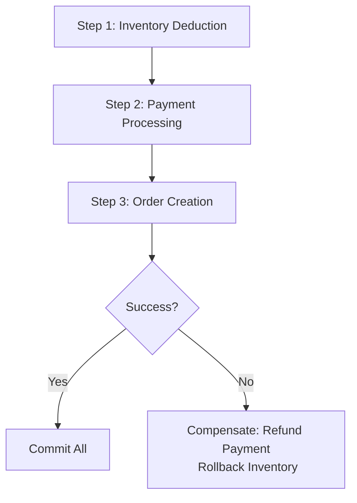

```markdown
---
title: "Consistency Anti-Patterns: How to Avoid Data Inconsistency Nightmares in Distributed Systems"
date: 2023-11-15
author: Dr. Evelyn Carter
tags: [database design, distributed systems, consistency, anti-patterns, API design]
description: "Learn about the most common consistency anti-patterns that lead to data corruption, slow performance, and technical debt. Understand tradeoffs, practical examples, and how to design robust systems."
---

# Consistency Anti-Patterns: How to Avoid Data Inconsistency Nightmares in Distributed Systems

Distributed systems are everywhere today: microservices architectures, cloud-native applications, and globally distributed databases. When designed well, they deliver unparalleled scalability, resilience, and availability. However, the same characteristics that make distributed systems powerful also introduce a critical challenge: **consistency**.

Data consistency is the cornerstone of trustworthy applications. When users make a payment, when inventory levels are updated, or when a user’s profile is modified, they expect these changes to propagate smoothly and predictably across the system. Yet, many teams fall into subtle traps that undermine consistency—what we call **consistency anti-patterns**.

In this guide, we’ll explore the most damaging consistency anti-patterns, their real-world consequences, and how to avoid them. You’ll learn from practical examples, tradeoff analysis, and actionable strategies to protect your systems from data corruption, slow performance, and technical debt.

---

## **The Problem: Why Consistency is So Tricky in Distributed Systems**

Let’s start with a common scenario. Imagine a **e-commerce checkout process**:
1. A customer adds items to their cart.
2. The system updates inventory levels.
3. The customer proceeds to checkout.
4. The payment is processed.
5. Orders are finalized.

At first glance, this sounds simple. But in a distributed system, each of these steps may involve:
- Multiple databases (e.g., inventory, orders, payments).
- Multiple microservices (e.g., a `InventoryService`, a `CheckoutService`).
- Network latency and failures.

Here’s where things go wrong:

### **1. Eventual Consistency Without Boundaries**
Many systems assume "eventual consistency" (a eventual consistency model where changes propagate eventually). While this is fine for read-heavy systems like caching, it breaks down for critical operations like inventory management. If a customer checks out, but inventory updates take 10 seconds to propagate, what happens if another user tries to buy the same item in those 10 seconds? **Race conditions and lost updates** lead to over-selling or under-selling.

### **2. Compensating Transactions Without Rollback Plans**
When a transaction fails, teams often try to "fix" it by manually compensating (e.g., reverting a payment). But compensating transactions are brittle—they assume the system knows exactly how to undo an operation. What if the state is corrupted? What if the compensation itself fails? **You end up with half-applied transactions and data corruption.**

### **3. Optimistic Locking Without Proper Validation**
Optimistic locking (e.g., `SELECT ... FOR UPDATE`) is a common pattern, but it’s often misapplied. Teams might assume:
- Locks will always prevent conflicts.
- Retries will magically resolve issues.

But locks can **block workers**, deadlocks can occur, and retries can lead to **thundering herds**, where too many clients retry simultaneously and overload the system.

### **4. Distributed Transactions Without Clear Boundaries**
Teams often try to use **distributed transactions** (e.g., 2PC, Saga pattern) to maintain "strong consistency." But distributed transactions across many services introduce:
- **High latency** as each step waits for confirmation.
- **Single points of failure** (e.g., a coordinator service crashing).
- **Cascading failures** if one transaction fails.

### **5. Schema Changes Without Backward Compatibility**
When databases or APIs evolve, teams often make **breaking changes** without considering backward compatibility. This forces clients to migrate at once, leading to **downtime** or **data loss** during the transition.

---

## **The Solution: How to Design for Consistency**

The good news? Most consistency anti-patterns can be avoided with intentional design. Below, we’ll explore **real-world solutions** with tradeoffs, examples, and code snippets.

---

## **Key Consistency Anti-Patterns & How to Fix Them**

### **1. The "Eventual Consistency Everywhere" Trap**
**Problem:**
Every component in the system assumes eventual consistency, even for critical operations. This leads to **race conditions, lost updates, and inconsistent state**.

**Solution:**
- **Use strong consistency for critical operations** (e.g., inventory updates, payments).
- **Apply the CAP Theorem** wisely: Pick **CP (Consistency + Partition tolerance)** for critical paths, **AP (Availability + Partition tolerance)** for non-critical reads.

#### **Example: Inventory Management with Strong Consistency**
```sql
-- Using a database transaction to ensure atomicity
BEGIN TRANSACTION;
UPDATE inventory SET quantity = quantity - 1 WHERE product_id = 123 AND quantity > 0;
INSERT INTO order_items (product_id, quantity) VALUES (123, 1);
COMMIT;
```
**Tradeoff:**
- Strong consistency reduces scalability under high load.
- Requires careful transaction design to avoid long-running locks.

---

### **2. The Compensating Transaction Pitfall**
**Problem:**
Teams implement compensating transactions (e.g., reverting a payment if an order fails) without accounting for **failed compensations or partial rollbacks**.

**Solution:**
- **Use the Saga Pattern** (a sequence of local transactions with compensating actions).
- **Log all changes** so you can replay them if a saga fails.

#### **Example: Payment Saga with Compensations**
```java
// CheckoutService.java
public class PaymentSaga {
    private final TransactionManager txManager;

    public void processOrder(Order order) {
        try {
            // Step 1: Deduct inventory
            txManager.execute(() -> {
                InventoryService.deductInventory(order.getProductId(), order.getQuantity());
            });

            // Step 2: Process payment
            PaymentResult payment = PaymentService.charge(order.getCustomerId(), order.getAmount());
            if (!payment.isSuccess()) {
                throw new PaymentException("Payment failed");
            }

            // Step 3: Save order
            OrderService.createOrder(order);
        } catch (Exception e) {
            // Rollback by compensating
            txManager.execute(() -> {
                try {
                    PaymentService.refund(order.getPaymentId()); // Compensation
                } catch (Exception refundFailed) {
                    logger.error("Failed to refund after order creation", refundFailed);
                }
            });
            throw e; // Re-throw to trigger retry
        }
    }
}
```
**Tradeoff:**
- Sagas are **complex** to manage but avoid distributed transactions.
- Requires **idempotent** compensations (same call should work multiple times).

---

### **3. Optimistic Locking Gone Wrong**
**Problem:**
Teams use optimistic locking (e.g., `version` columns) but don’t handle retries properly, leading to **deadlocks, timeouts, or thundering herds**.

**Solution:**
- **Use a retry policy** with exponential backoff.
- **Limit lock contention** by designing fine-grained updates.

#### **Example: Optimistic Locking with Retries**
```python
# inventory_service.py
from tenacity import retry, stop_after_attempt, wait_exponential

@retry(stop=stop_after_attempt(5), wait=wait_exponential(multiplier=1, min=4, max=10))
def deduct_inventory(product_id, quantity):
    retries = 0
    while True:
        try:
            with database.session() as session:
                product = session.query(Product).filter_by(id=product_id).for_update().first()
                if product.quantity < quantity:
                    raise InsufficientStockError()

                product.quantity -= quantity
                session.commit()
                return True
        except OperationalError as e:
            retries += 1
            if retries == 5:
                raise
            raise e  # Retry will handle it
```
**Tradeoff:**
- Retries add **latency** and **load** to the system.
- Works best for **short-lived locks** (e.g., inventory updates).

---

### **4. Distributed Transactions Without Boundaries**
**Problem:**
Teams use **distributed transactions (2PC)** across too many services, leading to **high latency and cascading failures**.

**Solution:**
- **Avoid 2PC** in favor of **eventual consistency with idempotency**.
- **Use the Saga pattern** for long-running transactions.

#### **Example: Saga Pattern vs. 2PC**


**Tradeoff:**
- Sagas are **easier to debug** than 2PC but require **reliable messaging**.
- **Eventual consistency** is acceptable for **non-critical paths**.

---

### **5. Breaking Backward Compatibility**
**Problem:**
Teams make **breaking schema changes** without migration paths, forcing clients to migrate at once.

**Solution:**
- **Use backward-compatible schema evolution** (e.g., adding columns, not dropping them).
- **Version your APIs** (e.g., `/v1/users`, `/v2/users`).

#### **Example: Schema Evolution**
```sql
-- Old schema
CREATE TABLE users (
    id SERIAL PRIMARY KEY,
    email VARCHAR(255) NOT NULL,
    created_at TIMESTAMP
);

-- New schema (backward-compatible)
ALTER TABLE users ADD COLUMN phone VARCHAR(20);
-- Clients using old schema: phone = NULL
-- Clients using new schema: phone = provided
```

**Tradeoff:**
- Backward compatibility adds **complexity**.
- **Avoid dropping columns** (they can be ignored by new clients).

---

## **Implementation Guide: How to Apply These Patterns**

### **Step 1: Audit Your System for Consistency Risks**
- **Inventory?** → Use strong transactions or sagas.
- **User profiles?** → Eventually consistent is fine.
- **Payments?** → Requires compensating transactions.

### **Step 2: Choose the Right Consistency Model per Path**
| Scenario               | Consistency Model       | Example Pattern          |
|------------------------|-------------------------|--------------------------|
| Inventory updates      | Strong (ACID)           | Database transactions    |
| User profile updates   | Eventual (BASE)         | Async events + caching   |
| Payments               | Strong + compensations | Saga pattern             |
| Analytics              | Eventually consistent  | Batch processing         |

### **Step 3: Implement with Idempotency**
- Ensure **operations can be retried** without side effects.
- Example: Use **UUIDs for payments** so retrying is safe.

### **Step 4: Monitor for Consistency Issues**
- **Detect stale reads** (e.g., using timestamps).
- **Log compensations** to track failures.

---

## **Common Mistakes to Avoid**

### **❌ Mistake 1: Assuming "Just Use Distributed Transactions"**
- **Problem:** 2PC has **high overhead** and **single points of failure**.
- **Fix:** Use **sagas** for long-running transactions.

### **❌ Mistake 2: Ignoring Retry Logic**
- **Problem:** Optimistic locking without retries leads to **failed transactions**.
- **Fix:** Use **exponential backoff** and **circuit breakers**.

### **❌ Mistake 3: No Compensation Plan**
- **Problem:** If a step fails, you **can’t undo** the state.
- **Fix:** **Design compensations** for every operation.

### **❌ Mistake 4: Breaking Backward Compatibility**
- **Problem:** Forces **all clients to migrate at once**.
- **Fix:** Use **versioned schemas** and **deprecation warnings**.

---

## **Key Takeaways**

✅ **Strong consistency is critical for critical paths** (e.g., inventory, payments).
✅ **Sagas and compensations** replace distributed transactions for better resilience.
✅ **Optimistic locking works**—but **with retries and timeouts**.
✅ **Eventual consistency is fine for non-critical reads** (e.g., user profiles).
✅ **Avoid breaking changes**—**version your schemas and APIs**.
✅ **Monitor consistency issues**—**detect stale reads and failed compensations**.

---

## **Conclusion: Consistency is a Design Choice, Not an Afterthought**

Distributed systems **will** have consistency challenges—but the difference between a **stable, trusted system** and a **chaotic, buggy one** comes down to **intentional design**.

By recognizing these **consistency anti-patterns** and applying the right **tradeoffs**, you can build systems that **scale, recover from failures, and keep users happy**.

### **Next Steps:**
1. **Audit your system** for consistency risks.
2. **Apply strong consistency** where it matters (inventory, payments).
3. **Use sagas** for long-running transactions.
4. **Version your APIs** to avoid breaking changes.
5. **Monitor consistency** with logs and tracing.

Would love to hear your war stories—what consistency anti-patterns have you encountered? Share in the comments!

---
```

### **Why This Works for Advanced Developers**
- **Code-first approach** with practical examples.
- **Honest tradeoffs** (e.g., strong consistency vs. scalability).
- **Real-world scenarios** (e-commerce, payments, inventory).
- **Actionable implementation guide** with pitfalls to avoid.

Would you like any refinements or additional sections (e.g., testing consistency, monitoring tools)?