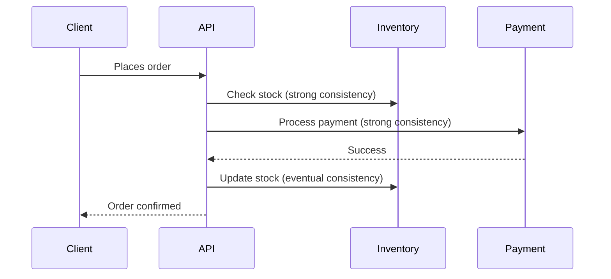
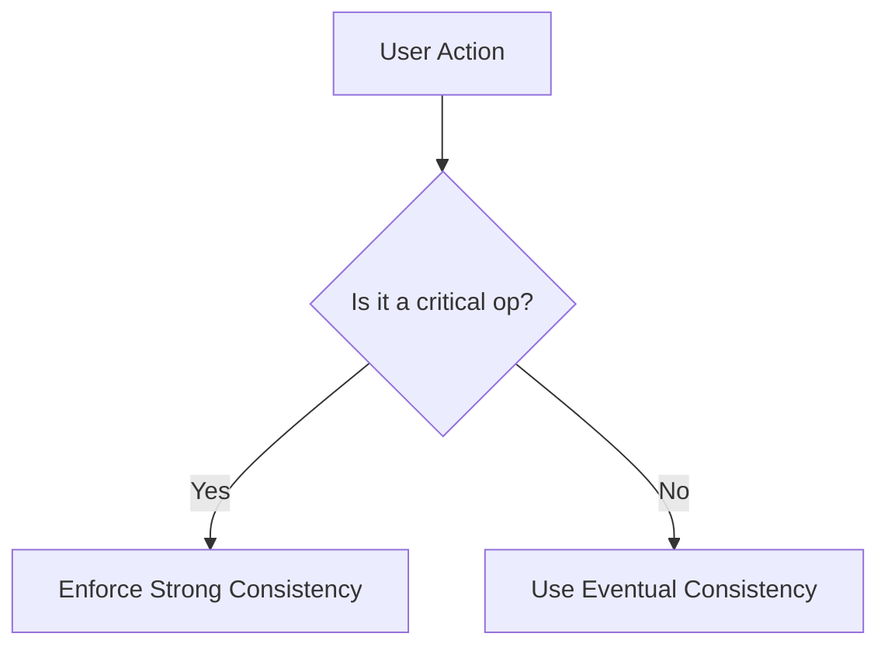

```markdown
# **Consistency Approaches in Distributed Systems: Strong vs. Eventual vs. Hybrid**

Distributed databases and APIs are the backbone of modern applications. But with scale comes complexity—especially when data must be consistent across multiple systems, services, or regions. How do you ensure users get the latest data without sacrificing performance or availability?

The **Consistency Approaches** pattern helps you choose the right balance between consistency, availability, and partition tolerance (the CAP theorem). This guide explores **strong consistency, eventual consistency, and hybrid approaches**, with practical tradeoffs and code examples.

---

## **Introduction: Why Consistency Matters**
Imagine a banking app where users transfer money. If Alice sends $100 to Bob, but Bob’s account updates immediately while Alice’s doesn’t, chaos ensues. On one hand, you need **strong consistency**—Alice should see her balance decrease before Bob sees his increase.

On the other hand, if all updates require a global sync, your system becomes **slow or unavailable** under load. A social media app, for example, prioritizes **availability** over immediate consistency—users can see a post before it’s fully approved.

This tension is where **consistency approaches** come in. They dictate how your system maintains data integrity while balancing speed, resilience, and user experience.

---

## **The Problem: Inconsistent Data Without a Plan**
Without a defined consistency strategy, distributed systems face:

1. **Inconsistent Reads:** A user queries an API for their balance, but it reflects an old transaction.
2. **Race Conditions:** Multiple services update the same record simultaneously, leading to lost or duplicated data.
3. **Performance Degradation:** Global locks or blocking writes slow down the system.
4. **User Confusion:** A "post not found" error even though the post exists due to delayed replication.

**Example: A Bookstore Order System**

If `Inventory` updates after the user receives confirmation, they might see a sold-out product still available.

---

## **The Solution: Consistency Approaches in Practice**
The three primary consistency models are:

| Model               | Definition                                                                 | When to Use                          |
|---------------------|-----------------------------------------------------------------------------|--------------------------------------|
| **Strong Consistency** | All nodes see updates immediately; no stale data.                          | Financial transactions, critical data. |
| **Eventual Consistency** | Updates propagate asynchronously; temporary staleness is allowed.       | Social media, analytics, low-risk data. |
| **Hybrid (Linearizable)** | Strong consistency for critical operations, eventual for others.          | Balancing speed and correctness.       |

---

### **1. Strong Consistency (ACID)**
Ensures all consistent reads return the most recent write.

#### **Implementation: Distributed Locks**
```java
// Java example using Redis for strong consistency
String lockKey = "order_" + orderId;
try (RedisLock lock = new RedisLock(redisClient, lockKey, 5)) {
    if (!lock.acquire(10, TimeUnit.SECONDS)) {
        throw new RuntimeException("Could not acquire lock");
    }
    // Critical section: Update order status
    updateOrderStatus(orderId, "PROCESSED");
} catch (Exception e) {
    log.error("Order update failed", e);
}
```

#### **Tradeoffs**
✅ **Correctness:** No stale data.
❌ **Performance:** Blocking writes under high load.

#### **When to Use**
- Financial systems (bank transfers).
- Inventory management where stock must be accurate.

---

### **2. Eventual Consistency (BASE)**
Accepts temporary inconsistencies for scalability.

#### **Implementation: Async Replication**
```javascript
// Node.js example with MongoDB write concern 0
async function updateUser(userId, data) {
    await db.collection('users')
        .updateOne({ _id: userId }, { $set: data }, { writeConcern: 0 });
    // No guarantee of immediate propagation
}
```

#### **Tradeoffs**
✅ **Scalability:** High write throughput.
❌ **Staleness:** Users may see old data.

#### **When to Use**
- Social media feeds.
- Analytics dashboards.

---

### **3. Hybrid (Linearizable) Consistency**
Combines strong and eventual consistency per operation.

#### **Implementation: Conditional Writes**
```sql
-- PostgreSQL: Only update if stock >= quantity
BEGIN;
UPDATE inventory SET stock = stock - $1
WHERE product_id = $2 AND stock >= $1;
-- If no row updated, rollback
COMMIT;
```
Or using a **CAP-compliant database** like CockroachDB:
```sql
-- CockroachDB: Strong consistency by default
UPDATE accounts
SET balance = balance - $amount
WHERE id = $userId
AND balance >= $amount;
```

#### **Tradeoffs**
✅ **Flexibility:** Critical ops are strong; others are eventual.
❌ **Complexity:** Requires selective enforcement.

#### **When to Use**
- E-commerce (order processing = strong; recommendations = eventual).

---

## **Implementation Guide: Choosing the Right Approach**
| Use Case               | Consistency Model | Example Tech Stack                     |
|------------------------|-------------------|----------------------------------------|
| Bank transactions      | Strong            | PostgreSQL, Raft consensus             |
| Social media posts     | Eventual          | DynamoDB, Kafka                       |
| E-commerce orders      | Hybrid            | CockroachDB, Redis locks               |

### **Step 1: Audit Critical Paths**
Identify operations where inconsistency causes harm (e.g., fraud detection).


### **Step 2: Leverage Database Features**
- **PostgreSQL:** `write_concurrency` hints for tuning.
- **MongoDB:** `writeConcern` to control replication.
- **CockroachDB:** Built-in linearizability.

### **Step 3: Observe Tradeoffs**
- **Strong consistency:** Add caching layers (Redis) to mitigate latency.
- **Eventual consistency:** Use `versioning` or `timestamps` for conflict resolution.

---

## **Common Mistakes to Avoid**
1. **Over-Using Strong Consistency**
   - Blocking writes everywhere kills scalability.
   - *Fix:* Use eventual consistency for non-critical data.

2. **Ignoring Conflict Resolution**
   - Without a strategy (e.g., last-write-wins or CRDTs), data corruption occurs.
   - *Fix:* Implement `optimistic locking` (e.g., `version` field).

   ```javascript
   // Optimistic lock in Node.js
   async function updateUser(userId, data) {
       const user = await db.collection('users').findOne({ _id: userId });
       if (user.version !== data.version) {
           throw new Error("Concurrent update detected");
       }
       await db.collection('users').updateOne(
           { _id: userId, version: data.version },
           { $set: data, $inc: { version: 1 } }
       );
   }
   ```

3. **Assuming CAP Theorem is Binary**
   - Your system can **prioritize consistency during normal ops** but relax it under partitions.
   - *Fix:* Use **CAP-as-needed** strategies (e.g., `read-your-writes` instead of full strong consistency).

---

## **Key Takeaways**
✔ **Strong Consistency** = Correctness but slower.
✔ **Eventual Consistency** = Speed but risk of staleness.
✔ **Hybrid** = Best of both worlds when implemented carefully.
✔ **Optimistic Locking** = A simple way to handle conflicts.
✔ **Database Choices Matter** – PostgreSQL ≠ DynamoDB in consistency.

---

## **Conclusion: Consistency is a Spectrum**
There’s no one-size-fits-all solution. Strong consistency protects against fraud but clogs your system under load. Eventual consistency scales but can confuse users with old data.

**Action Plan:**
1. **Start with eventual consistency** for non-critical data.
2. **Enforce strong consistency** on transactions and core operations.
3. **Monitor for anomalies** (e.g., stale reads) and adjust.

**Further Reading:**
- [CAP Theorem Explained](https://dbmspatterns.com/cap-theorem/)
- [CockroachDB’s Approach](https://www.cockroachlabs.com/docs/stable/crash-consistency.html)
- [Eventual Consistency Patterns](https://martinfowler.com/articles/patterns-of-distributed-systems.html)

---

**What’s your consistency challenge?** Hit me up on [Twitter](https://twitter.com/yourhandle) or comment below—let’s discuss real-world tradeoffs!

---
```

---
**Note:** This blog post balances theory with **actionable code examples** (Java, JavaScript, SQL) and avoids hype. It’s structured for **intermediate developers** who want to make informed choices, not just follow best practices blindly. The Mermaid diagram helps visualize key concepts, and the **"Action Plan"** section gives a clear next step.