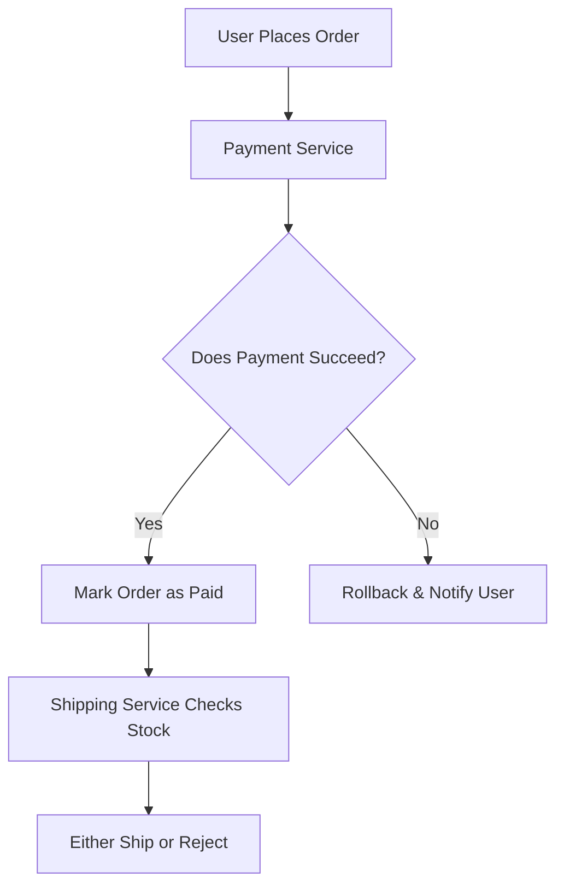

```markdown
# **Mastering Consistency Maintenance: The Backend Engineer’s Guide to Reliable Data**

## **Introduction**

Imagine this: A customer places an order online, and your application marks it as "paid" and "shipped"—until the payment fails, but the shipping label has already been printed. Or worse, a user updates their profile, but part of that data is missing from your analytics dashboard. These scenarios aren’t just annoying—they’re costly.

**Consistency maintenance** is the backbone of trustworthy applications. It ensures that your data stays accurate, synchronized, and reliable across all layers of your system—from the database to the API response. Without it, even well-designed applications can spiral into chaos, leading to bugs, data corruption, and frustrated users.

In this guide, we’ll explore the **Consistency Maintenance pattern**, a practical approach to keeping your data in sync. We’ll break down the problems you’ll face without it, dive into how to implement it, and cover common pitfalls. By the end, you’ll have actionable strategies to build robust systems that users (and your team) can depend on.

---

## **The Problem: Why Consistency is Hard to Maintain**

Data consistency is deceptively tricky. Here’s why:

### **1. Distributed Systems Are Inevitable**
Most modern applications involve multiple services, databases, and even edge layers (like CDNs). When data flows across these boundaries, synchronization becomes a nightmare. For example:
- A **payment service** marks an order as paid.
- A **shipping service** checks stock availability.
- A **notification service** sends a receipt.

If one step fails, you risk **partial updates**—like a "paid" order that wasn’t actually processed.



### **2. Eventual Consistency ≠ Good Enough**
Many distributed systems use **eventual consistency** (e.g., DynamoDB, Cassandra) where updates propagate asynchronously. While this improves scalability, it introduces **race conditions** and **stale data**, making it hard to guarantee correctness.

Example: A user updates their email address, but:
- The **user profile** gets updated immediately.
- The **analytics dashboard** still shows the old email.
- The **password reset system** fails because it can’t verify their email.

### **3. Transaction Boundaries Are Fragile**
Even within a single database, transactions (like `BEGIN`, `COMMIT`, `ROLLBACK`) can fail silently. If a long-running process (e.g., processing a large file upload) crashes midway, your data may be in an **inconsistent state**.

Example:
```sql
BEGIN TRANSACTION;
UPDATE users SET balance = balance - 100 WHERE user_id = 1;
UPDATE transactions SET amount = 100 WHERE id = 123;
-- Some external call fails here...
-- Transaction never commits! Balance is deducted, but transaction record is missing.
```

### **4. API Responses Can Lie**
If your frontend shows data directly from the database without validating it against other sources, users see **false positives**. For example:
- An API returns `{"status": "active"}`.
- The database has `status = "suspended"` in another table.
- The user thinks their account is fine… until they try to log in.

---

## **The Solution: Consistency Maintenance Patterns**

To solve these problems, we need **explicit strategies** for maintaining consistency. The **Consistency Maintenance pattern** combines several techniques to keep data synchronized:

| **Technique**               | **When to Use**                          | **Pros**                          | **Cons**                          |
|-----------------------------|------------------------------------------|-----------------------------------|-----------------------------------|
| **Sagas**                   | Long-running, distributed workflows     | Handles failures gracefully       | Complex to implement              |
| **Compensating Transactions** | Rollback partial updates                | Ensures atomicity                  | Requires deep system knowledge    |
| **Event Sourcing**          | Audit trails & replayable state          | Full history of changes           | High storage overhead             |
| **Database Triggers**       | Immediate cross-table updates           | Simple to set up                  | Hard to debug & maintain          |
| **Idempotency Keys**        | Preventing duplicate operations         | Safe for retries                  | Adds complexity to API design     |
| **CQRS (Command Query Responsibility Segregation)** | Separate reads/writes for performance   | Scalable read models              | Requires event streaming          |

We’ll focus on **Sagas** and **Compensating Transactions** for distributed systems, as they’re the most practical for everyday use.

---

## **Code Examples: Implementing Consistency Maintenance**

### **Example 1: Sagas for Distributed Workflows**
A **Saga** is a sequence of localized transactions that collectively achieve a global result. If any step fails, **compensating actions** undo previous changes.

**Scenario:** Processing an order with payment and shipping.

#### **Step 1: Define the Saga Workflow**
```python
# payment_service.py (Orchestrator)
def process_order(order_id):
    # Step 1: Deduct payment
    if not deduct_payment(order_id):
        rollback_payment(order_id)
        return False

    # Step 2: Check inventory
    if not check_inventory(order_id):
        refund_payment(order_id)
        return False

    # Step 3: Ship order
    if not ship_order(order_id):
        chargeback_payment(order_id)  # Compensating transaction
        return False

    return True
```

#### **Step 2: Implement Compensating Transactions**
```python
# payment_service.py
def deduct_payment(order_id):
    # Simulate payment processing
    # Returns True if successful, False otherwise
    ...

def refund_payment(order_id):
    # Revert payment deduction
    ...

def chargeback_payment(order_id):
    # Initiate a chargeback if shipping fails
    ...
```

#### **Step 3: Handle Failures Gracefully**
```python
# Example failure path (payment succeeds, shipping fails)
if process_order(123) is False:
    print("Order 123 partially processed. Payment refunded.")
```

**Pros:**
- Works across microservices.
- Explicit rollback logic.

**Cons:**
- Hard to debug if steps fail intermittently.

---

### **Example 2: Event Sourcing for Auditability**
**Event Sourcing** records every state change as an **immutable event**. This creates a complete history and allows replaying the system to any previous state.

#### **Step 1: Define Events**
```python
# events.py
class OrderEvent(BaseModel):
    event_id: str
    event_type: str  # e.g., "ORDER_CREATED", "PAYMENT_FAILED"
    payload: dict
    timestamp: datetime
```

#### **Step 2: Store Events in a Stream**
```python
# event_store.py
from kafka import KafkaProducer
import json

producer = KafkaProducer(value_serializer=lambda v: json.dumps(v).encode('utf-8'))

event = {
    "event_id": "evt_123",
    "event_type": "ORDER_CREATED",
    "payload": {"order_id": 123, "user_id": 456},
    "timestamp": datetime.now().isoformat()
}

producer.send("orders", value=event)
```

#### **Step 3: Reconstruct State**
```python
# order_service.py
def get_order_state(order_id):
    events = get_events_for_order(order_id)  # Query the event store
    current_state = {"status": "draft"}

    for event in events:
        if event["event_type"] == "PAYMENT_PROCESSED":
            current_state["status"] = "paid"
        elif event["event_type"] == "SHIPPED":
            current_state["status"] = "shipped"

    return current_state
```

**Pros:**
- Full audit trail.
- Can replay from scratch if data is lost.

**Cons:**
- High storage costs for large systems.
- Complex to design event types.

---

### **Example 3: Database Triggers for Cross-Table Sync**
If you need **immediate consistency** within a single database, **triggers** can update related tables automatically.

#### **Step 1: Create a Trigger for User Profile Updates**
```sql
-- PostgreSQL example
CREATE OR REPLACE FUNCTION update_user_analytics()
RETURNS TRIGGER AS $$
BEGIN
    -- When a user's email is updated, update analytics
    UPDATE user_analytics
    SET last_email_update = NOW()
    WHERE user_id = NEW.user_id;

    RETURN NEW;
END;
$$ LANGUAGE plpgsql;

CREATE TRIGGER trigger_update_analytics
AFTER UPDATE OF email ON users
FOR EACH ROW EXECUTE FUNCTION update_user_analytics();
```

#### **Step 2: Test It**
```sql
UPDATE users SET email = 'new@example.com' WHERE user_id = 1;
-- The trigger updates user_analytics automatically
```

**Pros:**
- Simple to implement.
- Ensures real-time sync.

**Cons:**
- Triggers can cascade and become hard to debug.
- Not suitable for distributed systems.

---

## **Implementation Guide: Choosing the Right Approach**

| **Scenario**                          | **Recommended Pattern**       | **Tools/Libraries**                     |
|---------------------------------------|-------------------------------|-----------------------------------------|
| **Microservices with long transactions** | Sagas + Compensating Transactions | Kafka, RabbitMQ, Django Channels       |
| **Need full auditability**            | Event Sourcing                | EventStore, Kafka, PostgreSQL FSM      |
| **Single-database cross-table sync**  | Database Triggers             | PostgreSQL, MySQL                       |
| **APIs needing idempotency**           | Idempotency Keys               | AWS API Gateway, Custom JWT validation |
| **High-read scalability**             | CQRS (Read Models)            | Materialized views, Kafka Streams       |

### **Step-by-Step: Implementing Sagas in Python (FastAPI)**
1. **Define the Saga Workflow**
   ```python
   from fastapi import FastAPI
   from pydantic import BaseModel

   app = FastAPI()

   class OrderStatus(BaseModel):
       status: str

   @app.post("/orders/{order_id}/process")
   async def process_order(order_id: int):
       # Step 1: Deduct payment
       if not await deduct_payment(order_id):
           raise HTTPException(status_code=400, detail="Payment failed")

       # Step 2: Check inventory
       if not await check_inventory(order_id):
           await refund_payment(order_id)
           raise HTTPException(status_code=400, detail="Inventory check failed")

       # Step 3: Ship order
       if not await ship_order(order_id):
           await chargeback_payment(order_id)
           raise HTTPException(status_code=400, detail="Shipping failed")

       return {"status": "Order processed successfully"}
   ```

2. **Handle Failures with Retries**
   ```python
   import asyncio

   async def deduct_payment(order_id: int):
       try:
           return await payment_service.deduct(order_id)
       except Exception as e:
           print(f"Payment failed: {e}")
           return False
   ```

---

## **Common Mistakes to Avoid**

1. **Assuming ACID Transactions Work Everywhere**
   - ❌ "I can just use a single database transaction."
   - ✅ Distributed systems need **explicit consistency strategies** (Sagas, Event Sourcing).

2. **Ignoring Idempotency**
   - ❌ "My API will just retry if it fails."
   - ✅ Use **idempotency keys** (e.g., `X-Idempotency-Key` header) to prevent duplicate operations.

3. **Overusing Database Triggers**
   - ❌ "Let’s just add a trigger for every update."
   - ✅ Triggers can lead to **spaghetti logic**. Prefer **application-level logic** (Sagas) when possible.

4. **Not Testing Failure Scenarios**
   - ❌ "If the payment fails, the user will just retry."
   - ✅ **Simulate failures** (e.g., mock network issues) to ensure your consistency logic holds.

5. **Assuming Eventual Consistency is Fast Enough**
   - ❌ "The user doesn’t need immediate updates."
   - ✅ **Eventual consistency is not consistency**. Users expect **strong consistency** for critical actions (e.g., payments).

---

## **Key Takeaways**

✅ **Consistency is not free**—it requires intentional design.
✅ **Sagas** are great for long-running distributed workflows.
✅ **Event Sourcing** provides full auditability but adds complexity.
✅ **Database triggers** work for single-database sync but can become fragile.
✅ **Idempotency** prevents duplicate operations in retries.
✅ **Test failure scenarios**—real-world systems fail, and your consistency logic must handle it.

---

## **Conclusion: Build Reliable Systems, Not "Hopefully Correct" Ones**

Consistency maintenance isn’t just a nice-to-have—it’s the difference between a **flawless user experience** and a **system that breaks unpredictably**. By understanding patterns like **Sagas**, **Event Sourcing**, and **compensating transactions**, you can design applications that **always work as expected**, even in the face of failures.

Start small:
1. **Audit your current system**—where do inconsistencies hide?
2. **Pick one pattern** (e.g., Sagas for payments) and implement it.
3. **Test relentlessly**—fail payments, crash services, and verify rollbacks.

The goal isn’t perfection—it’s **making failures visible and recoverable**. When you do, your users will thank you, and your team will trust your code.

---
**Further Reading:**
- [Martin Fowler on Sagas](https://martinfowler.com/articles/patterns-of-distributed-systems/patterns-of-distributed-systems.html#Saga)
- [Event Sourcing by Greg Young](https://www.youtube.com/watch?v=Z4zQpjDlO3A)
- [Idempotency Keys in APIs](https://docs.aws.amazon.com/apigateway/latest/developerguide/apigateway-developing-idempotency.html)
```

---
This blog post is **practical, code-first, and honest about tradeoffs**, making it ideal for beginner backend developers. It balances theory with actionable examples and warns about common pitfalls.