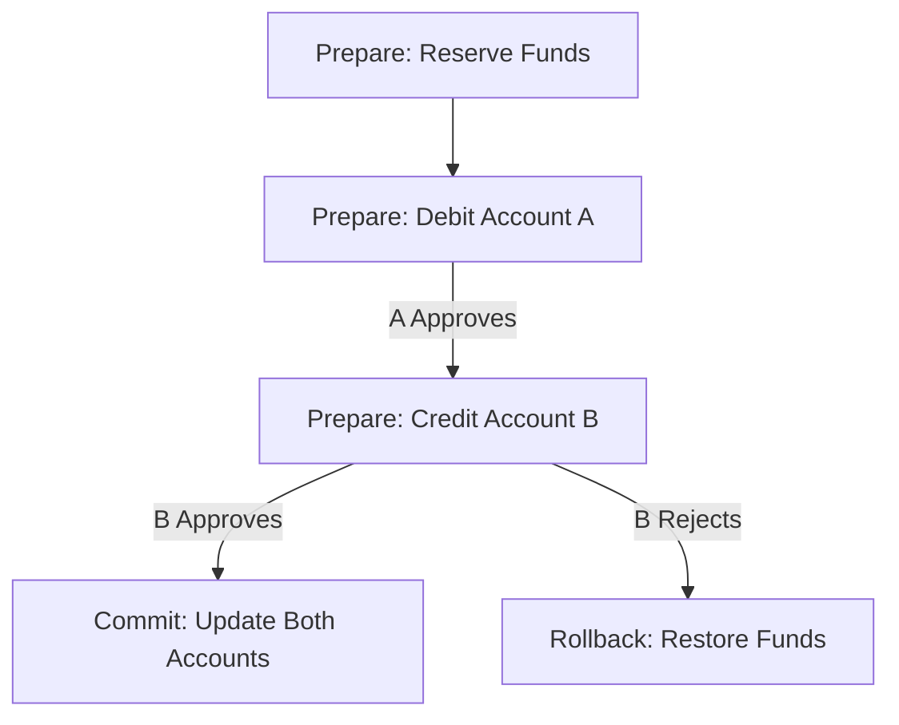

```markdown
---
title: "Consistency Patterns: Balancing Tradeoffs in Distributed Systems"
date: 2023-09-15
tags: ["database", "api", "distributed-systems", "consistency", "patterns"]
author: "Alex Chen"
---

# **Consistency Patterns: Balancing Tradeoffs in Distributed Systems**

Distributed systems are the backbone of modern applications—cloud-native microservices, globally accessible APIs, and scalable databases rely on them daily. But with this scalability comes a fundamental challenge: **eventual consistency**. The CAP theorem tells us that in a distributed system, we can only optimize for two out of three properties: **Consistency, Availability, and Partition Tolerance**.

As backend engineers, we’re often forced to choose between speed and correctness. **How do we design systems that feel consistent to users while staying performant and resilient?** This is where **consistency patterns** come into play.

In this guide, we’ll explore practical consistency patterns—from simple to sophisticated—used in production to balance tradeoffs. We’ll dive into **code-first examples** (PostgreSQL, Kafka, Redis, and more) and discuss tradeoffs so you can make informed decisions when designing your APIs and databases.

---

## **The Problem: Why Consistency is Hard**

Consistency isn’t just about databases. It spans:
- **Database transactions** (e.g., ACID vs. eventual consistency)
- **Distributed systems** (e.g., microservices exchanging events)
- **APIs** (e.g., request/response vs. event-driven workflows)
- **Caching layers** (e.g., Redis vs. database sync)

### **Challenges Without Proper Consistency Patterns**
1. **Inconsistent UI States**
   - User modifies data in one UI tab while another tab shows stale data.
   - Example: A user updates their shipping address in a checkout flow but sees the old address in the profile section.

2. **Failed Business Logic**
   - A payment system deducts money before verifying stock availability.
   - Example: A user “orders” a product that’s sold out mid-transaction.

3. **Race Conditions & Deadlocks**
   - Two requests update the same record simultaneously, leading to lost updates.
   - Example: Two users bid on an auction item at the same price, but only the second bid succeeds.

4. **Eventual vs. Strong Consistency Tradeoffs**
   - eventual consistency → high availability, lower latency (but feels "jittery").
   - strong consistency → slower, but predictable.

---

## **The Solution: Consistency Patterns**

Consistency patterns are **architectural strategies** to control how data flows and gets synchronized across systems. They don’t eliminate distributed system challenges but help manage them. Below are the most widely used patterns, categorized by their scope:

| **Pattern Category**       | **When to Use**                          | **Example Use Cases**                     |
|----------------------------|------------------------------------------|-------------------------------------------|
| **Saga Pattern**           | Long-running transactions (microservices)| Order fulfillment with inventory/payment |
| **Outbox Pattern**         | Reliable event publishing                | Kafka/RabbitMQ event sinks                |
| **Compensating Transactions** | Rollback logic for distributed failures | Canceling an order if payment fails       |
| **Two-Phase Commit (2PC)** | Strict cross-service consistency         | Bank transfers between accounts          |
| **Optimistic Locking**     | High-contention scenarios                | Auctions, multi-user document edits       |
| **CQRS + Event Sourcing**  | Read-heavy, write-complex workloads     | Analytics dashboards with transaction logs |

---

## **Code Examples: Practical Consistency Patterns**

### **1. Saga Pattern (Choreography & Orchestration)**
Sagas decompose long-running transactions into smaller, locally consistent steps with compensating actions.

#### **Example: E-Commerce Order Fulfillment**
```mermaid
graph TD
    A[User Places Order] --> B[Inventory Check (Check Stock)]
    B -->|Stock Available| C[Reserve Stock]
    B -->|Stock Unavailable| D[Notify User]
    C --> E[Charge Payment]
    E -->|Success| F[Ship Order]
    E -->|Failure| G[Refund Payment]
    F --> H[Update Order Status]
```

#### **Implementing a Saga (Orchestration)**
```javascript
// Step 1: Reserve Inventory
await inventoryService.reserveProduct(orderId, productId);

// Step 2: Charge Payment (with timeout)
const paymentResult = await paymentService.charge(orderId, amount);
if (paymentResult.failed) {
    // Compensate: Release Inventory
    await inventoryService.releaseProduct(orderId, productId);
    throw new Error("Payment failed");
}

// Step 3: Ship Order
await shippingService.createShipment(orderId);
```

#### **Pros & Cons**
✅ **Decouples services** (microservices can evolve independently).
❌ **Complex debugging** (tracking compensations across services).

---

### **2. Outbox Pattern (Reliable Event Publishing)**
The outbox ensures events are persisted before being published to Kafka/RabbitMQ.

#### **Example: PostgreSQL Outbox**
```sql
-- Create outbox table
CREATE TABLE event_outbox (
    id SERIAL PRIMARY KEY,
    event_type VARCHAR(50) NOT NULL,
    payload JSONB NOT NULL,
    processed BOOLEAN DEFAULT FALSE,
    created_at TIMESTAMP DEFAULT NOW()
);
```

```python
# Publisher (Python + SQLAlchemy)
from sqlalchemy import text
from KafkaProducer import KafkaProducer

def publish_event(event_type: str, payload: dict):
    # Store event in DB
    insert_query = text("""
        INSERT INTO event_outbox (event_type, payload)
        VALUES (%s, %s)
    """)
    db.execute(insert_query, (event_type, json.dumps(payload)))

    # Poll DB for unprocessed events
    while True:
        check_query = text("""
            SELECT id, event_type, payload
            FROM event_outbox
            WHERE processed = FALSE
            FOR UPDATE
            LIMIT 1
        """)

        event = db.execute(check_query).fetchone()
        if not event:
            time.sleep(0.1)
            continue

        # Publish to Kafka
        producer.send("orders", json.dumps({
            "type": event.event_type,
            "data": event.payload
        }))

        # Mark as processed
        db.execute("""
            UPDATE event_outbox
            SET processed = TRUE
            WHERE id = %s
        """, event.id)
```

#### **Pros & Cons**
✅ **At-least-once delivery** (guaranteed message processing).
❌ **Requires DB + event transport** (extra complexity).

---

### **3. Optimistic Locking (Concurrency Control)**
Prevents lost updates by versioning records.

#### **PostgreSQL Example**
```sql
CREATE TABLE user_profile (
    id SERIAL PRIMARY KEY,
    name VARCHAR(100),
    version INT DEFAULT 0  -- Optimistic lock version
);

-- Update with version check
UPDATE user_profile
SET name = 'New Name', version = version + 1
WHERE id = 1 AND version = 0;
```

#### **Application Layer (Python + SQLAlchemy)**
```python
from sqlalchemy import func

def update_profile(user_id: int, new_name: str):
    profile = db.query(UserProfile).filter_by(id=user_id).with_for_update().first()
    if profile.version != expected_version:
        raise ConflictError("Version mismatch!")

    profile.name = new_name
    profile.version += 1
    db.commit()
```

#### **Pros & Cons**
✅ **Simple to implement** (no blocking locks).
❌ **Requires application logic** (users may retry stale versions).

---

### **4. Two-Phase Commit (2PC) – Rare but Powerful**
For critical cross-service transactions (e.g., bank transfers).

#### **Example: Transfer Between Accounts**


#### **Pros & Cons**
✅ **Strong consistency** (no data loss).
❌ **Complexity & blocking** (coordinator required).

---

## **Implementation Guide: Choosing the Right Pattern**

| **Scenario**                          | **Recommended Pattern**          | **Alternatives**                     |
|---------------------------------------|-----------------------------------|--------------------------------------|
| High-throughput, loosely coupled     | Saga + Outbox + Event Sourcing    | CQRS + Optimistic Locking            |
| High-contention writes               | Optimistic Locking + Retries      | Pessimistic Locking (if rare)        |
| Cross-service transactions            | Saga (or 2PC if simplicity isn’t a concern) | Two-Phase Commit |
| Event-driven APIs                     | Outbox + Kafka/RabbitMQ           | Database Triggers (less scalable)    |
| Analytics + Transactional Data       | CQRS + Event Sourcing             | Materialized Views                   |

---

## **Common Mistakes to Avoid**

1. **Ignoring Retry Logic**
   - Example: A saga step fails, but compensations aren’t retried.
   - **Fix:** Use exponential backoff + dead-letter queues.

2. **Overusing Strong Consistency**
   - Example: Using 2PC everywhere (performance suffers).
   - **Fix:** Default to eventual consistency, enforce strong consistency only where critical.

3. **No Compensating Logic**
   - Example: A payment succeeds, but inventory isn’t reserved.
   - **Fix:** Always define rollback steps.

4. **Tight Coupling in Sagas**
   - Example: Service A calls Service B directly (hard to evolve).
   - **Fix:** Use a saga orchestrator (e.g., NServiceBus, Camunda).

---

## **Key Takeaways**

✔ **Consistency is a spectrum** – Choose patterns based on tradeoffs (speed vs. correctness).
✔ **Sagas are the Swiss Army knife** of distributed transactions (but require discipline).
✔ **Outbox + Event Sourcing** ensure reliable event delivery without blocking.
✔ **Optimistic locking** is often better than pessimistic (but test thoroughly).
✔ **Avoid over-engineering** – Start simple, then optimize.

---

## **Conclusion: Consistency is a Team Sport**

Designing for consistency isn’t just a backend problem—it affects **UI, testing, and user experience**. The patterns we’ve covered help manage tradeoffs, but **no silver bullet exists**.

**Start small:**
- Use **Sagas** for workflows across microservices.
- **Optimistic locking** for high-contention data.
- **Outbox** for event-driven architectures.

**Measure and iterate:** Monitor consistency violations (e.g., stale reads) and refine tradeoffs based on real-world usage.

As distributed systems grow more complex, consistency patterns will remain essential—**so master them, and your systems will too**.

---
### **Further Reading**
- [Saga Pattern (Martin Fowler)](https://martinfowler.com/patterns/Saga.html)
- [CQRS + Event Sourcing (Greg Young)](https://cqrs.files.wordpress.com/2010/11/cqrs_documents.pdf)
- [PostgreSQL Outbox Pattern](https://blog.sql-music.com/2021/02/10/outbox-pattern-postgresql/)
```