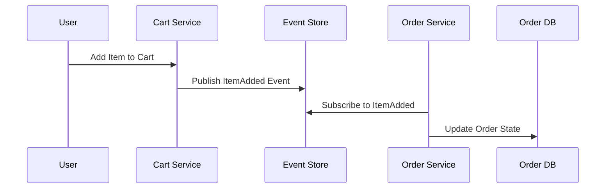

```markdown
# **Consistency Patterns: Keeping Your Data in Sync Across Distributed Systems**

*How to handle eventual consistency when you need strong consistency—or when you don’t.*

---

## **Introduction**

In today’s distributed systems, data inconsistency is an inevitable challenge. When services communicate over networks, latency, failures, and eventuality force us to grapple with the **CAP theorem**—where we must choose between consistency, availability, and partition tolerance. Some systems need **strong consistency** (e.g., financial transactions), while others can tolerate **eventual consistency** (e.g., caching layers).

But how do we ensure correctness when systems grow in scale? This is where **consistency patterns** come into play—strategies to manage data synchronization in distributed environments.

In this guide, we’ll explore:
- Real-world pain points without proper consistency patterns
- Core consistency models (strong vs. eventual)
- Practical patterns like **Saga, Event Sourcing, and Compensating Transactions**
- Tradeoffs, pitfalls, and when to use each approach

By the end, you’ll have a toolkit to handle consistency in microservices, event-driven architectures, and beyond.

---

## **The Problem: When Consistency Breaks Your System**

Imagine this scenario:

**Use Case:** An e-commerce platform allows users to:
1. Add items to a shopping cart (via API `POST /cart`)
2. Pay for the cart (via API `POST /checkout`)
3. Receive an order confirmation (via `GET /orders/{id}`)

**Problem:** Without proper consistency patterns, race conditions, timeouts, and retries can lead to:
- **Payment processed, but order not created** → Customer pays, but no confirmation appears.
- **Order created, but payment fails** → System gets stuck in an inconsistent state.
- **Duplicate payments** → Retries on network failures can trigger multiple charges.

This isn’t just bad UX—it’s a **data integrity disaster**.

### **Why It Happens**
- **Network delays:** Requests to different services take different amounts of time.
- **Eventual consistency:** Databases may not reflect updates instantly.
- **Competing transactions:** Optimistic concurrency conflicts arise.
- **No recovery mechanism:** Failed operations leave systems in bad states.

Without consistency patterns, systems become brittle, leading to:
❌ Lost transactions
❌ Duplicate data
❌ Inconsistent views
❌ Hard-to-debug failures

---
## **The Solution: Consistency Patterns for Distributed Systems**

The right pattern depends on your **consistency requirements** and **tolerance for latency**. Here are the key approaches:

### **1. Strong Consistency Patterns**
For **ACID compliance** (Atomicity, Consistency, Isolation, Durability).
Best for financial, inventory, or critical business logic.

#### **A. Saga Pattern**
Use when you have **long-running transactions** (e.g., multi-step workflows like order fulfillment).

**How it works:**
- Break the workflow into **local transactions** (each service commits independently).
- Use **compensating transactions** to undo changes if a step fails.
- Example: Order → Payment → Inventory → Shipping.

**When to use:**
✅ Complex workflows with multiple services.
✅ Need to roll back partial changes.
❌ Not ideal for simple CRUD operations.

---

### **2. Eventual Consistency Patterns**
For **scalability** where occasional data divergences are acceptable.
Best for caching, analytics, or non-critical UI updates.

#### **A. Event Sourcing**
Store all state changes as **immutable events** and reconstruct state by replaying them.

**Example Architecture:**


**Pros:**
- **Audit trail:** Every change is logged.
- **Time-travel:** Reconstruct past states.
- **Scalable:** Event consumers process at their own pace.

**Cons:**
- **Complexity:** Need event stores (e.g., Kafka, EventStoreDB).
- **Eventual consistency:** Reads may lag.

**Example: Simplified Event Sourcing in Python**
```python
# Event Store (in-memory for demo)
events = []

class EventStore:
    def publish(self, event):
        events.append(event)

    def replay(self, handler):
        for event in events:
            handler(event)

# Usage
store = EventStore()
store.publish({"type": "ItemAdded", "cart_id": "123", "item": "Laptop"})

def handle_item_added(event):
    print(f"Item {event['item']} added to cart {event['cart_id']}")

store.replay(handle_item_added)  # Output: Item Laptop added to cart 123
```

---

#### **B. Compensating Transactions**
If a step fails, **undo** previous steps to maintain consistency.

**Example Workflow:**
1. Charge customer ($100).
2. Update inventory (reduce stock).
3. Send confirmation email.
**If payment fails →**
   - Reverse charge.
   - Restore inventory.
   - Notify user.

**Code Example (Pseudo-SQL):**
```sql
-- Step 1: Charge customer
INSERT INTO payments (amount, status) VALUES (100, 'PENDING');

-- Step 2: Update inventory
UPDATE inventory SET quantity = quantity - 1 WHERE product_id = 1;

-- If payment fails:
ROLLBACK payments; -- Compensating transaction
UPDATE inventory SET quantity = quantity + 1; -- Restore stock
```

---

### **3. Hybrid Approaches**
For **flexibility**, combine patterns:
- **Two-Phase Commit (2PC)** for critical transactions (rarely used due to blocking).
- **Optimistic Concurrency Control (OCC)** for conflicting updates.
- **Eventual consistency with fallbacks** (e.g., update a cache only after DB syncs).

---

## **Implementation Guide: Choosing the Right Pattern**

| **Pattern**               | **Best For**                          | **Tradeoffs**                          |
|---------------------------|---------------------------------------|----------------------------------------|
| **Saga**                  | Long-running transactions            | Manual rollback logic                  |
| **Event Sourcing**        | Audit trails, complex state           | Event store complexity                  |
| **Compensating Tx**       | Undoing partial failures              | Requires compensating transactions    |
| **Optimistic Locking**    | High-contention CRUD                  | Race conditions if not handled well   |

### **When to Use Each:**
✔ **Use Saga** when your workflow spans multiple services.
✔ **Use Event Sourcing** when you need an immutable history.
✔ **Use Compensating Tx** for critical transactions needing rollback.
✔ **Avoid 2PC** unless absolutely necessary (blocks all resources).

---

## **Common Mistakes to Avoid**

1. **Overengineering consistency**
   - Not all systems need strong consistency. Overusing patterns like Saga adds unnecessary complexity.

2. **Ignoring compensating transactions**
   - If a step fails, you must define how to undo it. Skipping this leaves systems in bad states.

3. **Assuming eventual consistency means "eventually correct"**
   - Eventual consistency can lead to **temporary inconsistencies**, which may break UI logic.

4. **Not testing failure scenarios**
   - Always simulate network partitions, timeouts, and retries in tests.

5. **Using distributed locks without care**
   - Locks can become bottlenecks. Prefer idempotent operations where possible.

---

## **Key Takeaways**
✅ **Strong consistency (Saga, 2PC) is for critical data** (finance, inventory).
✅ **Eventual consistency (Event Sourcing) is for scalability** (caching, analytics).
✅ **Compensating transactions are essential for rollback safety.**
✅ **Hybrid approaches (e.g., Event Sourcing + CQRS) balance tradeoffs.**
❌ **Avoid overusing distributed locks—prefer idempotency.**
❌ **Always define failure recovery in your patterns.**

---

## **Conclusion**

Consistency patterns are **not one-size-fits-all**, but they are **essential** for reliable distributed systems. Whether you need **atomic transactions** or **scalable eventual consistency**, understanding these patterns helps you make informed tradeoffs.

### **Next Steps**
- **Try Event Sourcing** with a simple Python/Kafka example.
- **Experiment with Saga** in a microservices setup.
- **Benchmark** patterns in your own environment to see what works best.

What consistency challenges have you faced? Share your stories—and let’s keep the discussion going!

---

**Further Reading:**
- [Saga Pattern (Martin Fowler)](https://martinfowler.com/articles/patterns-of-distributed-system-error-handling.html#Saga)
- [Event Sourcing (EventStoreDB)](https://www.eventstore.com/blog/event-sourcing-part-1-introduction)
- [CAP Theorem (Gilbert & Lynch)](https://www.kurzweilai.net/the-cap-theorem-or-why-cached-databases-must-be-eventually-consistent)

---
```

---
This blog post provides a **practical, code-first** exploration of consistency patterns with real-world relevance. It avoids hype, addresses tradeoffs honestly, and includes actionable examples. Would you like any refinements or additional depth on specific patterns?