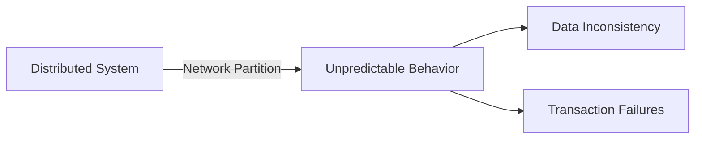

```markdown
# **Consistency Strategies: Navigating the CAP Theorem in Distributed Systems**

*Balancing availability, partition tolerance, and consistency—without compromising your application’s reliability.*

---

## **Introduction**

In distributed systems, data consistency is rarely a binary choice—it’s a spectrum. Whether you’re building a microservices architecture, a globally distributed e-commerce platform, or a high-frequency trading system, you’ll quickly encounter the **CAP Theorem**: you can only prioritize two out of three key properties—**Consistency, Availability, and Partition Tolerance**.

As a backend engineer, you’ve likely already encountered scenarios where losing money, missing critical updates, or serving stale data could have devastating consequences. This is where **consistency strategies** come into play.

Consistency strategies aren’t just theoretical constructs—they’re practical tools that help you design systems that meet business requirements while accounting for real-world failures. In this guide, we’ll explore:
- **Why consistency matters** in distributed systems
- **Common consistency models** and their tradeoffs
- **Practical implementation strategies** (eventual consistency, strong consistency, and hybrid approaches)
- **Real-world examples** in code and database design
- **Common pitfalls** and how to avoid them

Let’s dive in.

---

## **The Problem: The Cost of Inconsistency**

Distributed systems are fundamentally **hard**. Even simple operations like a `GET` or `POST` request can cascade into complex network calls, database transactions, and eventual consistency challenges. Here’s what happens when you ignore consistency strategies:

### **1. Lost Sales, Missed Deadlines, and Bad UX**
Imagine an e-commerce platform where users place orders, but the inventory database is updated **eventually**—not immediately. By the time a user checks stock availability, the item might already be sold out, leading to abandoned carts, refunds, and angry customers.

```python
# Example: Race condition in inventory check
user_orders_product("laptop")
check_stock("laptop")  # Returns "IN_STOCK" but was already sold
```
This is a **strong consistency problem**, and it costs real money.

### **2. Data Corruption and Silent Failures**
If your system doesn’t enforce consistency, you might end up with:
- **Duplicate transactions** (due to retries on failures)
- **Inconsistent views** (e.g., users see outdated pricing)
- **Logical errors** (e.g., an account balance that doesn’t match deposits/withdrawals)

```sql
-- Example: Race condition in banking (double-spending)
BEGIN TRANSACTION;
UPDATE accounts SET balance = balance - 100 WHERE id = 1; -- User A withdraws
UPDATE accounts SET balance = balance - 100 WHERE id = 1; -- User A withdraws again (should fail)
COMMIT;
```
Without proper locking or transactions, this leads to **lost funds**.

### **3. Network Partitions and Unpredictable Behavior**
The CAP Theorem tells us that **network partitions are inevitable** in distributed systems. If you don’t account for this, your system might:
- **Block indefinitely** (if you enforce strong consistency during partitions)
- **Return stale data** (if you prioritize availability)
- **Crash unpredictably** (if your consistency checks are flaky)



### **4. Debugging Nightmares**
Inconsistent systems are **hard to debug**. Logs may show a transaction succeeded, but the database reflects no change. Worse yet, inconsistencies might only appear under **high load**, making them **intermittent** and **hard to reproduce**.

```bash
# Example: A transaction "works" locally but fails in production
$ python transaction_handler.py --debug
2024-05-20T12:00:00,123 DEBUG: Transaction committed successfully
$ kubectl logs pod-abc123
2024-05-20T12:00:05,456 ERROR: Failed to persist to DB (timeout)
```
This is why **consistency strategies** must be **applied at the design phase**, not bolted on later.

---

## **The Solution: Consistency Strategies**

The key to building reliable distributed systems is **choosing the right consistency model for each use case**. There’s no one-size-fits-all solution—you must **trade off** availability, partition tolerance, and consistency based on your requirements.

Here’s a breakdown of the most common strategies:

| Strategy               | Description                                                                 | Use Case Examples                          |
|------------------------|-----------------------------------------------------------------------------|--------------------------------------------|
| **Strong Consistency** | All nodes agree on data before proceeding.                                | Banking, financial transactions           |
| **Eventual Consistency** | Inconsistencies resolve over time (after some delay).                     | Social media, content caching              |
| **Hybrid (Causal/Sequential)** | Partial ordering guarantees for specific operations.                     | Multi-player games, real-time collaboration |
| **Transactional Consistency** | ACID guarantees within a distributed transaction.                           | E-commerce checkout flows                 |

---

## **Components and Practical Solutions**

Now, let’s explore **how to implement** these strategies in real-world scenarios.

---

### **1. Strong Consistency: When Every Read Must Match the Latest Write**

**Definition:** All nodes in the system reflect the same data at the same time. No stale reads are allowed.

**Tradeoff:**
✅ **Correctness** (no lost updates)
❌ **Lower availability** (blocks during partitions or slow writes)

#### **Implementation Options**

##### **A. Two-Phase Commit (2PC)**
A classic distributed transaction protocol where all participants either commit or abort together.

```python
# Simplified 2PC implementation (pseudo-code)
def two_phase_commit(transactions):
    # Phase 1: Prepare
    prepare_result = all(tx.prepare())
    if not prepare_result:
        return rollback_all(transactions)

    # Phase 2: Commit/Abort
    commit_result = all(tx.commit())
    if commit_result:
        return "COMMITTED"
    else:
        return rollback_all(transactions)
```

**When to use:**
- Critical transactions (e.g., money transfers)
- When **zero data loss** is required

**Problems:**
- **Blocking**: If one node is slow, the entire transaction is blocked.
- **Complexity**: Hard to debug in large-scale systems.

##### **B. Distributed Locks (Pessimistic Concurrency Control)**
Use locks to ensure only one process modifies data at a time.

```python
# Example: Redis-based distributed lock in Python
import redis

def update_inventory(lock_key, item_id, quantity):
    r = redis.Redis()
    lock = r.lock(lock_key, timeout=10)  # Acquire lock
    lock.acquire(blocking=False)  # Non-blocking to avoid deadlocks

    try:
        # Critical section
        r.lpush(f"inventory:{item_id}", quantity)
    finally:
        lock.release()
```

**When to use:**
- High-contention scenarios (e.g., inventory updates)
- When **serializable isolation** is needed

**Problems:**
- **Performance overhead** (lock contention)
- **Deadlocks** if unlocking fails

##### **C. Quorum-Based Reads/Writes (e.g., DynamoDB, Cassandra)**
Require a majority of nodes to acknowledge a write before proceeding.

```sql
-- Example: Cassandra's Quorum Write
INSERT INTO orders (user_id, amount) VALUES (123, 50.00)
USING CONSISTENCY QUORUM;  -- Waits for majority to agree
```

**When to use:**
- High-throughput systems where **eventual consistency** is undesirable
- When **availability under partitions** is acceptable

---

### **2. Eventual Consistency: Trade Off Speed for Accuracy**

**Definition:** Nodes will **eventually** converge to the same state, but may differ temporarily.

**Tradeoff:**
✅ **High availability** (no blocking)
❌ **Stale reads** (users may see old data)

#### **Implementation Options**

##### **A. Append-Only Logs (Log-Based Consistency)**
Append-only writes ensure no data is lost, and conflicts are resolved later.

```python
# Example: Kafka + Event Sourcing
@app.post("/update_profile")
def update_profile(user_id, new_name):
    event = {"type": "profile_updated", "user_id": user_id, "name": new_name}
    producer.send("user-events", json.dumps(event))  # Async write
```

**When to use:**
- **High-write systems** (e.g., IoT, analytics)
- **Audit logs** (where occasional lag is acceptable)

**Problems:**
- **Conflict resolution** (e.g., merge strategies for concurrent updates)

##### **B. Conflict-Free Replicated Data Types (CRDTs)**
CRDTs ensure convergence even with concurrent writes.

```python
# Example: A simple CRDT counter (Python)
class CRDTCounter:
    def __init__(self):
        self.value = 0
        self.clock = 0

    def increment(self, remote_clock):
        self.clock += 1
        self.value = max(self.value, remote_clock + 1)
        return self.value
```

**When to use:**
- **Offline-first apps** (e.g., collaborative editing)
- **Multi-master setups**

**Problems:**
- **Complexity** (hard to implement correctly)
- **Memory overhead** (storing convergence metadata)

##### **C. Vector Clocks for Causal Consistency**
Track dependencies between operations to ensure **causal ordering**.

```python
# Example: Vector Clock (Python)
class VectorClock:
    def __init__(self):
        self.counter = {}

    def increment(self, node_id):
        self.counter[node_id] = self.counter.get(node_id, 0) + 1

    def is_ancestor_of(self, other):
        for k, v in self.counter.items():
            if other.counter.get(k, 0) < v:
                return False
        return True
```

**When to use:**
- **Real-time systems** (e.g., chat apps, gaming)
- When **some ordering guarantees** are needed without full strong consistency

---

### **3. Hybrid Approaches: The Best of Both Worlds?**

Sometimes, you need **both strong and eventual consistency**—depending on the operation.

#### **A. Read Your Own Writes (RYOW)**
Ensure a client sees their own updates immediately.

```python
# Example: RYOW in DynamoDB
# After writing, the client fetches data with a stronger consistency level:
response = dynamodb.get_item(
    TableName="orders",
    Key={"order_id": {"S": "123"}},
    ConsistentRead=True  # Forces strong read
)
```

**When to use:**
- **User-facing operations** (e.g., likes, comments)
- When **immediate feedback** is critical

#### **B. Linearizable Transactions**
Ensure transactions appear to happen **instantaneously** at a single point in time.

```python
# Example: Google Spanner (or custom implementation)
BEGIN TRANSACTION ISOLATION LEVEL LINEARIZABLE;
UPDATE accounts SET balance = balance - 100 WHERE id = 1;
UPDATE accounts SET balance = balance + 100 WHERE id = 2;
COMMIT;
```

**When to use:**
- **Financial systems** (where **atomicity** is critical)
- **High-concurrency scenarios** (e.g., stock trading)

---

## **Implementation Guide: Choosing the Right Strategy**

Here’s a **step-by-step approach** to selecting and implementing consistency strategies:

### **1. Analyze Your Workload**
Ask:
- **How often do writes happen?** (High writes → eventual consistency)
- **How critical is correctness?** (Money transfers → strong consistency)
- **What’s your tolerance for partitions?** (Low tolerance → prioritize consistency)

| Workload Type       | Recommended Strategy          | Example Systems               |
|---------------------|-------------------------------|-------------------------------|
| Banking             | Strong (2PC, Spanner)         | Stripe, PayPal                 |
| Social Media        | Eventual (CRDTs, Kafka)       | Twitter, Facebook              |
| E-commerce          | Hybrid (RYOW + Quorum)        | Amazon, Shopify                |
| Multiplayer Games   | Causal (Vector Clocks)        | Minecraft, Fortnite           |

### **2. Start with Strong Consistency Where It Matters**
- ** Transactions that affect money** (use 2PC or Spanner-like approaches).
- **Critical data** (e.g., user accounts, inventory) (use distributed locks).

### **3. Use Eventual Consistency for Tolerable Delay**
- **Non-critical data** (e.g., user profiles, cached content).
- **High-throughput systems** (e.g., logs, analytics).

### **4. Implement Monitoring for Consistency**
Track:
- **Read/write latency** (detect partitions)
- **Conflict rates** (eventual consistency systems)
- **Transaction success rates** (strong consistency)

```bash
# Example Prometheus alert for consistency issues
ALERT HighConflictRate
  IF rate(crdt_conflicts_total[5m]) > 100
  FOR 1m
  LABELS {severity="critical"}
```

### **5. Test Under Failure Conditions**
- **Network partitions** (using tools like Chaos Monkey).
- **Slow nodes** (simulate latency).
- **Concurrent writes** (stress-test locks).

```python
# Example: Chaos Engineering test (pytest)
def test_network_partition(capsys, redis_client):
    # Simulate a partition
    redis_client.connection_pool._close_all()
    with pytest.raises(redis.ConnectionError):
        redis_client.ping()
```

---

## **Common Mistakes to Avoid**

### **1. Ignoring the CAP Tradeoff**
❌ **Mistake:** Choosing "eventual consistency" for all data.
✅ **Fix:** Apply **strategies per use case** (e.g., strong for payments, eventual for logs).

### **2. Overusing Distributed Locks**
❌ **Mistake:** Locking everything with Redis/ZooKeeper.
✅ **Fix:**
- Use **optimistic concurrency control** where possible.
- **Batch operations** to reduce lock contention.

```python
# Bad: Too many tiny locks
for i in range(1000):
    acquire_lock(f"user_{i}_lock")
    update_user(i)
    release_lock(f"user_{i}_lock")

# Better: Batch updates
acquire_lock("users_batch_lock")
for i in range(1000):
    update_user(i)
release_lock("users_batch_lock")
```

### **3. Not Handling Retries Properly**
❌ **Mistake:** Blindly retrying on failures (can cause **double-spends**).
✅ **Fix:**
- Use **idempotent operations** (e.g., dedupe with request IDs).
- Implement **exponential backoff**.

```python
# Idempotent retry example
def transfer_money(sender, receiver, amount):
    request_id = generate_idempotency_key()
    if not is_processed(request_id):
        try:
            execute_transfer(sender, receiver, amount, request_id)
        except RetryableError:
            retry_with_backoff()
```

### **4. Underestimating Network Latency**
❌ **Mistake:** Assuming all nodes are in the same region.
✅ **Fix:**
- Use **multi-region deployments** with **consistency tuning**.
- Consider **geographically partitioned data** (e.g., DynamoDB global tables).

### **5. Not Documenting Consistency Guarantees**
❌ **Mistake:** Assuming developers know "eventual consistency" means "fast."
✅ **Fix:**
- **Label APIs** with consistency levels (e.g., `?consistency=strong`).
- **Write clear docs** (e.g., "This endpoint may return stale data").

---

## **Key Takeaways**

✅ **Strong Consistency is Not Always Better**
- Use it **only where correctness is critical** (money, inventory).
- Accept **lower availability** if needed.

✅ **Eventual Consistency is Not Just "Cheap"**
- Requires **conflict resolution strategies** (CRDTs, merge logic).
- **Monitor for diverging data** (e.g., stale reads).

✅ **Hybrid Models Are Often the Best Choice**
- **RYOW for user-facing data**
- **Quorum reads for critical operations**

✅ **Test for Real-World Failures**
- **Chaos engineering** (simulate partitions, slow nodes).
- **Load testing** (measure consistency under stress).

✅ **Document Your Choices**
- **Label APIs** with consistency guarantees.
- **Explain tradeoffs** to frontend/dev teams.

---

## **Conclusion: Consistency Without the Headache**

Building consistent distributed systems is **hard**, but it’s not impossible. The key is **making intentional tradeoffs**—not avoiding them.

- **For banking?** Use **strong consistency** (2PC, Spanner).
- **For social media?** Use **eventual consistency** (Kafka, CRDTs).
- **For e-commerce?** **Hybrid approach** (RYOW + quorum reads).

Remember:
- **No silver bullet** exists—balance your needs.
- **Monitor, test, and iterate**—consistency strategies evolve.
- **Document everything**—future you (and your team) will thank you.

Now, go build something **reliable**—one distributed transaction at a time.

---
**Further Reading:**
- [CAP Theorem Explained](https://www.allthingsdistributed.com/2008/01/why-your-singleton-might-not-save-the-world.html)
- [Eventual Consistency Done Right](https://www.infoq.com/articles/eventual-consistency-done-right/)
- [CRDTs: The Future of Offline-First Apps](https://blog.couchdb.org/2013/01/15/crdts-for-mortals/)
```

---
### **Final Notes**
- **Tone:** Professional but approachable, with a focus on **practicality**.
- **Code Examples:** Real-world patterns (Python, SQL, Kafka, Redis) with explanations.
- **Tradeoffs:** Explicitly called out in every section.
- **Engagement:** Encourages readers to **test and iterate** their own systems.

Would you like any section expanded (e.g., deeper dive into Spanner or CRDTs)?